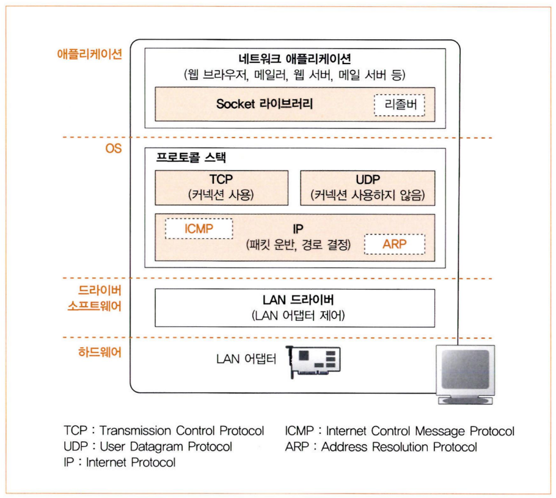

### 프로토콜 스택의 내부 구성



프로토콜 스택의 윗부분에는 데이터 송·수신을 담당하는TCP와 UDP가 있다.(UDP는 다음주차에 나와있기에 자세히 다룰 예정이다.)

그 아래에는 IP프로토콜을 사용하여 패킷 송·수신 동작을 제어하는 부분이 있다. 인터넷에서 데이터를 운반할때는 데이터를 작게 나누어 패킷이라는 형태로 운반하는데, 이 패킷을 통신 상대까지 운반하는 것이 IP의 주 역할이다.

ICMP는 패킷을 운반할때 발생하는 오류를 통지하거나 제어용 메시지를 통지할때, ARP는 IP주소에 대응하는 이더넷의 MAC주소를 조사할 때 사용한다.

MAC주소란 네트워크 인터페이스에 할당된 물리적 고유 식별 주소이다.

IP아래에 있는 LAN드라이버는 LAN 어댑터의 하드웨어를 제어한다.

마지막으로 LAN어댑터가 실제 송·수신 동작, 즉 케이블에 대해 신호를 송·수신하는 동작을 실행한다.


Cisco의 packetTracer를 이용한 LAN 구축.


Cisco의 packetTracer를 이용한 WAN구축

### 소켓의  통신 제어 정보

프로토콜 스택은 내부에 제어 정보를 기록하는 메모리 영역을 가지고 있으며, 여기에 통신 동작을 제어하기 위한 제어정보를 저장한다. 

저장되는 정보는 통신 상대의 IP주소는 무엇인가, 포트번호는 몇번인가, 통신동작이 어떤 진행상태에 있는가 하는 것이다.

### 서버 접속의 의미

소켓을 만들면 브라우저는 connect를 호출한다. 그러면 클라이언트에서 데이터 송수신 요청을 서버에 보냄을 시작으로 서버와 클라이언트간의 제어정보를 주고 받으며, 데이터가 송수신이 가능하도록 하는 상황을 만든다.

데이터 송·수신 동작을 실행할때는 송·수신하는 데이터를 일시적으로 저장하는 메모리 영역이 필요한데, 이 메모리 영역을 ‘버퍼메모리’라고 부른다.

버퍼메모리에 대한 확보가 접속 동작이 실행되는데, 이 실행을 접속한다는 의미를 가진다.

### TCP헤더 구조의 제어정보


- 시퀀스 번호:보내는 데이터에 순서를 붙이기 위한 번호 필드
- 승인번호: 받은 데이터의 어디까지 받을 수 있는지 바이트 위치를 나타내는 필드
- 헤더길이:TCP 데이터 시작 위치
- 플래그 비트
    - URG:긴급 데이터가 들어있는 것을 나타내는 플래그
    - ACK:확인 응답 필드에 있는 값이 유용함을 가리킴
    - PSH:받은 데이터를 즉시 상위계층에 보낼 것을 요구하는 플래그
    - RST:재설정 요구 플래그
    - SYN:3-way handshake시 오픈처리를 알리는 플래그
    - FIN:TCP연결 종료를 위한 플래그
- Recieve window: 수신자가 받아들이려는 바이트의 크기를 나타내는데 사용(흐름제어에 사용)
- 체크섬:TCP 패킷의 무결성 검사를 위한 필드
- 옵션:TCP연결 특성을 설정하는데 사용되는 가변길이의 필드
- 데이터:TCP의 데이터 부분

### 데이터 접속 동작의 시작:syn의 의미

소켓이 확정되었다면 접속을 시작하는데 이때 SYN이라는 컨트롤 비트를 1로 변경한다.

### 데이터 송수신 과정

피킷크기에 대한 용어로


MTU:패킷 한개로 운반 할수 있는 디지털 데이터의 최대길이, 이더넷 기준으로 1500바이트이다.

MSS:헤더를 제외하고 한개의 패킷으로 운반할 수 있는 TCP데이터의 최대길이

즉 MTU는 IP헤더+TCP헤더+데이터 이고, 데이터의 최대크기가 MSS라고 볼 수 있다.

### 송수신 하는 패킷에 대한 고찰

패킷이 데이터를 전송하는 속도를 판단하는 요소는 데이터의 크기와 타이밍 두가지가 있다.

만약 데이터의 크기(전자)를 중시하면 패킷 길이가 길어져서 네트워크의 이용효율이 높아지지만 버퍼에 머무는 시간만큼 송신 동작이 지연될 우려가 있다. 반대로 타이밍(후자)를 중시하면 지연을 적어지지만 이용효율이 떨어지므로 두가지를 효율적으로 사용해야 한다.

여기서 TCP프로토콜의 사양에는 절충에 관한 규정은 없으며, 실제로 어떻게 판단해야 할지는 프로토콜 스택을 만드는 개발자에게 다라 다르다.

### 3-Way Handshake


3-way handshake란?

- TCP통신을 이용하여 데이터를 전송하기 위해 네트워크 연결을 설정하는 과정
- 양쪽 모두 데이터를 전송할 준비가 되었다는 것을 보장하고 실제로 데이터전달이 시작하기 전에 한쪽이 다른 쪽이 준비되었다는 것을 알 수 있도록 한다.
- 즉, TCP/IP프로토콜을 이용해서 통신을 하는 응용 프로그램이 데이터를 전송하기 전에 먼저 정확한 전송을 보장하기 위해 상대방 컴퓨터와 사전에 세션을 수립하는 과정을 의미한다.

A프로세스가 (Client)가 B 프로세스(Server)에 연결을 요청

1. A→B:SYN
- 접속 요청 프로세스 A가 연결 요청 메시지 전송(SYN)
- 송신자가 최초로 데이터를 전송할때 Sequence Number를 임의의 랜덤 숫자로 지정하고 SYN플래그 비트를 1로 설정한 세그먼트를 전송한다.
- PORT상태-B:LISTEN, A:CLOSED

1. B→A:SYN+ACK
- 접속요청을 받은 프로세스 B가 요청을 수락했으며, 접속요청 프로세스인 A도 포트를 열어 달라는 메시지 전송(SYN+ACK)
- 수신자는 Acknowledgement Number필드를 (Sequence Number +1)로 지정하고 ,SYN과 ACK플래그 비트를 1로 설정한 세그먼트를 전송한다.
- PORT 상태-B:SYN_RCV, A:CLOSED

1. A→B:ACK
- PORT상태 -B:SYN_RCV A:ESTABLISHED
- 마지막으로 접속 요청 프로세스 A가 수락확인을 보내 연결을 맺음(ACK)
- 이때, 전송할 데이터가 있으면 이 단계에서 데이터를 전송할 수 있다.
- PORT상태-B:ESTABLISHED, A:ESTABLISHED

### 4-way handshaking(연결 해제 과정)


4 way handshake란?

- TCP의 연결을 해제(Connection Termination)하는 과정

A프로세스(Client)가 B프로세스(Server)에 연결해제를 요청

1. A→B:FIN
- 프로세스 A가 연결을 종료하겠다는 FIN플래그를 전송
- 프로세스 B가 FIN플래그로 응답하기 전까지 연결을 계속 유지
1. B→A:ACK
- 프로세스 B는 일단 확인 메시지를 보내고 자신의 통신이 끝날때까지 기다린다.(이 상태가 TIME_WAIT 상태)
- 수신자는 Acknowledgement Number 필드를 (Sequence Number +1)로 지정하고, ACK 플래그를 1로 설정한 세그먼트를 전송한다.
- 그리고 자신이 전송할 데이터가 남아있다면 이어서 계속 전송한다.
1. B→A:FIN
- 프로세스B가 통신이 끝났으면 연결종료 요청에 합의한다는 의미로 프로세스  A에게 FIN 플래그를 전송
1. A→B:ACK
- 프로세스 A는 확인했다는 메시지를 전송

### RDT(Reliable Data Transfer)란?

RDT는 신뢰성 있는 데이터 교환을 의미한다. 즉 송수신하는 데이터가 오류없이 온전히 전송되는 것을 뜻한다. Transport Layer에서는 신뢰성 있는 데이터 교환을 하고 싶어하지만 하위레이어들에서는 신뢰성을 보장할수 없기 때문에 문제가 발생할 수 있다. 이를 해결하기 위해 Transport Layer에서 RDT프로토콜을 이용할 수 있다.

아래는 RDT 프로토콜을 이용해 데이터를 송/수신 하는 예시이다.


송신측

- 상위 레이어에서 보내려는 데이터가 있다면 rdt_send()를 호출해 데이터를 RDT프로토콜로 전송한다.
- RDT프로토콜에서 신뢰할 수 없는 채널인 하위레이어로 보낼때 udt_send()를 호출해 패킷을 전송한다.

수신측

- 하위 레이어에서 받은 패킷이 있다면 rdt_rcv()를 호출해 RDT프로토콜로 전송한다.
- RDT프로토콜에서 상위 레이어로 데이터를 보낼때 deliver_data()를 호출해 데이터를 전송한다.

### FSM(Finite State Machines-유한 상태 기계)


FSM이란 유한개의 상태(state)가 존재할 때, 어떠한 상태(state)가 어떠한 사건(event)에 의해 다른 상태(state)로 변하는 전이(transition)가 발생하는 것을 도식화한 모델이다.

즉 event는 상태를 변화시키는 원인이고, actions는 상태가 변화할 때 취하는 행동을 말한다.


예를 들어 배고픔이란 상태(state)에서 식사(event)를 하는데 이때 초밥을 먹는다면(actions)배부름이라는 상태(state)로 전이(transition)된다.

### rdt 1.0(reliable transfer over a reliable channel)


rdt1.0은 완전히 안정적이라고 생각한다. 즉 bit error나 packet loss등이 전혀 없다고 가정한다.

즉 상태가 하나뿐이다.

송신측

- 상위 레이어에서 데이터를 보내오면 rdt_send(data)호출
- make_pkt(data)로 packet을 만듦
- udt_send(packet)호출해 패킷을 전송함

수신측

- 하위 레이어에서 데이터를 받아오면 rdt_rcv(packet)호출
- extract(paket,data)호출해 패킷에서 데이터를 추출함
- deliver_data(data) 호출해 상위 레이어로 데이터를 보냄

### rdt2.0(channel with errors)


rdt1.0과 다른점은 rdt2.0에서는 bit error가 발생할 수 있다고 가정한다는 점이다. 따라서 이때 에러처리를 위해 ACKs 와 NAKs를 사용한다.


rdt2.0에서는 에러가 없는 경우와 에러가 있는 경우 두가지를 나누어 설명하겠다.

### rdt2.0:operation with no errors(에러가 없는 경우)


(송신측 )상위 레이어에서 데이터를 받아온다

데이터를 패킷으로 만들어 udt_send()로 보낸다

수신측에서 패킷을 받는다

이상이 없으므로 ACK신호를 송신측으로 보낸다

송신측에서 ACK신호를 받고 종료한다.

### rdt2.0:operation with errors(에러가 있는 경우)


상위 레이어에서 데이터를 받아온다

데이터를 패킷으로 만들어 udt_send()로 보낸다.

수신측에서 패킷을 받는다.

패킷에 이상이 있으므로 NAK 신호를 송신측에서 보내고 기다린다

송신측에서 NAK신호를 받으면 데이터를 다시 수신측으로 재전송한다.

수신측에서 패킷을 받는다.

이상이 없다면 ACK신호를 송신측에 보낸다

송신측에서 ACK신호를 받고 종료한다

### rdt2.0의 치명적인 결함

다음과 같은 결함들이 존재

ACK/NAK 신호에 오류가 발생하거나 손실될 수 있다.

예를들어 수신측에서 패킷에 오류를 탐지하고 ACK신호를 송신측에 보냈으나 이것이 손실 될 수 있다.

이런경우 수신측은 무한정으로 ACK혹은 NAK신호를 기다리게 될 수 있다.

또한 ACK/NAK신호에 중복이 발생해 패킷이 중복으로 재전송 될 수 있다.

이러한 문제를 해결하기 위해서 NAK가 존재한다.

### rdt2.1

rdt2.1은 패킷에 seq#(순서번호)을 추가해 rdt2.0의 문제점을 해결한다.


위 그림은 rdt2.1의 송신측의 FSM이다. 복잡해 보이지만 천천히 뜯어보면 간단하다.

- 송신측에서 0번 패킷을 보내고 ACK 0 혹은 NAK 0 신호를 기다린다.
- 0번 패킷이 수신측에서 에러가 발생하였다면 NAK 0을 받을 것이고 수신측으로 0번패킷을 재전송할 것이다.\
- 0번 패킷이 정상적으로 전송된다면 ACK0을 받을 것이고 다음패킷인1번 패킷을 보낼깨까지 반복한다.
- 마찬가지로 ACK1혹은 NAK1신호를 기다리고 위와같은 과정을 모든 패킷을 보낼때까지 반복한다.

따라서 순서번호는 0과1이면 충분하다. 순서번호는 패킷의 중복재전송을 막기위해 부여하는 것이므로 중복인지 아닌지 판단하는 데에는 0과1이면 충분하기 때문이다.


위 그림은 rdt2.1의 수신측의 FSM이다. 마찬가지로 복잡해 보이지만 간단히 정리하자면 다음과 같다.

- 0번 패킷에 오류가 있다면 NAK 0신호를 보내고 0번패킷이 오길 기다린다.
- 0번패킷에 오류가 없다면 ACK0 신호를 보내고 1번패킷이 오길 기다린다.
- 1번 패킷에 오류가 있다면 NAK1 신호를 보내고 1번패킷이 오길 기다린다.
- 1번패킷에 오류가 없다면 ACK1신호를 보내고 0번패킷이 오길 기다린다.

### rdt2.2(NAK-free protocol)

rdt2.2는 rdt2.1과 같은 기능을 가진다. 다른점은 rdt2.2는 NAK대신 ACK만 사용한다는 점이다.


위 그림은 rdt2.2의 FSM이다. 마찬가지로 복잡해보이지만 간단히 정리하면 다음과 같다.

- 중복되는 ACK신호를 받으면 현재 패킷을 다시 재전송하면 된다.
- 예를 들어 0번패킷을 보내고 제대로 송신되어서 ACK0을 받았다고 하자
- 이후 1번패킷을 보냈는데, 수신측에서 오류를 탐지했다면 ACK1이 아닌 가장 최근에 전송에 성공한 ACK0를 보낸다.
- 수신측은 ACK1을 기대했으나 ACK0를 중복으로 받았으므로 오류가 발생했다는 사실을 알고 1번 패킷을 재전송한다.

### rdt3.0(channels with errors and loss)

rdt2.0/2.1/2.2는 패킷 에러에는 대응할 수 있으나 아직 큰 결함이 있다. 그것은 바로 ACK/NAK 혹은 패킷이 중간에 유실되는 경우에는 대응할 수 없다는 점이다. 예를 들어 송신측에서 ACK신호를 기다리고 있으나 ACK신호가 오지않아 다음 패킷을 보내지 못 할 수 있다.

따라서 rdt3.0은 다음과 같은 방법을 사용한다.


rdt의 데이터 전송과정을 살펴보자.


(a)는 패킷이 손실되지 않고 정상적으로 전달됐을때의 과정이다

(b)는 패킷이 중간에 손실됐을 경우이다.

- 만약 패킷1이 유실된다면 ACK1신호가 오지않을 것이다.
- 송신측은 한동안 ACK1신호를 기다리다 일정시간 이후 다시 패킷1을 재전송할 것이다.

(c)는 ACK이 손실됐을때의 과정이다.

- 송신측은 패킷1을 보내고 ACK1신호를 기다릴 것이다.
- 일정시간 이후 다시 패킷1을 재전송할 것이다.
- (b)와 다른점은 수신측이 패킷1을 중복으로 받았다는 것이다.
- 이는 seq#으로 해결이 가능하다. 수신측은 패킷1을 받고나서 패킷0을 기다릴 것이다. 그러나 이때 패킷1이 재전송되어 중복으로 왔으므로 그냥 패킷1을 버리면 된다.
- 패킷1을 버리고나서 다시 ACK1신호를 보내면 문제가 해결된다.

(d)는 ACK 신호전달이 지연됐을때의 과정이다.

- 송신측은 패킷1을 보내고 ACK1신호를 기다릴 것이다.
- 이때 ACK1 신호가 매우 느리게 전송된다고 하자.
- 송신측은 일정시간이 지나도 ACK1신호가 오지 않아 패킷1을 재전송했다.
- 패킷1을 재전송하고 나서 ACK1신호를 받았다. 따라서 다음 패킷인 패킷0을 보냈다.
- 수신측은 패킷1을 중복해서 받고 ACK1신호를 다시 보낸다.
- 송신측은 ACK1을 받고 다시 패킷0을 재전송한다.
- 계속해서 중복으로 패킷과 ACK신호가 재전송 되는 문제가 발생한다.

rdt3.0의 가장 큰 문제점이다. ACK신호가 지연된다면 위와같은 전송이 꼬이는 문제가 발생한다. 또한  rdt3.0은 데이터를 하나 보내고 ACK신호를 기다릴때까지 다음 데이터를 보내지 않아 성능이 매우 좋지 않다.

### 흐름제어

흐름제어는 수신 클라이언트가 수행해주는 제어기법으로, 송신서버와 수신 클라이언트의 데이터 처리속도 차이로 인한 수신버퍼 overflow를 해결하기 위한 방법이다.

### pipelined protocols


pipelined protocols 에서 pipelining은 송신자가 다수의 패킷을 한번에 보내는 것을 말한다. 즉 ACK신호를 받을때까지 기다리다 ACK신호를 받고 나서 다음 데이터를 보내는 stop and wait 방식과 다르게 송신자가 ACK신호를 받지 않아도 패킷 여러개를 보내는 방식이다. 송신자와 수신자가 버퍼를 가져야 하며, 대표적인 두가지 프로토콜로 Go-back-N과 Selective Repeat이 있다.

### GO-Back-N(GBN)


- Go-Back-N방식은 송신측에서 전송할 패킷의 개수를 정한다.
- 버퍼에 그 개수만큼의 패킷을 저장하여 전송한다.
- 버퍼를 window,버퍼의 사이즈를 window size라고 한다.
- 버퍼의 시작점인 send_base,다음에 보낼 패킷번호인 next_seq_num을 가진다.
- 수신측은 이번에 받을 패킷의 번호를 기억하고 있는다.
- 각 버퍼가 전송될때 ACK를 받지 못한 가장 오래된 패킷의 Timer를 기준으로 Timeout이 발생한다.
- Timeout이 발생하면 window에 있는 모든 패킷을 전송한다.

이해가 쉽지 않다면 다음과 같이 동작하는 예시를 보면 이해가 빠르다.


- window size가 4인 상황에서 GBN의 동작이다. 가장 먼저 패킷0,1,2,3을 전송한다. 전송도중에 패킷2가 손실되었다.
- 수신측은 패킷0과1을 잘 받았으므로 ACK0,1을 보내고 패킷2가 오기를 기다린다.
- 송신측은 ACK0을 받았으므로 send_base를 한칸 옆으로 밀고 (send_base가 0에서1이 됨) 패킷 4를 보낸다.
- 송신측은 ACK1을 받았으므로 send_base를 한칸 옆으로 밀고(send_base가 1에서2가됨)패킷 5를 보낸다.
- 수신측은 패킷2를 기다렸으나 패킷2가 오지 않고 패킷3이 왔으므로 패킷3을 버리고 가장 최근에 수신 성공한 패킷1에 대한 ACK1(Cumulatice ACK)을 보낸다.
- 수신측은 패킷2를 기다렸으나 패킷2가 오지 않고 패킷4가 왔으므로 패킷4를 버리고 가장 최근에 수신 성공한 패킷1에 대한 ACK1(Cumulatice ACK)을 보낸다.
- 수신측은 패킷2를 기다렸으나 패킷2가 오지 않고 패킷5가 왔으므로 패킷5를 버리고 가장 최근에 수신 성공한 패킷1에 대한 ACK1(Cumulatice ACK)을 보낸다.
- 송신 측은 중복된 ACK은 모두 무시한다.
- 송신측은 pk2를 보내고 일정기간이 지나도 ACK이 오지 않아 Timeout이 발생한다.
- Timeout이 발생했으므로 윈도우의 모든 패킷을 전송한다. 즉, 패킷2,3,4,5,를 보낸다.

### Selective Repeat(SR)


- GBN의 비효율성을 해결하기 위한 방식이다.
- 송신측은 각 패킷마다 timer를 설정하고 timeout된 패킷만 재전송한다.(GBN처럼 버퍼모두를 전송하지 않음)
- 수신측도 버퍼를 가지고 있다.
- 수신측은 기다리던 패킷이 오면 바로 상위계층으로 전달하고 ACK신호를 보낸다.
- 수신측은 기다리고 있던 패킷이 오지 않으면 일단 buffer에 넣어놓고 ACK신호를 보낸다.
- 이외는 GBN과 비슷하다.
- GBN보다 효율적으로 보이지만 모든 패킷에 timer가 있기때문에 overhead가 크다.

마찬가지로 예시를 들어보자


- window size가 4인 상황에서 SR의 동작이다. 가장 먼저 패킷 0,1,2,3, 을 보낸다. 전송도중 패킷2가 손실되었다.
- 수신측은 패킷0과1을 잘 받았으므로 ACK0,1을 보내고 패킷 0과 1을 상위계층에 전달한 다음 패킷2가 오기를 기다린다.
- 송신측은 ACK0을 받았으므로 send_base를 한칸 옆으로 밀고(send_base가 0에서1이 됨) 패킷4를 보낸다.
- 송신측은 ACK1을 받았으므로 send_base를 한칸 옆으로 밀고(send_base가 1에서2로 됨)패킷5를 보낸다.
- 수신측은 패킷2를 기다렸으나 패킷2가 오지 않고 패킷4가 왔으므로 패킷4를 버퍼에 넣어놓고 ACK4를 보낸다.
- 수신측은 패킷2를 기다렸으나 패킷2가 오지 않고 패킷5가 왔으므로 패킷5를 버퍼에 넣어놓고 ACK5를 보낸다.
- 송신측은 ACK3,4,5는 기록만 하고 send_base(pkt2)에 대한 ACK이 오지 않았으므로 send_base를 밀지는 않는다.
- pkt2에 대한 timer가 timeout이 됐으므로 패킷2를 다시 보낸다.
- 수신측은 패킷2를 받고, 버퍼에 있는 패킷까지 포함해 패킷2,3,4,5를 상위계층에 보낸 다음 ACK2를 보낸다.
- 이후 ACK2가 송신 측에 도착하면 send_base가 2에서3이 될 것이다.

### Selective Repeat Dilemma(SR딜레마)

sr은 GBN에 비해 매우 효율적으로 보인다. 하지만 SR은 큰 딜레마를 가지고 있다.


우선 window size가 3이고 sequence number는 0,1,2,3이라고 하자. 또한 수신측과 송신 측이 서로를 볼 수 없다고 가정하자. 위의 SR동작에서 보이진 않았지만, 수신측도 기다리던 패킷을 받으면 window에서 rcv_base를 옆으로 한칸씩 밀게 된다. 즉, 위 그림과 같은 상황에서는 아무 문제가 발생하지 않는다.


하지만 위와 같이 ACK 0,1,2가 모두 손실된다면 문제가 발생한다.

수신측은 패킷 0,1,2를 제대로 받았으므로 ACK0,1,2를 보내고 rcv_base를 한칸씩 밀어 rcv_base는 3이 될 것이다. 

송신측은 패킷 0,1,2를 보내고 ACK신호가 오지 않았으므로 timeout되고 패킷0을 다시보낼 것이다.

문제는 수신측의 window안에 0이 들어있다는 것이다.

수신측은 송신측의 상황을 모르기 때문에 이번에 들어온 패킷0가 올바른 패킷으로 판단하고 패킷0을 버퍼에 넣을 것이다.

하지만 이번에 들어온 패킷0는 이미 예전에 받은 패킷0과 똑같은 즉, 중복된 패킷을 받게 되는 문제가 발생한다.

### how to solve???

SR은 window size가 sequence number의 개수의 절반보다 이하여야 한다.

window size ≤(sequence number)


예를 들어 위와 같은 상황에서는 window size를 2로 줄이면 문제가 해결된다.

### 혼잡제어

만약 한 라우터에 데이터가 몰려서 모든 데이터를 처리할 수 없는 상황이 왔다고 가정해보자. 호스트들은 보낸 데이터에 대한 응답이 오지 않으니 동일 데이터를 재전송할 것이고, 이러한 재전송은 혼잡을 더욱 가중시켜서 오버플로우 데이터 손실이 발생할 것이다.

→혼잡제어는 이러한 네트워크의 혼잡을 피하기 위해 송신측에서 보내는 데이터의 전송속도를 제어하는 기법이다.

이러한 TCP의 혼잡제어 방식은 여러가지 방법이 존재하지만 가장 기본적인 혼잡제어 방법은 AIMD와 slow Start라는 혼잡 회피방법을 상황에 맞게 조합하는 방법이다.(+conservative after timeout events)

### 혼잡 윈도우

송신측의 윈도우 크기는 수신측이 보내준 윈도우 크기와 네트워크 상황을 함께 고려해서 정해지게 된다.

송신측은 자신의 최종 윈도우 크기를 정할 때, 수신측이 보내준 윈도우 크기인 수신자 윈도우(RWMD)와 자신이 네트워크 상황을 고려해 정한 혼잡 윈도우(CWMD)중에서 더 작은 값을 택한다.

결국 송신자가 조절하는 윈도우 크기란 정확하게는 송신측이 가지고 있는 혼잡 윈도우 크기인 것이다.

### 혼잡 회피방식

이러한 TCP회피방식들을 활용한 다양한 혼잡제어정책이 존재하고 정책들은 AIMD,slow start를 적절하게 섞어서 사용하되 네트워크 혼잡상황이 발생했을때 어떻게 대처하는지에 따라서 나뉘게 된다고 한다.

또한 정책들을 ‘혼잡이 발생하면 윈도우 크기를 줄이거나 혹은 증가시키지 않으며 혼잡을 회피’한다는 공통점을 가지고 있다.

그중 빠른 재전송,빠른 회복등을 활용한 대표적인 정책 TCP Tahoe, TCP Reno방식이 있다.

### Time Out

송신측이 수신측에 데이터를 보낸 이후

- 여러가지 요인으로 인해서 보낸 데이터가 유실된 상황
- 수신측이 데이터를 받고 전송한 ACK응답이 유실된 상황
- 송신측이 일정시간동안 응답받지 못하는 경우

### 3 ACK Duplicated

- 송신측이 3번이상 중복된 승인번호를 받은 상황
- 정상적으로 데이터가 전송되지 못했음을 의미
- 어떠한 이유로 인해 수신측이 특정 시퀀스 번호 이후의 데이터를 제대로 처리하지 못한 상황

### AIMD(Addictive Increase Multicative Decrease)

송신자의 데이터 전송 속도를 제어하는 첫번째 방법은 AIMD,우리말로 번역하면 합 증가-곱 감소 알고리즘이다.

더해갈때는 증가시키고 반으로 줄여 감소시킨다.

송신자는 처음에 하나의 패킷을 전송한다. 전송된 패킷이 문제없이 도착하는 것을 확인하면 **윈도우 사이즈를 하나 증가**시켜 두개를 보낸다. 이러한 식으로 하나씩 윈도우 사이즈를 늘려가다 패킷이 전송되지 않거나 TIME_OUT 이 발생하면 늘려놨던 윈도우 사이즈를 절반으로 줄인다.


이 단순한 AIMD알고리즘은 결국 모든 호스트가 공평하게 네트워크를 사용하게 하는데, 왜그럴까?

네트워크가 혼잡해져있는 상태에서 새로운 호스트가 진입했다고 가정하자.

이미 네트워크에 존재하던 호스트들은 큰 혼잡 윈도우를 가지고 있을 것이고,새로 진입한 호스트의 혼잡윈도우는 작은 상태이다. 

기존에 존재하던 호스트들은 큰 혼잡 윈도우를 가지고 있으므로 이미 혼잡한 네트워크에 무리하게 많은 데이터를 재전송하여 데이터가 더욱 유실될 것이고 자연스레 혼잡 윈도우 사이즈를 줄이게 된다.

그러면 새로 들어온 호스트는 자신의 혼잡 윈도우 사이즈를 하나씩 늘려가며 남게되는 대역폭을 사용하게 되고 이러한 과정이 반복되며 여러 호스트들이 대역폭을 공평하게 나뉘쓰는 형태로 향한다.

하지만 단점으로는 윈도우사이즈를 하나씩 늘려가기 때문에 초기 네트워크의 큰 대역폭을 바로 사용하지 못한다는 점 때문에 네트워크의 모든 대역폭을 활용해 제대로 된 속도로 통신하기까지 시간이 좀 걸린다.

또한 네트워크가 혼잡해지는 상황을 미리 감지할 수 없고 혼잡상태가 발생한 이후에 대역폭을 감소시킨다는 점이 있다.

### Slow Start

두번째 대표적인 혼잡회피 방법은 느린시작,slowstart 방식이다.

요즘에는 네트워크의 대역폭이 워낙 넓고 통신 인프라도 좋다보니 예전에 비해서 네트워크의 혼잡상황 발생하는 빈도가 많이 줄어들었다. 때문에 혼잡상황이 발생하기 전에도 제대로 속도를 내지 못하는 AIMD의 단점이 더욱 부각되었다고 한다.

반면 SlowStart방식도 동일하게 처음에 패킷을 하니씩 전송한다. 패킷이 문제없이 도착하면 각각의 ACK패킷마다 window size를 하나씩 증가시킨다. 즉 **윈도우 사이즈를 두배씩 증가**시킨다.

윈도우 사이즈를 빠르게 두배씩 증가시키다가 혼잡현상이 발생시 윈도우 사이즈를 1로 확 줄여버린다.

Slow Start 방식은 윈도우 사이즈를 1개씩 늘려가던 AIMD방식과 다르게 지수적으로 윈도우 사이즈를 증가시켜 빠르게 네트워크의 대역폭을 사용하게 된다

### 혼잡제어 정책

### TCP Tahoe

Tahoe정책은 혼잡제어의 초기정책이고 빠른재전송이 처음으로 도입된 정책이라고 한다.


처음에는 동일하게 slow start 방식으로 윈도우를 증가시키다가 ssthresh시점 이후부터는 AIMD방식을 사용한다.

이후 **TimeOut이나 3 ACK Duplicated상황이 발생시** 네트워크가 혼잡하다는 것을 인지하고 ssthresh는 **혼잡상황 발생시 윈도우 사이즈의 절반으로, 윈도우 사이즈는 1로** 수정하는 방식이다.

하지만 이 방법에선 혼잡상황이 발생할때 마다 윈도우를 1로 초기화해 다시 증가시켜 나가는 부분이 비효율적이라 할 수 있다. 이러한 점을 개선시키기 위해 빠른 회복을 적용한 TCP Reno정책이 있다.

### TCP Reno


TCP Tahoe정책과 동일하지만 차이점은 바로 3 Ack Duplicated 와 TimeOut을 구분해 대응한다는 점이다.

3 ACK Duplicated이 발생하면 윈도우 크기를1로 초기화하지 않고 AIMD처럼 윈도우 크기를 절반으로 줄이며 ssthresh값 역시 줄어든 윈도우 값으로 설정한다.

이러한 방식으로 빠르게 윈도우 사이즈를 회복시켜 네트워크 대역폭을 사용하도록 하고, 이를 빠른 회복 (Fast Recovery)라 한다!

TimeOut이 발생한다면 TCP Tahoe와 동일하게 윈도우 사이즈를 1로 줄이고 slow start를 시작하지만 ssthresh값은 변경하지 않는다.

그림에서도 timeout이 발생하나 경우에는 ssthresh값이 유지되는 것을 볼 수 있다. 즉 timeout에 비해 3 ACK Duplicated는 그리 심각한 혼잡상황이라고 판단하지 않는듯 하다.

### 추가 조사해야 할 부분

강의중 Reno에서 보완한 방식이 cubic 배웠는데, 교수님께서는 UDP기반의 quic방식(http3.0)에 비해 장점이 많이 있다고 하셨다.

또한 스터디장님의 자료에도 RUDP(UDP의 빠른 전송속도를 이용하면서도 신뢰성을 소프트웨어로 구현한 방식)라는 알고리즘 또한 존재하였다.

궁금하여 찾아보니 bbr이라는 방식 또한 존재하는데, 전 부분까지는 전에 학습하였던 내용이라 이해를 상대적으로 빠르게 하였으나, 이쪽 부분은 자료가 부족하고 내용이 심화되어 있어 좀더 조사해보아야 할 것 같다.

### 에코서버 실습

에코서버란 클라이언트가 전송해주는 데이터를 그대로 되돌려 전송해 주는 기능을 가진 서버를 말한다. 에코 서버 클라이언트 모델의 특징은 몇 바이트를 송수신할 것인지 예상할 수 있다는 것이 큰 특징이다. 그 이유는 전송한만큼 바이트를 되돌려 받기 때문이다.

```jsx
C:\Users\polic\.jdks\corretto-11.0.20\bin\java.exe "-javaagent:C:\Program Files\JetBrains\IntelliJ IDEA 2022.3.3\lib\idea_rt.jar=63061:C:\Program Files\JetBrains\IntelliJ IDEA 2022.3.3\bin" -Dfile.encoding=UTF-8 -classpath C:\Users\polic\IdeaProjects\echoServer\out\production\echoServer socketServer
Server is ready
connect clinet...
Client has accepted
from Client>hii
from Client>I
from Client>learn
from Client>network
from Client>in
from Client>BCSD
```

위와 같이 클라이언트가 전송하는 데이터를 그대로 돌려받은 것을 확인 할 수 있다.


출처:

교재:

성공과 실패를 결정하는 1%의 네트워크 원리

모든 개발자를 위한 HTTP웹 기본지식 김영한 

컴퓨터 네트워킹 하향식 접근

컴퓨터 네트워킹 이재오p 자체교재

인터네트워킹 강승찬p 자체교재

08.네트워크 /04.TCP 최선문 

링크:

[https://velog.io/@ragnarok_code/Network-TCP-프로토콜-연결종료-과정](https://velog.io/@ragnarok_code/Network-TCP-%ED%94%84%EB%A1%9C%ED%86%A0%EC%BD%9C-%EC%97%B0%EA%B2%B0%EC%A2%85%EB%A3%8C-%EA%B3%BC%EC%A0%95)

https://vt200.com/tcp-congestion-cubic-quic-bbr/

https://code-lab1.tistory.com/26

https://code-lab1.tistory.com/27

https://www.youtube.com/watch?v=BEK354TRgZ8

https://www.youtube.com/watch?v=ikDVGYp5dhg

https://drive.google.com/file/d/1me0jcPoeEG2GsJbsb2wC68_zuqDuGwyL/view