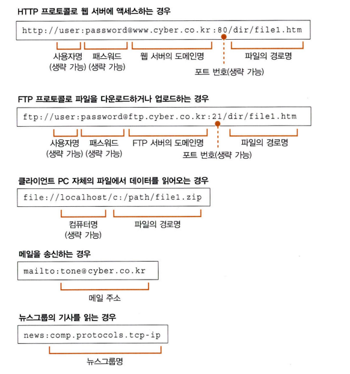

# 01 웹 브라우저가 메시지를 만든다
## 1. HTTP 리퀘스트 메시지를 작성한다
### 1 탐험 여행은 URL 입력부터 시작한다
URL(Uniform Resource Locator)이란 웹 서버에 액세스하는 클라이언트 기능, 파일을 다운로드/업로드 하는 FTP(File Transfer Protocol)의 클라이언트 기능, 메일의 클라이언트 기능 등을 하는 브라우저의 기능 중 중의 어느 것을 사용하여 데이터에 액세스하면 좋을 것인지를 판단하는 재료이다.
URL을 사용하는 방법은 다양하지만 모든 URL에는 맨 앞에 있는 문자열(http:, ftp:, mailto:, file:)에서 액세스 하는 방법을 나타내는 공통점이 있다.

### 2 브라우저는 먼저 URL을 해독한다
브라우저가 처음 하는 일은 웹 서버에 보내는 리퀘스트의 메시지를 작성하기 위해  URL을 해독하는 것이다.
이 책에서는 웹 서버에 액세스하는 경우를 설명한다.
>> http://www.lab.cyber.co.kr/dir1/file1/html

### 3 파일명을 생략한 경우
- http://www.lab.cyber.co.kr/dir/
	- URL의 규칙에는 파일명을 생략해도 된다. 파일명을 쓰지 않으면 어느 파일에 액세스해야 할지 모르기 때문에, 미리 서버측에 설정해 둔다. 서버에 따라 다르지만 대부분의 서버가 'index.html' 또는 'default.htm'이라는 파일명을 설정하고 이 파일에 액세스한다.
- http://www.lab.cyber.co.kr/
	- 루트 디렉토리가 지정되고 파일명은 생략된 것이다. 마찬가지로 '/index.html', '/default.htm'이라는 파일에 액세스한다.
- http://www.lab.cyber.co.kr
	- 루트 디렉토리까지 생략된 것이다. 마찬가지로 '/index.html', '/default.htm'이라는 파일에 액세스한다.
- http://www.lab.cyber.co.kr/whatisthis
	- 웹 서버에 'whatisthis'라는 파일이 있으면 whatisthis를 파일명으로 보고, 'whatisthis'라는 디렉토리가 있으면 whatisthis를 디렉토리명으로 본다.

### 4 HTTP의 기본 개념
HTTP(HyperText Transfer Protocol)는 클라이언트와 서버가 주고받는 메시지의 내용이나 순서를 정한 것으로 기본 개념은 아래와 같다.
1. 클라이언트에서 서버를 향해 리퀘스트 메세지를 보낸다. 이때 리퀘스트 메세지에는 '무엇을'과 '어떻게 해서'의 내용일 들어간다.
	- '무엇을'에 해당하는 것을 URI(Uniform Resource Identifier)라고 하는데 여기에는 페이지 데이터를 저장한 파일의 이름, CGI(Common Gateway Interface) 프로그램의 파일명, URL을 그대로도 사용한다.
	- '어떻게 해서'에 해당하는 것은 메소드라고 하는데 웹 서버에게 어떤 동작을 하고 싶은지를 전달한다. 자주 사용하는 메소드는 GET, POST가 있는데 GET은 웹 서버에 액세스하여 페이지의 데이터를 읽을 때 사용하고, POST는 폼에 데이터를 사용해서 웹 서버에 송신할 때 사용한다.
	- 리퀘스트 메세지에는 추가적으로 보충 정보를 나타내는 헤더 파일과 헤더 필드의 뒤에 데이터가 들어가기도 한다.
2. 리퀘스트 메시지가 웹 서버에 도착하면 웹 서버는 그 속에 쓰여있는 내용을 해독한다.
3. URI와 메시지를 조사하여 판단한 후 요구에 따라 동작하고, 결과 데이터를 응답 메시지에 저장한다.
	- 응탑 메시지의 맨 앞부분에는 스테이터스 코드가 있고, 이 후 헤더 파일과 페이지의 데이터가 있다.
4. 클라이언트에 도착하여 브라우저가 메시지의 안에서 데이터를 추출하여 화면에 표시한다.

### 5 HTTP 리퀘스트 메시지를 만든다
브라우저는 URL을 해독하고 웹 서버와 파일명을 판단하면 이것을 바탕으로 HTTP의 리퀘스트 메시지를 만든다.
- 리퀘스트 메시지의 첫 번째 행에는 웹 서버에 어떻게 할 것인지를 전달하는 리퀘스트 라인을 쓴다.
- 리퀘스트 메시지의 두 번째 행부터 공백 행 전까지는 부가적인 자세한 정보를 갖고 있는 메세지 헤더 부분이다.
- 공백 행 이후에는 메시지의 실제 내용인 메시지 본문이 쓰여진다.

### 6 리퀘스트 메시지를 보내면 응답이 되돌아온다
응답 메세지의 포맷도 기본적인 개념은 리퀘스트 메시지와 같다.
- 스테이터스 코드와 응답 문구를 첫 번째 행에 입력한다. 이때 둘의 내용은 같지만 용도는 다르다. 스테이터스 코드는 숫자로 쓰여 있음, 주로 프로그램 등에 실행 결과를 알려주는 것이고, 응답 문구는 문장으로 쓰여 있음, 사람에게 실행 결과를 알리는 것이다.
- 영상 등을 포함한 경우에는 문장 안에 영상 파일을 나타내는 태그가 포함되어 있다.
- 화면에 문장을 표시할 때 태그를 탐색하고, 영상용 공백을 비워두고 문장을 표시한다.
- 다시 한 번 웹 서버에 액세스하여 태그에 쓰여있는 영상 파일을 웹 서버에서 읽어와서 공백에 표시한다.
리퀘스트 메시지에 쓰는 URI는 한 개만으로 결정되어 있으므로 파일을 한 번에 한 개씩만 읽을 수 있기 때문에 파일을 따로 읽어야 한다.

## 2. 웹 서버의 IP 주소를 DNS 서버에 조회한다
### 1 IP 주소의 기본
IP 주소는 네트워크 번호와 호스트 번호를 합친 주소이다. IP 주소의 호스트 번호 부분의 비트 값이 모두 0 또는 1인 경우는 특별한 의미를 가진다. 0일 때는 서브넷 자체를 나타내고, 1일 때는 서브넷에 있는 기기 전체에 패킷을 보내는 브로드 캐스트를 나타낸다.

### 2 도메인명과 IP 주소를 구분하여 사용하는 이유
TCP/IP 네트워크는 IP 주소로 통신 상대를 지정하므로 IP 주소가 필요하다. 하지만 숫자로 나열된 IP 주소는 기억하기 어려워 도메인명을 사용하는 것이 좋다. 이 부분에도 문제가 있다. 만약 도메인명을 사용하면 라우터가 부하되어 데이터를 운반하는 동작에 더 많은 시간이 걸리면서 네트워크의 속도가 느려진다. 따라서 사람은 도메인명을, 라우터는 IP 주소를 사용하는 방법이 고안되었고 DNS(Domain Name System)원리가 나타났다.

### 3 Socket 라이브러리가 IP 주소를 찾는 기능을 제공한다
DNS 서버에 조회한다는 것은 DNS 서버에 조회 메시지를 보내고, 거기에서 반송되는 응답 메시지를 받는 것을 말한다. 이 DNS 클라이언트에 해당하는 것을 DNS 리졸버라고 하고, DNS의 원리를 사용하여 IP 주소를 조사하는 것을 네임 리졸루션이라한다.
Socket 라이브러리는 OS에 포함되어 있는 네트워크의 기능을 애플리케이션에서 호출하기 위한 부품을 모아놓은 것으로 리졸버는 Socket 라이브러리에 내장된 프로그램이다.

### 4 리졸버를 이용하여 DNS 서버를 조회한다
Socket 라이브러리에 포함되어있는 리졸버는 리졸버의 프로그램명과 웹 서버의 이름을 써서 브라우저에서 간단히 호출하여 이용할 수 있다. 리졸버를 호출하면 리졸버가 DNS 서버에 조회 메시지를 보내고, DNS 서버에서 응답 메시지가 돌아오는데 이 때 응답 메시지 속에 IP 주소가 포함되어 있고 리졸버는 이것을 추출하여 브라우저에서 지정한 메모리 영역에 쓴다. 이 메모리 영역에서 IP 주소를 추출하여 HTTP의 리퀘스트 메시지와 함께 OS에 건네주어 송신을 의뢰한다.

### 5 리졸버 내부의 작동
리졸버 내부의 작동은 아래와 같다.
1. 브라우저가 리졸버를 호출하면 제어가 리졸버의 내부로 넘어간다.
2. 리졸버는 DNS 서버에 문의하기 위한 메시지를 만든다.
3. 리졸버는 OS의 프로토콜 스택을 호출하여 실행을 의뢰한다.
4. DNS 서버에 도착하고 DNS 서버는 메시지에 쓰여있는 조회 내용을 조사하여 답을 찾는다.
5. 액세스 대상의 웹 서버가 DNS 서버에 등록되어 있으면 탑을 응답 메시지에 써서 클라이언트에게 반송한다.
6. 메시지는 네트워크를 통해 클라이언트측에 도착하고, 프로토콜 스택을 경유하여 리졸버에 건너져 리졸버가 내용을 해독한 후 IP 주소를 추출하여 건네준다.
7. 리졸버의 동작이 끝나고 제어가 브라우저에게 돌아온다.