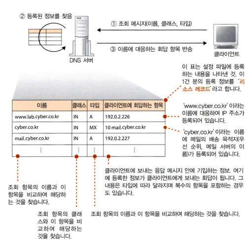

# 01 웹 브라우저가 메시지를 만든다
## 3. 전 세계의 DNS 서버가 연대한다
DNS(Domain Name System)는 도메인명을 IP 주소로 변환해주는 시스템이다. DNS 서버는 DNS를 통해 어떤 서버에 연결할 것인지를 제어한다.
 그럼 DNS 서버의 기본 동작에 대해 알아보자.

DNS 서버의 기본 동작은 클라이언트에서 조회 메시지를 받는다. 이때 조회 메시지에는 '이름', '클래스', '타입' 이라는 세 가지 정보가 포함되어있다.
	- 이름은 서버나 메일 배송 목적지와 같은 이름이다.
	- 클래스는 항상 인터넷을 나타내는 'IN' 값이다.
	- 타입은 어떤 타입(종류)의 정보가 지원되는지를 나타낸다. 타입에 따라 클라이언트에 회답하는 정보의 내용이 달라진다.
		- A(Address) 타입 : 이름에 IP 주소가 지원
		- MX(Mail eXchange) 타입 : 이름에 메일 배송 목적지가 지원
		- PTR(Pointer) 타입 : IP 주소에서 이름을 조사
		- CNAME(Canonical Name) 타입 : 이름에 닉네임을 붙임
		- NS(Name Server) 타입 : DNS 서버의 IP 주소를 등록
		- SOA(Sender Policy Framework) 타입 : 도메인 자체의 속성 정보를 등록
DNS 서버는 이 조회 메시지를 통해 등록된 정보를 찾아 응답하는 형태로 정보를 회답한다.

1대의 DNS 서버에 수많은 인터넷의 IP 주소를 등록하는 것은 불가능하다. 그래서 DNS 서버는 정보를 분산시켜서 다수의 DNS 서버에 등록하고, 다수의 DNS 서버가 연대하여 어디에 정보가 등록되어 있는지를 찾아내는 구조를 가진다.
DNS 서버에 등록한 정보에는 모든 도메인명이라는 계층적 구조를 가진 이름이 붙여져 있다.
	- www.cyber.co.kr 도메인
		- kr : 최상위 도메인으로, 대한민국에 할당된 도메인
		- co : kr의 서브 도메인으로, 국내의 도메인을 분류하기 위해 설치된 도메인
		- cyber : co의 서브 도메인으로, 회사에 할당된 도메인
		- www : 최하위 도메인으로, 서버의 이름
이렇게 계층화된 도메인의 정보를 서버에 등록하고 아래와 같은 방법으로 등록한 정보를 찾아낸다.
	1. 하위의 도메인을 담당하는 DNS 서버의 IP 주소를 그 상위의 DNS 서버에 등록
	2. 루트 도메인(.)에서 차례로 아래쪽으로 거슬러 내려가며 찾음
	3. 루트 도메인의 DNS 서버를 인터넷에 존재하는 DNS 서버에 전부 등록

또한 DNS 서버는 한 번 조사한 이름을 캐시에 기록하여 사용한다. 이런 캐싱에 대해 문제점이 있다. 바로 캐시에 정보를 등록한 이후 등록 정보가 변경되는 경우, 캐시 안에 저장된 정보는 올바르다고 단언할 수 없다는 점이다.
따라서 DNS 서버는 등록하는 정보에 유효 기한을 설정하고, 캐시에 저장한 데이터의 유효 기간이 지나면 캐시에서 삭제한다. 또한 조회에 회답할 때 정보가 캐시에 저장된 것인지, 아니면 등록처 DNS 서버에서 회답한 것인지 알려준다.

------------
## 4. 프로토콜 스택에 메시지 송신을 의뢰한다
### 1 데이터 송·수신 동작의 개요
- IP 주소를 조사했으면 OS의 내부에 있는 프로토콜 스택에 액세스 대상 웹 서버에 메시지를 송신하도록 의뢰
- Socket 라이브러리에 들어있는 프로그램 복수의 부품을 결정된 순번대로 호출
- 데이터를 송·수신하는 컴퓨터 사이에 데이터의 통로 같은 것이 있고, 이것을 통해 데이터가 흐르면서 상대측에 도착
- 송·수신 동작을 하기 전에 송·수신하는 양자 사이를 파이프로 연결하는 동작이 필요
	- 소캣 : 양끝에 있는 데이터의 출입구
		- 서버측에서 소켓을 만들고, 소켓에 클라이언트가 연결하기를 기다림
		- 클라이언트측에도 소켓을 만들고, 소켓에서 파이프를 늘려 서버측의 소켓에 연결
		- 데이터 송·수신 동작을 실행
- 송·수신 동작이 끝난 후의 동작
	- 데이터를 전부 보내고나면 연결했던 파이프가 분리
	- 어느쪽에서 분리해도 상관 없음
	- 한쪽에서 분리하면 또 한쪽도 분리되고, 파이프를 분리하면 소켓을 말소하여 통신 동작이 종료
- 송·수신 전체 흐름
	- 소켓을 만듦(소켓 작성 단계)
	- 서버측의 소켓에 파이프를 연결(접속 단계)
	- 데이터를 송·수신함(송·수신 단계)
	- 파이프를 분리하고 소켓을 말소(연결 끊기 단계)

### 2 소켓의 작성 단계
- Socket 라이브러리의 socket이라는 프로그램 부품을 호출하여 클라이언트측의 소켓을 만듦
	- 소켓이 생기면 디스크립터라는 것이 돌아오므로 애플리케이션은 이것을 받아서 메모리에 기록
		- 디스크립터 : 소켓을 식별하기 위해 사용하는 것

### 3 파이프를 연결하는 접속 단계
- 클라이언트측의 소켓을 서버측의 소켓에 접속하도록 프로토콜 스택에 의뢰
	- 애플리케이션은 Socket 라이브러리의 connect라는 프로그램 부품을 호출하여 의뢰 동작을 실행
		- connect를 호출할 때 디스크립터, 서버의 IP 주소, 포트 번호를 넘김
			- 프로토콜 스택이 디스크립터를 보고 어느 소켓을 서버측의 소켓에 접속할지 판단하여 접속 동작을 실행
			- 서버의 IP 주소와 포트 번호를 통해 어느 컴퓨터의 어느 소켓과 접속할지를 분명히 지정

### 4 메시지를 주고받는 송·수신 단계
- Socket 라이브러리의 write 프로그램 부품을 사용해 소켓에서 데이터를 쏟아부으면 상대측의 소켓에 데이터가 도착
	- 애플리케이션은 송신 데이터를 메모리에 준비
	- write를 호출할 때 디스크립터와 송신 데이터를 지정
	- 프로토콜 스택이 송신 데이터를 서버에게 송신
	- 서버는 수신 동작을 실행하여 받은 데이터의 내용을 조사하혹 적절한 처리를 실행하여 응답 메시지를 반송
- 수신할 때는 Socket 라이브러리의 read라는 프로그램 부품을 통해 프로토콜 스택에 수신 동작을 의뢰
	- 수신 버퍼 : 수신한 응답 메시지를 저장하기 위한 메모리 영역

### 5 연결 끊기 단계에서 송·수신이 종료된다
- 브라우저가 데이터 수신을 완료하면 Socket 라이브러리의 close라는 프로그램 부품을 호출하여 연결 끊기 단계로 들어감
	- 소켓 사이를 연결한 파이프와 같은 것이 분리되고 소켓도 말소
