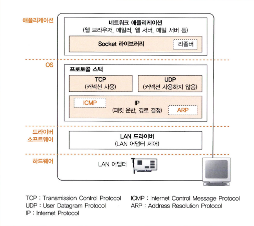
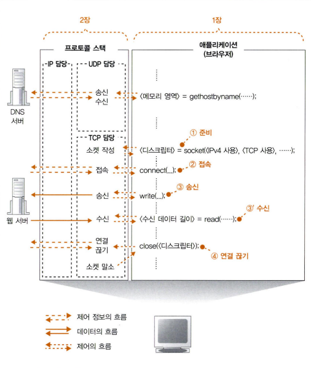
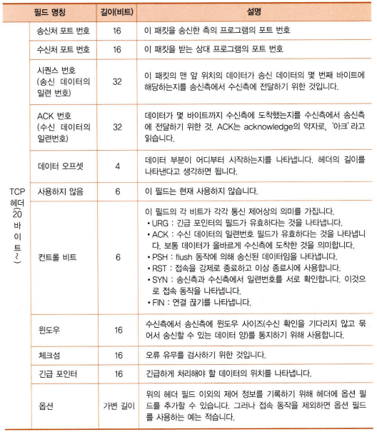
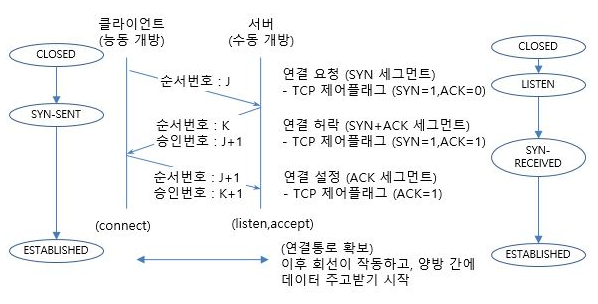
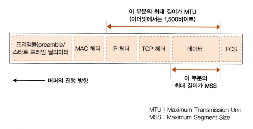
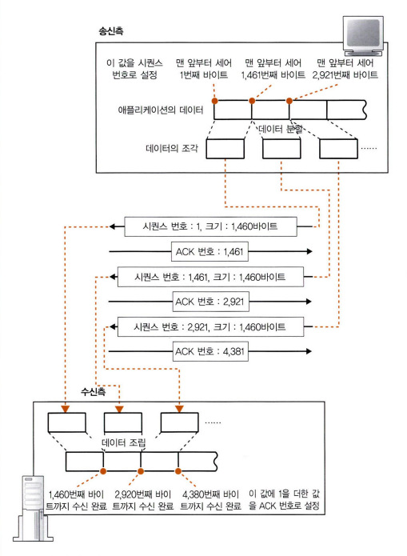
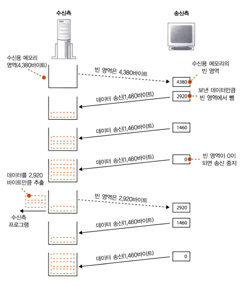
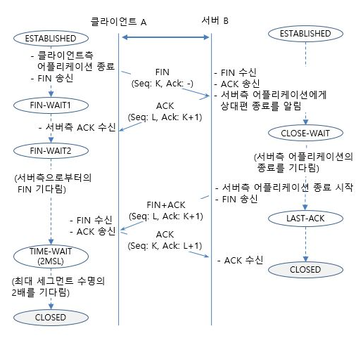

# 02 TCP/IP의 데이터를 전기 신호로 만들어 보낸다

데이터 송·수신은 아래와 같은 순서로 동작한다.
1. 소켓을 작성하는 단계
2. 접속 동작 실행 단계
3. 데이터 송·수신 단계
4. 연결 끊기 단계

데이터 송·수신을 자세하게 알아보기 전에 OS에 내장된 네트워크 제어용 소프트웨어(프로토콜 스택)와 네트워크용 하드웨어(LAN 어뎁터)가 브라우저에서 받은 메시지를 서버에 송출하는 동작을 알아보자.

먼저 맨 위에 있는 것은 네트워크 애플리케이션으로 브라우저, 메일러, 웹 서버, 메일 서버 등의 프로그램 등이 있다. 데이터의 송·수신 등의 일을 의뢰하며 애플리케이션의 아랫부분에는 Socket 라이브러리와 리졸버가 있다.

그 아래가 OS의 내부이며, 여기에 프로토콜 스택이 있다. TCP와 UDP 프로토콜을 사용하여 데이터 송·수신을 담당한다. 브라우저, 메일 등의 일반적인 애플리케이션에서 사용할 때는 TCP를 사용하고, DNS 서버에 대한 조회 등에서 짧은 제어용 데이터를 송·수신하는 경우 UDP를 사용한다.

그 아래에는 패킷 송·수신 동작을 제어하는 IP가 있다. 패킷이란 작은 덩어리로 분할된 데이터를 말하며, 이 패킷을 통신 상대까지 운반하는 것이 IP의 주 역할이다. 그리고 IP 내부에는 패킷을 운반할 때 발생하는 오류를 통지하거나 제어용 메시지를 통지하는 **ICMP**(Internet Control Message Protocol) 프로토콜과 IP 주소에 대응하는 이더넷의 MAC 주소를 조사할 때 사용하는 **ARP**(Address Resolution Protocol) 프로토콜을 다룬다.

IP 아래에는 LAN 드라이버와 LAN 어뎁터가 있으며 LAN 드라이버는 LAN 어뎁터의 하드웨어를 제어하고 실제 송·수신 동작을 LAN 어뎁터가 실행한다.

------------
그럼 이제 데이터 송·수신 동작을 하나씩 알아보자.

먼저 소켓에 대해 알아보자.
 프로토콜 스택은 내부에 제어 정보를 기록하는 메모리 영역을 가지고 있으며, 통신 상대의 IP 주소, 포트 번호, 통신 동작이 어떤 진행 상태에 대한 정보가 담겨있다.
 소켓은 이런 제어 정보 또는 제어 정보를 기록한 메모리 영역을 말한다. 소켓의 역할은 통신 동작을 제어하기 위한 여러 가지 제어 정보를 통해 프로토콜 스택이 다음에 무엇을 해야하는지 판단한다.

애플리케이션이 socket을 호출하여 소켓을 만들 것을 의뢰하면 프로토콜 스택은 의뢰에 따라 한 개의 소켓을 만든다.
> <디스크립터> = socket(<IPv4 사용>, <TCP 사용>,...);

이때 프로토콜 스택은 소켓 한 개 분량의 메모리 영역을 확보하고 여기에 제어 정보를 기록한다. 또한 초기 상태임을 나타내는 제어 정보를 소켓의 메모리 영역에 기록한다. 이렇게 소켓이 만들어지면 소켓을 나타내는 **디스크립터**를 애플리케이션에 알려준다.

------------
다음은 접속 동작이다.
 소켓을 만든 직후는 통신 상대가 누군지 모른다. 그래서 애플리케이션은 connect를 호출하여 통신 상대와의 사이에 제어 정보를 주고받아 소켓에 필요한 정보를 기록하고 데이터 송·수신이 가능한 상태로 만든다.
> connect(<디스크립터>, <서버측의 IP 주소와 포트번호>,...);

또한 송·수신하는 데이터를 일시적으로 저장하는 버퍼 메모리의 확보도 접속 동작을 할 때 실행된다.

제어 정보에는 두 종류가 있다.
 먼저 하나는 클라이언트와 서버가 서로 연락을 절충하기 위해 주고받는 제어 정보로 TCP 프로토콜의 사양으로 규정하고 있다.

제어 정보를 패킷의 맨 앞부분에 배치하는 곳부터 **헤더**라고 부르며, 클라이언트와 서버는 이 헤더에 필요한 정보를 기록하여 연락을 하면서 통신 동작을 진행한다.
 헤더에 기록된 제어 정보 중 컨트롤 비트에 대해 알아보자.
 컨트롤 비트는 필드의 각 비트가 각각 통신 제어상의 의미를 가지며 아래와 같은 6개의 종류가 있다.
- URG(Urgent) : 긴급 포인터의 필드가 유효하다는 것을 나타내며, 비트가 1이면 패킷의 순서에 상관없이 먼저 송신
- ACK(Acknowledgement) : 수신 데이터의 일련번호 필드가 유효하다는 것을 나타내며, 보통 데이터가 올바르게 수신측에 도착한 것을 의미
- PSH(Push) : flush 동작에 의해 송신된 데이터임을 나타내며, 수신측은 버퍼가 찰 때까지 기다리지 않고 수신 즉시 버퍼링된 데이터를 전달
- RST(Reset) : 접속을 강제로 종료하고 이상 종료시에 사용
- SYN(Synchronize) : 연결을 시작하기 위한 컨트롤 비트 
- FIN(Finish) : 연결을 종료하기 위한 컨트롤 비트

다른 하나는 소켓에 기록하여 프로토콜 스택의 동작을 제어하기 위한 제어 정보이다.

TCP는 **3-Way Handshaking**을 통해 클라이언트와 서버를 연결한다. 3번의 단계를 거쳐서 설정이 완료되며 각 단계는 아래와 같다.
1. SYN 세그먼트(연결 요청) : 클라이언트는 서버에 SYN 패킷을 전송하여 연결 요청
2. SYN + ACK 세그먼트(연결 허락) : 서버가 클라이언트의 SYN 요청을 받고 SYN-ACK의 패킷을 전송
3. ACK 세그먼트(연결 설정) : 클라이언트는 서버의 SYN-ACK 패킷을 받고, ACK 패킷을 서버에 전송하며 연결

------------
다음은 데이터를 송·수신하는 단계이다.
애플리케이션에 제어가 되돌아오면 write를 호출하여 송신 데이터를 프로토콜 스택에 건네준다.
> write(<디스크립터>, <송신 데이터>, <송신 데이터 길이>);

애플리케이션에서 한 번의 송신 의뢰에서 건네주는 데이터의 길이를 제어한다. 프로토콜 스택은 받은 데이터를 송신용 버퍼 메모리 영역에 저장하고 어느 정도 데이터를 저장하고 나서 송·수신 동작을 실행한다.

OS의 종류나 버전에 따라 달라지지만 다음과 같은 요소를 바탕으로 판단한다.
 먼저 **한 패킷에 저장할 수 있는 데이터의 크기**로 판단한다.

- MTU(Maximum Transmission Unit) : 한 패킷으로 운반할 수 있는 디지털 데이터의 최대 길이로, 패킷에 헤더가 포함
- MSS(Maximum Segment Size) : 헤더를 제외한 하나의 패킷으로 운반할 수 있는 데이터의 최대 길이

애플리케이션에서 받은 데이터가 MSS를 초과하거나 MSS에 가까운 길이에 이르기까지 데이터를 저장하고 송신 동작을 한다.
 한 개의 패킷에 들어가지 않을 만큼 긴 데이터를 보낼 경우도 있을 거다. 이럴 경우에는 맨 앞부터 차례대로 MSS의 크기에 맞게 분할하고, 분할한 조각을 한 개씩 패킷에 넣어 송신한다.

또 한가지 판단 요소는 **타이밍**이다.
  송신 속도가 느려지는 경우에는 MSS에 가깝게 데이터를 저장하면 송신 동작이 지연되므로 적당한 시간이 지나면 송신 동작을 실행한다.

TCP는 ACK 번호를 사용하여 송신한 패킷이 상대에게 올바르게 도착했는지 확인하고, 도착하지 않았으면 다시 송신하는 기능을 통해 송신 확인을 한다.
 확인 방법의 개념은 아래와 같다.
- 데이터를 조각으로 분할할 때 조각이 통신 개시부터 따져서 몇 번째 바이트에 해당하는지를 세어둠
- 데이터의 조각을 송신할 때 세어둔 값을 TCP 헤더에 기록하는데, 시퀀스 번호라는 항목이 해당됨
- 수신측에서 패킷 전체의 길이에어 헤더 길이를 빼는 방법으로 데이터의 크기를 산출하고 이를 통해 패킷이 누락되었는지 확인
- 수신측은 이전에 수신한 데이터와 합쳐 데이터를 몇 번째 바이트까지 수신한 것인지 계산하고, 그 값은 TCP 헤더의 ACK 번호에 기록하여 송신측에 알림
- 실제로 악의적인 공격에 대비하기 위해 난수를 바탕으로 산출된 초기값으로 시작하고 데이터의 송·수신을 시작하기 전에 초기값을 상대에게 알림

또한 TCP는 네트워크 혼잡 상태를 고려하여 ACK 번호의 대기 시간을 조정한다. 사내 LAN이라면 수 밀리초 안에 ACK 번호가 돌아오지만, 인터넷의 경우는 혼잡하면 수백 밀리초를 넘는 경우도 있기 때문에 TCP는 대기 시간을 동적으로 변경하는 방법을 취한다.

TCP는 ACK 번호가 돌아올 때까지의 시가 동안 아무 일도 하지 않고 기다리는 것은 시간 낭비이다. 그래서 TCP는 **윈도우 제어 방식**으로 효율적으로 ACK 번호를 관리한다.
 윈도우 제어는 한 개의 패킷을 보낸 후 ACK 번호를 기다리지 않고 차례대로 연속해서 복수의 패킷을 보내는 방법이다. 하지만 계속 보내게 될 경우 수신측의 능력을 초과하는 문제가 생길 수 있다.
 이를 해결하기 위해 먼저 수신측에서 송신측에 수신 가능한 데이터 양을 통지하고, 수신측을 이 양을 초과하지 않도록 송신 동작을 실행한다.

송·수신 동작의 효율성을 높이기 위해 ACK 번호와 윈도우를 통지하는 타이밍을 고려해야 한다.
 먼저 윈도우 통지가 필요할 때는 수신측이 수신 버퍼에서 데이터를 추출하여 애플리케이션에 건네주었을 때이다.
ACK 번호는 수신측에서 데이터를 받았을 때 내용을 조사하여 정상 수신을 확인할 수 있는 경우에만 송신측에 보낸다.
 따라서 수신측은 ACK 번호와 윈도우 통지를 한 개의 패킷에 합승시켜 통지하여 패킷의 수를 줄일 수 있다.

프로토콜 스택은 서버에서 응답 메시지가 돌아오기를 기다리고, 응답 메시지가 돌아오면 그것을 수신한다. 서버에서 돌아오는 응답 메시지를 받기 위해 read 프로그램을 호출하고 read를 경유하여 프로토콜 스택에 제어가 넘어간다.
> <수신 데이터 길이> = read(<디스크립터>, <수신 버퍼>,...);

서버에서 응답 메시지의 패킷이 도착했을 때 프로토콜 스택은 수신 버퍼에서 수신 테이터를 추출하여 애플리케이션에 건네준다. 먼저 수신한 데이터 조각과 TCP 헤더의 내용을 조사하여 도중에 데이터가 누락되었는지 검사하고, 문제가 없으면 ACK 번호를 반송한다. 그리고 데이터 조각을 수신 버퍼에 일시 보관하고, 조각을 연결하여 데이터를 원래 모습으로 복원한 후 애플리케이션이 지정한 메모리 영역에 옮겨 기록한 후 애플리케이션에 제어를 되돌려준다.

------------
마지막으로 연결 끊기 단계이다.
 데이터 보내기를 완료한 쪽에서 연결 끊기 단계에 들어가는데, 책에서는 서버측에서 연결 끊기 단계에 들어가는 것으로 간주하고 설명한다.

서버측의 애플리케이션이 먼저 Socket 라이브러리의 close를 호출한다.
> close(<디스크립터>);

TCP는 **4-Way Handshaking**을 통해 연결을 종료한다. 4번의 단계를 거쳐서 연결이 종료되며 각 단계는 아래와 같다.
1. 서버 FIN 세그먼트 : 서버에서 FIN 비트를 1로 설정하고 클라이언트에게 전송
2. 클라이언트 ACK 세그먼트 : 클라이언트는 서버의 FIN 비트를 수신하고 ACK로 응답
3. 클라이언트 FIN 세그먼트 : 클라이언트는 모든 데이터 수신이 완료되면 FIN 비트를 1로 설정하고 서버에게 전송
4. 서버 ACK 세그먼트 : 서버는 클라이언트의 FIN 비트를 수신하고 ACK로 응답

이 때 소켓을 바로 말소해버린다면 오동작이 일어날 수 있다.
 책에서 나온 오동작의 예시다.
1. 클라이언트가 FIN 송신
2. 서버가 ACK 번호 송신
3. 서버가 FIN 송신
4. 클라이언트가 ACK 번호 송신

클라이언트가 서버측에 FIN을 송신한 후 소켓을 말소해버리면 서버는 ACK 번호가 돌아오지 않아 다시 FIN을 송신한다. 이 시점에서 다른 애플리케이션이 소켓을 작성하면 새 소켓에 같은 포트 번호가 할당될 수 있고 같은 포트 번호의 소켓이 만들어진 상태에서 서버가 다시 보낸 FIN을 수신받게 되는 문제가 있다.
 이러한 오동작을 막기 위해 잠시 기다린 후 소켓을 말소한다.

------------
### 참고자료
- https://www.cyber.co.kr/book/item/7147
- http://www.ktword.co.kr/test/view/view.php?m_temp1=1889&id=1103
- http://www.ktword.co.kr/test/view/view.php?m_temp1=2437&id=1103
- http://www.ktword.co.kr/test/view/view.php?m_temp1=1901&id=995

