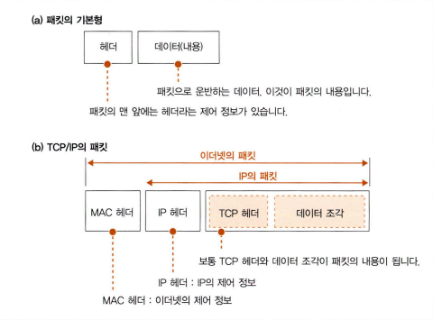
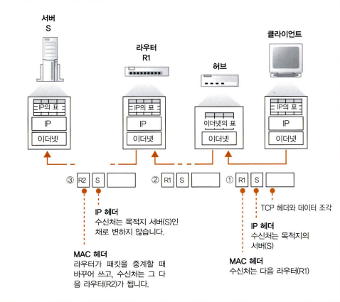
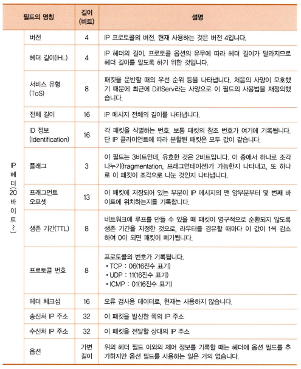
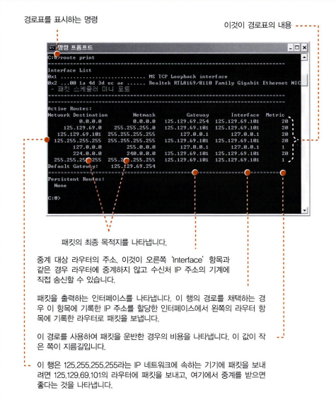
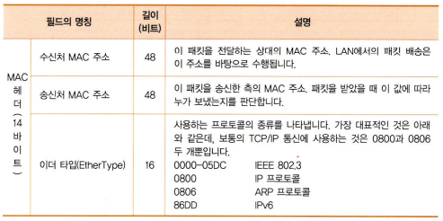
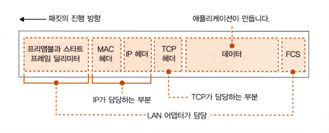
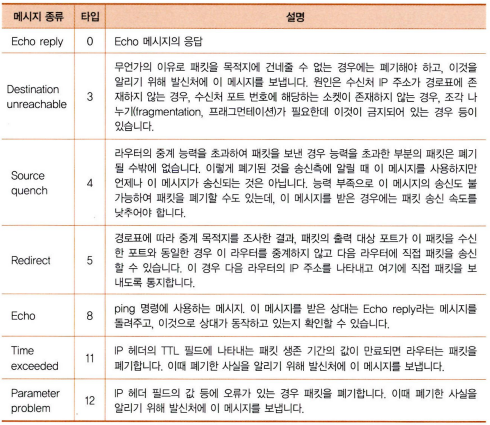
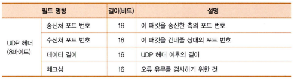

# 02 TCP/IP의 데이터를 전기 신호로 만들어 보낸다

## 5. IP와 이더넷의 패킷 송·수신 동작
학습 목표
- 실제로 패킷을 송·수신 동작하는 동작
	- 프로토콜 스택과 LAN 어댑터가 연대하여 작은 조각으로 분할한 데이터를 패킷 형태로 묶고 그것을 전기나 빛의 신호로 변환하여 케이블에 송출하는 모습 설명

### 1 패킷의 기본
- 패킷 : 네트워크가 전달하는 데이터의 형식화된 블록
	- **헤더**와 **데이터**로 구성
		- 헤더 : 수신처를 나타내는 주소등의 제어 정보가 있음
		- 데이터 : 패킷의 내용
- 패킷이 가장 가까운 중계 장치에 도착하고, 중계 장치는 패킷의 헤더를 조사하여 최종 목적지를 판단
- 송신처에서 수신처를 향해 패킷을 보내면 보통 수신처에서 송신처를 향해 회답 패킷이 되돌아옴

- IP 주소의 서브넷은 **라우터**와 **허브**의 패킷 중계 장치에서 아래와 같은 역할을 분담하면서 패킷을 운반
	- IP 헤더를 통해 라우터가 목적지를 확인하여 다음 라우터를 나타냄
	- MAC 헤더를 통해 허브가 서브넷 안에서 패킷을 운반하여 다음 라우터에 도착

- 패킷의 전송 과정
	1. 송신처에서 패킷의 목적지가 되는 액세스 대상 서버의 IP 주소를 IP 헤더의 수신처에 기록
	2. IP는 이 수신처가 어느 방향에 있는지를 조사하고, 그 방향에 있는 다음 라우터를 조사
	3. 다음 라우터에 할당된 MAC 주소를 조사하고, 그것을 MAC 헤더에 기록
	4. 의뢰를 받은 이더넷에게 어느 라우터에 패킷을 도착하면 좋은지를 전달
	5. 허브에 도착하고, MAC 헤더의 수신처 정보와 이더넷용 표를 결합해서 패킷의 목적지를 판단하여 중계
	6. 다음 라우터에 도착하고, IP 헤더의 수신처 정보와 IP용 표를 결합해서 다음에 어느 라우터에 패킷을 중계하면 좋을지를 결정
	7. 목적지에 패킷이 도착할 때까지 3 - 7 과정을 반복

- IP와 이더넷의 역할을 분담하는 이유
	- 이더넷 부분을 무선 LAN, ADSL, FTTH 등 IP의 의뢰를 받아 패킷을 운반할 수 있는 것이면 무엇이든지 대체하기 위함

### 2 패킷 송·수신 동작의 개요
- IP 담당 부분의 패킷 송신 동작
	1. TCP 담당 부분이 IP 담당 부분에 패킷 송신을 의뢰
	2. IP 담당 부분은 IP 헤더와 MAC 헤더를 부가
		- IP 헤더 : IP 프로토콜에 규정된 규칙에 따라 IP 주소로 표시된 목적지까지 패킷을 전달할 때 사용하는 제어 정보를 기록
		- MAC 헤더 : 이더넷 등의 LAN을 사용하여 가장 가까운 라우터까지 패킷을 운반할 때 사용하는 제어 정보를 기록
	3. 만든 패킷을 네트워크용 하드웨어게 전달(형태에 따라 호칭이 다르지만 여기선 'LAN 어댑터'라고 호칭)
		- LAN 어댑터에 건네줄 때의 패킷의 모습은 0이나 1의 비트가 이어딘 디지털 데이터고, 이것이 LAN 어댑터에 의해 전기나 빛의 신호 상태로 케이블에 송출
	4. 신호는 허브나 라우터 등의 중계 장치에 도착하고, 목적지까지 전달

- 상대에게 패킷이 도착하면 거기에서 회답이 돌아옴
	1. 케이블에서 신호의 모습을 한 패킷이 들어오면 이것을 LAN 어댑터에서 디지털 데이터의 모습으로 되돌림
	2. 디지털 데이터의 패킷을 IP 담당 부분에 건네줌
	3. IP 담당 부분이 TCP 헤더와 데이터 조각을 TCP 담당 부분에 건네줌

- IP 패킷 송·수신 동작은 패킷의 역할에 관계없이 모두 같음
	- 의뢰받은 내용물을 패킷의 모습으로 만들어 상대에게 송신하거나 전달한 패킷을 수신함

### 3 수신처 IP 주소를 기록한 IP 헤더를 만든다
- IP 헤더의 포맷은 아래와 같다

- 수신처 IP 주소
	- TCP 담당 부분에서 통지된 통신 상대의 IP 주소를 설정
	- IP는 스스로 수신처를 판단하지 않고 애플리케이션이 지정한 상대에게 패킷을 송신할 뿐이므로 전적으로 애플리케이션측에 책임이 있음
- 송신처 IP 주소
	- 컴퓨터에 할당된 IP 주소 (하나의 LAN 어댑터)
	- 서버 기계의 경우 복수의 LAN 어댑터를 장착할 수 있음
		- 라우팅 테이블을 사용하여 IP 주소를 결정
			- 소켓에 기록되어 있는 수신처 IP 주소를 Network Destination 항목과 비교하여 일치하는 것을 찾아냄
			- 찾아낸 행의 Interface 항목(네트워크용 인터페이스)은 인터페이스에서 패킷을 송신하면 상대에 패킷을 전해줄 수 있다는 의미
			- Gateway 항목에는 다음 라우터의 IP 주소를 기록하게 되어 있어서 IP 주소를 가진 라우터에 패킷을 건네주면 라우터가 목적지에 패킷을 중계해 준다는 것을 의미
- 프로토콜 번호
	- 패킷에 들어간 내용물이 어디에서 의뢰받은 것인지를 나타내는 값
		- 06 : TCP에서 의뢰
		- 17 : UDP에서 의뢰

### 4 이더넷용 MAC 헤더를 만든다
- MAC 헤더의 포멧은 아래와 같다

- 수신처 MAC 주소
	- 경로표에 일치하는 행의 Gateway 항목에 기록되어 있는 IP 주소를 설정
- 송신처 MAC 주소
	- 자체의 LAN 어댑터의 MAC 주소를 설정
- 이더 타입
	- 내용물이 무엇인지를 나타냄

### 5 ARP로 수신처 라우터의 MAC 주소를 조사한다
- ARP(Address Resolution Protocol)
	- 서브넷에 연결되어 있는 전원에게 IP 주소를 브로드 캐스팅하고 응답을 받음
	- 한 번 조사한 결과는 ARP 캐시에 보존하여 다시 이용
	- IP 주소가 수정된 경우 문제가 발생할 수 있기 때문에 ARP 캐시에 저장된 값은 일정 시간이 지나면 지워짐

### 6 이더넷의 기본
- 다수의 컴퓨터가 여러 상대와 자유롭게 적은 비용으로 통신하기 위해 고안된 통신 기술

### 7 IP 패킷을 전기나 빛의 신호로 변환하여 송신한다
- 디지털 데이터를 전기나 빛의 신호로 변환하여 네트워크 케이블에 송출
- LAN 어댑터에서 동작을 실행
- LAN 드라이버 소프트웨어를 통해 LAN 어댑터를 제어

- LAN 어댑터 초기화
	- 하드웨어 이상 검사
	- 초기 설정
	- 이더넷 특유의 작업
		- MAC(Media Access Control) 회로에 MAC 주소를 설정
			- LAN 어댑터의 RON에는 일원화해서 관리하는 MAC 주소를 제조할 때 기록
			- 이것을 읽어와 MAC 주소를 설정
		- 명령이나 설정 파일을 통해 MAC 주소를 설정할 수도 있음

### 8 패킷에 3개의 제어용 데이터를 추가한다
- 패킷을 전기 신호로 변환하여 실제로 케이블에 송출
	1. LAN 드라이버는 IP 담당 부분에서 패킷을 받으면 그것을 LAN 어댑터의 버퍼 메모리에 복사
	2. 복사를 마친 후 패킷을 송신하도록 MAC 회로에 명령을 보내면 MAC 회로의 작업이 시작

- 송신 패킷을 버퍼 메모리에서 추출하고 맨 앞에는 **프리앰블**과 **스타트 프레임 딜리미터**를, 맨 끝에는 **FCS(Frame Check Sequence)**를 부가
	- 프리앰블 : 송신하는 패킷을 읽을 때의 타이밍을 잡기 위한 것
	- 스타트 프레임 딜러미터 : 프레임의 개시 위치를 발견
	- FCS : 오류 검출용 데이터, 패킷을 운반하는 도중에 잡음 등의 영향으로 파형이 흐트러져 데이터가 변한 경우 이것을 검출하기 위해 사용

- 신소의 전압이나 전류의 값을 읽고 0과 1의 비트 값으로 되돌림
- 하나의 값이 이어지면 신호의 변화가 없어져 비트 구분을 판단할 수 없는 문제가 생김
- 이러한 문제를 해결하기 위해 별도로 비트 구분을 나타내는 **클록** 신호를 보냄
	- 클록 신호가 아래에서 위로 변화할 때 데이터 신호의 전압이나 전류를 읽고 이것을 0과 1로 대응
	- 물리적인 거리가 멀어져 데이터의 신호와 클록 신호가 전달되는 시간에 차이가 생겨 클록이 틀어져 버리는 문제
		- 데이터 신호와 클록 신호를 합성하여 한 개의 신호로 만듦
			- 이를 통해 데이터 신호를 추출할 수 있음

### 9 허브를 향해 패킷을 송신한다
1. 리피터 허브를 사용힌 반이중 모드
	- 먼저 케이블에 다른 기기가 송신한 신호가 흐르고 있는지 조사하고, 신호가 흐르고 있으면 그것이 끝날 때까지 기다림
	- 신호가 정지했거나 애초부터 신호가 흐르고 있지 않았으면 송신 동작을 시작
	- MAC 회로가 프리앰블의 맨 앞부터 1비트씩 차례로 디지털 데이터를 전기 신호로 변환하고, 이것을 PHY 또는 MAU 송·수신 신호 부분에 보냄
	- PHY(MAU) 회로는 이 신호를 케이블에 송출하는 형식으로 변환하여 송신
	- 낮은 확률로 동시에 복수의 기기가 송신 동작에 들어갈 가능성이 있고 이를 **충돌** 현상이라고 함
		- 송신 동작을 중지
		- **재밍 신호**를 통해 충돌이 일어난 사실을 다를 기기에 알리고 송신 동작을 멈추고 다시 한 번 송신 동작을 시도
		- 이를 대기 시간이라고 하는데 시간이 중복되지 않도록 고안됨
			- 이더넷이 혼잡해지면 충돌의 가능성이 높아지므로 대기 시간을 2배로 늘려서 다시 보냄
			- 열 번째까지 다시 보냈는데도 해결되지 않으면 오류로 판단	
2. 스위칭 허브를 사용한 전이중 모드
	- 송신과 수신을 동시에 실행하면서 충돌을 일어나지 않음

### 10 돌아온 패킷을 받는다
- 패킷을 수신할 때의 동작
	- 리피터 허브를 이용한 반이중 동작의 이더넷에서는 1대의 송신한 신호가 리피터 허브에 접속된 케이블 전부에 흘러감
	- 프리앰블로 타이밍을 계산하고 스타트 프레임 딜러미터로 개시를 알면, 그 다음 비트부터 디지털 데이터로 변환
		- PHY(MAU) 회로에서 MAC 회로쪽으로 진행
		- MAC 회로에서 디지털 데이터로 변환하여 버퍼 메모리에 저장
		- FCS를 검사
			- 문제가 생기면 오류 패킷으로 간주하여 폐기
		- 문제가 없다면 MAC 헤더의 수신처 MAC 주소를 조사하여 LAN 어댑터를 초기화할 때 설정한 자체의 MAC 주소와 비교한 후 이것이 자신에게 오는 것인지 판단
			- 다른 곳에 갈 패킷은 폐기
		- 자신에게 오는 것이면 패킷을 받아 버퍼 메모리에 저장
		- 패킷을 수신한 사실을 컴퓨터에 통지
			- 인터럽트 구조를 사용
			- LAN 드라이버가 동작하고 LAN 어댑터의 버퍼 메모리에서 수신한 패킷을 추출하면, LAN 드라이버는 MAC 헤더의 타입 필드의 값으로부터 프로토콜을 판별

### 11 서버의 응답 패킷을 IP에서 TCP로 넘긴다
- IP 담당 부분은 IP 헤더 부분부터 조사하여 포맷에 문제가 없는지 확인하고, 수신처 IP주소를 조사
- 패킷을 수신한 기기가 윈도우의 클라이언트 PC
	- 서버에서 회신된 패킷의 수신처 IP 주소는 수시한 LAN 어댑터에 할당된 주소와 일치할 것이므로 이것을 확인하고 패킷을 수신
	- 수신처 IP 주소가 자신의 주소와 다르면 오류가 있는 것
		- ICMP 메시지를 사용하여 통신 상대에게 오류를 통지
	- 수신처 IP 주소가 올바르면 **조각 나누기(fragmentation)**을 통해 하나의 패킷을 여러 개로 분할된 것을 원래 패킷으로 되돌림
		- 분할된 패킷은 IP 헤더에 잇는 **플래그** 항목을 통해 알 수 있음
		- IP 헤더에 있는 **ID 정보**에 같은 값을 가진 패킷이 도착하기를 기다림
		- **프래그먼트 오프셋(fragment offset)** 항목에는 원래 패킷의 어느 위치에 있었는지를 나타내는 정보가 들어있음
		- **리어셈블링(reassembling)**을 통해 패킷을 원래의 모습으로 되돌림
	- 패킷을 TCP 담당 부분에 전달

## 6. UDP 프로토콜을 이용한 송·수신 동작
학습 목표
- UDP 프로토콜의 필요성과 TCP와의 차이점

### 1 수정 송신이 필요없는 데이터의 송신은 UDP가 효율적이다
- TCP 사용 이유
	- 데이터를 확실하면서도 효율적으로 전달하기 위해서 사용
- 데이터가 한 개인 패킷에 수용할 수 있을 만큼 길이가 짧은 경우 TCP처럼 복잡한 구조를 사용해도 효율적으로 데이터를 다시 보낼 수 있음
	- 패킷이 한 개라면 이것이 없어졌는지 생각할 필요가 없음
	- 데이터를 전부 다시 보낸다 해도 패킷을 한 개만 보내므로 낭비가 아님
	- 접속하거나 연결을 끊을 때 제어용 패킷을 보낼 필요 없음
	- 수신 확인 응답 패킷도 필요 없음

### 2 제어용 짧은 데이터
- DNS 서버에 대한 조회 등 제어용으로 실행하는 정보 교환은 한 개의 패킷으로 끝나는 경우가 많으므로 UDP를 사용
- 애플리케이션에서 송신 데이터를 받으면 여기에 UDP 헤더를 부가하고 이것을 IP에 의뢰하여 송신하기만 함
- IP 헤더에 기록되어 있는 수신처 IP 주소와 송신처 IP 주소, 그리고 UDP 헤더에 기록되어 있는 수신처 포트 번호와 송신처 포트 번호라는 네 항목과 소켓에 기록된 정보를 결합하여 데이터를 건네줄 대상 애플리케이션을 판단하고 건네주기만 함
- 오류가 발생하면 응답이 돌아오지 않으므로 애플리케이션이 그 사실을 알아차리고 데이터를 한 번 더 다시 보냄

### 3 음성 및 동영상 데이터
- 음성이나 영상의 데이터를 보낼 때 UDP를 사용
	- TCP를 사용하는 경우 수신 확인 응답에 의해 오류를 검출하여 다시 보내는 방법이라면 시간이 걸려 재생 타이밍에 맞지 않을 수 있음

### 참고자료
- https://ko.wikipedia.org/wiki/%EB%84%A4%ED%8A%B8%EC%9B%8C%ED%81%AC_%ED%8C%A8%ED%82%B7
- http://www.ktword.co.kr/test/view/view.php?m_temp1=1859
- http://www.ktword.co.kr/test/view/view.php?nav=2&no=323&sh=UDP
