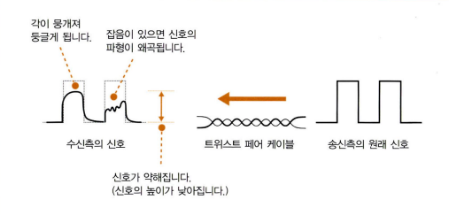
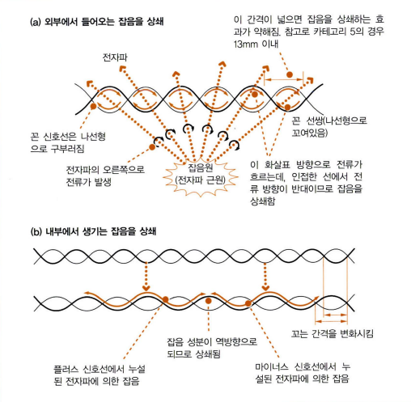
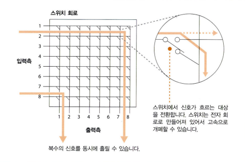

# 03 케이블의 앞은 LAN 기기였다
학습 목표
- 클라이언트 PC가 송신한 패킷이 리피터 허브, 스위칭 허브, 라우터를 경유하여 인터넷에 나가는 부분을 학습

## 1. 케이블과 리피터, 허브 속을 신호가 흘러간다
### LAN 케이블은 신호를 약화시키지 않는 것이 핵심이다
- LAN 어댑터의 PHY(MAU) 회로에서 전기 신호로 형태를 바꾼 패킷은 RJ-45 커넥터를 통해 **트위스트 페어 케이블**에 들어감
- 신호는 케이블 속을 흘러 리피터 허브의 커넥터 부분에 도착
- 이 때 신호는 각이 뭉개져 둥글게 되거나 잡음으로 신호의 파형이 외곡될 수 있음

잡음은 케이블 주위에서 발생하는 전자파가 원인이다.
- 케이블에 영향을 받는 전자파는 두 종류
	1. 모터, 형광등, CRT 모니터와 같은 기기에서 누설되는 전자파
		- 케이블 밖에서 오는 것으로, **선을 꼼**으로써 막을 수 있음
	2. 같은 케이블 안의 인접한 신호선에서 누설되는 전자파
		- **크로스토크(crosstalk)** : 신호선 안에 신호라는 전류가 흐르므로 전류에 의해 주위에 전자파가 생기고, 이것이 다른 신호선에 대한 잡음이 되어 영향을 미치는 현상
		- 강하진 않지만 가까이 있음
		- 꼬는 간격을 미묘하게 변화시키면 어떤 부분에서는 플러스 신호가 가까이에 있고, 다른 부분에서는 마이너스 신호선이 가까워짐
		- 플러스와 마이너스의 균형이 잡히면서 잡음의 영향이 줄어듦

### 리피터 허브는 연결되어 있는 전체 케이블에 신호를 송신한다
1. 신호가 리피터 허브에 도달하면 LAN 전체에 신호가 흩어짐
	- 리피터 허브에는 MDI/MDI-X와 같은 전환 스위치가 존재하는데, 허브끼리 접속할 때는 각각 한쪽이 MDI,MDI-X여야 함
		- MDI(Media Dependent Interface) : RJ-45 커넥터와 신호 송·수신 회로를 직접 결선
		- MDI-X(MDI-Crossover) : 교차하여 결선
2. 리피터 허브에서 PHY(MAU) 회로의 수신부에 도달한 신호는 리피터 회로에 들어감
	- 들어오는 신호를 리피터 허브의 커넥터 부분에 뿌림
	- 리피터 허브에 접속한 전체 기기에 도달
3. 신호를 수신한 기기는 맨 앞에 있는 MAC 헤더에 쓰여있는 수신처 MAC 주소를 조사하여 자신이 수신처에 해당하면 이것을 수신하고, 해당하지 않으면 수신한 신호를 무시
4. 뿌려진 신호는 스위칭 허브, 라우터, 서버 등에 도달하여 디지털 데이터로 변환되고, FCS를 검사하는 곳에서 데이터 변화가 판명된 후 변화된 패킷은 폐기됨
	- 패킷이 폐기되면 수신 확인 응답을 되돌려주지 않으므로 프로토콜 스택의 TCP 담당 부분이 패킷을 다시 보냄

## 2. 스위칭 허브의 패킷 중계 동작
### 1 스위칭 허브는 주소 테이블로 중계한다
- 패킷이 스위칭 허브를 경유하여 흘러갈 때의 동작
	1. 신호가 커넥터 부분에 도달하여 PHY(MAU) 회로에서 수신되는 부분은 리피터 허브와 같음
	2. PHY(MAU) 회로에서 케이블을 흐르는 신호의 형식부터 디지털 데이터로 변환한 후 신호는 MAC 회로로 들어가고 패킷의 맨 끝에 있는 FCS를 대조하여 오류의 유무를 검사하고, 문제가 없으면 버퍼 메모리에 저장
	3. 스위칭 허브의 포트는 수신처 MAC 주소를 검사하지 않고 모든 패킷을 수신하여 버퍼 메모리에 저장하기 때문에 스위칭 허브의 포트에는 LAN 어댑터와 달리 MAC 주소가 할당되어 있지 않음
	4. 패킷을 버퍼 메모리에 저장하면 다음에 수신처 MAC 주소와 일치하는 것이 MAC 주소표에 등록되어 있는지 조사
		- MAC 주소표에는 기기의 MAC 주소와 그 기기가 어느 포트에 존재하는지에 대한 정보가 등록되어 있음
		- 이것을 사용하여 수신한 패킷을 어느 포트에서 송신하면 좋을지를 판단
		- 스위치 회로를 경유하여 패킷을 송신측의 포트에 보냄

- **스위치 회로**
	- 신호선이 격자 모양으로 배치되고, 교점에 스위치가 있음
	- 스위치는 전자적으로 개폐를 제어할 수 있고, 이 전자적 개폐를 통해 신호가 흐르는 대상을 제어
	- 입력측은 수신측 포트에, 출력측은 송신측 포트에 각각 접속
	- 포트 사이에 패킷을 운반할 때는 이 회로에 패킷의 신호를 흘림
	- 신호의 교점에 있는 스위치는 각각 독립적으로 움직이므로 신호가 중복되지 않으면 복수의 신호를 동시에 흘릴 수도 있음
	- 이 스위치 회로를 경유하여 송신측의 포트에 패킷을 운반하면 MAC 회로나 PHY(MAU) 회로가 송신 동작을 실행하고 케이블에 신호가 흘러감
		- 이 때 송신 동작도 LAN 어댑터의 송신 동작과 같음
		- 이더넷의 규칙에 따라 먼저 아무도 송신중이지 않다는 것을 확인
			- 신호 송·수신 회로의 수신 부분에 신호가 흘러들어오지 않는 것을 확인
			- 누군가가 송신중이면 그것이 끝날 때까지 기다림
		- 송신 동작이 끝나거나 아무도 송신하지 않으면 소켓을 디지털 데이터에서 신호로 변환하여 송신
			- 송신 동작을 하고 있는 사이에 수신 신호를 감시하는 부분도 LAN 어댑터와 같음
			- 송신 동작중에 다른 기기가 보낸 신호가 수신측에 들어오면 패킷이 충돌하므로 **재밍 신호**를 보낸 후 송신 동작을 중지하고 잠시 기다렸다가 다시 보냄

### 2 MAC 주소 테이블을 등록 및 갱신한다
- 스위칭 허브는 패킷을 중계할 때 MAC 주소표의 내용을 갱신하는 동작도 실행
- 갱신 동작은 두 종류
	1. 패킷을 수신했을 때 송신처 MAC 주소를 조사하고, 이것을 수신한 입력 포트 번호와 하나의 세트로 MAC 주소표에 등록하는 것
		- 패킷이 들어온 포트의 앞에 패킷을 송신한 기기가 있을 것이므로 송신처 주소를 등록해 두면 MAC 주소로 갈 패킷을 수신했을 때 이것이 존재하는 포트에 중계할 수 있음
	2. MAC 주소표에 등록되어 있는 내용을 지우는 동작
		- MAC 주소표에 등록한 정보는 사용하지 않고 일정 시간이 경과하면 삭제

### 3 예외적인 동작
1. 주소표에 등록되어 있는 송신 포트가 패킷을 수신한 포트와 같은 경우
	- 스위칭 허브는 패킷을 수신한 포트와 송신하는 포트가 같을 경우 패킷을 중계하지 않고 폐기

2. MAC 주소표에 수신처 MAC 주소와 일치하는 주소가 등록되어 있지 않은 경우
	- 주소의 기기에서 패킷이 한 번도 스위칭 허브에 도착하지 않은 경우나 어느 정도 시간이 경과하여 MAC 주소표에서 삭제된 경우로 패킷을 수신한 포트 이외의 전체 포트에 패킷을 송신

3. 수신처 MAC 주소가 **브로드캐스트 주소**인 경우
	- 수신 포트를 제외하고 모든 포트에 패킷을 송신

**플러딩(Flooding)**
- 수신되는 포트를 제외하고 나머지 모드 포트에 전송하는 것을 말하며, 위의 2, 3의 경우가 해당된다.

### 4 전이중 모드에서 송신과 수신을 동시에 실행한다
- **전이중 모드**
	- 송신과 수신을 동시에 실행
	- 트위스트 페어 케이블의 신호선은 송신용과 수신용으로 나뉘어져 있으므로 송·수신 도중에 신호가 충돌하지 않음
	- 이더넷의 규칙을 개정하여 신호가 흐르고 있어도 상관하지 않고 송신해도 좋다는 동작 모드를 새로 추가
		- 동시에 이 동작 모드로 동작할 때는 신호의 충돌을 검출하는 회로를 무효화
	- 반이중 모드보다 빠르게 동작
	- 송신할 수 있는 데이터의 양의 상한선도 높아서 성능이 좋음

### 5 최적의 전송 속도로 보내는 자동 조정
- 동작 모드를 자동으로 전환하는 기능
	- 접속한 상대가 전이중 모드를 지원하는지 검출하고 동작 모드를 자동으로 전환하는 기능
	- 동작 모드뿐만 아니라 상대의 전송 속도를 검출하여 전송 속도도 자동으로 전환하는데, 이 기능은 **자동 조정(auto negotiation)**이라 함

- 이더넷은 데이터가 흐르고 있진 않을 때는 상대가 올바르게 작동하는지, 케이블이 단선되지 않았는지 등의 사항을 확인하기 위해 **링크 펄스**라는 펄스형의 신호를 흘림
- 특정 패턴으로 펄스 신호를 송신하여 자신의 상황을 상대에게 전하는 방법이 고안
	- 이 패턴에 의해 지원 가능한 모드와 전송 속도를 서로 통지하고, 그 중에서 최적의 조합을 선택하여 각각 자기 자신을 설정
		- 신호가 상대에게 도착하며, 도착한 펄스의 패턴을 읽고 상대가 어느 모드를 지원하는지 조사
		- 모드에는 우선 순위가 결정되어 있고 우선 순위가 높은 것부터 차례대로 조사하면서 자신과 상대 모두가 지원하는 것을 찾음

### 6 스위칭 허브는 복수의 중계 동작을 동시에 실행한다
- 스위칭 허브는 수신처 MAC 주소의 기기가 존재하는 포트 이외에는 송신 동작을 실행하지 않으므로 다른 포트는 빈 상태가 됨
	- 비어있는 곳에 별도의 패킷을 흘릴 수 있으며, 이렇게 해서 동시에 여러 개의 패킷을 중계할 수 있음
- 리피터 허브는 들어온 신호를 모든 포트에서 뿌리므로 동시에 두 개 이상의 신호가 들어오면 패킷이 충돌하기 때문에 복수의 신호를 동시에 흘릴 수 없음

### 참고자료
- http://www.ktword.co.kr/test/view/view.php?m_temp1=1411
- http://www.ktword.co.kr/test/view/view.php?nav=2&no=446&sh=%EB%A6%AC%ED%94%BC%ED%84%B0
- https://en.wikipedia.org/wiki/Medium-dependent_interface
- http://www.ktword.co.kr/test/view/view.php?m_temp1=2026
- http://www.ktword.co.kr/test/view/view.php?m_temp1=1362
- http://www.ktword.co.kr/test/view/view.php?nav=2&no=700&sh=%EC%A0%84%EC%9D%B4%EC%A4%91+%EB%AA%A8%EB%93%9C
