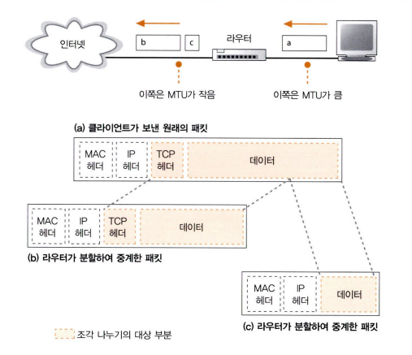

# 03 케이블의 앞은 LAN 기기였다
학습 목표
- 클라이언트 PC가 송신한 패킷이 리피터 허브, 스위칭 허브, 라우터를 경유하여 인터넷에 나가는 부분을 학습

## 3 라우터의 패킷 중계 동작
### 1 라우터의 기본
- 패킷은 리피터 허브나 스위칭 허브를 경유해 라우터에 도착하고, 중계 대상을 등록한 표를 보고 다음 라우터로 중계된다.
- 라우터의 내부 구조는 중계 부분과 포트 부분으로 구성된다.
	- 중계 부분 : 패킷의 중계 대상을 판단하는 동작을 담당
	- 포트 부분 : 패킷의 송·수신하는 동작을 담당
- 라우터의 포트 부분에 다양한 통신 기술의 하드웨어를 장착하명 다양한 통신 기술을 지원할 수 있다.

- 라우터는 포트 부분의 하드웨어에 의뢰하여 패킷을 수신하고, 중계 부분에서 받은 패킷의 IP 패킷에 기록되어 있는 수신처 IP 주소와 중계 대상을 등록한 표를 대조하여 중계 대상을 판단한다. 그리고 중계 대상측의 포트로 패킷을 옮기고 포트 부분의 하드웨어 규칙에 따라 패킷 송신 동작을 실행한다.

### 2 경로표에 등록된 정보
- 라우터는 IP 헤더에 기재되어 있는 수신처 IP 주소로 중계 대상을 판단한다.

- 라우팅 테이블에는 **수신처**, **넷마스크**, **게이트웨이**, **인터페이스**, **메트릭** 정보가 들어있다.
	- 수신처에는 IP 주소가 들어있고, 라우터는 이 항목에 등록되어 있는 IP 주소와 수신한 패킷의 수신처 IP 주소의 네트워크 번호의 부분만 비교한다.
	- 넷마스크는 주소 비교 동작을 실행할 때 네트워크 번호의 비트 수를 판단하기 위해 사용한다.
		- **주소 집약**을 이용해 몇 개의 서브넷을 모아서 한 개의 서브넷으로 간주하기 위해 넷마스크 값을 변경하여 경로표에 등록하고, 수신처 항목에 집약한 주소를 등록한다.
		- 한 개의 서브넷을 세분화하여 경로표에 등록하고, 복수의 서브넷이 있는 것처럼 보이는 경우도 있다.
	- 게이트웨이와 인터페이스는 패킷의 중계 대상을 나타낸다.
	- 매트릭은 수신처 IP 주소에 기록되어 있는 목적지가 가까운지, 먼지를 나타낸다.

### 3 라우터의 패킷 수신 동작
1. 신호가 커넥터 부분에 도착하면 안쪽에 있는 PHY(MAU) 회로와 MAC 회로에서 신호를 디지털 데이터로 변환한다.
2. FCS를 대조하여 오류의 유무를 점검한다.
3. 오류가 없다면 MAC 헤더의 수신처 MAC 주소가 자신에게 해당하는지 조사하여 해당하면 패킷을 수신 버퍼 메모리에 저장하고 해당되지 않는다면 패킷을 폐기한다.

### 4 경로표를 검색하여 출력 포트를 발견한다
- 라우터는 패킷 수신 동작이 끝나면 맨 앞의 MAC 헤더를 폐기한다.
- IP 헤더의 내용을 보고 패킷 중계 동작에 들어간다.
	- 경로표에서 중계 대상을 조사할 때 가장 먼저 수신한 패킷의 수신처 IP 주소와 경로표의 수신처 항목을 조사하여 해당하는 행을 찾는다.
		- 복수의 후보가 발견된다면 네트워크 번호의 비트 수가 가장 긴 것을 찾는다.
		- 네트워크 번호의 길이가 같은 것이 여러 행 존재하는 경우에는 메트릭 값이 작은 쪽을 중계 대상으로 선택한다.
		- 해당하는 행이 한 개도 발견되지 않는 경우에는 라우터는 패킷을 폐기하고, ICMP(Internet Control Message Protocol) 메시지로 송신처에 이 사실을 통지한다.

### 5 해당하는 경로가 없는 경우에 선택하는 기본 경로
- 넷마스크가 0.0.0.0으로 하면 모든 주소에 일치하므로 중계 대상이 분명하지 않다는 사태가 발생하기 않는다.
- 이 경우 게이트웨이에 인터넷으로 나가는 라우터를 등록해 두면 다른 행에 해당하는 것이 없는 경우에는 패킷을 그 곳으로 중계한다.
- 이 행을 **기본 경로**라고 하며, 여기에 등록된 라우터를 **기본 게이트웨이**라고 한다.

### 6 패킷은 유효 기한이 있다
- 패킷이 같은 장소를 순환하는 사태를 막기 위해 **TTL**(Time To Live)이라는 IP 헤더의 필드를 갱신한다.

### 7 큰 패킷은 조각 나누기 기능으로 분할한다
- 출력 포트측의 패킷의 최대 길이가 입력측보다 작은 경우에는 **조각 나누기**(fragmentation)라는 방법을 사용하여 패킷을 분할하고, 패킷의 길이를 짧게 만든 후 중계한다.

1. 출력측의 MTU를 조사하여 중계하는 패킷을 그대로 출력측에서 송신할 수 있는지 조사한다.
2. 출력측의 MTU가 작은 경우, IP 헤더의 플래그 필드를 조사하여 분할해도 좋을지 확인하고, 저장할 수 있는 크기로 패킷을 분할한다.
	- 플래그 필드가 분할 불가로 되어 있으면 패킷을 폐기하고 ICMP 메시지로 송신처에 동지한다.
3. 출력측의 MTU에 맞춰 TCP 헤더 이후의 부분을 분할 대상 데이터로 간주하고 이 부분을 맨 앞부분부터 차례대로 잘라내고 IP 헤더를 덧붙인다.

### 8 라우터의 송신 동작은 컴퓨터와 같다
- 출력측의 포트에 따라 송신 동작은 다르며 여기에서는 이더넷인 경우의 송신 동작을 설명한다.
- 패킷의 맨 앞부분에 MAC 헤더를 부가하고, 여기에 값을 설정하여 패킷을 완성시킨 후 전기 신호로 변환해서 보낸다.
	- 수신처 MAC 주소 필드에 값을 설정하기 위해 경로표의 게이트웨이에서 패킷을 건네줄 상대를 판별한다.
		- 이 때 IP 주소가 쓰여있으면 IP 주소가 건네줄 상대이고, 공란이면 IP 헤더의 수신처 IP 주소가 건네줄 상대이다.
	- IP 주소가 결정되면 ARP로 IP 주소에서 MAC 주소를 조사하고, 결과를 수신처 MAC 주소로 설정한다.
	- 송신처 MAC 주소 필드에는 출력측의 포트에 할당된 MAC 주소를 설정하고 타입 필드에 0800(16진수)를 설정한다.

### 9 라우터와 스위칭 허브의 관계
- MAC 헤더를 부가하여 패킷을 송신한다는 것은 이더넷의 패킷의 데이터 부분에 IP의 패킷을 넣고 이더넷에 의뢰하여 다음 라우터까지 운반하는 것이다.
 그리고 다음 라우터에 패킷이 도착하면 그 다음 라우터에 패킷을 운반하는 동작을 반복하여 송신 상대에게까지 운반하는 것이다.

## 4 라우터의 부가 기능
### 1 주소 변환으로 IP 주소를 효율적으로 이용한다
- 인터넷이 일반에게 공개되면서 고유한 주소가 고갈되는 문제가 발생할 수 있다.
- 같은 주소를 사용했어도 네트워크가 독립되어 있으면 문제가 일어나지 않아 주소 부족에 대처하기 위해 이 성질을 이용해 **글로벌 주소**와 **프라이빗 주소**를 생성한다.
- 하지만 사내 네트워크는 완전히 독립되어 있는 것이 아니라 인터넷을 통해 많은 회사에 연결되므로 패킷이 사내와 인터넷을 왕래하면 여기저기에 같은 주소가 있게 되어 패킷을 정확하게 운반할 수 없다.

- 주소 변환을 통해 사내 네트워크는 인터넷과는 직접 패킷을 주고받지 않도록 특별한 구조를 사용하여 접속한다.

### 2 주소 변환의 기본 동작
- 주소 변환의 구조는 패킷을 중계할 때 IP 헤더에 기재된 IP 주소와 포트 번호를 바꿔쓰는 것이다.

1. TCP의 접속동작에서 최초로 흐르는 패킷을 인터넷에 중계할 때 송신처의 IP 주소를 프라이빗 주소에서 글로벌 주소로 바꿔쓴다.
	- 여기에서 사용하는 글로벌 주소는 주소 변환 장치의 인터넷측에 있는 포트에 할당된 주소로, 이것과 동시에 포트 번호도 바꾸어 쓴다.
2. 바꿔쓰기 전의 프라이빗 주소와 포트 번호, 바꿔쓴 후의 글로벌 주소와 포트 번호를 한 세트로 하여 주소 변환 장치 내부에 있는 대응표에 기록한다.
3. 송신처의 IP 주소와 포트 번호를 바꿔쓴 후 패킷을 인터넷에 송출한다.
4. 회신 패킷이 도착하면 주소 변환 장치는 주소의 대응표에서 수신처를 대응하는 프라이빗 주소와 포트 번호로 바꿔쓰고, 사내 네트워크에 패킷을 보낸다.

### 3 포트 번호를 바꿔쓰는 이유
- 포트 번호를 바꿔쓰지 않고 사용할 경우 사내의 많은 사원이 동시에 접속하는 경우, 많은 글로벌 주소가 필요하게 되고 이를 개선하기 위해 포트 번호를 바꿔쓴느 방법이 고안됐다.

### 4 인터넷에서 회사로 액세스한다
- 인터넷에서 사내로 패킷을 중계할 때는 대응표에 등록되어 있지 않으면 중계할 수 없다.
- 사전에 수동으로 대응표에 등록해 두면 중계가 가능하다.

### 5 라우터의 패킷 필터링 기능
- 패킷 필터링은 패킷을 중계할 때 MAC 헤더, IP 헤더, TCP 헤더에 기록되어 있는 내용을 조사하여 그것이 사전에 설정한 조건에 합치되면 패킷을 중계하거나 폐기하는 동작을 실행하는 기능으로 이 원리를 이용해 부정 침입을 방지한다.

### 참고자료
- https://www.cyber.co.kr/book/item/7147
- http://www.ktword.co.kr/test/view/view.php?m_temp1=1327
- http://www.ktword.co.kr/test/view/view.php?nav=2&no=1919&sh=%EB%A9%94%ED%8A%B8%EB%A6%AD