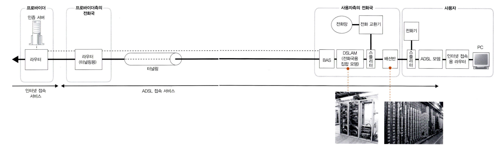

# 04 액세스 회선을 통해 인터넷의 내부로!
## 1. ADSL 기술을 이용한 액세스 회선의 구조와 동작
### 1 인터넷의 기본은 가정이나 회사의 LAN과 같다
- 다수의 라우터가 차례대로 중계하여 패킷을 목적지에 전달하는 부분이 가정이나 회사의 LAN과 같다.

- 인터넷과 가정이나 회사의 LAN과의 차이점은 아래와 같다.
	- 중계 장치 간의 거리
		- 회사나 가정의 LAN은 중계 장치 간의 거리가 수미터에서 수백 미터이다.
		- 인터넷의 경우 중계 장치 간의 거리가 수 킬로미터이다.
	- 경로표에 정보를 등록하는 부분

### 2 사용자와 인터넷을 연결하는 액세스 회선
- 인터넷 접속용 라우터의 패킷 송신 동작은 **액세스 회선의 규칙에 따라 패킷 송신 동작을 실행**하기 때문에 이더넷의 패킷 송신 동작과 다르다.

**액세스 회선**
- 인터넷과 가정이나 회사의 LAN을 연결하는 통신 회선을 말하며 일반 가정은 ADSL, FTTH, CATV, 전화 회선, ISDN 등을 이용하고, 회사의 경우 전용 회선 등이 추가된다.

### 3 ADSL 모델에서 패킷을 셀로 분할한다
**ADSL**(Asymmetric Digital Subscriber Line)
- 전주에 부설된 전화용 금속제 케이블을 이용하여 고속으로 통신하는 기술

- ADSL 기술을 사용한 액세스 회선의 과정
	1. 사용자측의 라우터에서 송신된 패킷은 ADSL 모뎀이나 전화의 케이블을 통해 전화국에 도착
	2. ADSL 사업자의 네트워크를 경유하여 프로바이더(ISP;Internet Service Provider)에 도착

- ADSL 기술을 사용한 액세스 회선의 과정동안 패킷의 변경 과정

- 패킷을 송신하는 동작까지는 비슷하지만 이더넷의 헤더가 다르다.
	- 액세스 회선 사업자에 따라 변형되며, 액세스 회선의 앞에 있는 BAS(Broadband Access Server) 패킷 중계 장치의 지식이 필요하므로 MAC 헤더, PPPoE 헤더, PPP(Point-to-Point Protocol) 헤더가 붙는다.
- 인터넷 접속용 라우터가 패킷을 ADSL 모뎀에 송신하고, ADSL 모뎀은 패킷을 작게 분할하여 **셀**에 저장한다.
	- 셀은 맨 앞부분에 헤더(5바이트)와 데이터(48바이트)가 이어지는 작은 디지털 데이터의 덩어리로, ATM(Asynchronous Transfer Mode) 통신 기술에 사용한다.
	- 셀로 분할하는 이유
		- 셀을 사용하는 상태로 두면 다른 설비와 매끄럽게 연대되어 개발 투자나 설비 투자를 줄일 수 있다.

### 4 ADSL은 변조 방식으로 셀을 신호화한다
- 셀로 저장한 다음에는 이것을 신호로 변환한다.
	- LAN의 경우 사각형 신호를 이용해 0과 1을 나타내는 간단한 방식으로 변환했지만, ADSL은 좀 더 복잡하다.
	- 복잡하게 사용하는 이유는 아래와 같다.
		- 사각형 신호는 파형이 뭉개지기 쉽고 거리가 떨어진 경우에 오류를 일으키기 쉽다.
		- 사각형 신호는 낮은 주파수에서 높은 주파수까지 넓은 범위의 주파수가 포함되어 있어 잡을을 제어가기가 어렵기 때문이다.

**변조 기술**
- 정현파(완만한 파형)을 합성한 신호에 0과 1의 비트 값을 대응시키는 기술

- ADSL은 **직교 진폭 변조**(QAM) 방식을 사용 (**진폭 변조**(ASK) 방식과 **위상 변조**(PSK) 방식의 결합)

**진폭 변조**(ASK;Amplitude Shift Keying)
- 신호의 진폭의 크기에 0과 1을 대응시키는 방법이다.
- 진폭이 작은 신호는 0, 진폭이 큰 신호는 1로 대응시킨 것이다.
- 비트 수를 늘려 고속화할 수 있지만 전달하는 도중 잡음의 영향을 받으면 파형이 변형된다.

**위상 변조**(PSK;Phase Shift Keying)
- 신호의 위상에 0과 1을 대응시키는 방법이다.
- 파에는 한 번 순환하는 주기의 시작점에 따라 모양이 다르다는 성질을 이용하여 시작 각도에 0과 1을 대응시킨 것이다.(0도에는 0, 180도에는 1)
- 각도의 단계를 세분하면 고속화할 수 있지만 각도가 가까워지면 판별할 수 없게 되어 오류가 발생할 수 있다.

**직교 진폭 변조**(QAM;Quadrature Amplitude Modulation)
- 신호의 진폭과 위상에 각각 1비트를 대응시키고, 한개의 파에 2비트분의 데이터를 대응시킨 것이다.
- 진폭과 위상의 단계를 각각 늘려 고속화할 수 있지만 판별할 수 없는 오류가 발생할 수 있다.

### 5 ADSL은 파를 많이 사용하여 고속화를 실현한다
- 주파수가 서로 다른 파를 혼합하면 파를 합성할 수 있으며, 특정 주파수의 파만 통과시키는 필터 회로를 사용하면 주파수마다 파를 분리할 수 있다.
- 여러 주파수의 파를 합성한 것을 신호로 사용하는 것이 가능하다.

- ADSL은 이 성질을 사용하여 다수의 파에 비트값을 대응시켜서 고속화를 한다.
	- 4.3125kHz씩 주파수를 다르게 한 수백 개의 파를 사용하여 각각의 파에 직교 진폭 변조에 의해 비트값을 대응시킨다.
	- 이때 잡음 등의 상태에 의해 한 개의 파에 대응할 수 있는 비트 수를 변화시킨다.
		- 잡음이 없는 주파수의 파에는 다수의 비트를 대응시키고, 잡음이 있는 주파수의 파에는 소수의 비트를 대응시킨다.
	- 각 파에 대응시킨 비트 수를 합계한 값에 의해 전체의 전체의 전송 속도가 결정된다.

- ADSL은 업로드는 26개의 파를 사용하고 다운로드는 95개나 223개의 많은 수의 파를 사용해 전송 속도가 다르다.

**트레이닝**
- 회선의 상태를 조사하여 사용할 파의 수나 각 파에 대응하는 비트 수를 판단하는 방법을 말한다.

### 6 스플리터의 역할
- ADSL 모뎀에서 전기 신호로 변환된 셀은 **스플리터** 장치에 들어가고, ADSL의 신호는 전화의 음성 신호와 섞여서 전화 회선에 함께 흘러나간다.
- 사용자 측에서 신호를 전화 회선에 송출할 때는 전화와 ADSL 양쪽의 신호를 그대로 흘린다.
- 전화 회선에서 신호가 흘러들어온 경우 스플리터터는 전화와 ADSL의 신호를 나누는 역할을 한다.
	- 들어온 신호를 분리하여 전화기측에 ADSL의 신호가 흐르지 않도록 하는 것이다.

- 전화기측이 ADSL측에 끼치는 영향을 방지하는 역할도 한다.
	- 수화기를 드는 위치에 따라 신호의 전달 방향이 바뀌고 잡음 등의 성질이 변한다.
	- ADSL로 통신중에 수화기를 들면 신호를 전달하는 쪽이 변해서 회선의 상태를 조사하는 트레이닝을 다시 실행해야하는 문제를 스플리터가 방지한다.

### 7 전화죽까지의 여정
- 스플리터 앞에는 전화 케이블을 꽂은 모듈형 커넥터가 있고 이곳을 통과하여 전화의 옥내 배선을 빠져나가면 배선반(IDF, MDF)이 있고 이곳을 지나가면 보안기가 있다.
- 보안기를 지나면 신호는 전주의 전화 케이블로 들어간다.

### 8 잡음의 영향
- 신호가 전화 케이블을 통과할 때 여러 가지 잡음의 영향을 받는다.
- ADSL의 신호는 다수의 주파수로 나위어져 잡음과 주파수가 겹치는 신호만 영향을 받아서 사용할 수 없게 된다.
	- 사용할 수 있는 신호의 수가 감소하여 속도가 저하된다.

- 외부의 영향
	- 잡음이 많은 장소에 전화 케이블이 가설되어 있는 경우 영향을 받을 수 있다.
- 내부의 영향
	- 쿼드 속 또는 인접한 서브 유닛의 가까운 위치에 ADSL의 신호선과 ISDN 회선의 신호선이 함께 들어있는 경우 ISDN 회선에서 누설되는 잡음에 영향을 받을 수 있다.
	- 현재는 ISDN 회선의 영향을 방지하는 기술이 확립되어 걱정하지 않고 이용할 수 있다.

### 9 DSLAM을 통과하여 BAS에 도달한다.
- 전화국에 도착한 신호가 배선반과 스플리터를 통과하여 **DSLAM**(DSL Access Multiplexer)에 도착하면 전기 신호가 디지털 데이터의 셀로 복원된다.
	- DSLAM은 다수의 ADSL 모뎀에 해당하는 기능을 묶어서 하나의 케이스에 넣은 장치로 신호의 파형을 읽어 진폭과 위상을 조사하고, 이것이 어느 비트 값에 대응하는지 판단하여 디지털 데이터로 복원한다.
	- DSLAM은 사용자측의 ADSL 모뎀과 다르게 ATM 인터페이스를 가진 것이 대부분이며 패킷을 분할한 셀의 형태 그대로 후방의 라우터와 주고받는다.

- DSLAM을 나온 셀을 **BAS**(Broadband Access Server) 패킷 중계 장치에 도착한다.
	- BAS에도 ATM 인터페이스가 있고, 여기에서 셀을 수신한다.
	- ATM 인터페이스에는 수신한 셀을 원래의 패킷으로 복원하는 기능이 있고, 셀을 원래의 패킷으로 복원되면서 BAS의 수신 동작을 끝난다.
	- MAC 헤더와 PPPoE 헤더를 버리고 PPP 헤더 이후의 부분을 추출한다.
	- 터널링용 헤더(L2TP) 헤더를 붙여 터널링의 출구를 향해 중계한다.
	- 패킷은 터널링용 라우터에 도착하고 터널링용 헤더를 분리하고 IP 패킷을 추출하여 인터넷의 내부에 중계한다.

## 2. 관섬유를 이용한 액세스 회선(FTTH)
### 1 광섬유의 기본
**FTTH**(Fiber To The Home)
- 일반 가정까지 광섬유를 끌어온다는 것을 가리키는 말

- 광섬유는 이중 구조의 가는 섬유질의 투명한 재질로 만들어져 있으며, 안쪽에 있는 코어 부분 속에 광신호를 흘려서 디지털 데이터로 전달한다.
- 등이 켜진 밝은 상태가 1을 나타내고, 어두운 상태가 0을 나타낸다.

- 광섬유를 이용한 통신 원리
1. 디지털 데이터를 전기 신호로 변환한 후 전기 신호를 광신호로 변환한다.
	- 1을 높은 전압으로 나타내고, 0을 낮은 전압으로 나타낸다.
2. 이 전기 신호를 LED나 포토 다이오드 같은 광원에 입력하면 광원은 입력된 신호의 전압에 따라 빛을 발한다.
	- 전압이 높으면 밝아지고, 낮으면 어두워진다.
3. 이 빛을 광섬유 안에 통과시켜 수신측에 전달한다.
4. 수신측에는 수광 소자를 이용해 빛이 닿을 경우 밝으면 높은 전압의 전기 신호를, 어두우면 낮은 전압의 전기 신호를 낸다.
5. 디지털 데이터로 변환하여 수신한다.

### 2 싱글모드와 멀티모드의 차이
- 광섬유를 이용한 통신의 요점은 바로 광섬유이다.
- 광섬유의 재질이 달라서 생기는 빛의 투과율이나 굴절률의 차이, 코어의 직경 등이 빛의 전달 방법에 영향을 준다.

- 광섬유 속을 빛이 진행해 가는 모습
	- 광원에서 나온 빛이 광섬유의 코어 부분에 들어오는 부분
		- 입사각이 큰 빛은 코어와 클래드의 경계면에서 굴절되어 밖으로 나간다.
		- 입사각이 작은 빛만이 경계면에 전반사되어 코어 속을 진행한다.
		
		
		
		- 코어 속을 진행하며 빛은 반사한다.
			- 반사될 때 위상이 같은 각도로 입사된 소수의 빛만이 멀리 도달한다.
			- 코어의 직경은 이 각도를 고려하여 결정되어 있다.
				- 코어의 직경에 따라 광섬유의 성질도 달라진다.

- 코어의 직경에는 **싱글모드**(8~10μm)와 **멀티모드**(50μm 또는 62.5μm) 두 가지로 분류한다.
	- 싱글모드 광섬유는 코어가 가늘고 입사각이 작은 빛만 속으로 들어가므로 위상이 같은 각도 중 가장 작은 각도의 빛만 들어갈 수 있다.
		- 광원이나 수광 소자의 성능이 높아야 한다.
		- 신호의 변형이 적다는 이점이 있다.
	- 멀티모드 광섬유는 코어의 직경이 굵고 입사각이 큰 빛도 들어가므로 위상이 같은 각도 중에서 복수의 빛이 코어 속을 진행한다.
		- 광원이나 수광 소자의 성능이 비교적 낮은 것이라도 상관 없다.

- 멀티모드는 반사각의 차이로 수신측에 도달할 때까지의 시간에 영향을 끼친다. 그 결과, 신호가 도착하는 시간이 일정하지 않아 신호의 폭이 넓어지는데, 이것은 신호가 변형된다는 것을 의미한다.
	- 광섬유가 길어짐에 따라 변형이 커지고 이것이 허용한도를 초과하면 통신 오류를 일으킨다.
- 싱글모드는 코어를 진행하는 빛이 한 개뿐이므로 신호의 변형이 없다.
- 이러한 성질에 따라 광섬유의 최대 케이블 길이가 결정된다.
	- 싱글모드는 멀티모드보다 케이블 길이를 길게 할 수 있기 때문에 멀리 떨어진 장소에 있는 건물 사이를 열결할 때 사용한다.
	- 멀티모드는 주로 한 건물 안을 연결하는 용도로 사용한다.

### 3 광섬유를 분기시켜서 비용을 절감한다
- FTTH 액세스 회선은 광섬유를 사용하여 사용자측의 인터넷 접속용 라우터와 인터넷측의 BAS를 접속하는 것을 말하며 크게 두 가지로 나눌 수 있다.
	1. 한 개의 광섬유로 사용자측과 가장 가까운 전화국측을 접속하는 유형
		- 사용자와 전화국 사이를 한 개의 광섬유로 직접 연결하며, 패킷은 아래와 같이 흘러간다.
			1. 사용자측에 설치된 **미디어 컨버터**라는 장치에서 이더넷의 전기 신호를 광신호로 변환한다.
			2. 광신호는 미디어 컨버터에 연결된 광섬유 속으로 들어간다.
			3. 광섬유는 외길로 BAS의 바로 앞에 있는 집합형의 미디어 컨버터에 연결되므로 그 속을 광신호가 흘러간다.
				- FTTH는 싱글모드의 광섬유를 사용하므로 코어 속을 특정 각도로 반사하면서 광신호가 흘러간다.
			4. 집합형 미디어 컨버터에서 전기 신호로 복원되어 BAS의 포트가 수신하고 인터넷의 내부로 패킷을 중계한다.
		- 인터넷에서 응답 패킷이 돌아오고, 이 광신호도 같은 광섬유를 통해 사용자측에 흘러온다.
			- 이때 상향 광신호와 하향 광신호는 광섬유 속에서 혼합되기 때문에 프리즘의 원리로 분리한다.
		- **파장 다중** : 한 개의 광섬유를 사용하여 파장이 서로 다른 복수의 광신호를 흘리는 것
	2. 사용자 부근의 전주에 **광스플리터**라는 분기 장치를 설치하고, 여기에서 광섬유를 분기시켜서 복수의 사용자를 연결하는 유형
		- **ONU**(Optical Network Unit) 장치를 사용자측에 설치하고, 이더넷 신호를 광신호로 변환하며, 이 신호가 BAS의 바로 앞에 있는 **OLT**(Optical Line Terminal) 장치로 흘러간다.
		- 복수의 사용자가 동시에 패킷 송신 동작을 실행하면 광스플리터 부분에서 패킷의 광신호가 충돌한다.
			- ONU와 OLT에는 패킷의 충돌을 방지하기 위해 타이밍을 조정하는 기능이 마련되어 있다.
				- OLT가 송신의 타이밍을 조정하여 ONU에 송신 지시를 내리고, 그 지시에 따라 ONU가 송신 동작을 실행하는 형태롤 작동한다.
				- BAS측에서 사용자측으로 신호를 보낼 때는 패킷의 맨 앞부분에 각각의 ONU를 식별하는 정보를 부가하여 ONU에 흘러온 신호가 자신에게 오는 것인 경우에만 광신호를 수신하여 이더넷의 신호로 변환한다.
- 광섬유 속을 흐르는 패킷의 형태는 PPPoE를 이용하여 패킷을 운반할 경우 ADSL의 패킷과 동일하다.

## 3. 액세스 회선으로 이용하는 PPP와 터널링
### 1 본인 확인과 설정 정보를 통지한다
- BAS는 로그인 동작의 창구 역할을 한다.
	- 이 역할을 실현하기 위해 PPPoE(Point-to-Point Protocol over Ethernet) 구조를 사용한다.

- 전화 회선이나 ISDN을 사용하여 인터넷에 다이얼업 방식으로 접속할 때 PPP의 동작
	1. 프로바이더의 액세스 포이트에 전화를 걸고 전화가 연결되면 사용자면과 패스워드를 입력하여 로그인 조작을 한다.
	2. 사용자명과 패스워드는 RADIUS(Remote Authentication Dial-In User Service) 프로토콜을 사용하여 RAS(Remote Access Server)에서 본인 확인용 서버(인증 서버)에 전송되고, 정확한지 검사핟는다.
	3. 패스워드가 정확하다고 확인되면 인증 서버에서 IP 주소 등의 설정 정보가 반송되므로 이번에는 사용자측에 전송한다.
	4. 사용자의 PC는 이 정보에 따라 IP 주소 등을 설정하며, 이로써 TCP/IP의 패킷을 송·수신할 준비가 된다.
	5. TCP/IP의 패킷 송·수신 동작을 진행한다.

### 2 이더넷에서 PPP 메시지를 주고받는 PPPoE
- ADSL이나 FTTH는 사용자와 BAS를 케이블로 고정적으로 접속하므로 본인인지 확인할 필요가 없어 PPP 구조가 전부 필요한 것은 아니지만, 사용자명과 패스워드를 입력하는 동작을 남겨두면 사용자명에 따라 프로바이더를 전환할 수 있기 때문에 PPP를 사용한다.

- 다이얼업 접속의 PPP는 HDLC(High-level Data Link Control) 프로토콜의 사양을 사용하여 메시지를 운반한다.

- ADSL이나 FTTH는 PPPoE 프로토콜을 사용하여 메시지를 운반한다.

### 3 터널링 기능에 의해 프로바이더에 패킷을 전달한다
- BAS는 **터널링**을 사용하여 패킷을 운반하는 기능이 있다.
	- 한쪽의 터널링 출입구에서 헤더를 포함한 패킷 전체를 넣으면, 이것이 헤더를 포함하여 그대로의 모습으로 반대쪽 출입구에 도달한다.
- 터널링을 통해 BAS와 프로바이더의 라우터 사이에 있는 ADSL/FTTH 접속 서비스 사업자의 네트워크 안에 터널을 만들고 사용자와 BAS를 연결하는 액세스 회선을 연결하면, 사용자로부터 프로바이더의 라우터까지 한 개의 길이 만들어져서 패킷이 그 길을 통해 인터넷의 내부로 들어가는 형태가 된다.

- 터널링을 실현하는 방식
	- TCP의 커넥션을 사용하여 실현하는 방법
		1. 네트워크에 설치한 터널링용 라우터 사이에 TCP의 커넥션을 만든다.
		2. 커넥션의 양끝에 있는 소켓에 해당하는 부분을 라우터의 포트로 간주하고 여기에서 패킷을 송·수신한다.
	- 캡슐화 방법을 사용하여 터널링을 실현하는 방법
		- 헤더도 포함한 패킷 전체를 별도의 패킷 안에 저장하여 터널의 한쪽 출입구까지 운반한다.

### 4 액세스 회선 전체의 동작
- 액세스 회선의 동작은 사용자측에 인터넷 접속용 라우터를 설치하고 인터넷에 접속한 곳부터 시작된다.

1. 인터넷 접속용 라우터에 프로바이더가 할당한 사용자면과 패스워드를 등록하면 인터넷 접속용 라우터는 PPPoE의 Discovery라는 구조에 따라 BAS의 MAC 주소를 찾는다.
2. 본인 확인이나 설정값 통지 동작을 실행한다.
	- 동작이 복잡해 요점만 설명한다.
		- 사용자명과 패스워드를 BAS에 보내는 부분이다.
			- **CHAP**와 **PAP** 두 가지 방식이 있고, 인터넷 접속용 라우터의 설정을 통해 어떤 방법을 사용할지 선택해야 한다.
				- CHAP(Challenge Handshake Authentiaction Protocol) : 패스워드를 암호화하는 방식
				- PAP(Password Authentiaction Protocol) : 패스워드를 암호화하지 않는 방식
		- 패스워드를 확인한 후 BAS에서 사용자에 대해 TCP/IP의 설정 정보를 통지하는 부분이다.
			- 인터넷 접속용 라우터를 사용할 경우 인터넷에 접속하는 기기에 할당한 IP 주소, DNS 서버의 IP 주소, 기본 게이트웨이의 IP 주소 정보를 인터넷 접속용 라우터가 받아서 라우터 자체에 설정한다.
			- 이렇게 해서 인터넷 접속용 라우터의 BAS측 포트에 글로벌 주소가 할당되고, 경로표에 기본 게이트에이도 설정된다.
			- 인터넷 접속용 라우터는 패킷을 인터넷에 중계할 수 있는 상태가 된다.

- 경로표에서 중계 대상을 판단한 후 패킷을 송신하는 부분은 PPPoE의 규칙에 따른 상태가 된다.
	1. 송신하는 패킷에 MAC 헤더, PPPoE 헤더, PPP 헤더를 붙이고 여기에 값을 기록한다.
		- MAC 헤더
			- 수신처 MAC 주소에는 PPPoE의 Discovery에서 조사한 BAS의 MAC 주소를 기록
			- 송신처 MAC 주소에는 인터넷 접속용 라우터의 BAS측 포트의 MAC 주소를 기록
			- 이더 타입에는 PPPoE를 나타내는 8864(16진수)를 기록
		- PPPoE 헤더와 PPP 헤더
			- 페이로드의 길이 이외에는 사전에 값이 결정되어 있다.
			
			
	
	2. 패킷은 BAS에 도착하고 MAC 헤더와 PPPoE 헤더를 제거하고, PPP 헤더 이후의 부분을 추출한 후 터널링을 사용하여 패킷을 송신한다.
	3. 패킷은 프로바이더의 라우터에 도착한다.

### 5 IP 어드레스를 할당하지 않는 언넘버드
- 라우터의 포트끼리 하나의 케이블로 연결하는 상태에서 접속되어 있는 부분에서는 경로표에서 게이트웨이 항목의 값을 바탕으로 중계 대상의 주소를 조사하는 동작은 필요 없다.
- 중계 대상의 주소를 조사할 필요가 없으면 게이트웨이 항목에 값을 기록할 필요가 없다.
- 이것을 **언넘버드**(unnumbered)라고 한다.

### 6 인터넷 접속용 라우터에서 프라이비트 주소를 글로벌 주소로 변환한다
- 인터넷 접속용 라우터를 사용하면 BAS가 통지한 설정 정보를 라우터가 받아버려 글로벌 주소는 라우터에 할당되어 버린다.
- 이 경우 PC에는 프라이비트 주소를 할당하고 PC가 보낸 패킷은 인터넷 접속용 라우터에서 주소 변환한 후 인터넷에 중계된다.
	- 주소 변환의 영향으로 애플리케이션이 정확하게 작동하지 않을 경우에는 라우터를 사용하지 않고 BAS가 통지하는 PPPoE의 메시지를 PC가 받는 형태로 인턴넷에 연결하는 본래의 방법을 선택하면 된다.

### 7 PPPoE 이외의 방식
**PPPoA**(Point-to-Point Protocol over ATM)
- MAC 헤더와 PPPoE 헤더를 붙이지 않고 PPP 메시지를 그대로 셀에 저장한다.
- PPP 메시지를 이더넷에 전송할 수 없으므로 PC나 라우터를 ADSL 모뎀과 일체화하지 않으면 PPP의 구조가 동작하지 않는다.
- ADSL 모뎀과 라우터를 일체화시킨 라우터 일체형 ADSL 모뎀을 사용하는 방법이 있다.
	- 라우터를 사용하지 않고 PC를 인터넷에 연결한다는 대책은 없어 주소 변환에 문제가 발생하면 안된다.
- 이더넷의 패킷을 사용하지 않으므로 MTU가 짧아지지 않고 효율성도 떨어지지 않는다.

**DHCP**(Dynamic Host Configuration Protocol)
- 주로 사내 LAN에서 클라이언트 PC에 TCP/IP의 설정 정보를 통지하기 위해 사용된다.
	1. PC에서 설정 정보를 요구
	2. DHCP 서버가 설정 정보를 통지
- 여러 갈래의 단계는 없으므로 사용자명과 패스워드를 확인하지 않는다.
- 사용자명에 따라 프로바이더를 전환할 수 없다
- PPP의 추가적인 헤더가 붙어있지 않아 MTU가 짮아지지 않는다.
- 셀을 사용하지 않고 이더넷 패킷을 그대로 ADSL 신호로 변환하므로 ADSL 모뎀과 라우터를 분리할 수 없다는 제약도 없다.

------------
### 참고자료
- https://www.cyber.co.kr/book/item/7147
- http://www.ktword.co.kr/test/view/view.php?nav=2&no=242&sh=ADSL
- http://www.ktword.co.kr/test/view/view.php?nav=2&no=598&sh=FTTH
