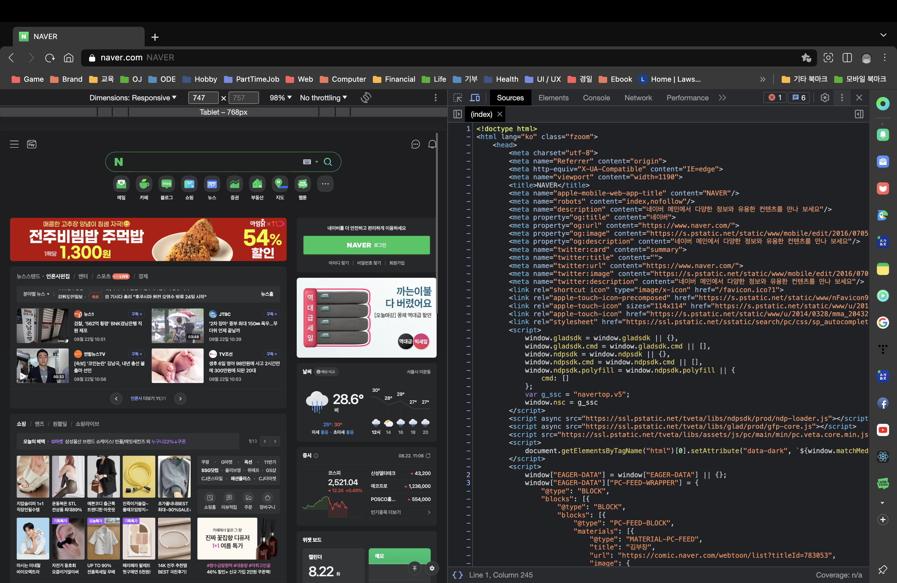
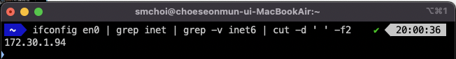
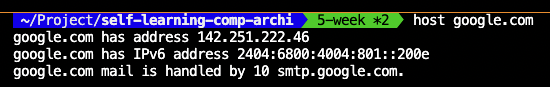
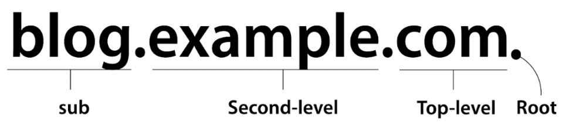
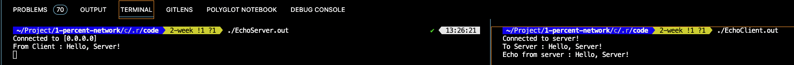

<style>
    .highlight
    {
        color: red;
    }

    .footnote
    {
        color: gray;
        font-size: 90%;
    }

    img
    {
        display: block;
        margin: auto;
    }

    .img-desc
    {
        color: gray;
        text-align: center;
        margin-bottom: 1%;
    }

    html body table
    {
        display: table;
        width: 80%;
        margin: auto;
    }
</style>

# 1. 웹 브라우저가 메시지를 만든다.
네이버에 접속하기 위해 웹 브라우저의 주소창에 `www.naver.com`이라고 입력했을 때, 가장 먼저 웹 브라우저가 하는 일은 메시지를 만드는 것이다. 이번 챕터에서는 어떤 과정을 거쳐 메시지가 작성되는지 알아보도록 하자.

## 1-1. HTTP 리퀘스트 메시지를 작성한다.
### URI
주소창에 작성했던 `www.naver.com`와 같은 것을 URL(Uniform Resource Locator)이라고 한다. 사실 우리가 웹 페이지(Web Page)라고 부르는 것의 실체는 HTML(Hypertext Markup Language) 문서로 웹 브라우저가 이를 분석해 우리에게 보여주는 것이다. 다시 말해 `www.naver.com`를 입력하면 네이버의 서버에 어떤 HTML 문서 파일을 요청하는 것이라고 할 수 있다.


<div class="img-desc">우리가 보는 네이버는 오른쪽의 HTML 문서를 분석한 결과다.</div>

서버에는 여러 가지 자원이 있기 때문에 우리가 원하는 자원을 요청하려면 이를 식별할 수 있어야 한다. 웹에서는 이를 위해 URI(Uniform Resource Identifier)를 사용한다. URI는 URL과 URN(Uniform Resource Name)으로 나뉘는데, URL은 자원의 위치를 나타내고 URN은 자원의 이름을 나타낸다.* URI 문법에 대한 설명은 [여기](https://developer.mozilla.org/en-US/docs/Web/HTTP/Basics_of_HTTP/Identifying_resources_on_the_Web#syntax_of_uniform_resource_identifiers_uris)로 대체한다.
<span class="footnote"> * URN보다는 URL을 더 많이 사용하긴 한다.</span>

### HTTP
HTTP(Hypertext Transfer Protocol)는 이름에서도 알 수 있듯 HTML 문서를 전송하기 위한 프로토콜*이다. 하지만 지금은 HTML 문서 외에도 이미지, 비디오 등 다양한 자료를 전송할 수 있게 됐다. 
<span class="footnote"> * 프로토콜은 통신을 위한 규칙을 말한다.</div>


<div class="img-desc">하나의 웹 문서를 구성하기 위해 여러 번의 HTTP 호출이 필요한 경우도 있다.</div>

HTTP의 동작은 서버에 무언가 요청하면 그에 대한 응답을 받는 것으로 구성된다. 요청 서식과 응답 서식이 정해져 있는데 이를 각각 요청 메시지*(Request Message)와 응답 메시지(Response Message)라고 한다.
<span class="footnote"> * 메시지란 통신되는 데이터를 지칭한다.</div>


<div class="img-desc">요청 메시지와 응답 메시지의 예시</div>

메시지를 잘 들여다보면 구성이 크게 다르지 않은 것을 알 수 있다. 시작 줄에는 요청 혹은 응답의 내용을 적고, 여러 가지 부가 정보가 담긴 헤더*(Header)를 작성한다. 그 후 한 줄의 개행 후에 바디(Body)를 작성하는데, 여기에는 요청과 관련된 데이터나 요청에 대한 결과가 포함된다.
<span class="footnote"> * 헤더의 각 항목에 대해서 알고 싶다면 [여기](https://developer.mozilla.org/en-US/docs/Web/HTTP/Headers)를 참고하라.</span>

#### 메소드
요청 메시지의 시작 줄에는 메소드(Method)가 포함된다. 메소드는 메소드는 HTTP의 동작 방법을 의미하며 종류는 아래와 같다. 각각에 대해서 자세히 알고 싶다면 [여기](https://developer.mozilla.org/en-US/docs/Web/HTTP/Methods)를 참고하라.

| 메소드 | 설명 |
| --- | --- |
| GET | 데이터를 요청한다. |
| HEAD | 데이터에 대한 정보를 요청한다. |
| POST | 데이터를 전송한다. |
| PUT | 서버의 파일을 교체한다. |
| DELETE | 서버의 파일을 삭제한다. |
| CONNECT | 서버와의 터널을 구성한다. |
| OPTIONS | 통신 옵션을 통지하거나 조사한다. |
| TRACE | 메시지 루프백 테스트를 수행한다. |
| PATCH | 자원의 수정된 내역을 적용한다. |

#### 상태 코드
응답 메시지의 시작 줄에는 상태 코드(Status Code)가 포함된다. 상태 코드는 요청이 성공적으로 완료되었는지를 나타낸다. 상태 코드는 5개의 그룹으로 묶여있다. 각각에 대해서 자세히 알고 싶다면 [여기](https://developer.mozilla.org/en-US/docs/Web/HTTP/Status)를 참고하라.

| 상태 코드 값 | 설명 |
| --- | --- |
| 100 ~ 199 | 처리의 경과 상황 등을 통지한다. |
| 200 ~ 299 | 요청 성공적으로 완료됐음을 알린다. |
| 300 ~ 399 | 다른 조치가 필요함을 나타낸다. |
| 400 ~ 499 | 클라이언트 오류를 나타낸다. |
| 500 ~ 599 | 서버 오류를 나타낸다. |

## 1-2. 웹 서버의 IP 주소를 DNS 서버에 조회한다.
### IP 주소
인터넷에는 수많은 컴퓨터가 접속되어 있다. 이중 우리가 원하는 컴퓨터에 HTTP 요청을 하려면 해당 컴퓨터를 찾아낼 수 있는 정보가 필요한데, 여기에는 IP(Internet Protocol) 주소를 사용한다.

IP 주소는 32비트의 숫자이며*, 네트워크 ID와 호스트 ID로 구성 된다. 표기는 `221.149.9.93`과 같이 8비트씩 끊어서 십진수로 표기하는 십진수 점 표기법(DDN; Dotted Decimal Notation)을 사용한다.
<span class="footnote"> * 엄밀히는 IPv4 주소 길이이며, IPv6 주소의 길이는 128비트이다.</span>


<div class="img-desc">인터넷에 접속한 모든 컴퓨터는 IP 주소를 갖고 있다.</div>

#### 서브넷 마스크
`221.149.9.93`을 다시 보자. 이 주소에서 네트워크 ID와 호스트 ID가 구분이 되는가? 이를 구분하려면 서브넷 마스크(Subnet Mask)가 필요하다. 서브넷 마스크는 `221.149.9.93/24`처럼 IP 주소 뒤에 네트워크 ID의 길이를 표기한다*. 혹은 DDN이나 이진수로도 표기할 수 있다.
<span class="footnote">* 이를 [CIDR](http://www.ktword.co.kr/test/view/view.php?nav=2&no=1144&sh=CIDR)(Classless Inter-Domain Routing)이라고 한다.</span>

<!-- 서브넷 마스크 -->

#### 특수한 IP 주소
IP 주소 중 몇 가지 특수한 IP 주소가 있다.

- **네트워크(Network) 주소**
네트워크를 나타내는 주소로 호스트 ID의 모든 비트가 0이다. 예를 들어 `221.149.9.93/24`에서는 `221.149.9.0`가 네트워크 주소다.

- **브로드캐스트(Broadcast) 주소**
네트워크에 속한 모든 호스트에게 데이터를 전송하기 위한 주소로 호스트 ID의 모든 비트가 1이다. 예를 들어 `221.149.9.93/24`에서는 `221.149.9.255`가 브로드캐스트 주소다.

- **와일드카드(Wildcard) 주소**
0.0.0.0/0 주소를 말하며, 모든 IP를 지칭한다.

- **루프백(Loopback) 주소**
로컬 머신을 지칭하는 주소다. 127.0.0.0/8을 사용한다. 로컬호스트(Localhost)라고도 한다.

### 도메인 이름
`223.130.200.107`라는 IP 주소가 있다고 해보자. 이게 어느 컴퓨터인지 알 수 있는가? 그러면 `www.naver.com`은 어떤가? 한눈에 네이버라는 것을 알 수 있다. `223.130.200.107`은 네이버 서버의 IP 주소다. 

이처럼 IP 주소는 외우기가 어렵다. 이를 대신하여 사용하는 것이 바로 도메인 이름(Domain Name)이다. 그래서 웹 브라우저는 URL에 적힌 도메인 이름을 DNS(Domain Name System)에 의해 IP 주소로 해석(Resolution)한 후, HTTP 요청을 한다.

도메인 이름 해석을 위해서는 소켓 라이브러리를 사용해야 한다. BSD 소켓 라이브러리를 사용해 `www.naver.com`의 해석을 하는 프로그램은 아래와 같다.

```c
// Unix OS에서만 동작한다.

#include <stdio.h>
#include <netdb.h>
#include <sys/types.h>
#include <sys/socket.h>
#include <stdlib.h>
#include <netinet/in.h>
#include <arpa/inet.h>

int main()
{
  // 1. DNS 질의를 요청한다.
  const char* domain = "www.naver.com";
  const char* port = "80"; // HTTP

  struct addrinfo hints = { 0 };
  hints.ai_family = AF_INET;
  hints.ai_socktype = SOCK_STREAM;

  struct addrinfo* result = NULL;
  getaddrinfo(domain, port, &hints, &result);

  // 2. 응답 받은 주소를 출력한다.
  puts("Result");

  while (addresses != NULL)
  {
    struct sockaddr_in* address = (struct sockaddr_in*)addresses->ai_addr;

    printf("%s\n", inet_ntoa((struct in_addr)address->sin_addr));

    addresses = addresses->ai_next;
  }

  freeaddrinfo(result);
  
  exit(EXIT_SUCCESS);
}
// Output:
// Result
// 223.130.195.200
// 223.130.195.95
```

## 1-3. 전 세계의 DNS 서버가 연대한다.
### DNS 동작 원리
앞서 살펴본 DNS의 동작 원리에 대해서 자세히 살펴보자. HTTP가 요청-응답의 흐름을 가졌던 것처럼 DNS도 질의-응답의 흐름을 가진다. DNS 질의 메시지에는 질의할 도메인 이름, 자원 레코드 유형, 질의 클래스의 정보가 저장되어 있다.


<div class="img-desc">DNS 메시지의 질의 섹션에 질의할 도메인 이름, 자원 레코드 유형, 질의 클래스 데이터가 저장된다.</div>

질의할 도메인 이름에는 `www.naver.com`와 같이 IP 주소를 얻고 싶은 도메인 이름이 기록된다. 질의 클래스에는 DNS가 고안될 당시에 인터넷 이외에도 다양한 네트워크에 대응하기 위해 해당 정보를 준비했다. 질의 클래스에 저장될 수 있는 값에는 인터넷을 의미하는 `IN`, COAS 네트워크를 의미하는 `CS`, Hesoid 서버를 의미하는 `HS`가 있는데 현재는 인터넷을 제외하고 사용되지 않으므로 질의 클래스 영역에는 항상 `IN`이 저장된다.
<span class="footnote"> * 괄호 안의 값은 실제 값을 나타낸다.</span>

#### 자원 레코드
그럼 자원 레코드 유형이란 무엇일까? 먼저 자원 레코드에 대해서 알아보자. 자원 레코드(RR; Resource Record)는 DNS 서버에 저장되는 데이터로 자원 레코드 하나에는 도메인 이름, 값, 유형의 데이터가 저장되어 있다. DNS에 저장될 수 있는 데이터에는 IP 주소 외에도 여러 가지가 존재하는데 유형은 이를 나타낸다. 어떤 유형이냐에 따라 응답하는 내용이 달라진다. 유형에는 여러 가지가 있지만 A, CNAME, MX 대표적인 몇 개만 살펴보자.*
<span class="footnote"> * 이 외의 유형은 [여기](http://www.ktword.co.kr/test/view/view.php?m_temp1=4889&id=434)를 참고하라</span>

A(Address) 레코드는 자원 레코드의 가장 기본적인 유형으로 IP 주소를 조회하기 위한 용도로 사용된다. 예를 들어 `www.naver.com`을 질의했을 때, DNS 서버에는 아래처럼 자원 레코드가 저장되어 있을 것이다.

| 도메인 이름 | 값 | 유형 |
| --- | --- | --- |
| www.naver.com | 223.130.195.200 | A |
| www.naver.com | 223.130.195.95 | A |
<div class="img-desc">A 레코드 예시</div>

CNAME 레코드는 도메인 이름의 별칭이 저장된 레코드다.

| 도메인 이름 | 값 | 유형 |
| --- | --- | --- |
| www.naver.com | www.naver.com.nheos.com | CNAME |
<div class="img-desc">CNAME 레코드 예시</div>

MX(Mail Exchange)는 메일 서버 주소를 조회하기 위한 용도로 사용한다. 이메일 서비스의 경우 여러 대의 메일 서버가 운용될 수 있기에 다른 레코드와 달리 우선 순위도 저장한다. 그래서 우선 순위가 낮은 도메인부터 이메일 서비스를 시도하고 실패할 시 차례차례 다음 도메인에 재시도한다.

| 도메인 이름 | 값 | 우선 순위 | 유형 |
| --- | --- | --- | --- |
| google.com | smtp.google.com | 10 | MX |
<div class="img-desc">MX 레코드 예시</div>

### 눈으로 확인하기
Linux에서는 `host`를 이용하면 DNS 동작을 직접 확인할 수 있다.


<div class="img-desc">기본적으로 A, AAAA, MX 레코드를 조회한다.</div>

### 분산 계층 구조
DNS 서버는 분산 계층 구조를 이루고 있다. 다시 말해 `www.naver.com`을 조회한다고 할 때 하나의 DNS 서버에게 질의하는 것이 아니라 차례대로 상위 계층에 속하는 DNS 서버에게 질의하며 최종 결과를 얻는다. 질의하는 방법에는 반복적 질의(Iterative Queries)와 재귀적 질의(Recursive Queries)가 있다. 질의 방법은 둘 중 하나만 사용하는 것이 아니라 상황에 따라 둘을 혼용하기도 한다.


<div class="img-desc">왼쪽이 반복적 질의, 오른쪽이 재귀적 질의다. </div>

또, 각 계층에 하나의 DNS 서버만 존재하는 것이 아니라 여러 개의 DNS 서버가 존재하여 원활한 서비스가 이뤄지게 하고 있다. 각 계층의 정보는 도메인 이름에 명시되어 있다.

#### 도메인 이름
도메인 이름에 대해서 다시 자세히 살펴보자. 도메인 이름의 `.`은 사실 각 계층을 구분하기 위한 것으로 `.`의 오른편에 상위 계층을 적는다. 즉, `www.naver.com`은 `com`이 최상위 계층에 위치함을 나타내고, `naver`가 그 다음 하위 계층을 `www`가 그 다음 하위 계층을 나타낸다. 사실 `com` 위에 더 상위 계층이 존재하는데 이를 루트 도메인(Root Domain)이라 한다. 루트 도메인은 이름이 없어 사실상 생략되는데, `www.naver.com`은 `www.naver.com.`와 같으며 마지막에 위치한 `.`이 루트 도메인을 나타낸다. 계층의 갯수는 가변적이며 최대 128개다. 전세계 도메인 관리는 [ICANN](https://www.icann.org/)이 국내는 [KRNIC](https://xn--3e0bx5euxnjje69i70af08bea817g.xn--3e0b707e/)이 관리하고 있다.

<!-- 도메인 이름 예시 -->

<div class="img-desc">도메인 이름에는 여러 정보가 포함되어 있다.</div>

계층에 대해서 조금 더 알아보자. 먼저 루트 서버는 하위 계층인 최상위 도메인에 대한 IP 주소를 제공하고 있다. 루트 서버는 13개 관리 기관에 의해서 관리되고 있으며*, 이 주소는 전세계에 존재하는 모든 DNS 주소가 알고 있다. 그 다음 최상위 도메인 서버는 `com`, `kr`, `org`와 같은 것인데 책임 DNS 서버에 대한 IP 주소를 제공한다.** 책임 DNS 서버는 `naver`, `google` 등과 같이 회사가 관리하며 각 회사의 서비스에 대한 IP 주소를 제공한다. 가령 네이버 웹툰 서비스의 도메인은 `comic.naver.com`인데 이는 네이버 웹툰 홈페이지가 `naver` DNS 서버에 의해 제공되는 것이다.
<span class="footnote"> * 루트 서버 목록은 [여기](https://www.iana.org/domains/root/servers)서 확인할 수 있다.
** 최상위 도메인 서버 목록은 [여기](https://www.iana.org/domains/root/db)서 확인 가능하다.</span>

### 캐싱
같은 호스트에 접속하는 일은 생각보다 많다. 예를 들어, 네이버 홈페이지에 접속 후 1시간 뒤에 네이버에 다시 접속한다고 할 때, 같은 질의 메시지를 발생시키는 것은 트래픽 낭비라고 볼 수 있다. 따라서 각 질의는 일정 시간 동안 캐싱해둔다. 캐싱은 올바른 질의에 대해서도 잘못된 질의에 대해서도 모두 적용된다.
## 1-4. 프로토콜 스택에 메시지 송신을 의뢰한다.
서버와 클라이언트가 서로 메시지를 주고받으려면 프로토콜 스택에 메시지 송∙수신을 의뢰해야 한다. 서버가 클라이언트로부터 어떤 메시지를 그대로 다시 클라이언트에게 전송하는 에코 서버 프로그램을 제작해보며 메시지 송∙수신 과정을 이해해보자.

### 서버 프로그램 제작
서버부터 제작해보자. 핵심에만 집중하기 위해 오류 처리는 하지 않았다.

```c
// Unix OS에서만 동작한다.

#include <stdio.h>
#include <stdlib.h>
#include <stdbool.h>
#include <unistd.h>

#include <netdb.h>
#include <sys/types.h>
#include <sys/socket.h>
#include <netinet/in.h>
#include <arpa/inet.h>

int main()
{
    // 1. 소켓을 제작한다.
    // 소켓(Socket)은 네트워킹을 위한 인터페이스로 데이터 송∙수신이 일어나는 통로다.
    // 소켓의 실체는 파일이기 때문에 socket()의 반환값은 파일 디스크립터(File Descriptor)다.
    // 파일 디스크립터는 파일을 구분하기 위한 ID라고 생각하면 된다.
    int listenSocket = socket(AF_INET, SOCK_STREAM, IPPROTO_TCP);
    
    // 2. 소켓 주소에 바인드한다.
    // 하나의 프로그램이 여러 개의 소켓을 만들 수 있다.
    // 그렇기 때문에 각 소켓을 구분할 수 있는 게 필요한데 이것이 바로 소켓 주소다.
    // 즉, 각 소켓에는 대응되는 소켓 주소가 필요하다.
    // 바인드를 한다는 것은 소켓과 소켓 주소를 사상시키는 것을 의미한다.
    // 다른 컴퓨터가 서버에 올바르게 접속하기 위해 소켓 주소를 만들고 이를 바인드하는 것이다.
    // 아래 코드는 listenSocket과 127.0.0.1:12345라는 주소를 바인드하는 것이다.
    struct sockaddr_in serverSocketAddress = { 0 };
    serverSocketAddress.sin_family = AF_INET;
    serverSocketAddress.sin_port = htons(12345);
    serverSocketAddress.sin_addr.s_addr = INADDR_ANY;
    bind(listenSocket, (struct sockaddr*)&serverSocketAddress, sizeof(serverSocketAddress));

    // 3. 대기 상태로 만든다.
    // 서버에서는 여러 클라이언트의 접속을 처리하기 위해 대기 소켓이라는 것을 만든다.
    // MMORPG의 접속 대기열 같은 것이라고 생각해도 무방하다.
    int errorCode = listen(listenSocket, 10);

    while (true)
    {
        // 4. 클라이언트와의 연결을 수립한다.
        // 어떤 클라이언트가 서버에 접속할 때, 가장 먼저 해야하는 것은 데이터 송∙수신을 위한 연결을 수립하는 것이다.
        // 연결은 세션이라고도 하는데 서로 데이터를 보낼 수 있는 가상의 파이프라고 생각하면 된다.
        // 클라이언트와 소통할 수 있는 가상의 파이프를 만드는 것이다.
        struct sockaddr_in clientSocketAddress = { 0 };
        socklen_t clientSocketAddressLength = 0;
        int clientSocket = accept(listenSocket, (struct sockaddr*)&clientSocketAddress, &clientSocketAddressLength);
        printf("Connected to [%s]\n", inet_ntoa(clientSocketAddress.sin_addr));

        // 5. 클라이언트로부터 메시지를 수신한다.
        char buffer[1024] = { 0 };
        ssize_t readBytes = recv(clientSocket, buffer, 1023, 0);
        printf("From Client : %s\n", buffer);

        // 6. 클라이언트에게 메시지를 에코한다. 즉, 다시 전송한다.
        send(clientSocket, buffer, readBytes, 0);

        // 7. 연결을 끊는다.
        shutdown(clientSocket, SHUT_RDWR);
        close(clientSocket);
    }
    
    exit(EXIT_SUCCESS);    
}
```

### 클라이언트 프로그램 제작
서버 프로그램 제작이 완료되었다면 클라이언트 프로그램을 제작해보자. 마찬가지로 핵심에만 집중하기 위해 오류 처리는 하지 않았다.

```c
// Unix OS에서만 동작한다.

#include <stdio.h>
#include <stdlib.h>
#include <stdbool.h>
#include <string.h>
#include <unistd.h>

#include <netdb.h>
#include <sys/types.h>
#include <sys/socket.h>
#include <netinet/in.h>
#include <arpa/inet.h>

int main()
{
    // 1. 서버와 통신하기 위한 소켓을 제작한다.
    int serverSocket = socket(AF_INET, SOCK_STREAM, IPPROTO_TCP);

    // 2. 서버와 연결한다.
    // 서버의 소켓 주소를 명시하면 프로토콜 스택이 알아서 소켓 주소에 해당하는 소켓과 연결해준다.
    // 서버에서 봤던 bind()와 다르게 serverAddress가 serverSocket과 바인드되는 것이 아니다.
    // serverSocket의 소켓 주소는 연결 수립 시 알아서 주소가 대응된다.
    // 그리고 이때 서버는 대기 소켓이 대기 상태여야 한다.
    struct sockaddr_in serverAddress = { 0 };
    serverAddress.sin_family = AF_INET;
    serverAddress.sin_addr.s_addr = inet_addr("127.0.0.1");
    serverAddress.sin_port = htons(12345);
    connect(serverSocket, (struct sockaddr*)&serverAddress, sizeof(serverAddress));
    puts("Connected to server!");

    // 3. 메시지를 서버로 보낸다.
    const char* message = "Hello, Server!";
    int messageLength = strlen(message);
    send(serverSocket, message, messageLength, 0);
    printf("To Server : %s\n", message);

    // 4. 에코된 메시지를 받는다.
    char buffer[1024] = { 0 };
    int remainBytes = 1023;
    recv(serverSocket , buffer, remainBytes, 0);
    printf("Echo from server : %s\n", buffer);

    // 5. 연결을 종료한다.
    shutdown(serverSocket, SHUT_RDWR);
    close(serverSocket);

    exit(EXIT_SUCCESS);
}
```

### 동작 결과
에코 서버 프로그램의 동작은 아래와 같다. 클라이언트로부터 메시지를 받고 그대로 재전송한 것을 확인할 수 있다.


<div class="img-desc">에코 서버의 동작</div>

# 참고자료
- https://developer.mozilla.org/en-US/docs/Web/HTTP/Basics_of_HTTP/Identifying_resources_on_the_Web#syntax_of_uniform_resource_identifiers_uris
- https://developer.mozilla.org/en-US/docs/Web/HTTP/Messages
- https://developer.mozilla.org/en-US/docs/Web/HTTP/Methods
- https://developer.mozilla.org/en-US/docs/Web/HTTP/Headers
- https://youtu.be/Yv7KIbbWSow
- https://youtu.be/s5kIGnaNFvM
- https://youtu.be/K1o6sTZng-4
- https://youtu.be/9GSvbn6y9uU
- https://youtu.be/3-dIUtXHEr0
- https://youtu.be/JDh_lzHO_CA
- http://www.ktword.co.kr/test/view/view.php?nav=2&no=1144&sh=CIDR
- https://opentutorials.org/course/3276
- http://www.ktword.co.kr/test/view/view.php?m_temp1=385&id=433

- https://youtu.be/Epu3m_9zp8M
- https://youtu.be/XXzxetbAIfA
- https://opentutorials.org/course/3276
- http://www.ktword.co.kr/test/view/view.php?nav=2&no=264
- http://www.ktword.co.kr/test/view/view.php?m_temp1=385&id=433
- http://www.ktword.co.kr/test/view/view.php?m_temp1=2017&id=433
- http://www.ktword.co.kr/test/view/view.php?m_temp1=2251&id=434
- http://www.ktword.co.kr/test/view/view.php?m_temp1=3042&id=434
- http://www.ktword.co.kr/test/view/view.php?m_temp1=2110&id=434
- http://www.ktword.co.kr/test/view/view.php?m_temp1=2918&id=434
- http://www.ktword.co.kr/test/view/view.php?m_temp1=2705&id=1230
- https://www.cloudflare.com/ko-kr/learning/dns/dns-records/dns-a-record/
- https://www.lesstif.com/system-admin/nslookup-20775988.html
- https://www.cloudflare.com/ko-kr/learning/dns/dns-records/dns-cname-record/
- https://www.cloudflare.com/ko-kr/learning/dns/dns-records/dns-mx-record/