

# 2. TCP/IP의 데이터를 전기 신호로 만들어 보낸다.
## 2-1. 소켓을 작성한다.
### 1. 프로토콜 스택의 내부 구성
- **프로토콜 스택**(Protocol Stack)
    - 여러 프로토콜의 구현체
        - TCP, UDP, ICMP, IP, ARP 등
    - 네트워크 애플리케이션은 Socket 라이브러리를 이용해 프로토콜 스택을 이용할 수 있다.

### 2. 소켓의 실체는 통신 제어용 제어 정보
- 프로토콜이 동작하는 데 필요한 정보를 **제어 정보**(Control Information)이라 한다.
- 소켓은 제어 정보가 기록되는 파일이다.

### 3. Socket을 호출했을 때의 동작
- HTTP는 TCP를 사용한다.
- `socket()`의 반환값은 **파일 디스크립터**(File Descriptor)다.
    - 파일 디스크립터는 운영체제에서 파일을 관리할 때 사용하는 식별자다.
- `netstat`으로 네트워크 상태를 확인할 수 있다.

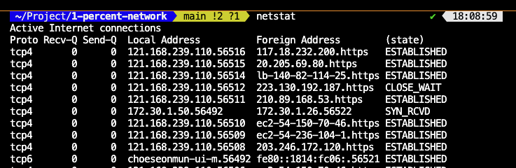

netstat 동작 화면

## 2-2. 서버에 접속한다.
### 1. 접속의 의미
- 통신 상대와 제어 정보를 주고받아 데이터 송수신이 가능한 상태로 만든다.
- 데이터 송수신에 사용할 버퍼 메모리도 확보한다.

### 2. 맨 앞부분에 제어 정보를 기록한 헤더를 배치한다.
- 각 프로토콜의 제어 정보가 기록된 영역을 **헤더**(Header)라고 한다.
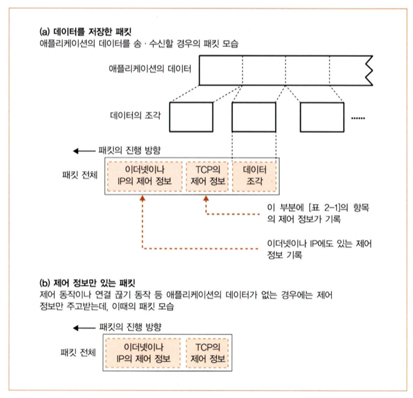

헤더는 데이터 앞쪽에 붙는다. 이를 <b>캡슐화</b>(Encapsulation)라 한다.

- TCP 헤더는 아래와 같다.

<pre class="center">
0                   1                   2                   3   
0 1 2 3 4 5 6 7 8 9 0 1 2 3 4 5 6 7 8 9 0 1 2 3 4 5 6 7 8 9 0 1 
+-+-+-+-+-+-+-+-+-+-+-+-+-+-+-+-+-+-+-+-+-+-+-+-+-+-+-+-+-+-+-+-+
|          Source Port          |       Destination Port        |
+-+-+-+-+-+-+-+-+-+-+-+-+-+-+-+-+-+-+-+-+-+-+-+-+-+-+-+-+-+-+-+-+
|                        Sequence Number                        |
+-+-+-+-+-+-+-+-+-+-+-+-+-+-+-+-+-+-+-+-+-+-+-+-+-+-+-+-+-+-+-+-+
|                    Acknowledgment Number                      |
+-+-+-+-+-+-+-+-+-+-+-+-+-+-+-+-+-+-+-+-+-+-+-+-+-+-+-+-+-+-+-+-+
|  Data |           |U|A|P|R|S|F|                               |
| Offset| Reserved  |R|C|S|S|Y|I|            Window             |
|       |           |G|K|H|T|N|N|                               |
+-+-+-+-+-+-+-+-+-+-+-+-+-+-+-+-+-+-+-+-+-+-+-+-+-+-+-+-+-+-+-+-+
|           Checksum            |         Urgent Pointer        |
+-+-+-+-+-+-+-+-+-+-+-+-+-+-+-+-+-+-+-+-+-+-+-+-+-+-+-+-+-+-+-+-+
|                    Options                    |    Padding    |
+-+-+-+-+-+-+-+-+-+-+-+-+-+-+-+-+-+-+-+-+-+-+-+-+-+-+-+-+-+-+-+-+
|                             data                              |
+-+-+-+-+-+-+-+-+-+-+-+-+-+-+-+-+-+-+-+-+-+-+-+-+-+-+-+-+-+-+-+-+
</pre>

TCP 헤더 구조

| 필드 명칭 | 설명 |
| --- | --- |
| Source Port | 송신자의 포트 번호 |
| Destination Port | 수신자의 포트 번호 |
| Sequence Number | 순서번호(SN) |
| Acknowledgement Number | 확인응답번호(AN) |
| Data Offset | 데이터의 시작 위치 |
| Reserved | 예약된 공간으로 사용하지 않는다. |
| URG(urgent) | 긴급 포인터가 활성화 되었음을 나타낸다. |
| ACK(acknowledge) | 데이터가 올바르게 수신되었음을 나타낸다. |
| PSH() | flush 동작에 의해 송신된 데이터임을 나타낸다. |
| RST(reset) | 세션을 강제로 종료하고 이상 종료시에 사용한다. |
| SYN(synchronize) | 세션을 성립하기 위해 사용한다. |
| FIN(finish) | 세션 종료를 나타낸다. |
| Window | 윈도우 크기를 나타낸다. |
| Checksum | 체크섬을 나타낸다. |
| Urgent Pointer | 긴급하게 처리해야 할 데이터의 위치를 나타낸다. |
| Options | 헤더 외의 옵션을 사용하기 위한 데이터이나 잘 사용되지 않는다. |

TCP 헤더 필드의 의미

### 3. 접속 동작의 실제
- 연결 성립의 과정을 **3-way Handshake**라고 한다.
    - `connect()`을 호출하는 순간 연결 성립 과정이 일어난다.

<pre>
클라이언트                                                         서버
1.  CLOSED                                                      LISTEN
2.  SYN-SENT    --> < SEQ=100 >< CTL=SYN >                  --> SYN-RECEIVED
3.  ESTABLISHED <-- < SEQ=300 >< ACK=101 >< CTL=SYN,ACK >   <-- SYN-RECEIVED
4.  ESTABLISHED --> < SEQ=101 >< ACK=301 >< CTL=ACK >       --> ESTABLISHED
</pre>

(1) : 클라이언트의 소켓은 닫혀있는 상태고, 서버의 소켓은 대기 상태다.
(2) : 클라이언트가 서버에게 연결을 성립한다는 의미로 SYN 패킷과 함께 순서번호를 전송한다. 순서번호는 임의의 번호다.
(3) : 서버도 클라이언트에게 마찬가지로 연결을 성립한다는 의미와 클라이언트로부터 데이터를 잘 받았다는 의미로 SYN, ACK의 비트를 설정(set)하여 패킷을 보낸다. 이때 확인응답번호 필드에는 다음에 받을 순서번호를 기록해야 하므로 (2)에서 받았던 순서번호에 1을 더하여 기록한다. 즉, 101번의 데이터부터 달라고 클라이언트에게 알려준다.
(4) : 클라이언트가 서버에게 SYN 패킷을 잘 받았다는 의미로 ACK 패킷을 보내면서 연결이 성립된다. 이때부터 데이터를 전송할 수 있기 때문에 데이터를 같이 실어서 보내는 경우도 있다.

## 2-3. 데이터를 송∙수신한다.
### 1. 프로토콜 스택에 HTTP 요청 메시지를 넘긴다.
- 망에 부하를 주는 것을 방지하기 위해 데이터 송신 요청이 있을 때 바로바로 보내진 않는다.
- 송신용 버퍼가 있어 여기에 복사본을 저장해둔 후 충분히 데이터가 모일 때까지 기다린 후에 전송한다.
    - 이를 **네이글 알고리즘**(Nagle Algorithm)이라 한다.
- 한 번에 전송할 수 있는 패킷의 크기를 **MTU**(Maximum Transmission Unit)이라 하며, MTU에서 IP 헤더와 TCP 헤더를 뺀 최대 페이로드 크기를 **MSS**(Maximum Segment Size)라 한다.

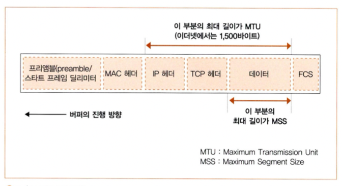

MTU와 MSS

### 2. 데이터가 클 때는 분할하여 보낸다.
- 보내려고 하는 데이터가 MSS를 초과하는 경우 MSS의 크기에 맞게 분할하여 보낸다.

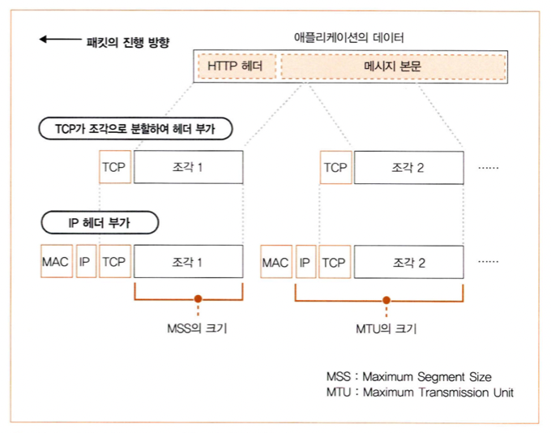

데이터가 크면 분할한다.

### 3. ACK 번호를 사용하여 패킷이 도착했는지 확인한다.
- TCP는 **수신 확인응답**을 통해 송신측에게 어떤 데이터까지 수신했는지를 알려준다.
    - 수신 확인응답에 사용되는 정보는 순서번호와 확인응답번호다.
        - 순서번호에는 보내려고 하는 페이로드의 첫 번째 바이트 번호가 저장된다.
        - 확인응답번호에는 다음에 받고자 하는 순서번호가 저장된다.
- 순서번호는 악의적인 공격을 방지하기 위해 난수를 바탕으로 산출한 초기값으로 시작한다.
    - 그래서 세션을 성립할 때 서로 순서번호를 주고받는다.
- TCP는 데이터가 누락될 경우를 대비하여 송신한 데이터를 **재전송 큐**(Retransmission Queue)에 보관하고, 만일 제대로 전송되지 않았을 경우 다시 재전송한다.
    - 이를 **재전송 기반 오류 제어**(Retransmission Error Control) 혹은 검출 후 재전송 방식이라고 한다.
    - 반면 송신한 데이터에 대해 ACK 패킷을 받았다면 복사본을 즉시 재전송 큐에서 삭제한다.
    - 수신자의 확인응답번호로 데이터의 재전송이 일어나는 것을 **자동 재전송 요청**(ARQ; Automatic Retransmission Request)이라 한다.
    - 몇 번의 재전송이 일어났음에도 데이터가 제대로 수신되지 못한다면 회복의 전망이 없는 것으로 보고, 데이터 송신 동작을 강제로 종료하고 애플리케이션에 오류를 통지한다.

### 4. 패킷 평균 왕복 시간으로 ACK 번호의 대기 시간을 조정한다.
- TCP는 데이터를 송신한 후 이에 대한 ACK 패킷을 일정 시간동안 대기하며, 이 시간 동안 ACK 패킷을 받지 못한다면 데이터가 제대로 도착하지 못했다고 판단한다.
    - 대기 시간 동안 ACK 패킷이 도착하지 못한 경우를 **재전송 타임아웃**(RTO; Retransmission Timeout)이라 한다.
    - 여기에 사용되는 타이머를 **재전송 타이머**(Retransmission Timer)라 한다.
    - 타임아웃 값은 **RTT**(Round Trip Time)을 기반으로 계산한다.
        - 네트워크의 상황은 시시각각 다르기 때문에 동적으로 계속 변할 수 밖에 없다. 그래서 이를 **적응적 재전송**(Adaptive Retransmission)이라 한다.

### 5. 윈도우 제어 방식으로 효율적으로 ACK 번호를 관리한다.
- TCP는 수신 버퍼를 가지고 있어 수신된 데이터를 일시 보관해둔다.
- TCP는 ACK 패킷을 기다리는 동안에도 계속 데이터를 송신한다.
    - 수신 할 수 있는 메모리 영역을 **윈도우**(Window)라고 하며, 윈도우 크기를 서로 통지하여 상대방이 수신할 수 있는 만큼만 데이터를 전송한다.
        - 이를 **슬라이딩 윈도우**(Sliding Window) 혹은 **연속적 ARQ**(Continuous ARQ / Go-back-N ARQ)라고도 한다.
        
### 6. ACK 번호와 윈도우를 합승한다.
- 윈도우 통지는 수신 버퍼의 빈 영역이 늘어났을 때 일어난다.
- 윈도우 통지는 ACK 패킷을 보낼 때 함께 알리게 된다.
    - 만일 더이상 수신할 수 없을 경우, 즉 윈도우 크기가 0이라면 송신자는 더이상 데이터를 송신하지 않고 대기하게 되고, 수신자는 송신자로부터 데이터가 오지 않기 때문에 더이상 수신 윈도우 변화를 통지할 수 없게 된다. 이러한 교착상태를 방지하기 위해 **윈도우 프로브**(Window Probe)가 있다.
        - 송신자는 수신측의 상황을 알아보기 위해 주기적으로 **윈도우 프로브 패킷**(Window Probe Packet)을 전송한 후 이에 대한 ACK 세그먼트로 수신 윈도우 변화를 통지 받는다.
            - 이때 사용하는 타이머를 **영속 타이머**(Persistence Timer)라고 한다.

### 7. HTTP 응답 메시지를 수신한다.
- 응답 메시지 패킷이 도착하면 수신 버퍼에서 이를 복사해 애플리케이션에 건네준다.
- 수신 버퍼의 크기가 변화했으므로 송신 측에 윈도우를 통지한다.

## 2-4. 서버에서 연결을 끊어 소켓을 말소한다.
### 1. 데이터 보내기를 완료했을 때 연결을 끊는다.
- 연결 해제의 과정을 **4way Handshake**라고 한다.
    - 연결을 끊고자 할 때, `shutdown()`을 사용한다.

<pre>
클라이언트                                                        서버
1.  ESTABLISHED                                                ESTABLISHED
2.  (Close)
    FIN-WAIT-1  --> < SEQ=100 >< ACK=300 >< CTL=FIN,ACK >  --> CLOSE-WAIT
3.  FIN-WAIT-2  <-- < SEQ=300 >< ACK=101 >< CTL=ACK >      <-- CLOSE-WAIT
4.                                                             (Close)
    TIME-WAIT   <-- < SEQ=300 >< ACK=101 >< CTL=FIN,ACK >  <-- LAST-ACK
5.  TIME-WAIT   --> < SEQ=101 >< ACK=301 >< CTL=ACK >      --> CLOSED
6.  (2 MSL)
    CLOSED
</pre>

(1) 서로 연결된 상태다.
(2) 연결 해제 요청은 보통 클라이언트가 먼저 한다. FIN 패킷을 서버에게 전송한다.
(3) 서버는 FIN 패킷을 받았다는 의미로 ACK 패킷을 전송한다. 이때를 **TCP Half-close**라 한다.
(4) 서버에서도 FIN 패킷을 전송한다.
(5) 클라이언트가 서버의 FIN 패킷을 받았다는 의미로 ACK 패킷을 전송한다.
(6) 혹시 모를 상황에 대비하여 바로 소켓을 닫지 않고 잠시 기다리다 소켓을 닫는다.

### 2. 소켓을 말소한다.
- 연결을 해제할 때 마지막 ACK 패킷을 보낸 후 일정 시간 동안 연결을 유지하는 이유는..
    - 마지막 ACK 패킷이 유실될 경우 재전송하기 위함이다.
    - 뒤늦게 도착한 패킷을 폐기하기 위함이다.
        - 바로 소켓을 닫아버리면 해당 포트 번호를 다른 소켓이 점유할 수도 있으며 이는 오동작을 일으킬 수 있다.
- 이때 사용되는 타이머를 **대기 시간 타이머**(Time-waited Timer)라고 한다.

## 2-5. IP와 이더넷의 패킷 송∙수신 동작
### 1. 패킷의 기본
- 패킷(Packet)은 헤더와 데이터로 구성된다.
    - 헤더는 제어 정보가 기록되어 있으며 프로토콜이 동작하기 위한 데이터다.
- 패킷은 `라우터(Router)`와 `허브(Hub)` 등 여러 중계 장치를 거쳐 목적지로 도달된다.
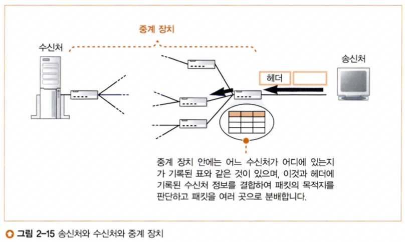

패킷을 수신한 중계 장치는 헤더에 있는 정보를 활용해 다음 장치로 패킷을 전송한다.

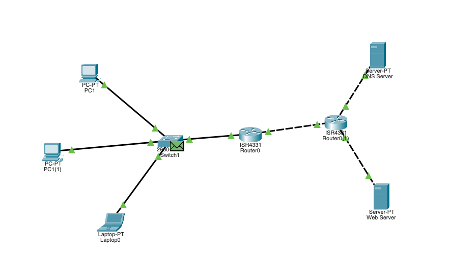

이런 식으로 여러 장치를 거쳐 목적지에 패킷이 도달하게 된다.

### 2. 패킷 송∙수신 동작의 개요
- IP가 패킷을 송신할 때는 상위 계층으로부터 전달된 데이터가 무엇이든지 MAC 헤더와 IP 헤더를 부착해 송신한다.

### 3. 수신처 IP 주소를 기록한 IP 헤더를 만든다.
<pre class="center">
0                   1                   2                   3
0 1 2 3 4 5 6 7 8 9 0 1 2 3 4 5 6 7 8 9 0 1 2 3 4 5 6 7 8 9 0 1
+-+-+-+-+-+-+-+-+-+-+-+-+-+-+-+-+-+-+-+-+-+-+-+-+-+-+-+-+-+-+-+-+
|Version|  IHL  |Type of Service|          Total Length         |
+-+-+-+-+-+-+-+-+-+-+-+-+-+-+-+-+-+-+-+-+-+-+-+-+-+-+-+-+-+-+-+-+
|         Identification        |Flags|      Fragment Offset    |
+-+-+-+-+-+-+-+-+-+-+-+-+-+-+-+-+-+-+-+-+-+-+-+-+-+-+-+-+-+-+-+-+
|  Time to Live |    Protocol   |         Header Checksum       |
+-+-+-+-+-+-+-+-+-+-+-+-+-+-+-+-+-+-+-+-+-+-+-+-+-+-+-+-+-+-+-+-+
|                       Source Address                          |
+-+-+-+-+-+-+-+-+-+-+-+-+-+-+-+-+-+-+-+-+-+-+-+-+-+-+-+-+-+-+-+-+
|                    Destination Address                        |
+-+-+-+-+-+-+-+-+-+-+-+-+-+-+-+-+-+-+-+-+-+-+-+-+-+-+-+-+-+-+-+-+
|                    Options                    |    Padding    |
+-+-+-+-+-+-+-+-+-+-+-+-+-+-+-+-+-+-+-+-+-+-+-+-+-+-+-+-+-+-+-+-+
</pre>

IP 헤더의 구조

| 필드 명칭 | 설명 |
| --- | --- |
| Version | IP의 버전으로 4가 입력된다. |
| IHL | IP 헤더의 길이 |
| ToS; Type of Service | [서비스 유형](http://www.ktword.co.kr/test/view/view.php?m_temp1=2051&id=425) |
| Total Length | IP 패킷 전체의 길이를 바이트 단위로 표시한다. |
| Identification | IP 패킷을 식별하는 번호로 단편화(Fragmentation)가 일어난 경우 송신지에서 다시 조립하기 위해 사용한다. |
| Flags | [단편화 플래그](http://www.ktword.co.kr/test/view/view.php?m_temp1=5236&id=1003) |
| Fragment Offset | 단편화 되기 전 위치를 나타낸다. |
| Time to Live | 패킷이 경유할 수 있는 라우터의 개수(홉; hop)를 나타낸다. 이 값이 0이된 패킷은 라우터가 폐기한다. |
| Protocol | 상위 계층의 프로토콜* |
| Header Checksum | IP 헤더 체크섬**  |
| Source Address | 송신지 IP 주소 |
| Destination Address | 수신지 IP 주소 |

 * 프로토콜 번호는 [여기](https://www.iana.org/assignments/protocol-numbers/protocol-numbers.xhtml)를 참고하라. 
 ** IPv6부터는 상위 계층에서 오류를 검출하면 된다고 생각해 체크섬이 사라졌다. 

IP 헤더 필드의 의미

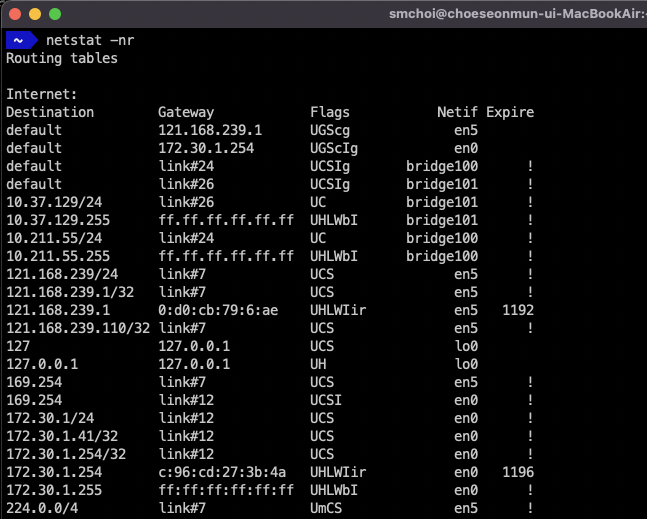

 MacOS에서 라우팅 테이블을 확인한 결과

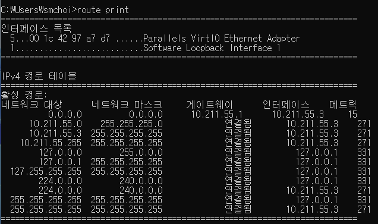

 Windows에서 라우팅 테이블을 확인한 결과

### 4. 이더넷용 MAC 헤더를 만든다.
- MAC(Media Access Control) 주소란?
    - NIC(Network Interface Card)에 부여된 물리적인 네트워크 주소
    - 전 세계에서 중복되지 않게 부여된다.
    - [IEEE](https://www.ieee.org/)가 관리한다.
- IP 주소와 MAC 주소의 차이
    - IP 주소는 인터넷에서 호스트를 식별하기 위한 논리적인 주소다. 그래서 각 호스트에 할당된 IP 주소는 시시각각 변할 수 있다. (Ex. WiFi를 이용하다가 LTE에 접속하는 경우 등)
    - 앞서 설명했듯 패킷은 여러 중계 장치를 거쳐서 전송한다. 즉, 목적지 IP 주소로 가기 위해서는 실제 물리적인 주소가 필요하다. 이것이 MAC 주소다.
- MAC 헤더는 아래와 같다.
<pre class="center">
0                   1            
0 1 2 3 4 5 6 7 8 9 0 1 2 3 4 5 6
+---------------+---------------+
|                               |
|             Source            |
|          MAC Address          |
|                               |
+---------------+---------------+
|                               |
|          Destination          |
|          MAC Address          |
|                               |
+---------------+---------------+
|           EtherType           |
+---------------+---------------+
</pre>

MAC 헤더의 구조

| 필드 명칭 | 설명 |
| --- | --- |
| Source MAC Address | 송신지 MAC 주소 |
| Destination MAC Address | 수신지 MAC 주소 |
| EtherType | 사용하는 프로토콜의 종류* |

* 자세한 것은 [여기](http://www.ktword.co.kr/test/view/view.php?m_temp1=2039&id=852)를 참고하라. 

MAC 헤더 필드의 의미

### 5. ARP로 수신처 라우터의 MAC 주소를 조사한다.
- 수신지 IP 주소로 가기 위한 다음 경유지의 MAC 주소를 모를 경우 ARP(Address Resolution Protocol)을 사용해 MAC 주소를 얻는다.
- ARP의 동작
    1. ARP 요청 패킷을 이더넷으로 브로드캐스트한다. 브로드캐스트된 패킷은 서브넷 외부로 나가지 않는다.
    2. ARP 요청을 받은 호스트 중 해당되는 호스트만 ARP 응답을 한다. 그 외의 호스트는 폐기한다.
        2-1. 만일 외부 네트워크에 속하는 호스트인 경우 게이트웨이가 응답한다.
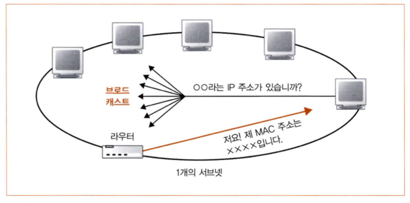

ARP도 HTTP나 DNS처럼 요청과 응답의 과정으로 구성된다. ARP 요청은 내부망에서만 일어난다.

- DNS 캐시처럼 ARP의 결과도 캐싱된다.

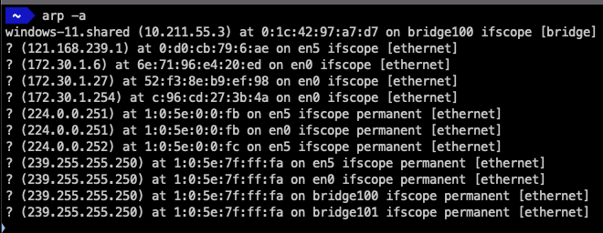

MacOS에서의 ARP 테이블

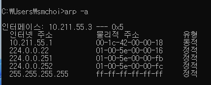

Windows에서의 ARP 테이블

### 6. 이더넷의 기본
- 이더넷(Ethernet)
    - 다수의 컴퓨터가 여러 상대와 자유롭게 적은 비용으로 통신하기 위해 고안된 통신 기술이다.
    - MAC 헤더를 이용해 원하는 상대에게 신호를 송신한다.
    - 초기에는 공유 매체를 사용했으나 현재는 전용매체 전이중방식으로 원하는 상대하고만 양방향 통신한다.

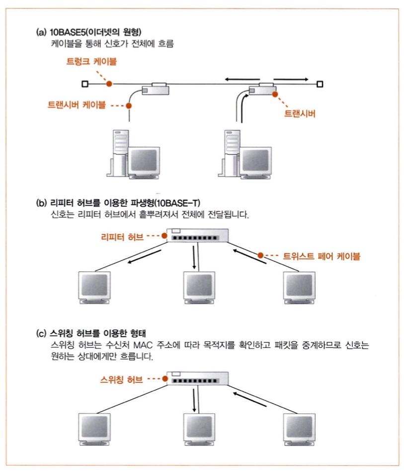

이더넷의 기본형

### 7. IP 패킷을 전기나 빛의 신호로 변환하여 송신한다.
- LAN 어댑터가 프레임을 전기, 빛 등의 신호로 변환하여 송신한다.
    - 프레임(Frame)이란 데이터 링크 계층에서의 PDU(Protocol Data Unit)이다.
- LAN 어댑터는 입출력장치기 때문에 드라이버가 필요하다.
    - LAN 어댑터에 전원이 공급되면 드라이버가 초기화한다. 이때, LAN 어댑터에 MAC 주소가 설정된다.
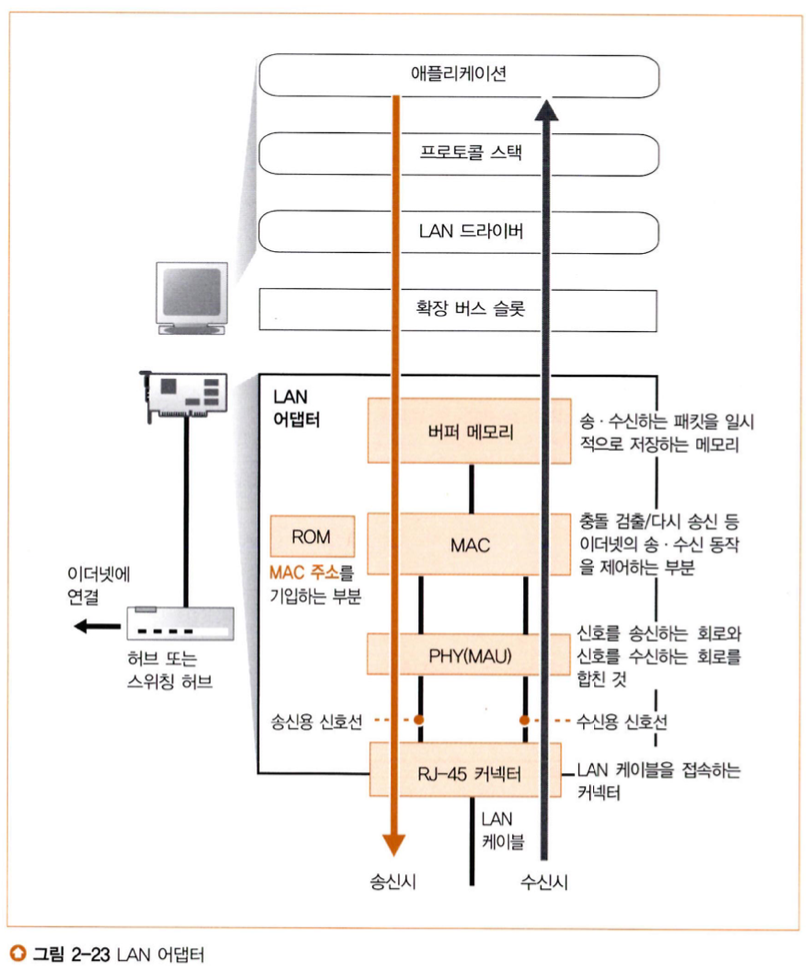

LAN 어댑터의 구조

### 8. 패킷에 3개의 제어용 데이터를 추가한다.
- MAC 회로가 프리앰블(Preamble)과 스타트 프레임 딜리미터(SFD; Start Frame Delimeter)를 패킷의 맨 앞에(Header), 프레임 체크 시퀀스(FCS; Frame Check Sequence)를 맨 뒤에(Trailer) 부착한다.
    - 프리앰블은 패킷 수신 시 타이밍을 잡기 위한 것이다.
    - 스타트 프레임 딜리미터는 프레임의 시작 위치를 표시하기 위한 것이다.
    - 프레임 체크 시퀀스는 프레임의 오류를 검출하기 위한 것이다.

프리앰블과 스타트 프레임 딜리미터

- 송신할 때는 데이터 신호와 클록 신호를 합친 형태로 전송된다.
    - 이를 합친 이유는...
        - 1 혹은 0이 이어지면 신호의 변화가 없어 비트의 구분을 판단하지 못할 수 있기 때문이다.
        - 케이블이 길어질 경우 신호선의 길이가 달라져 데이터 신호와 클록 신호가 전달되는 시간에 차이가 생겨 클록이 틀어질 수 있기 때문이다.

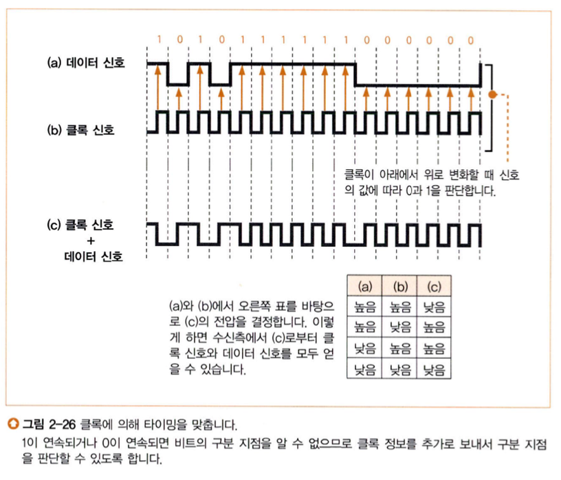

신호의 예시

- FCS로 오류를 검출할 때는 [순환중복검사](http://www.ktword.co.kr/test/view/view.php?nav=2&no=603&sh=CRC)(CRC; Cyclic Redendancy Check)를 이용한다.

### 9. 허브를 향해 패킷을 송신한다.
- 송신 과정
    1. MAC 회로가 디지털 데이터를 전기 신호로 변환하여 PHY(MAU) 회로에 전달한다.
    2. PHY(MAU) 회로가 전기 신호를 이더넷의 종류에 따라 변환한다.

100BASE-TX의 사양으로 변환된 신호

- 리피터 허브와 같이 반이중 모드의 경우 PHY(MAU) 회로가 아무도 송신하고 있지 않을 때, 데이터를 내보내게 된다.
    - 다만 우연히 충돌할 수 있는데 이때는 재밍 신호를 송신한 후, 잠시 대기했다가 다시 한 번 송신을 시도한다. 대기 시간은 MAC 주소를 바탕으로 생성된 난수에 따라 달라진다.
    - 계속해서 충돌이 일어날 경우 대기 시간을 2배씩 늘리다가 열 번째까지 송신을 시도했는데도 해결되지 않으면 오류로 판단한다.

### 10. 돌아온 패킷을 받는다.
- 수신 과정
    1. 프리앰블을 분석해 타이밍을 계산한다.
    2. 스타트 프레임 딜리미터가 나오면 그 다음 비트부터 디지털 데이터로 변환한다.
    3. PHY(MAU) 회로에서 신호를 공통 형식으로 변환하여 MAC 회로에 보낸다.
    4. MAC 회로에서 신호를 차례대로 디지털 데이터로 변환하여 버퍼 메모리에 저장한다.
    5. 신호의 마지막에 이르면 FCS를 검사해 오류가 발생했는지 검사한다. FCS의 값이 다른 경우 오류로 간주해 폐기한다.
    6. 수신지 MAC 주소를 비교하여 자신의 패킷이 아닌 경우 폐기한다.
        6-1. 만일 무차별 모드(Promiscuous Mode)라면 MAC 주소를 검사하지 않고 수신한다.
    7. 패킷을 수신한 사실을 인터럽트로 통지한다.

- 인터럽트에 관하여는 [여기](https://github.com/haedal-study/self-learning-comp-archi/blob/main/choiseonmun/3%EC%A3%BC%EC%B0%A8.pdf)를 참고하자.

### 11. 서버의 응답 패킷을 IP에서 TCP로 넘긴다.
- 수신 과정
    1. LAN 어댑터가 패킷을 TCP/IP 프로토콜 스택에 건넨다.
    2. IP가 헤더를 조사해 오류가 없는지 확인한다. 만약 수신지 IP 주소가 자신이 아닌 경우 ICMP로 송신자에게 오류를 통지한다.
    3. 단편화가 일어났을 경우 리어셈블링(Reassembling)하여 TCP에 건넨다.
    4. TCP가 헤더를 조사해 오류가 없는지 확인하고, 대응되는 소켓을 찾아 적절한 동작을 실행한다.

- ICMP 메시지 종류

| 메시지 종류 | 타입 | 설명 |
| --- | --- | --- |
| Echo Reply | 0 | Echo 메시지 응답 |
| Destination Unreachable | 3 | 목적지에 도달하지 못하고 폐기된 경우 |
| Source Quench | 4 | 라우터의 수신 버퍼가 가득차서 전달되지 못한 경우 |
| Redirect | 5 | LAN에 다수의 라우터가 존재하는 경우 목적지로 가는 더 좋은 경로가 있음을 알려준다. |
| Echo | 8 | Echo 메시지 요청 |
| Time Exceeded | 11 | TTL이 만료된 경우 |
| Parameter Problem | 12 | IP 헤더에 오류가 있는 경우 |

 주요 ICMP 메시지

## 2-6. UDP 프로토콜을 이용한 송∙수신 동작
- UDP(User Datagram Protocol)
    - TCP는 신뢰성이 있지만 UDP는 단순히 전송만 한다.
    - UDP를 사용하는 프로토콜의 종류
        - DNS, NTP, DHCP, RIP 등
- UDP 헤더는 아래와 같다.
<pre class="center">
0      7 8     15 16    23 24    31  
+--------+--------+--------+--------+
|     Source      |   Destination   |
|      Port       |      Port       |
+--------+--------+--------+--------+
|                 |                 |
|     Length      |    Checksum     |
+--------+--------+--------+--------+
|                                    
|          data octets ...           
+---------------- ...                
</pre>

UDP 헤더의 구조

| 필드 명칭 | 설명 | 
| --- | --- |
| Source Port | 송신지 포트 번호 |
| Destination Port | 수신지 포트 번호 |
| Length | UDP 헤더와 페이로드를 합한 길이 |
| Checksum | 체크섬 |

UDP 헤더 필드의 의미

# 참고자료
- https://www.ietf.org/rfc/rfc793.txt
- https://datatracker.ietf.org/doc/html/rfc9293
- https://datatracker.ietf.org/doc/html/rfc768
- https://datatracker.ietf.org/doc/html/rfc791
- http://www.ktword.co.kr/test/view/view.php?m_temp1=1859
- https://datatracker.ietf.org/doc/html/rfc826
- https://en.wikipedia.org/wiki/MAC_address
- http://www.ktword.co.kr/test/view/view.php?nav=2&no=388&sh=%EC%9D%B4%EB%8D%94%EB%84%B7
- http://www.ktword.co.kr/test/view/view.php?m_temp1=2167&id=449