

# 3. 케이블의 앞은 LAN 기기였다.
## 3-1. 케이블과 리피터, 허브 속을 신호가 흘러간다.
### 1. 하나하나의 패킷이 독립된 것으로 동작한다.
- 리피터 허브, 스위치 허브, 라우터 등의 기기는 자신이 속한 계층의 제어 정보 이 외에는 모두 다 데이터로 간주한다.
    - **리피터 허브**(Repeater Hub)는 L1 기기로 수신된 신호를 단순하게 브로드캐스트 한다.
    - **스위치 허브**(Switch Hub)는 L2 기기로 MAC 주소를 이용해 다음 기기로 데이터를 보낸다.
    - **라우터**(Router)는 L3 기기로 IP 주소를 이용해 다음 기기로 데이터를 보낸다.

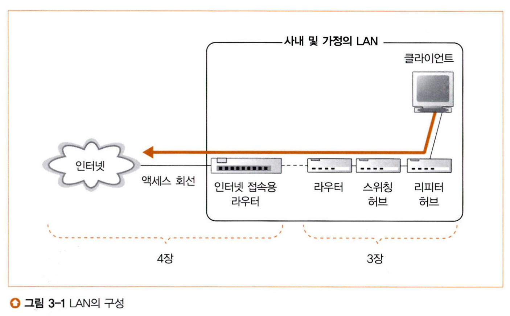

 요즘은 라우터, 스위칭 허브, 리피터 허브의 기능이 모두 결합된 기기를 쓴다. 이를 공유기라고 부르지만 정식 명칭은 AP(Access Point)다. 

### 2. LAN 케이블은 신호를 약화시키지 않는 것이 핵심이다.
- 송신된 신호는 전자파의 성질과 잡음으로 인해 변형되어 수신했을 때는 원래 신호와 달라진다.
- 전기 신호의 주파수에 따라 전자가 진동하며 전자기파가 발생한다.*
    - 고주파일수록 방출되는 전자기파가 높아지기 때문에 그만큼 에너지의 손실이 생긴다. 그래서 케이블이 길수록 신호가 약해진다.

* 자세한 것은 [맥스웰 방정식](https://namu.wiki/w/%EB%A7%A5%EC%8A%A4%EC%9B%B0%20%EB%B0%A9%EC%A0%95%EC%8B%9D)을 참고하라.

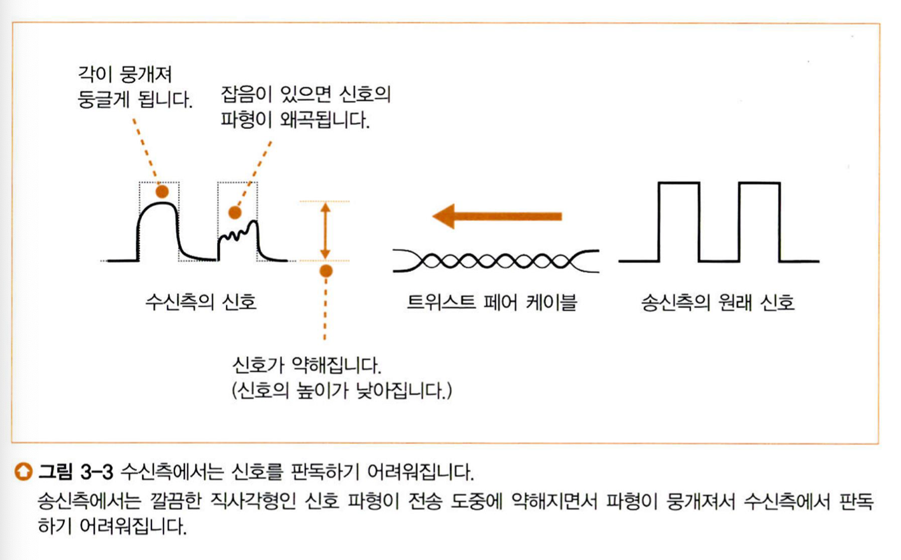

변형된 신호로 인해 0과 1을 잘못 판독할 수 있어 통신 오류가 일어날 수 있다.

### 3. '꼼'은 잡음을 방지하기 위한 방법이다.
- 전자파는 금속 등의 전기가 잘 통하는 도체에 닿으면 금속 표면의 전류로 변화되고, 이는 케이블에 흐르는 전기 신호에 영향을 준다. 즉, 잡음이 생긴다.
- 케이블은 케이블 외부와 케이블 내부에서 발생하는 전자파에 영향을 받는다.
    - 전자 기기에서 누설되는 전자파(외부)
    - 인접한 신호선에서 누설되는 전자파(내부)
- 잡음을 상쇄하기 위해 케이블을 꼰 것이다. 이 외에도 신호선 사이의 거리를 유지하기 위해 **구분판**을 넣거나, 금속성의 **실드**(Shield)라는 피복을 입히는 등의 방법을 사용한다.
    - [앙페르 법칙](http://www.ktword.co.kr/test/view/view.php?m_temp1=4395)에 의해 외부에서 발생한 전자파의 오른쪽 방향으로 유도 전류가 생기는데, 이를 신호선을 꼬아 상쇄한다.
    - 내부에 흐르는 전류로 인한 전자파*는 꼬는 간격을 달리해 플러스와 마이너스의 균형을 잡아 상쇄한다.

* 크로스토크(Crosstalk)라고 한다.

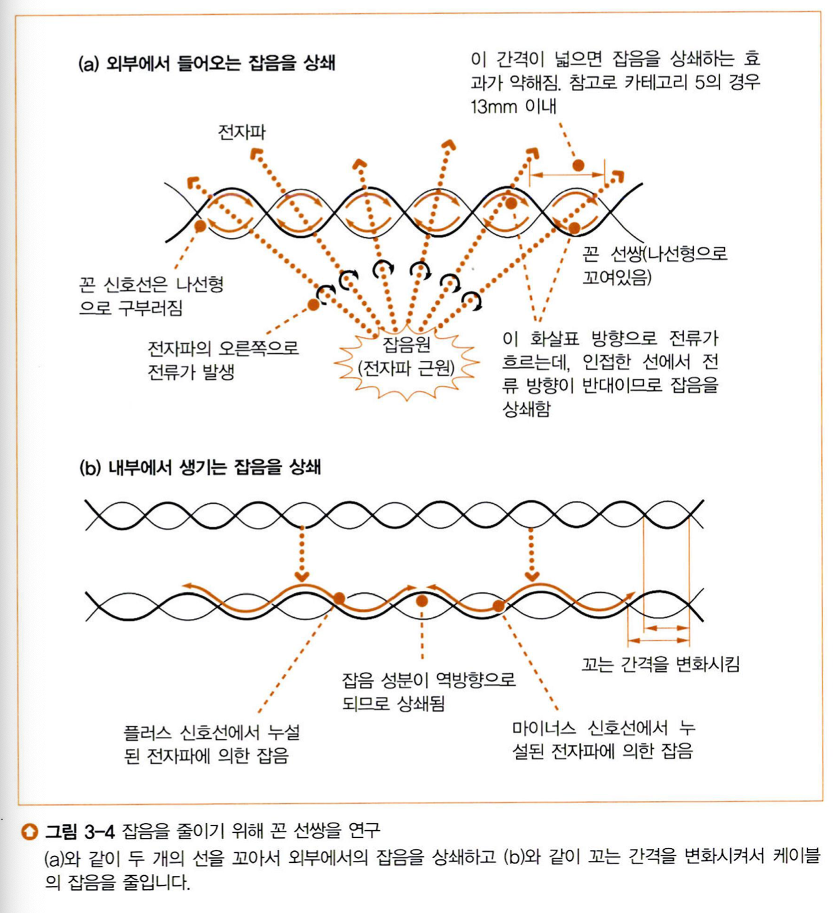

케이블을 꼬아 잡음을 상쇄한다.

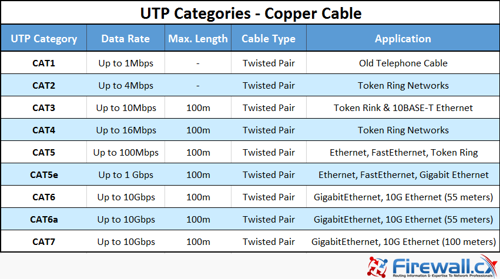

트위스트 페어 케이블 카테고리

### 4. 리피터 허브는 연결되어 있는 전체 케이블에 신호를 송신한다.
- 리피터 허브는 들어온 신호를 연결된 케이블 전부에 다시 송신한다.
    - 제품 중에는 신호의 파형을 다듬고 오류를 억제하는 것도 있다.
- 신호를 올바르게 송∙수신 하려면 한쪽의 송신이 상대의 수신에 연결되어야 한다.
    - MDI(Media Dependent Interface) 커넥터와 MDI/X(MDI-Crossover) 커넥터를 연결한다.
    - 크로스 케이블을 이용하여 연결한다.

리피터 허브의 내부

## 3-2. 스위칭 허브의 패킷 중계 동작
### 1. 스위칭 허브는 주소 테이블로 중계한다.
- 스위칭 허브는 수신한 이더넷 프레임을 MAC 주소 테이블을 참고해 목적지로 송신한다.
    1. 수신한 이더넷 프레임에 오류가 없는지 FCS를 대조한다.
    2. 오류가 없다면 버퍼 메모리에 저장한다.
    3. MAC 주소 테이블을 참고해 스위치 회로를 경유하여 목적지로 송신한다.

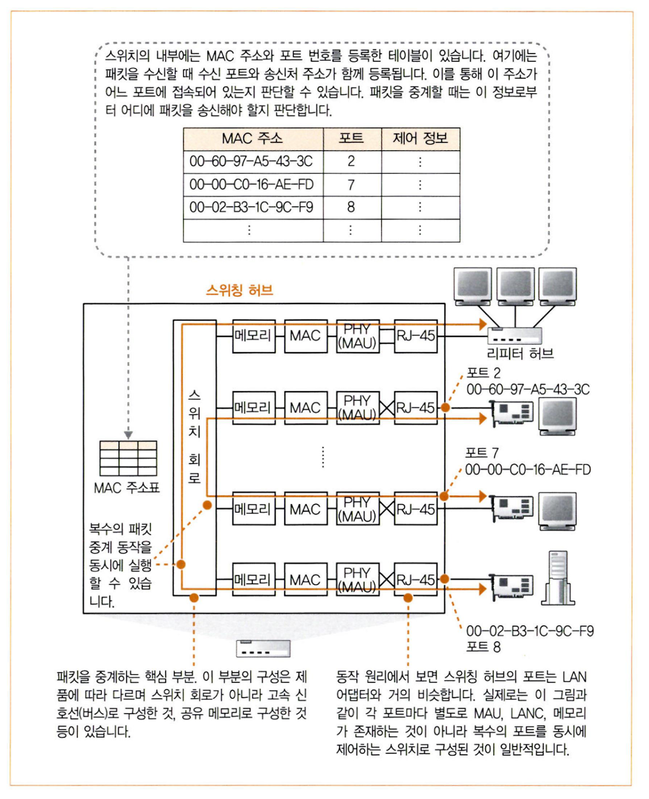

스위치 허브의 원리

- 스위칭 허브에서 커넥터와 안쪽에 있는 회로 부분을 **포트**(Port)라 한다.
    - PC의 LAN 어댑터와 거의 같지만*, MAC 주소가 할당되어 있지 않다.**

* 그래서 프로미스큐어스 모드로 동작하면 PC를 스위칭 허브처럼 사용할 수 있다.
** 하지만 보통 기기를 원격으로 관리하기 위해 프로세서를 내장한 후 MAC 주소와 IP 주소를 할당한다.

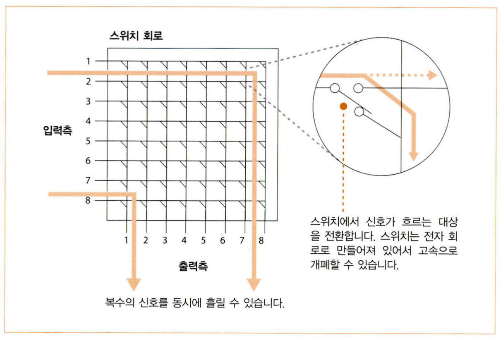

스위치 회로의 개념

### 2. MAC 주소 테이블을 등록 및 갱신한다.
- MAC 주소 테이블은 자동으로 관리된다.*
    - 신규 MAC 주소의 등록은 이더넷 프레임을 수신한 후 송신처 MAC 주소를 조사해 입력 포트와 묶어서 저장한다.
    - MAC 주소의 삭제는 일정 시간(보통 몇 분)이 지나면 자동으로 삭제된다. 

* 고급 기종은 수동으로 관리할 수 있다.

### 3. 예외적인 동작
- 수신한 포트와 송신하는 포트가 같은 경우 패킷을 중계하지 않고 폐기한다.

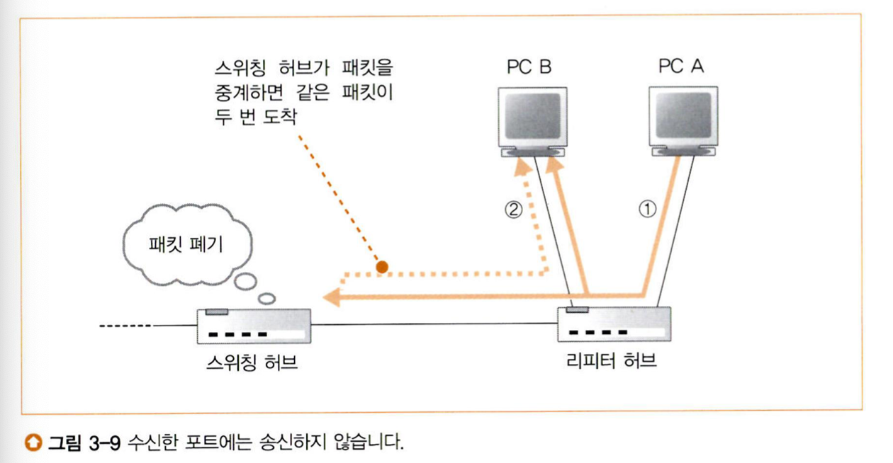

목적지에 같은 패킷이 두 번 도착하지 않게 한다.

- MAC 주소 테이블에 목적지 MAC 주소가 없는 경우 브로드캐스트한다.

### 4. 전이중 모드에서 송신과 수신을 동시에 실행한다.
- 스위치 허브는 전이중 모드를 지원한다. 즉, 양방향 통신이 가능하다.

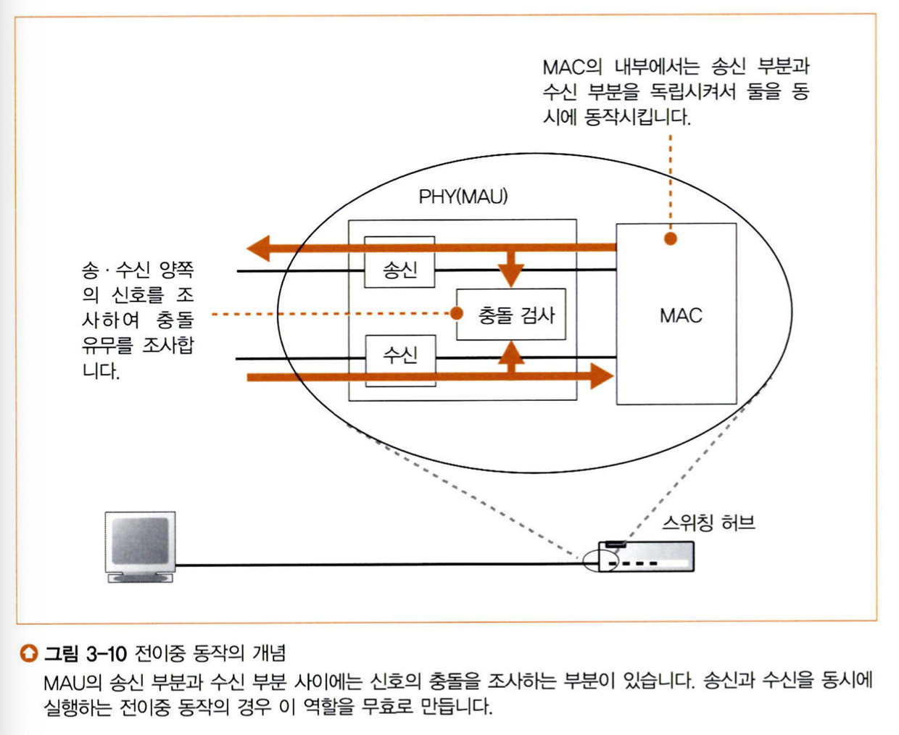

스위치 허브는 전이중 모드로 동작할 수 있다.

### 5. 최적의 전송 속도로 보내는 자동 조정
- **자동 조정**(Auto Negotiation)이란 상대방의 동작 모드와 전송 속도를 검출해 자동으로 전환하는 것이다.
- 이더넷은 링크 펄스를 흘려 상대가 올바르게 작동하는지, 케이블이 단선되지 않았는지 등의 사항을 확인한다.
    - 커넥터 주변에 있는 초록 LED 표시등이 켜져있다면 PHY(MAU) 회로와 케이블에 이상이 없는 것이다.*
- 자동 조정은 특정 패턴의 링크 펄스를 이용해 지원 가능한 모드와 전송 속도를 서로 통지하고, 그 중 최적의 조합을 선택한다.

* MAC 회로, 버퍼 메모리, 버스 신호선의 이상은 판단할 수 없다.

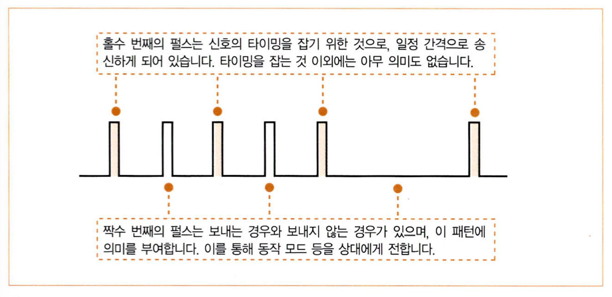

자동 조정을 위해 서로 특수한 패턴의 링크 펄스를 보낸다.

### 6. 스위칭 허브는 복수의 중계 동작을 동시에 실행한다.
- 리피터 허브는 들어온 신호를 모든 포트에 전송하기에 패킷의 충돌을 방지하기 위해 복수의 신호를 동시에 전송할 수 없다. 반면, 스위치 허브는 목적지에 해당하는 포트로만 신호를 전송하기에 복수의 신호를 동시에 전송할 수 있다.

## 3-3. 라우터의 패킷 중계 동작
- 라우터의 패킷 중계 동작은 스위칭 허브의 그것과 비슷하다. 다만 스위칭 허브는 이더넷을 기반으로 중계하고, 라우터는 IP를 기반으로 중계한다.

### 1. 라우터의 기본
- 라우터 내부 구조는 크게 중계 부분과 포트 부분으로 나눌 수 있다.
    - 중계 부분은 중계 대상을 판단한다.
    - 포트 부분은 패킷을 송∙수신한다.
- 스위칭 허브와 다르게 라우터는 포트가 송신처나 수신처가 될 수 있다.

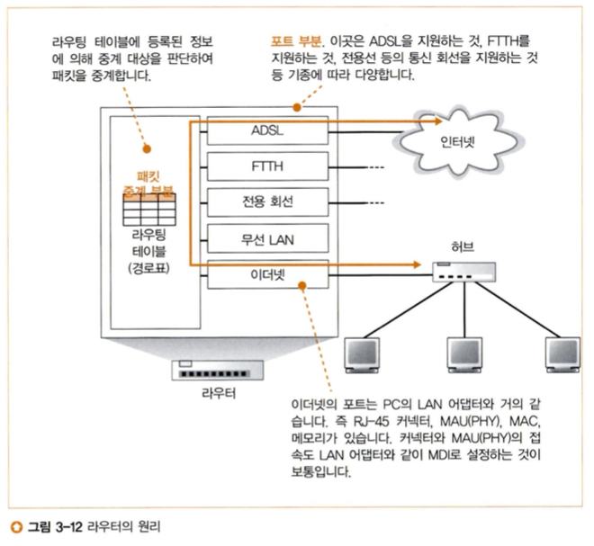

라우터는 크게 중계 부분과 포트 부분으로 구성된다.

### 2. 경로표에 등록된 벙보
- 스위칭 허브와 비슷하게 표를 사용하여 패킷을 중계하지만, 스위칭 허브가 MAC 주소를 기반으로 동작한 반면 라우터는 IP 주소를 기반으로 동작한다.
- 라우터가 중계할 때 사용하는 표를 **경로표**(Routing Table)이라 한다.
    - **수신처**(Destination) : 패킷의 목적지 IP 주소
    - **넷마스크**(Netmask) : 서브넷마스크
    - **게이트웨이**(Gateway) : 다음으로 가야할 IP 주소
    - **인터페이스**(Interface) : 라우터의 포트
    - **메트릭**(Metric) : 수신처가 얼마나 가까운지 나타내는 값으로 작을수록 가까움
- 몇 개의 서브넷을 모아 단일의 서브넷으로 경로표에 등록할 수 있으며, 이를 **주소 집약**(Route Summarization, Route Aggregation)이라고 한다.

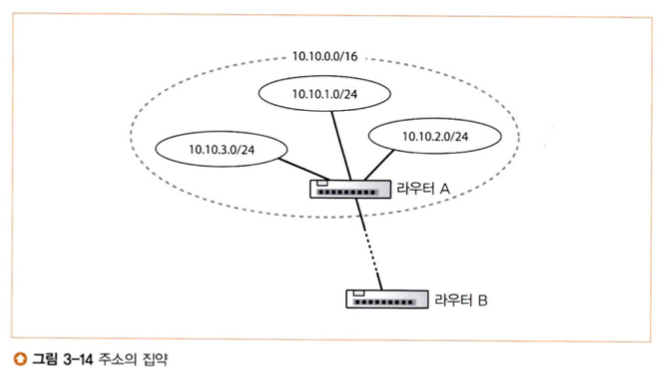

라우터 B는 `10.10.1.0/24`, `10.10.2.0/24`, `10.10.3.0/24`에 대한 경로를 `10.10.0.0/16`으로 집약하여 처리한다.

- 스위칭 허브와 다르게 패킷을 중계할 때 경로표가 변경되진 않는다. 경로표는..
    - 사람이 수동으로 등록/갱신 하거나
    - RIP, OSPF, BGP라는 라우팅 프로토콜로 등록/갱신한다.

### 3. 라우터의 패킷 수신 동작
- 이더넷의 포트에서의 수신의 경우 [2장](./Chapter%202.pdf)에서 배웠던 것과 동일하다.

### 4. 경로표를 검색하여 출력 포트를 발견한다.
- 경로표에서 검색하는 방법
    1. 수신처와 넷마스크를 이용해 패킷의 목적지 IP 주소와 일치하는 행이 있는지 확인한다.
    2. 복수의 후보가 있는 경우 최장 일치(Longest Prefix Match)된 것을 목적지로 고른다.
    3. 메트릭 값이 작은 것을 선택한다.
    4. 인터페이스를 통해 게이트웨이로 송신한다.
- 일치하는 행이 없는 경우에는 패킷을 폐기하고 ICMP 메시지로 송신처에 통지한다.
    - 브로드캐스트하는 스위칭 허브와 다르게 패킷을 폐기하는 이유는 라우터가 가정하는 네트워크(인터넷)의 규모는 매우 크기 때문에 브로드캐스트를 할 시 네트워크가 혼잡해지기 때문이다.
    - 통지하는 ICMP 메시지는 **목적지 도달불가**(Destination Unreachable) 유형이다.

### 5. 해당하는 경로가 없는 경우에 선택하는 기본 경로
- 경로표에서 넷마스크가 0.0.0.0인 행은 **기본 경로**(Default Route)를 나타낸다.
    - 여기에 등록한 게이트웨이를 **기본 게이트웨이**(Default Gateway)라고 한다.

### 6. 패킷은 유효 기한이 있다.
- 경로표에 등록된 정보에 오류가 있거나 기기의 고장 등으로 우회로로 전환될 때 일시적으로 경로가 혼란에 빠지질 수 있다. 이때 패킷은 같은 장소를 순환할 수 있는데, 이를 막기 위해 IP 헤더에는 **TTL**(Time to Live)가 있다.
    - 송신처가 64 혹은 128로 TTL 값을 설정해둔다.
        - 현재의 인터넷은 지구의 반대편까지 접근해도 경유하는 라우터 수가 많아야 수십 개 정도다.
    - 라우터를 경유할 때마다 1씩 줄어들며, 이러한 동작은 라우터가 중계하기 전에 갱신한다.
    - 숫자가 0이되면 패킷을 폐기한다.

### 7. 큰 패킷은 조각 나누기 기능으로 분할한다.
- MTU보다 큰 패킷일 경우 **단편화**(Fragmentation)가 일어난다.
    1. 출력측의 MTU를 조사해 중계하는 패킷을 송신할 수 있는지 조사한다.
        - 패킷의 최대 길이는 포트의 종류에 따라 결정되며, 여기에 헤더의 길이를 빼서 MTU를 산출한다.
    2. 단편화가 필요한 경우 IP 헤더의 플래그 필드를 조사해 분할해도 좋을지 확인한다.
        - 단편화가 불가능하면 패킷을 폐기하고 ICMP 메시지로 송신처에 통지한다. 마찬가지로 목적지 도달불가다.
    3. MTU에 맞춰 데이터 부분을 맨 앞부터 차례대로 자른다.
        - 이때 TCP 헤더 이후의 부분(페이로드)을 분할 대상 데이터로 간주한다.
    4. 자른 후 IP 헤더를 붙인다.
        - IP 헤더에는 단편화와 관련된 필드가 있는데, [여기](http://www.ktword.co.kr/test/view/view.php?nav=2&no=5236&sh=단편화)를 참고하라. 

### 8. 라우터의 송신 동작은 컴퓨터와 같다.
- 포트의 사양에 맞춰 송신한다.

### 9. 라우터와 스위칭 허브의 관계
- 통신 상대까지 패킷을 전달하는 전체의 동작은 L3가 담당하고, 이 동작을 할 때 다음 라우터까지 패킷을 운반하는 부분은 L2가 담당한다.

## 3-4. 라우터의 부가 기능
- 여기서는 **주소 변환**(NAT; Network Address Translation)과 **패킷 필터링**(Packet Filtering)에 대해서 알아본다.

### 1. 주소 변환으로 IP 주소를 효율적으로 이용한다.
- 주소 변환이 나오게 된 배경
    - 본래 IP 주소는 인터넷에서 각 기기를 식별해야 하기 때문에 기기마다 중복이 없이 고유하게 할당되어야 한다.
    - 1990년대에 인터넷이 대중에게 공개되자 인터넷에 접속하는 기기 수가 폭발적으로 늘어나면서 IP 주소가 부족해졌다.
- 위의 문제점에 대한 해결 방안
    - **공인 주소**(Global Address, Globally Unique Address, Public Address)와 **사설 주소**(Private Address)를 나누었다.
        - 내부망에서만 사용하는 주소는 중복되어도 상관없다는 데에서 착안했다.
    - 사설 주소는 당시 미사용의 공인 주소 중에서 선택해 아래의 범위로 한정한다.
        - 10.0.0.0 ~ 10.255.255.255
        - 172.16.0.0 ~ 172.31.255.255
        - 192.168.0.0 ~ 192.168.255.255
    - 당연하게 사설 주소라 할지라도 내부망에서 각 기기가 서로 중복되면 안된다.
    - 하지만 패킷이 내부망과 인터넷을 왕래하기 위해서는 사설 주소와 공인 주소 간의 변환이 필요했고, 이것이 주소 변환이다.

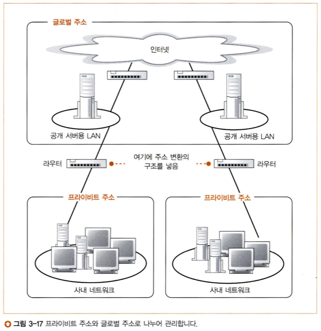

내부망과 인터넷을 연결하기 위해 주소 변환이 필요하다.

### 2. 주소 변환의 기본 동작
- 주소 변환은 패킷을 중계할 때 IP 헤더에 기재된 IP 주소와 포트 번호를 바꿔쓰는 것이다.
    - 바꾼 내용은 대응표에 기록해둔다.

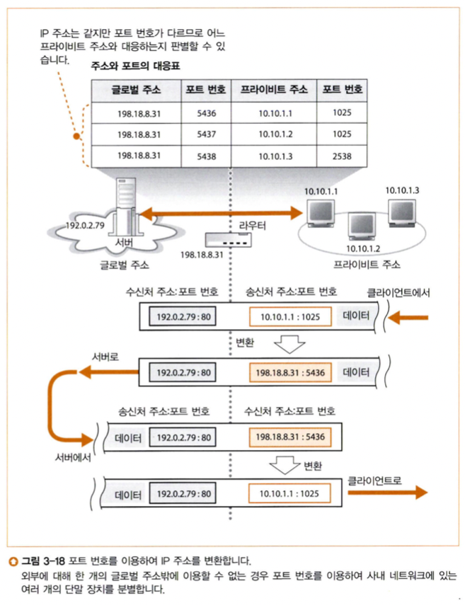

서버 입장에서는 내부망에 있는 각 기기가 프로세스인 것처럼 여겨진다.

### 3. 포트 번호를 바꿔쓰는 이유
- 초기의 주소 변환(Traditional NAT)은 IP 주소만 변경했다. 그래서 동시에 인터넷에 접속하려는 내부망의 기기가 많아질수록 그만큼의 공인 주소가 필요했다.
- 그래서 하나의 공인 주소만을 활용하기 위해 포트 번호도 같이 바꾸게 됐고*, 이를 **NAPT**(Network Address Port Translation)이라고 한다.**

* 모든 포트 번호를 주소 변환용으로 사용하는 것은 아니다.
** 위에서는 단순히 IP 주소와 포트 번호만 바꾼다고 했지만, 엄밀히는 포트 번호가 바뀌었기 때문에 TCP 체크섬, UDP 체크섬 등 연관된 다른 부분도 변경된다.

### 4. 인터넷에서 회사로 액세스한다.
- 외부망에서 내부망으로 접속하려면 대응표에 등록된 기기에만 접속할 수 있다. 따라서 외부로부터의 부정 침입을 방지할 수 있다. 이를 **IP 위장**(IP Masquerading)이라 한다.
- 하지만 이때문에 서로 다른 내부망에 있는 클라이언트끼리 연결이 필요한 경우 **홀 펀칭**(Hole Punching) 기술이 요구된다. 홀 펀칭은 중계 서버를 이용해 클라이언트끼리 연결시키는 것이다.*

* 자세한 것은 [여기](https://en.wikipedia.org/wiki/Hole_punching_(networking))를 참고하라.

### 5. 라우터의 패킷 필터링 기능
- 패킷 필터링은 패킷의 내용을 조사해 조건에 합치되면 중계하고 그렇지 않으면 폐기하는 동작을 말한다.

# 참고자료
- https://ko.wikipedia.org/wiki/%EB%A7%A5%EC%8A%A4%EC%9B%B0_%EB%B0%A9%EC%A0%95%EC%8B%9D
- http://www.rfdh.com/bas_rf/emwave.htm
- http://www.ktword.co.kr/test/view/view.php?m_temp1=4395
- https://www.firewall.cx/networking/network-cabling/network-cabling-utp.html
- http://www.ktword.co.kr/test/view/view.php?nav=2&no=1676&sh=NAT
- https://en.wikipedia.org/wiki/Hole_punching_(networking)
- http://www.ktword.co.kr/test/view/view.php?m_temp1=1919
- http://www.ktword.co.kr/test/view/view.php?m_temp1=5465&id=423