

# 4. 액세스 회선을 통해 인터넷의 내부로!
## 4-1. ADSL 기술을 이용한 액세스 회선의 구조와 동작
- ADSL 액세스 회선의 구성
- 전화선 속을 흐르는 신호
- 전화와 공존시키는 방법

### 1. 인터넷의 기본은 가정이나 회사의 LAN과 같다.
- LAN과의 차이점
    - 중계 장치 간의 거리가 멀다.
        - 그래서 이더넷 케이블로 연결할 수 없다.
    - 라우팅 테이블에 등록된 정보가 많다.
    - 라우팅 테이블의 정보가 시시각각 변한다.
        - 그래서 경로 정보의 등록 방법이 다르다.

### 2. 사용자와 인터넷을 연결하는 액세스 회선
- 인터넷 접속용 라우터는 이더넷이 아닌 액세스 회선(ADSL, FTTH, CATV, 전화 회선, ISDN 등)과 연결되어 있다.
    - 본 책에서는 ADSL 위주로 다룬다.

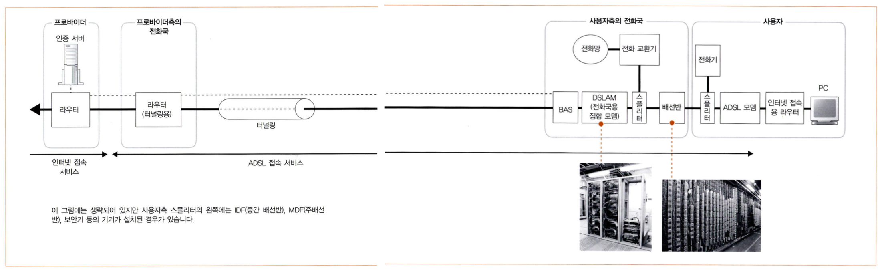

ADSL 액세스 회선은 위와 같이 구성된다.

### 3. ADSL 모뎀에서 패킷을 셀로 분할한다.
- [셀(Cell)](http://www.ktword.co.kr/test/view/view.php?m_temp1=1232&id=311)
    - 헤더(5바이트) + 데이터(48바이트)로 구성
    - [ATM](http://www.ktword.co.kr/test/view/view.php?nav=2&no=246&sh=ATM)(Asynchronous Transfer Mode) 통신 기술에 사용
- 셀로 분할하는 이유는 ADSL 기술 개발 당시 ATM이 주 통신 기술이었기 때문이다.
- 셀로 분할하지 않는 유형의 ADSL 모뎀도 있다.

<!-- NOTE : PPPoE 프로토콜 조사 -->
<!-- NOTE : PPP 프로토콜 조사 -->
<!-- NOTE : BAS(Broadband Access Server) -->

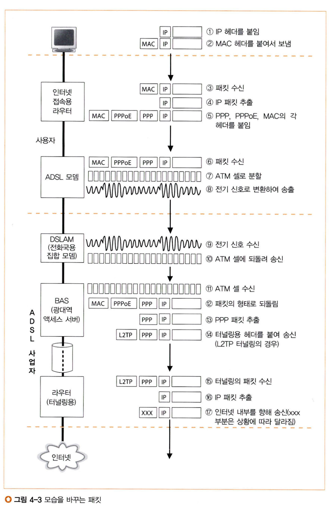

ADSL 모뎀이 셀로 분할해 전기 신호로 바꿔 스플리터에 송신한다.

### 4. ADSL은 변조 방식으로 셀을 신호화한다.
- 사각형 신호를 쓰지 않는 이유
    - 파형이 뭉개지기 쉽기 때문에 거리가 멀수록 오류를 일으키기 쉽다.
    - 주파수 폭이 넓어 방사되는 잡음의 양이 많아지기 때문에 잡음의 제어가 어렵다.
- 변조 기술
    - 정현파(正弦波)에 0과 1의 비트 값을 대응시키는 것
    - 진폭 혹은 위상의 단계를 늘려 대역폭을 증가시킬 수 있음.
        - 그러나 파형은 진행할수록 점점 감쇠하고 이로 인해 잡음의 영향을 많이 받게 되는데, 너무 많은 단계가 있다면 수신 측에서 인접 단계와 오인할 수 있다. 다시 말해 고속화에는 한계가 있다.
    - 종류
        - [진폭 변조](http://www.ktword.co.kr/test/view/view.php?nav=2&no=2394&sh=ASK)(ASK; Amplitude Shift Keying)
        - [위상 변조](http://www.ktword.co.kr/test/view/view.php?nav=2&no=698&sh=PSK)(PSK; Phase Shift Keying)
        - [직교 진폭 변조](http://www.ktword.co.kr/test/view/view.php?nav=2&no=1582&sh=QAM)(QAM; Quadrature Amplitude Modulation) 

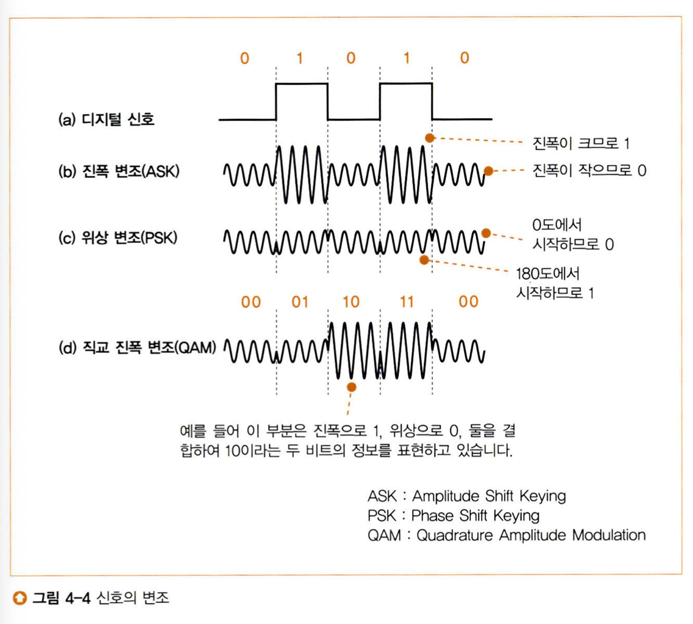

각 변조 방식에서 대응되는 비트의 표현은 위와 같다.

### 5. ADSL은 파를 많이 사용하여 고속화를 실현한다.
- 이것이 가능한 이유는 주파수가 다른 파끼리는 합성이 가능하며, 반대로 이를 분리하는 것도 가능하기 때문이다.
- 잡음이 없는 주파수의 파에는 다수의 비트를 대응시키고, 잡음이 있는 주파수의 파에는 소수의 비트를 대응시킨다.*

* 보통 수 비트에서 수십 비트를 대응시킨다.

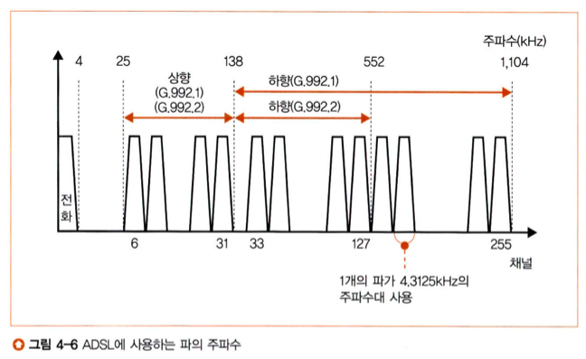

각각의 파에 직교 진폭 변조로 비트를 대응시킨다.

- ADSL은 업로드와 다운로드의 전송 속도가 다르다.
    - 업로드에는 26개의 파를 사용한다.
    - 다운로드에는 95개나 223개의 파를 사용한다.

- 전화국에서 멀어지면 다운로드의 속도가 떨어지는 이유
    - 다운로드에는 높은 주파수의 파를 사용한다.
    - 높은 주파수의 파는 감쇠가 크고 잡음의 영향을 받기 쉽다.

- ADSL에는 회선의 상태를 조사해 사용할 파의 수나 각 파에 대응하는 비트 수를 판단하는 구조도 마련되어 있다.
    - 모델의 전원을 공급할 때 시험 신호를 보내고, 이 수신 상태에 따라 파의 수나 비트 수를 판단한다.
        - 트레이닝(Training)
        - 몇 초에서 수십 초가 걸림.

### 6. 스플리터의 역할
- 송출할 때는 ADSL의 신호를 전화의 음성 신호와 함께 전화 회선으로 흘려보낸다.
- 수신할 때는 ADSL의 신호와 전화의 음성 신호를 분리한다.
    - 스플리터에는 일정한 주파수를 초과하는 신호를 차단하는 기능을 갖추고 있기에 ADSL의 높은 주파수 신호를 차단한다.

- ADSL 모뎀의 내부에는 ADSL이 사용하는 주파수에서 벗어난 불필요한 주파수를 차단하는 기능이 있다.

## 4-2. 광섬유를 이용한 액세스 회선(FTTH)
### 1. 광섬유의 기본
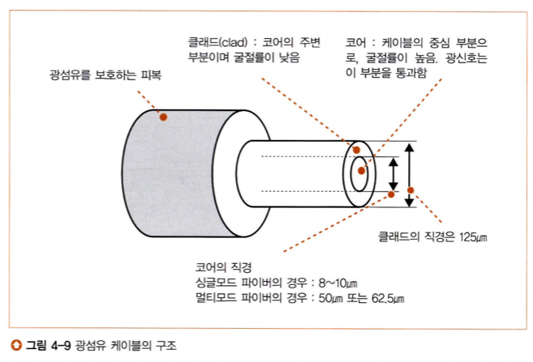

ADSL 신호와 달리 광신호는 등이 켜진 상태가 1을 나타내고, 등이 어두운 상태가 0을 나타낸다.

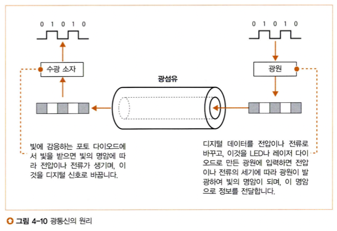

디지털 데이터를 전기 신호로 변환한 후 광신호로 변환한다.

### 2. 싱글모드와 멀티모드의 차이
- 빛을 전달할 떄는 신경쓸 것이 많다.
    - 빛은 파동성을 지니고 있기에 반사, 굴절, 간섭 등이 생긴다.
    - 광섬유의 재질에 따라 빛의 투과율이나 굴절률이 달라지는데, 특히 코어의 직경이 크게 영향을 끼친다.
    - 빛이 반사될 때 입사각에 따라 위상이 달라지는데 이때문에 경계면을 향하는 빛과 반사되어 돌아오는 빛끼리 위상차가 생겨 서로 상쇄될 수도, 강화될 수도 있다.
        - 대부분의 각도에서 파가 상쇄되기에 소수의 빛만이 멀리 도달한다.
        - 코어의 직경은 이 입사각을 고려하여 결정되고, 코어의 직경에 따라 광섬유의 성질이 크게 달라진다.
    
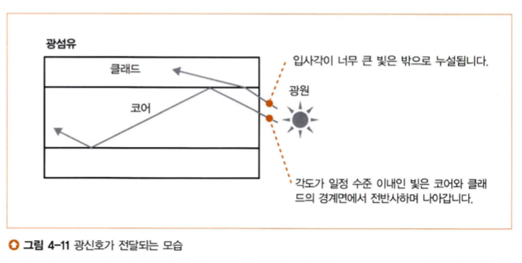

코어를 지나는 빛은 코어와 클래드의 경계면에서 입사각에 따라 굴절되거나 전반사(全反射)된다.

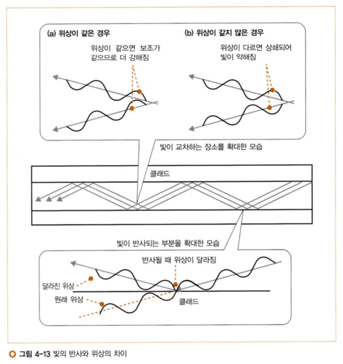

- 코어의 직경의 종류
    - 싱글모드(8~10µm) 
        - 코어의 직경이 가늘어 입사각이 작은 빛만 전달 가능
        - 전달되는 빛의 양이 적어 광원이나 수광 소자의 성능이 뛰어나야 한다. (= 광원과 수광 소자가 비싸다.)
        - 신호의 변형이 적다.
        - 케이블 길이를 길다.
    - 멀티모드(50µm 또는 62.5µm)
        - 코어의 직경이 굵어 입사각이 큰 빛도 전달할 수 있기에 복수의 빛을 전달
        - 전달되는 빛의 양이 많아 광원이나 수광 소자의 성능이 비교적 낮은 것이라도 상관 없다.(= 광원과 수광 소자가 싸다.)
        - 신호의 변형이 잦다.
        - 케이블 길이가 짧다.

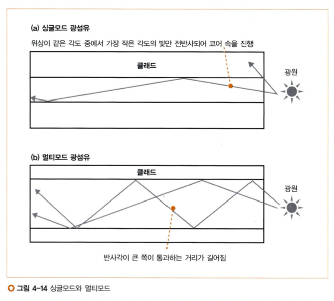

싱글모드와 멀티모드라는 단어는 위상의 같은 각도 수의 개수가 단일이냐 복수냐에 따라 붙여진 것이다.

- 신호의 변형
    - 신호의 변형은 빛이 코어를 지나갈 때 반사되는 횟수와 관계가 있다.
    - 반사각이 큰 빛은 반사되는 횟수가 많다.
    - 반사되는 횟수가 많을수록 빛이 진행하는 코스의 거리가 길어진다.
    - 거리가 길면 수신측에 도달할 때까지 더 많은 시간이 걸린다.
    - 신호가 도착하는 시간이 일정하지 않아 신호의 폭이 넓어진다.
    - 광섬유가 길어지면 변형이 커지고 이것이 허용 한도를 초과하면 통신 오류를 일으킨다.

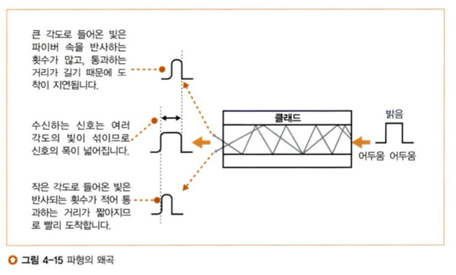

### 3. 광섬유를 분기시켜서 비용을 절감한다.
- 한 개의 광섬유로 사용자측과 가장 가까운 전화국측을 접속한다.
    1. 미디어 컨버터(Media Converter)가 이더넷의 전기 신호를 광신호로 변환한다.
    2. 변환된 광신호는 광섬유*를 통해 집합형 미디어 컨버터로 전달된다.
    3. 집합형 미디어 컨버터에서 광신호를 전기 신호로 복원하여 BAS에 전달한다.
    4. BAS는 인터넷의 내부로 패킷을 중계한다.
    5. 인터넷에서 돌아온 응답을 같은 광섬유를 통해 사용자측으로 보낸다.

- 광스플리터를 이용해 복수의 사용자를 연결하는 유형
    - 

- 파장 다중화(WDM; Wavelength Division Multiplexing)
    - 여러 파장대역을 통해 동시에 전송하는 광 다중화 방식
    - 빛의 성질 중 분산을 이용한 것으로 파장이 다른 빛을 혼합해 송신한 후 프리즘의 원리로 분리한다.

## 4-3. 액세스 회선으로 이용하는 PPP와 터널링
### 1. 본인 확인과 설정 정보를 통지한다.
- BAS는 FTTH, ADSL을 연결할 수 있는 라우터

- PPP(Point-to-Point Protocol)
    - 점대점 데이터링크의 확립, 그 위에 3계층 프로토콜들을 캡슐화, 이를통한 데이터 전송용 프로토콜
    - 전화 회선이나 ISDN을 사용해 인

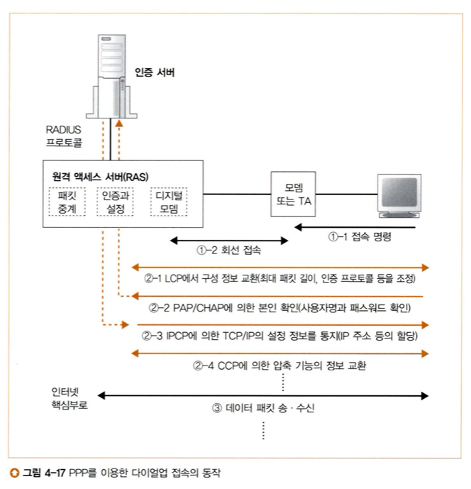

# 참고자료
- http://kocw-n.xcache.kinxcdn.com/data/document/2018/pusan/parkkanghyun1115/1.pdf
- http://www.ktword.co.kr/test/view/view.php?m_temp1=908&id=33
- http://www.ktword.co.kr/test/view/view.php?m_temp1=1232&id=311
- http://www.ktword.co.kr/test/view/view.php?nav=2&no=246&sh=ATM
- http://www.ktword.co.kr/test/view/view.php?nav=2&no=2394&sh=ASK
- http://www.ktword.co.kr/test/view/view.php?nav=2&no=698&sh=PSK