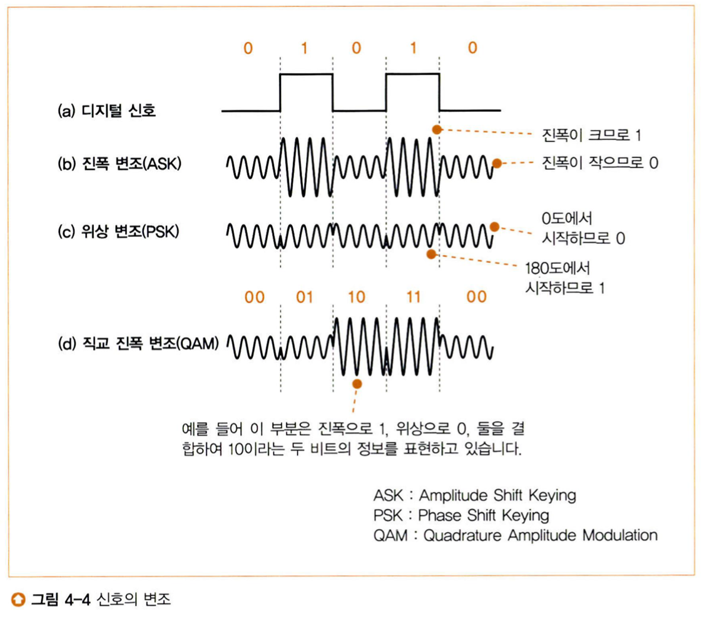

bnbbbrbㄱbbㅠb# 7주차

## 4장 액세스 회선을 통해 인터넷 내부로

## 4.1 ADSL 기술을 이용한 액세스 회선의 구조와 동작
### 4.1.1 인터넷의 기본은 가정이나 회사의 LAN과 같다.

* 인터넷의 내부에는 수만 대 이상의 라우터가 있고, 이것이 수신처 IP주소를 바탕으로 중계 대상을 판단하면서 패킷을 중계한다. 다수의 라우터가 차례대로 중계하여 패킷을 목적지에 전달합니다.

기본적으로 위의 내용에 대해서는 중계하는 방법은 같지만, 중요하게 거리와 중계대상과 관련하여 차이가 있습니다.

1. 거리
- 회사나 가정의 LAN은 케이블을 연장하여 인접한 라우터에 연결할 수 있지만, 인터넷은 수 킬로, 혹은 대륙간의 거리가 있을 수 있기에 케이블 연결은 무리가 있습니다.

2. 중계대상
- 경로표에 등록된 경로 정보에 기초하여 중계 대상을 판단한다는 기본 동작은 같으나, 인터넷의 라우터에서는 경로 정보가 10만 개 이상이 등록되어 있으며, 정보의 변화량이 많습니다.
- 이를 자동화하여, 등록방법의 차이가 있습니다.

### 4.1.2 사용자와 인터넷을 연결하는 액세스 회선
스위칭 허브와 라우터로 패킷을 중계하면 패킷은 목적지 서버를 향해 진행합니다.  
이 과정에서 라우터의 접속 중계동작은 인터넷 접속용 라우터의 패킷 중계, 이더넷의 라우터가 거의 동일합니다.

*단, 인터넷 접속용 라우터의 패킷 송신 동작만큼은 이더넷의 패킷 송신동작이 다릅니다.*

> ADSL(Asymmetric Digital Subscriber Line)
> 전화용 금속제 케이블을 활용하여 고속으로 통신하는 기술

* 액세스 회선
  * 인터넷을 가정이나 회사의 LAN을 연결하는 통신 회선

즉, 인터넷을 연결하기 위한 하나의 회선 기술을 알아보는 것이다.

### 4.1.3 ADSL 모델에서 패킷을 셀로 분할한다.
ADSL 모델에서 네트워크로부터 패킷을 수신한다.
여기서 일반적으로 IP 패킷을 수신하게 되는데,

1. 패킷 분할: ADSL 모뎀은 수신한 IP 패킷을 고정된 크기의 여러 ATM 셀로 분할. 
2. 셀 라벨링: 각 셀은 고유한 식별자 또는 라벨을 포함하게 되고, 이 라벨을 통해 목적지까지의 경로를 결정하거나 패킷 재조립을 위해 사용됨.
3. 셀 전송: 분할된 셀들은 전기신호로 변환되어 ADSL 선을 통해 전송.
4. 셀 재조립: 목적지에 도착한 전기신호는 셀로 되돌리고 분할된 셀들을 패킷의 형태로 되돌려 순서대로 재조립.

셀로 분할하는 것이라고 했는데 셀의 구조는 헤더와 데이터로 이루어져있습니다.

* 헤더(5바이트) + 데이터(48바이트)

여기서 ATM 기술이라는 것이 활용되는데, ATM (Asynchronous Transfer Mode)이란 셀이라는 고정된 크기의 패킷으로 나누어 전송하는 통신 표준입니다.

> 이렇게만 보면 라우터 패킷 전달과 별 차이가 없으나, 인터넷 접속용 라우터에서는
> MAC 헤더, PPPoE헤더, PPP헤더이 세 가지를 붙이고 ADSL 모뎀에서 패킷을 보낸다.

그렇다면 이 헤더는 언제 붙이고, 어떻게 이용하는가?

* 3가지 헤더가 붙는 과정
  * 초기에 IP 패킷 수신 이후 라우터에서는 IP 패킷을 먼저 추출하게 됩니다.
  * 추출된 IP 패킷에 이제 앞에서 말한 3개의 헤더를 붙이게 됩니다.

인터넷 라우터 과정에서 추가된 3가지 헤더에 대한 내용은 아래와 같습니다.

* MAC 헤더 (Media Access Control Header):
  * 역할: MAC 헤더는 데이터 링크 계층에서 사용되며, 패킷이 소스와 목적지 사이의 물리적 네트워크에서 올바르게 전송되도록 합니다.
  * 내용: 주로 소스 및 목적지의 MAC 주소 (물리적 주소)를 포함합니다.
  * 사용: 패킷이 로컬 네트워크 내에서 올바른 장치로 라우팅되기 위해 이 MAC 주소를 사용합니다.

* PPPoE 헤더 (Point-to-Point Protocol over Ethernet Header):
  * 역할: PPPoE는 Ethernet 네트워크 상에서 PPP 세션을 캡슐화하기 위한 프로토콜입니다. 이 헤더는 이러한 캡슐화된 세션을 식별하는 데 도움을 줍니다.
  * 내용: 세션 ID와 PPPoE 프로토콜 버전, PPPoE 타입, 코드 등을 포함합니다.

* PPP 헤더 (Point-to-Point Protocol Header):
  * 역할: PPP는 직접 연결된 두 컴퓨터 간의 데이터 링크 계층 프로토콜로서, 네트워크 계층의 프로토콜을 캡슐화하여 전송합니다.
  * 내용: 전송되는 데이터의 유형을 지정하는 프로토콜 필드가 포함됩니다.

> 여기서는 간단한 개념 정리를 해두었다. 이후 PPPoE와 PPP가 정확히 어떤 부분인지는 차후 정리

### 4.1.4 ADSL은 변조 방식으로 셀을 신호화한다.
셀 전송과정에서 전기신호로 변환하는 과정을 거치는데 0과 1로 이루어진 디지털 신호로 변환됩니다.
LAN에서는 PHY를 전기 신호로 변환하였지만, 여기서는 조금 더 복잡한 방식의 변환이 이루어집니다.

그 이유로는 아래와 같습니다.

> 1. 사각형의 신호는 파형이 뭉게지기 쉽고, 거리가 멀어질 경우 오래 발생 확률이 높아서
> 2. 사각형의 신호에는 낮은 주파수에서 높은 주파수까지의 넓은 범위의 주파수까지 포함되어 있어서
 

ADSL 모뎀은 전기신호를 변환하는 과정에서 정현파에 합성한 신호에 0과 1을 대응시키는 기술을 사용하는 변조 기술을 활용합니다.

ADSL에서는 진폭 변조, 위상 변조, 직교 진폭 변조를 활용합니다.
1. 진폭 변조 (Amplitude Modulation, AM):
    * 설명: 진폭 변조는 기본 파동의 높낮이(크기)를 정보 신호에 따라 변경하는 방법입니다. 정보가 변할 때마다 기본 파동의 높낮이도 그에 맞게 바뀝니다.

2. 위상 변조 (Phase Modulation, PM):
    * 설명: 위상 변조는 기본 파동의 시작 지점을 정보 신호에 따라 변경하는 방법입니다. 예를 들어, 파동이 시작되는 시점이 앞당겨지거나 늦춰질 수 있습니다.

3. 직교 진폭 변조 (Quadrature Amplitude Modulation, QAM):
    * 설명: QAM은 진폭 변조와 위상 변조를 결합한 복합 변조 방식입니다. 기본 파동의 높낮이와 시작 지점을 동시에 변경하여 정보를 전송합니다. 이를 통해 더 많은 정보를 동일한 주파수 대역에 전송할 수 있습니다.

  

### 4.1.5 ADSL은 파를 많이 사용하여 고속화를 실현한다.
ADSL (Asymmetric Digital Subscriber Line)은 기존의 전화 회선을 활용하여 고속 인터넷 서비스를 제공하는 기술입니다. 전화 회선은 원래 음성 통화를 위해 설계되었기 때문에, 그 대역폭은 상대적으로 제한적입니다. 그러나 ADSL 기술은 이 제한된 대역폭을 최대한 효율적으로 활용하려고 노력합니다.

여기서 중요한 개념은 **"파"** 또는 **"주파수"** 입니다. 모든 전자 통신은 특정 주파수 대역에서 작동하며, 사용 가능한 주파수가 많을수록 더 많은 데이터를 전송할 수 있습니다.

ADSL은 전화 회선의 사용 가능한 주파수 대역을 여러 개의 작은 주파수 대역, 즉 "파"로 나누어 활용합니다. 이렇게 각각의 작은 주파수 대역에 데이터를 할당함으로써 전체적인 데이터 전송 속도를 높이게 됩니다.

하지만 모든 주파수 대역이 동일한 통신 품질을 제공하는 것은 아닙니다. 일부 주파수 대역은 잡음이 많거나 다른 방해로 인해 데이터 전송 품질이 떨어질 수 있습니다. 따라서 ADSL 모뎀은 연결이 초기 설정될 때 **"트레이닝"** 이라는 과정을 거쳐 최적의 주파수 대역을 선택하고, 각 주파수 대역에 얼마나 많은 데이터를 할당할지 결정합니다.

> 트레이닝이란?  
> ADSL 연결이 초기화되는 과정에서 ADSL 모뎀 간의 통신 품질을 최적화하기 위해 실행되는 자동 프로세스

이 트레이닝 과정은 ADSL 연결이 시작될 때 자동으로 실행되며, 이를 통해 최상의 연결 품질과 데이터 전송 속도를 보장하게 됩니다.

결론적으로, ADSL은 사용 가능한 주파수 대역을 여러 파로 나누어 고속화를 실현하고, 트레이닝 과정을 통해 각 주파수 대역의 최적화된 활용을 결정합니다.

### 4.1.6 스플리터의 역할
스플리터는 **전화 음성 신호와 ADSL 데이터 신호를 분리하는 역할**을 합니다. 이렇게 함으로써 한 회선을 통해 동시에 전화 서비스와 고속 인터넷 서비스를 이용할 수 있게 됩니다.

스플리터의 역할과 기능은 다음과 같습니다

1. 신호 분리: 전화 회선은 원래 음성 통화를 위해 설계되었습니다. 음성 신호는 일반적으로 낮은 주파수 대역에서 운영됩니다. 반면, ADSL 데이터 신호는 이보다 더 높은 주파수 대역에서 운영됩니다. 스플리터는 이 두 신호를 효과적으로 분리하여, 하나의 회선에서 동시에 전화와 인터넷 서비스를 제공할 수 있게 합니다.

2. 잡음 감소: 스플리터를 사용하면 전화기에서 발생하는 잡음이 ADSL 모뎀으로 전달되는 것을 방지할 수 있습니다. 이를 통해 데이터 연결의 안정성과 성능이 향상됩니다.

3. 상호 간섭 방지: 스플리터가 없으면, 고속의 ADSL 데이터 신호가 전화기로 전달될 수 있어, 전화 통화 중에 원하지 않는 잡음이 발생할 수 있습니다. 스플리터를 사용함으로써 이러한 상호 간섭을 방지하고, 음성 통화의 품질을 보장합니다.

결론적으로, 스플리터는 전화 음성 신호와 ADSL 데이터 신호를 안전하고 효과적으로 분리하여, 하나의 전화 회선을 통해 두 가지 서비스를 동시에 제공할 수 있게 하는 중요한 장치입니다.

### 4.1.7 전화국까지의 여정

건물 내에는 IDF와 MDF와 같은 밖에서 들어오는 전화배선과 건물의 배선을 관리하고 접속되어 있는 형태입니다.

만약 건물에서 전화선을 타고 외부로 신호가 나가게 되는데, 중간에 있는 보안기를 거쳐
전신주를 타고, 동도라는 전화선을 지하에 매설된 하나의 터널에 모이게 되어 전화국 MDF실로 들어오게 됩니다.

### 4.1.8 잡음의 영향

이러한 전화선들은 하나의 전류의 흐름으로 자기장을 형성하기에 잡음의 문제를 피할 수 없습니다.

심지어 ADSL의 경우에는 인터넷의 더욱 높은 주파수를 활용하기 때문에 이더넷 트위스트 페어 케이블보다 잡음의 영향을 받기 쉽습니다.

트위스트 페어 케이블의 경우에는 디지털 신호에서의 0과 1을 통해 사각형 신호 형태 한 개 뿐이여서 변형이 이루어지면, 데이터를 읽지 못해 오류를 발행할 수 있습니다.

하지만, ADSL의 경우 다수의 주파수로 나뉘어 잡음과 주파수가 겹치는 신호만 영향을 받아서 사용할 수 없게 됩니다.

ex: AM 라디오의 전파

###  4.1.9 DSLAM을 통과하여 BAS에 도달한다.

*DSL 서비스의 사용자는 모뎀을 통해 DSLAM에 연결되고, DSLAM은 사용자의 데이터를 BAS 또는 BRAS로 전송합니다. 그 후, BAS는 사용자의 데이터를 인터넷에 연결한다.*

전화케이블이 배선반과 스플리터, 보안기, 동도를 지나 전화국에 도착하게 되면 DSLAM에 도착하게 됩니다.

> DSLAM이란?  
> DSLAM은 디지털 가입자 회선 액세스 다중화기라는 뜻입니다.  
> DSLAM은 전화 회선의 아날로그 신호를 디지털로 변환하며, 이 디지털 데이터인 셀로 복원하여 고속 인터넷으로 중앙 집중식의 네트워크로 전송하는 장치입니다.  
> DSL 서비스 제공 시, 가입자의 모뎀에서 오는 아날로그 데이터를 DSLAM에서 디지털 셀로 변환하고, 이 데이터를 고속으로 전송합니다.

여기서 중요한 점은 DSLAM은 ATM 인터페이스를 가지고 있고 패킷을 분할한 형태 그대로 후방의 라우터와 통신합니다.

#### DSLAM에서 BAS까지의 과정:

1. 사용자의 DSL 모뎀과 DSLAM 사이에서는 전화선을 통해 아날로그 DSL 신호가 통신됩니다.
2. DSLAM에서는 이 아날로그 신호를 디지털 신호로 변환하며, 다수의 사용자를 위한 데이터 스트림을 하나의 고속 링크로 집중시킵니다.
3. 집중된 데이터 스트림은 BAS (Broadband Access Server) 또는 BRAS (Broadband Remote Access Server)와 같은 다음 네트워크 장비로 전송됩니다.

> * BAS (Broadband Access Server) 또는 BRAS (Broadband Remote Access Server)  
>   * BAS 또는 BRAS는 DSL 서비스 제공자의 네트워크 중심에 위치하는 장치입니다.  
>   * 이 장치는 DSLAM에서 오는 다중의 사용자 데이터 스트림을 처리하고, 각 사용자에 대한 인증, 인터넷 접근, IP 주소 할당 등의 역할을 합니다.  
>   * 일단 사용자가 인증되면, BAS는 사용자의 데이터를 인터넷으로 라우팅합니다.

## 4.2 광섬유
광섬유는 정보 통신 및 데이터 전송의 혁명적인 기술로 꼽히며, 그 기술과 특성에 대해 다음과 같이 정리할 수 있습니다.

1. 정의:
광섬유는 빛을 내부에서 반사시켜 정보를 전송하는 얇은 유리나 플라스틱 섬유입니다.

2. 구조:
코어 (Core): 광섬유의 중심부로, 빛이 전송되는 영역입니다.
클래딩 (Cladding): 코어를 둘러싸며, 빛의 반사와 전송을 도와줍니다.
외부 케이싱 (Buffer or Jacket): 클래딩을 보호하는 외부 층.

3. 장점:
고속 데이터 전송: 광섬유는 초고속의 데이터 전송을 가능하게 합니다.
저손실: 전송 중에 발생하는 신호 손실이 매우 낮습니다.
전기적 간섭에 민감하지 않음: 광섬유는 전기적인 신호를 사용하지 않으므로 전기적 간섭에 영향을 받지 않습니다.
보안: 빛의 신호는 쉽게 가로채거나 간섭하기 어렵기 때문에 보안성이 높습니다.
경량 및 작은 크기: 다른 전송 매체에 비해 경량이며 공간을 적게 차지합니다.

4. 단점:
비용: 설치 초기 비용이 비쌀 수 있습니다.
물리적인 손상: 유리나 플라스틱으로 만들어진 광섬유는 물리적인 손상에 취약할 수 있습니다.

5. 전송 방식:
단일 모드 광섬유 (Single Mode Fiber): 작은 코어를 가진 광섬유로, 한 가지 경로로만 빛이 전송됩니다.
다중 모드 광섬유 (Multi mode Fiber): 더 큰 코어를 가지며, 여러 경로로 빛이 전송됩니다.

## 4.2.2 싱글모드와 멀티모드의 차이
1. 싱글모드 광섬유 (Single Mode Fiber, SMF):
    * 코어의 지름: 대략 8~10µm (마이크로미터) 범위에 있습니다. 이 작은 코어 크기로 인해 빛의 전파가 주로 한 가지 방향(모드)으로만 이루어집니다.
    * 전파 방식: 광섬유 코어 안에서 빛이 직진 경로로만 전파되기 때문에 모드 분산이 거의 발생하지 않습니다.
    * 사용하는 파장: 주로 1310nm 또는 1550nm 파장에서 동작합니다.
    * 전송 거리: 싱글모드 광섬유는 멀티모드보다 훨씬 더 긴 거리를 전송할 수 있습니다. 수십 킬로미터에서 수 백 킬로미터까지 가능합니다.
    * 용도: 주로 광섬유 백본, 장거리 통신, 텔레콤 네트워크 등에 사용됩니다.
 
 

2. 멀티모드 광섬유 (Multi Mode Fiber, MMF):
    * 코어의 지름: 50µm 또는 62.5µm가 일반적입니다. 큰 코어 크기로 인해 여러 경로(모드)로 빛이 전파됩니다.
    * 전파 방식: 빛이 광섬유 코어 내에서 다양한 각도로 반사되며 전파되기 때문에, 동일한 신호가 서로 다른 시간에 도착할 수 있습니다. 이로 인해 모드 분산이 발생할 수 있습니다.
    * 사용하는 파장: 주로 850nm 및 1300nm 파장에서 동작합니다.
    * 전송 거리: 모드 분산의 영향으로 인해 전송 거리가 상대적으로 짧습니다. 일반적으로 수십 킬로미터 이내에서 동작합니다.
    * 용도: 데이터 센터, LAN (Local Area Network), 건물 내 통신 등 짧은 거리의 통신에 주로 사용됩니다.
 
 

> * 주요 차이점 요약:  
>   * 코어 크기: SMF는 코어 크기가 작아 한 가지 방향으로만 빛이 전파되는 반면, MMF는 코어 크기가 크기 때문에 여러 경로로 빛이 전파됩니다.
>   * 전송 거리: SMF는 멀티모드에 비해 훨씬 긴 거리를 전송할 수 있습니다.
>   * 용도: SMF는 장거리 통신에, MMF는 짧은 거리 통신에 적합합니다.
>   * 모드 분산: MMF에서는 여러 경로로 빛이 전파되기 때문에 모드 분산이 발생할 수 있습니다.

### 4.2.3 광섬유를 분기시켜서 비용을 절감한다.
이렇게 광섬유를 활용하여 사용자 측의 인터넷 접속용 라우터와 인터넷 측의 BAS를 접속하는 것은 FTTH 액세스 회선입니다.

> * FTTH (Fiber To The Home)  
>   * 광섬유 통신 기술을 집까지 연결하는 방식

이는 크게 두 가지의 형태로 나눌 수 있습니다.

#### 한 개의 광섬유로 사용자측과 가장 가까운 전화국 측으로 연결하는 상황(Point to Point)

1. 사용자의 집에 설치된 미디어 컨버터 또는 ONU를 통해 데이터가 광 신호로 변환됩니다.
2. 광섬유 케이블을 통해 신호가 전송됩니다.
3. 전화국 또는 중앙 오피스의 OLT에 도착한 신호는 여기서 전기 신호로 다시 변환되어 인터넷 백본에 연결됩니다.

#### 광섬유 분기로 복수의 사용자를 연결하는 유형(Passive Optical Network)

  1. 사용자의 집에 설치된 미디어 컨버터 또는 ONU를 통해 데이터가 광 신호로 변환됩니다.
  2. **광 분배기 (Optical Splitter)** 를 통해 하나의 광섬유 신호가 여러 사용자로 분배됩니다.
  3. 복수의 사용자에서 오는 신호는 중앙 오피스의 OLT에 모아집니다.
OLT에서는 모아진 신호들을 개별 신호로 분리하여 인터넷 백본에 연결합니다.

>  * 파장 다중(WDM : Wavelength Division Multiplexing)
>     * 다양한 파장의 빛을 하나의 광섬유 케이블로 동시에 전송하여 대역폭을 확장하는 데 사용된다.
>     * 여기서 인터넷을 향해 올리는 상향 광신호와 사용자를 향해 내리는 하향 광신호가 존재하는데, 이는 프리즘의 원리를 통해 분리가 가능합니다.
>     * 그렇기에 하나의 광섬유에 서로 다른 복수의 광신호가 섞여 있어도 큰 문제가 없습니다.
>     * 이를 통해 용하여 다양한 데이터 서비스 (예: 데이터, 음성, 비디오)를 하나의 광섬유 케이블에 합쳐 전송도 가능합니다.

## 4.3 액세스회선으로 이용하는 PPP와 터널링
### 4.3.1 본인확인과 설정 정보를 통지한다.
액세스 회선을 활용해서 인터넷을 향해 들어온 패킷은 액세스 회선을 운영하는 BAS에 도달합니다.

BAS는 액세스 회선의 진화에 맞추어 탄생한 라우터의 형태입니다.
그렇다면 어떤 부분이 진화가 되었는지를 정리해겠습니다.

1. 본인 확인과 설정값 통지 기능
    * ADSL, FTTH와 같은 액세스회선은 최초 사용자의 이름과 패스워드를 입력하는 로그인 동작(RADIUS 프로토콜 활용)을 BAS에서 이를 받게 됩니다.
    * 이를 위해 필요한 것이 **PPPoE** 구조를 활용합니다.

인터넷에 접속하는 경우에는 **PC에 글로벌 주소를 설정해야 하는데, 이것을 사전에 고정할 수 없습니다.**

다이얼업 접속은 전화번호에 따라 액세스 포인트를 전환할 수 있으며, 전환한 액세스 포인트에 따라 주소가 달라지므로 사전에 고정할 수 없습니다.

그래서 인터넷 접속 시 인터넷 측에서 PC에 TCP/IP 설정정보를 통지가 이루어집니다.

## 4.3.2 이더넷에서 PPP 메시지를 주고받는 PPPoE

PPP의 메시지를 운반할 때는 IP 패킷을 이더넷의 패킷에 넣어 운반하는 것은 같은 개념입니다.
하지만 PPP는 전화회선을 규정으로 만들어진 것이기에 이더넷의 프리엠블이나 FCS에 해당하는 규정이나 신호에 대한 규정이 없어 PPP메시지를 그대로 송신할 수 없는 문제가 있습니다.

그렇기에 PPP는 이더넷의 프리엠블이나 FCS 규정 신호의 규정으로 **HDLC**라는 프로토콜을 사용합니다.

> HDLC 프로토콜이란?
>   * 데이터 링크 계층의 프로토콜로, 패킷 기반 네트워크에서 신뢰성 있는 데이터 전송을 위한 기본적인 프레임 구조와 메커니즘을 제공한다.

하지만 PPP와 이더넷은 서로 다른 데이터 링크 계층의 프로토콜입니다. PPP는 주로 전화 회선과 같은 직렬 연결을 위해 설계되었으며, 이더넷은 로컬 영역 네트워크 (LAN) 환경을 위해 설계되었습니다.

PPP는 데이터를 전송할 때 HDLC 프레임 구조를 사용합니다. 이는 PPP가 전화 회선과 같은 신호 회선을 사용하여 데이터를 전송할 때 필요한 프레임 구조와 메커니즘을 제공하기 때문입니다.

ADSL과 FTTH에서의 데이터를 전송하기 위해서 이를 활용하여야 하지만,
ADSL과 FTTH는 전통적인 HDLC 기반의 PPP 프레임을 지원하지 않습니다. 이는 이런 액세스 회선이 LAN 기반의 이더넷 프로토콜에 더 친화적이기 때문입니다.

이런 한계를 극복하기 위해 PPPoE (PPP over Ethernet)가 도입되었습니다. PPPoE는 PPP 세션을 이더넷 프레임 내부에 캡슐화하여 이더넷 네트워크를 통해 PPP 통신을 가능하게 합니다. 이를 통해 ADSL과 FTTH와 같은 액세스 회선에서도 PPP 기반의 서비스를 제공할 수 있습니다.

### 4.3.3 터널링 기능에 의해 프로바이더에 패킷을 전달한다.
BAS에서 사용자의 ID와 패스워드를 입력하는 로그인 기능과 더불어 **터널링** 활용하여 패킷을 운반하는 기능이 있습니다.

터널링이란?
하나의 네트워크 프로토콜이 다른 네트워크 프로토콜 내에서 캡슐화되어 전송되는 방식을 말한다. 

BAS와 Provider의 라우터 사이에 있는 ADSL/FTTH 접속 서비스 사업자의 네트워크 안에 터널을 만듭니다.
터널링이 되면서 캡슐화된 프로토콜은 다른 네트워크를 통과할 있게 됩니다.

### 4.3.4 액세스 회선 전체의 동작
BAS (Broadband Access Server)는 광대역 네트워크 환경에서 사용자의 인터넷 접속을 관리하는 장치입니다. 이 서버는 사용자의 인증을 처리하고, IP 주소를 할당하며, 트래픽을 라우터로 전달하는 역할을 합니다.

BAS에 대한 접근
사용자 인증: 사용자가 인터넷에 접속하려고 할 때, BAS는 사용자의 ID와 패스워드를 검증합니다. 이 과정에서 PAP (Password Authentication Protocol)나 CHAP (Challenge Handshake Authentication Protocol) 같은 인증 프로토콜을 사용할 수 있습니다.

PAP: 가장 기본적인 형태의 인증 프로토콜로, 사용자 ID와 패스워드를 텍스트 형태로 전송합니다. PAP은 간단하지만, 패스워드가 평문으로 전송되기 때문에 보안에 취약합니다.
CHAP: 서버와 클라이언트 사이에 챌린지-응답 방식을 사용하여 인증을 수행합니다. 패스워드는 직접 전송되지 않고, 해시 값으로 변환되어 전송되기 때문에 PAP보다 보안이 강화된 방식입니다.
IP 설정값 전달: 인증이 성공하면, BAS는 사용자에게 TCP/IP 설정값을 전달합니다. 이 설정값에는 IP 주소, 서브넷 마스크, 기본 게이트웨이, DNS 서버 주소 등이 포함됩니다.

라우터로의 트래픽 전달: 사용자의 트래픽은 BAS를 통과하여 인터넷 라우터로 전달됩니다. 이 과정에서 NAT (Network Address Translation)이 수행될 수 있으며, 사용자의 프라이빗 IP 주소는 인터넷 상에서 유일한 글로벌 IP 주소로 변환됩니다.

이러한 과정을 통해 사용자는 안전하게 인터넷에 접속할 수 있으며, BAS는 네트워크의 효율적인 관리와 보안을 유지하는 데 도움을 줍니다.

### 4.3.5 IP 어드레스를 할당하지 않는 언넘버드
언넘버드(unnumbered) 인터페이스는 IP 주소를 할당받지 않는 네트워크 인터페이스를 말합니다. 
이 방법은 주로 라우터 간의 포인트-투-포인트 링크에서 사용됩니다. 
언넘버드 인터페이스를 사용하면 IP 주소를 절약할 수 있으며, 설정이 간단해집니다. 언넘버드 인터페이스는 주로 내부 네트워크에서 사용되며, 외부 네트워크와 통신할 때는 IP 주소가 필요합니다.
> 이와 같은 언넘버드의 형식을 사용할 수 있는 이유는 부가하는 헤더의 값은 사전에 대부분 결정되어 있어서  
> 경로표의 기본 게이트웨이 항목에 어떤값이 들어와도 관계가 없기 때문입니다.

* IP 주소 절약: 언넘버드 인터페이스를 사용하면 매 포인트-투-포인트 링크마다 IP 주소를 할당할 필요가 없어져 IP 주소를 절약할 수 있습니다.
* 구성의 단순화: 네트워크 구성이 간단해지며, 관리가 용이해집니다. 특히 대규모 네트워크에서 이점이 더욱 도드라집니다.
* 자동 인터페이스 구성: 언넘버드 인터페이스는 자동으로 구성될 수 있으며, 별도의 IP 주소 할당 과정 없이도 통신이 가능합니다.
라우팅 프로토콜과의 호환성: 대부분의 라우팅 프로토콜은 언넘버드 인터페이스와 호환되어 정상적으로 작동합니다.

* 장점
  * IP 주소 효율성: IP 주소를 절약할 수 있어 IPv4 환경에서 특히 유리합니다.
  * 네트워크 구성의 단순화: 구성이 간단해져서 관리 오버헤드가 줄어들고, 구성 오류의 가능성도 감소합니다.
  * 스케일링의 용이성: 대규모 네트워크 확장 시 IP 주소 할당의 부담이 줄어들어 스케일링이 용이합니다.
 

* 단점
  * 디버깅과 문제 해결의 어려움: IP 주소가 없기 때문에 트래픽을 추적하고 문제를 해결하는 것이 더 어려울 수 있습니다.
  * 특정 기능과의 불호환: 일부 네트워크 기능이나 서비스는 IP 주소를 필요로 할 수 있어 언넘버드 환경에서 작동하지 않을 수 있습니다.
  * 보안 고려사항: 언넘버드 인터페이스는 다른 인터페이스와 다르게 보안 정책을 구성할 때 주의가 필요합니다.

### 4.3.6 인터넷 접속용 라우터에서 프라이비트 주소를 글로벌 주소로 변환한다.
사용자의 컴퓨터는 인터넷에 접속하기 위해 초기 접속 요청을 하고, 이때 사용하는 프라이비트 주소는 BAS에서 글로벌 주소로 변환되어 인터넷 상의 다른 장치와 통신할 수 있게 합니다. 이 변환 과정은 인터넷 접속용 라우터에서 이루어지며, 이를 통해 내부 네트워크의 주소와 외부 네트워크의 주소 간의 충돌을 방지하고, 보안성을 유지하면서 효율적인 통신이 가능해집니다.

* 예시 통신과정
  * 사용자의 컴퓨터는 먼저 액세스 회선을 통해 인터넷에 접속하려고 시도합니다. 이때, 사용자와 BAS 간에 TCP/IP 설정 정보가 교환됩니다.
  * 사용자 컴퓨터(PC)는 특정 정보를 포함하는 패킷을 발송하며, 이 정보에는 프라이비트 IP 주소가 포함됩니다. 이 주소는 인터넷에서 직접 사용될 수 없기 때문에 변환이 필요합니다.
  * 사용자 컴퓨터의 정보를 받은 BAS는 이를 처리하며, 필요한 정보를 반환합니다. 이 과정에서 프라이비트 IP 주소를 글로벌(공용) IP 주소로 변환하는 작업이 이루어집니다.
  * 이후 사용자의 PC는 변환된 글로벌 IP 주소를 이용하여 인터넷 상의 다른 서버나 장치와 통신할 수 있게 됩니다.

### 4.3.7 PPPoE 이외의 방식

PPPoE(Point-to-Point Protocol over Ethernet) 외에도 여러 가지 방법으로 인터넷에 접속할 수 있습니다. 

* DHCP (Dynamic Host Configuration Protocol): IP 주소를 자동으로 할당받아 네트워크에 연결하는 방법입니다.
* 정적 IP 주소 설정: 사용자가 직접 IP 주소, 서브넷 마스크, 게이트웨이 등의 네트워크 설정을 수행하는 방법입니다.
* PPPoA (Point-to-Point Protocol over ATM): ATM 네트워크를 통해 포인트-투-포인트 연결을 설정하는 방법입니다.
* PPTP (Point-to-Point Tunneling Protocol): VPN 연결을 설정하여 인터넷에 접속하는 방법입니다.