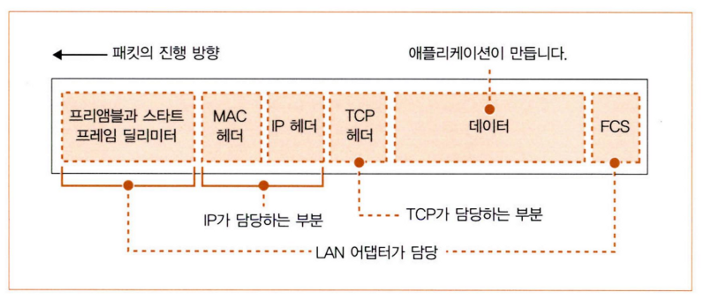

# **Chapter 02. TCP/IP의 데이터를 전기 신호로 만들어 보낸다.**

# 01. 소켓 작성

## 1. 프로토콜 스택의 내부 구성

- 패킷 : 분할된 데이터의 덩어리를 패킷이라고 한다.
- ICMP : 패킷을 운반할 때 발생하는 오류를 통지하거나 제어용 메시지를 통지한다.

## 2. 소켓의 실체는 통신 제어용 제어 정보

- Socket : Socket 라이브러리
- socket : Socket 라이브러리 안의 socket 프로그램
- 소켓 : 파이프 양끝의 출입구

소켓은 실체가 없다. 제어 정보 또는 제어 정보를 기록한 메모리를 소켓이라 할 수 있다.
프로토콜 스택은 소켓의 제어 정보를 바탕으로 움직인다.

명령 프롬프트 창에 netstat를 치면 소켓의 내용을 볼 수 있다.
옵션으로 -ano를 붙일 수 있는데 각각은 다음의 의미를 가진다.
- a : 통신하기 전인 것도 전부 표시
- n : IP 주소, 포트 번호를 번호로 표시
- o : 소켓을 사용하고 있는 프로그램의 PID(식별 번호) 표시

netstat -ano 라고 치면 프로토콜의 종류(TCP와 UDP 중 하나), 로컬과 통신 상대의 IP주소, 포트 번호 그리고 통신 상태가 나온다.
통신 상태는 두 가지가 있는데, LISTENING은 상대의 접속을 기다리고 있는 상태이고 ESTABLISHED는 데이터를 통신하고 있는 상태라는 것을 의미한다.
PID는 소켓을 어느 프로그램이 사용하는 알 수 있게 해주는데, PID도 보고싶다면 따로 설정해야한다.

## 3. Socket을 호출했을 때의 동작

1. 소켓 한 개 분량의 메모리 영역을 확보 후 제어 정보를 기록한다.
    1. 초기 상태라는 것도 기록한다.
2. 소켓을 만든 후 애플리케이션에 디스크립터를 보낸다.

디스크립터로 어느 소켓인지 알면 프로토콜 스택에서 필요한 정보를 알 수 있게된다.

# 02. 서버 접속

## 1. 접속의 의미

접속 동작으로 브라우저가 알고 있는 서버의 IP주소와 포트 번호를 클라이언트의 소켓에게 전달할 수 있다. 그리고 클라이언트에서 클라이언트의 IP주소와 포트 번호를 서버에게 알리면 서버의 소켓에게도 정보가 전달된다. 접속 동작은 이렇게 서로의 정보를 기록하고 데이터 송•수신이 가능한 상태가 되도록 만든다.
또한, 접속 동작에서는 데이터를 잠시 보관하는 버퍼 메모리(메모리 영역)를 확보한다.

## 2. 맨 앞부분에 제어 정보를 기록한 헤더 배치

제어 정보는 크게 두 가지로 나뉜다.

- 헤더에 기입되는 정보
- 소켓에 기록되는 정보

<헤더>

통신 동작에서 필요한 내용을 TCP 프로토콜로 규정하고 있다.

송신처 포트 번호, 수신처 포트 번호, 시퀀스 번호, ACK 번호, 데이터 오프셋, 컨트롤 비트, 윈도우, 체크섬, 긴급 포인터, 옵션이 규정되어 있다.
이 제어 정보를 데이터인 패킷 맨 앞부분에 배치하는데, 이를 헤더라고 부른다.

TCP 헤더, 이더넷 헤더, IP 헤더가 있다.

<소켓>

애플리케이션에서 통지된 정보, 상대에게 받은 정보, 송•수신 동작의 진행 상황 등이 수시로 기록된다. 상대의 소켓에 있는 제어 정보는 볼 수 없기 때문에 소켓을 바탕으로 헤더를 작성하면 상대쪽도 볼 수 있다.

## 3. 접속 동작의 실제
connect(<디스크립터>, <서버측의 IP 주소와 포트 번호>, …)

1. 제어 정보를 기록한 TCP 헤더를 만든다.
2. TCP 헤더를 IP 담당 부분에 건네주어 송신을 의뢰한다.
3. 서버에 도착한 패킷을 서버측의 IP 담당 부분에게 전달하면 IP 담당 부분은 TCP 담당 부분에게 전달한다.
4. TCP 담당 부분은 TCP 헤더를 조사하여 수신처 포트에 해당하는 소켓을 찾는다.
5. 소켓을 찾으면 필요한 정보를 기록하고 접속 동작이 진행중으로 상태가 바뀐다.
6. 서버의 TCP 담당 부분은 TCP 헤더를 만든다.
7. 응답을 돌려보낼 때 ACK라는 컨트롤 비트를 1로 만든다.
8. 패킷이 클라이언트에 돌아오면 IP 당당 부분을 거쳐 TCP 담당 부분에게 전달된다.
9. TCP 헤더를 조사해 접속 동작이 성공했는지 확인한다.
10. 성공했다면 접속 완료라는 상태로 제어 정보를 바꾼다.
11. 서버가 보낸 패킷이 잘 도착했으므로 서버에 알리기 위해 ACK 비트를 1로 만든 TCP 헤더를 보낸다.
12. 서버에 도착하면 접속 동작이 끝난다.

접속 동작이 완료되면 데이터를 송•수신할 수 있게된다. 이때 파이프로 연결되었다고 하는데, 실제 무언가로 연결되어 있지는 않지만 연결되어 있다고 생각하는 것이 네트워크 업계의 습관이다.

파이프를 커넥션이라고 한다. 커넥션은 close를 호출하기 전까지 존재한다.

# 03. 데이터 송•수신

## 1. 프로토콜 스택에 HTTP 리퀘스트 메시지 전달
애플리케이션이 write를 호출하면 송신 데이터를 프로토콜 스택에 전달한다.

데이터를 나눠서 전달하는데, 이때 애플리케이션마다 나누는 양이 다르다. 그렇기 때문에 프로토콜 스택은 송신용 버퍼 메모리 영역에 어느 정도까지 저장하고 송신 동작을 한다.

어느 정도까지인지 판단하는 요소는 두 가지가 있다.

첫 번째는, 한 패킷에 저장할 수 있는 데이터의 크기이다. MTU라는 매캐변수를 바탕으로 판단하느데, MTU는 Maximum Transmission Unit으로 헤더와 데이터를 포함한 디지털 데이터의 최대 길이다. 그리고 헤더를 뺀 패킷(데이터)은 MSS(Maximum Segment Size)로 데이터의 최대 길이이다.

두 번째는, 타이밍이다. 애플리케이션의 송신 속도가 느릴 때 MSS까지 기다리고 있으면 송신 동작이 지연된다. 그렇기 때문에 프로토콜 스택은 내부의 타이머로 일정 시간이 경과하면 패킷을 송신한다.

## 2. 데이터가 클 때는 분할

송신 버퍼에 저장된 데이터가 MSS의 길이를 초과하면 MSS의 길이에 맞게 나눠서 한 개씩 패킷에 넣어 송신한다.

## 3. ACK 번호를 사용하여 패킷이 도착했는지 확인

TCP 담당 부분은 데이터를 조각으로 나눌 때 몇 번째 바이트에 해당하는지 세고, TCP 헤더의 시퀀스 번호에 기록한다.

위의 그림처럼 1460번째 바이트를 수신 완료했을 때 시퀀스 번호가 1461인 패킷이 오면 누락이 없다는 것을 알 수 있다.
수신측은 이전에 수신한 데이터의 크기와 누적하여 계산하여 TCP 헤더의 ACK 번호에 기록한다. ACK 번호를 보내는 동작을 수신 확인 응답이라고 부른다.
시퀀스 번호는 악의적인 공격이 있을 수 있으므로 난수로 초기값을 시작한다. 그래서 송•수신 전에 SYN에 제어 비트를 1로 설정할 때 시퀀스 번호에도 값을 설정한다.

TCP는 ACK 번호가 상대로부터 돌아오지 않으면 패킷을 다시 보낸다.

## 4. 패킷 평균 왕복 시간으로 ACK 번호의 대기 시간 조정

ACK 번호가 돌아오는 것을 기다리는 대기 시간을 타임아웃 값이라고 한다.

타임아웃 값이 너무 짧으면 ACK 번호가 돌아오기 전에 다시 보내게 되고, 너무 길면 속도가 저하된다.

타임아웃 값은 서버의 거리에 따라 달라지므로 TCP는 동적으로 변경하도록 하고 있다. ACK 번호가 돌아오는 시간을 기준으로 타임아웃 값을 판단하여 예측한다.

## 5. 윈도우 제어 방식으로 효율적으로 ACK 번호를 관리

윈도우 제어는 한 개의 패킷을 보낸 후 ACK 번호를 기다리고만 있지 않고 다른 패킷을 보내서 시간의 낭비를 없앤다.

또한, 윈도우 제어 방식으로 수신 버퍼에 데이터가 넘치지 않도록 할 수 있다.
수신측에서 송신 가능한 데이터 양을 TCP 헤더의 윈도우 필드에 기록함으로써 수신측의 능력을 초과하지 않도록 한다.

수신 가능한 데이터 양의 최대값을 윈도우 사이즈라고 한다.

## 6. ACK 번호와 윈도우 합승

윈도우 통지는 수신 버퍼의 빈 영역이 늘어나서 송신측에 알려야할 때이다.

ACK 번호는 데이터를 받으면 바로 보내야한다.

윈도우와 ACK를 따로따로 보내면 보내는 패킷의 수가 늘어나 효율성이 낮아진다. 그렇기 때문에 수신측은 ACK 번호나 윈도우를 통지할 때 소켓을 바로 보내지 않고 기다려서 둘 다 통지해야하게 되면 한 개의 패킷으로 묶어 보낸다.

## 7. HTTP 응답 메시지 수신

브라우저는 서버의 응답 메시지를 받기 위해 read 프로그램을 호출한다.

프로토콜은 응답 메시지가 올 때까지 작업을 보류하고 있다가 도착하면 수신 버퍼에서 수신 데이터를 추출한다. 그리고 문제가 없으면 ACK 를 서버측에 보내고, 데이터 조각을 연결하여 복원해 애플리케이션이 지정한 메모리 영역에 기록한다. 그 후에 윈도우를 서버측에 통지한다.

# 04. 서버에서 연결을 끊어 소켓 말소

## 1. 데이터 보내기 완료 후 연결 끊기

데이터 보내기를 완료한 쪽에서 연결 끊기 단계에 들어간다.

1. 서버측에서 완료했다면 서버측의 애플리케이션이 Socket 라이브러리의 close를 호출한다.
2. TCP 헤더를 만들고 컨트롤 비트의 FIN 비트를 1로 설정한다.
3. IP 담당 부분에 클라이언트로 송신을 의뢰한다. 그리고 서버측의 소켓에 연결 끊기 동작에 들어갔다는 정보를 기록한다.
4. 클라이언트에 TCP 헤더가 도착하면 자신의 소켓에 서버측이 연결 끊기 동작에 들어갔다는 것을 기록한다.
5. ACK 번호를 서버측에게 보낸다.
6. 클라이언트측의 애플리케이션이 read를 호출하면 수신 완료했다는 사실을 알린다.
7. 클라이언트측의 애플리케이션도 close를 호출하여 끝낸다.
8. 프로토콜 스택은 TCP 헤더를 만들고 FIN 비트에 1을 설정하여 IP 담당 부분에 서버으로 송신 의뢰를 한다.
9. 서버에서 ACK 번호가 돌아오고 서버와의 대화가 끝난다.

## 2. 소켓 말소

서버로부터 FIN이 오기 전까지 소켓을 말소하지 않고 기다린다. 그 이유는 소켓을 말소하면 다른 소켓으로 FIN이 가는 상황과 같은 오동작이 생기는 것을 막기 위해서이다.

