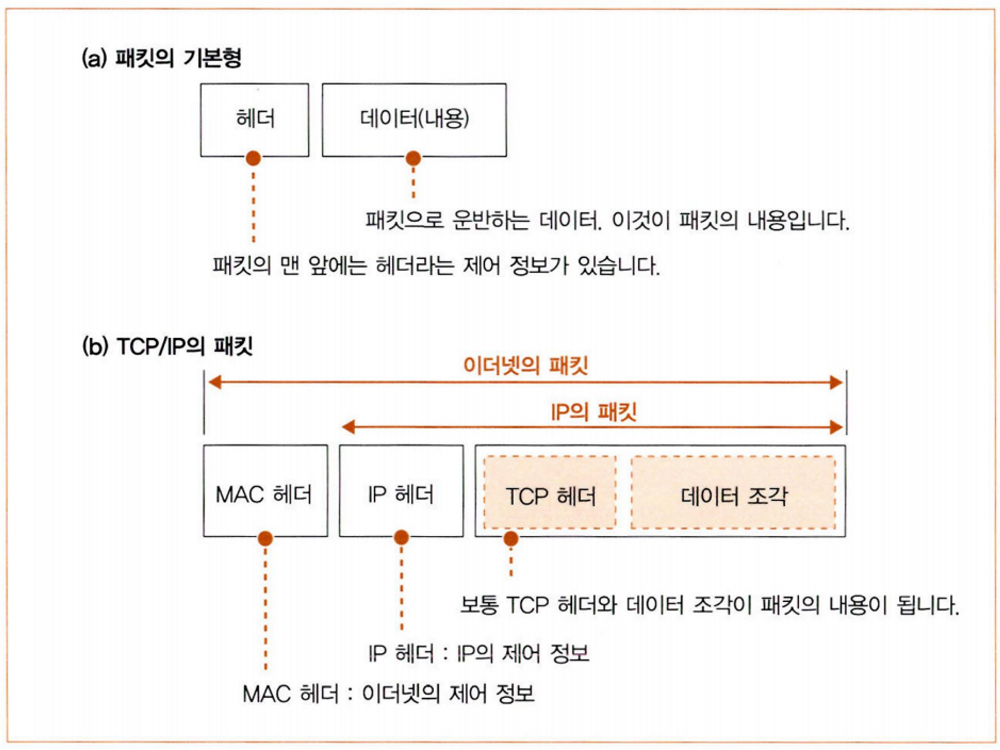
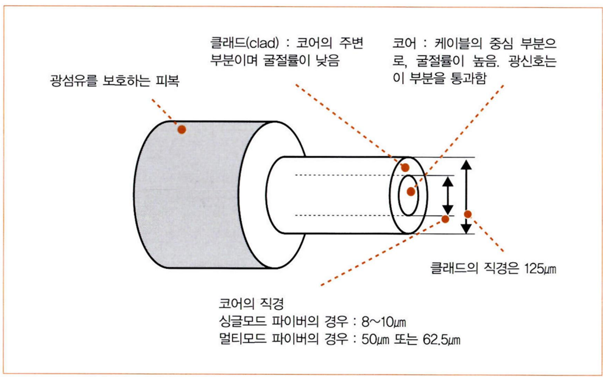
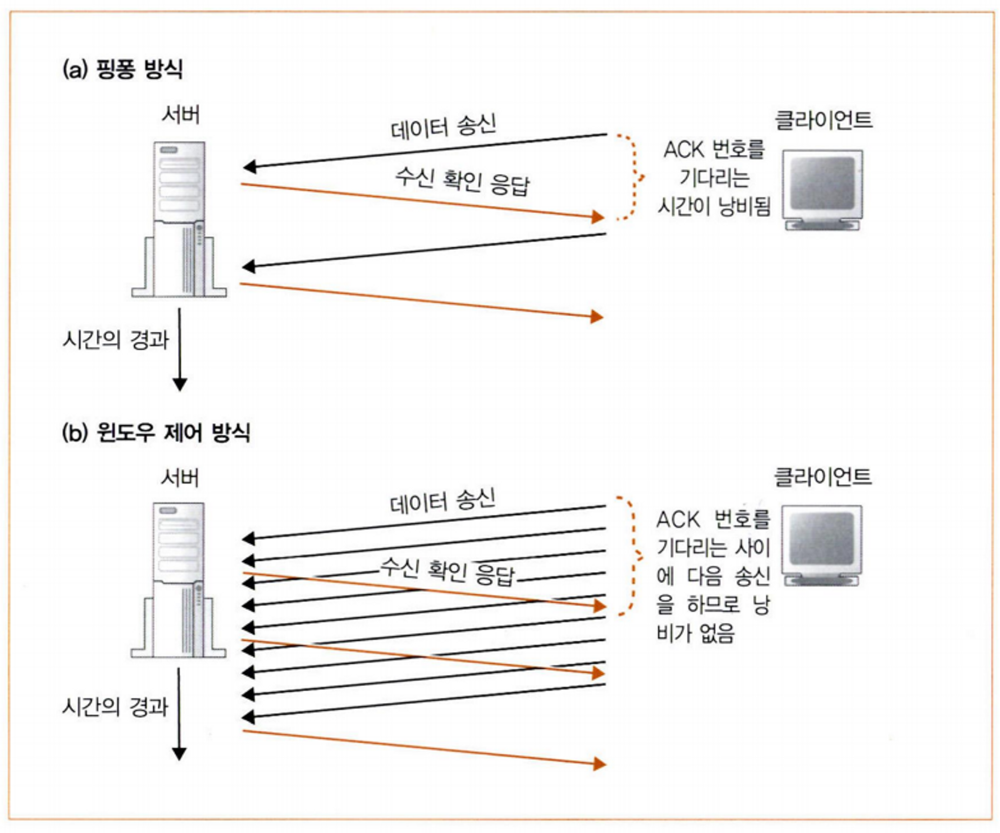
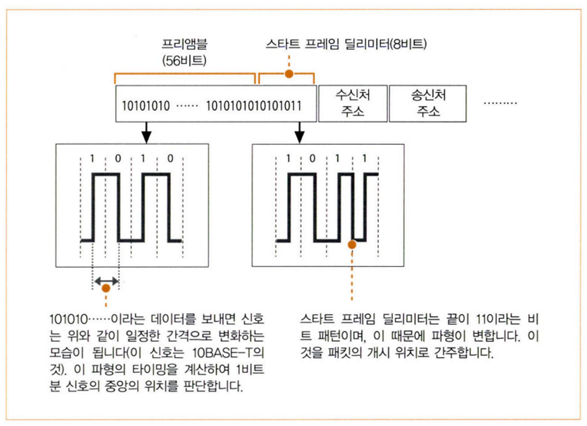
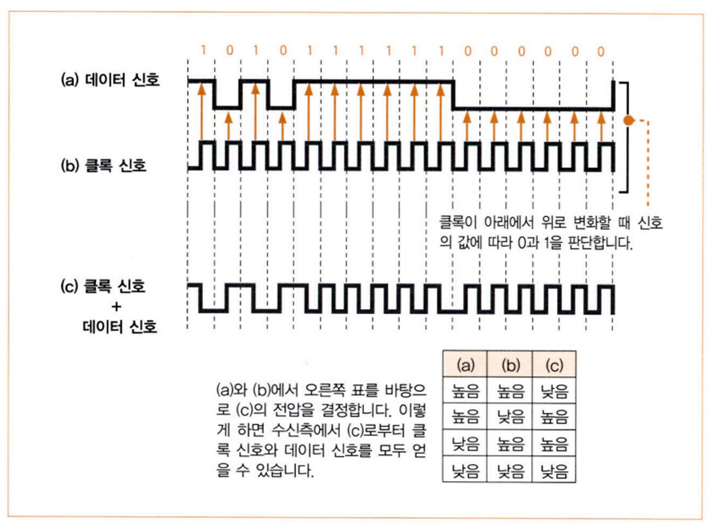

# 05. IP와 이더넷의 패킷 송•수신 동작

## 1. 패킷의 기본

생성된 패킷은 가까운 중계 장치로 가게 된다. 중계 장치는 수신처의 위치를 알 수 있는 표가 있기 때문에 이 표와 패킷의 헤더 안에 있는 수신처를 비교한다. 이를 통해 패킷은 다음 중계 장치로 가게 된다.

자세한 순서는 다음과 같다.

1. 수신처가 있는 방향의 라우터에 할당된 MAC 주소를 조사하여, 패킷의 MAC 헤더에 기록한다.
2. 이더넷에 이 라우터에 도착하도록 의뢰한다.
3. 패킷은 먼저 허브에 도착을 한다. 그 후에 허브가 가진 이더넷용 표와 패킷의 수신처 정보를 비교하여 목적지를 판단한다.
4. 패킷이 라우터에 도착하면, 라우터가 가진 IP용 표와 패킷의 IP 헤더의 수신처를 비교하여 다음 라우터를 결정한다. 그리고 결정한 라우터의 MAC 주소를 조사하여 패킷의 MAC 헤더를 바꾼다.
5. 3번과 4번의 동작을 반복하여 목적지에 패킷이 도착하면 전달 동작이 끝난다.

## 2. 패킷 송•수신 동작의 개요

1. TCP 담당 부분은 데이터 조각 앞에 TCP 헤더를 추가하고 IP 담당 부분에게 건네준다. IP 담당 부분은 TCP 헤더 앞에 IP 헤더와 MAC 헤더를 붙인다.
2. 네트워크용 하드웨어(이더넷이나 무선 LAN 등)에게 패킷을 건네준다. 이때의 패킷은 0과 1의 비트로 이루어진 디지털 데이터인데, LAN 어댑터를 통해 전기나 빛의 신호로 바뀐다.
3. 패킷이 상대에게 도착하면 응답이 돌아온다.
4. 전기나 빛의 신호로 된 패킷을 LAN 어댑터를 통해 디지털 데이터로 되돌린다.
5. IP 담당 부분에게 패킷을 전달하면, IP 담당 부분은 TCP 헤더와 데이터 조각을 TCP 담당 부분에게 준다.

## 3. 수신처 IP 주소를 기록한 IP 헤더

상대의 IP 주소는 애플리케이션 → TCP 담당 부분 → IP 담당 부분으로 IP 담당 부분에 전해져서 수신처 IP 주소에 기록된다.

송신처 IP 주소는 LAN 어댑터에 할당된 IP 주소가 기록된다. 그러나 여러 개의 LAN 어댑터가 있다면 각 LAN 어댑터에는 서로 다른 IP 주소가 할당되어 있기 때문에 어느 것을 사용할지 정해야 한다.

## 4. 이더넷용 MAC 헤더

IP 당당 부분은 IP 헤더 앞에 MAC 헤더를 붙인다. MAC 헤더에는 수신처 MAC 주소, 송신처 MAC 주소, 이더 타입(Ether Type)이 기록된다.

송신처 MAC 주소는 자체의 LAN 어댑터의 MAC 주소이다.

수신처 MAC 주소는 다음으로 가는 라우터의 MAC 주소인데, 이 주소는 ARP로 조사한다.

이더 타입은 사용하는 프로토콜의 종류를 나타낸다.

## 5. ARP로 수신처 라우터의 MAC 주소 조사

ARP는 Address Resolution Protocol로 수신처 라우터의 MAC 주소를 조사할 때 사용한다.

연결되어 있는 모두에게 패킷을 전달하는 브로드캐스트를 이용하여 상대 IP 주소를 가지고 있는지 물어본다. 그러면 가지고 있는 라우터가 자체의 MAC 주소를 보내온다.

ARP 패킷이 너무 많아지는 것을 방지하기 위해 조사한 MAC 주소를 ARP 캐시(메모리 영역)에 몇 분정도 보존한다. 그래서 ARP를 조회하기 전에 ARP 캐시를 먼저 조사하여 MAC 주소가 저장되어 있는지 확인한다.

이렇게 알게된 MAC 주소를 MAC 헤더에 기록하고, MAC 헤더를 IP 헤더의 앞에 붙여 패킷을 완성시킨다.

## 6. 이더넷의 기본

이더넷의 원형은 그림의 (a)와 같다. 트랜시버는 신호를 흘려 케이블과 같은 역할을 한다. 신호를 송신하면 연결된 모두에게 신호가 전달한다. 신호를 받은 기기에서 헤더부분의 수신처 주소를 보고 자신의 주소가 아니면 패킷을 폐기한다.

이더넷의 원형이 (a)에서 (b)의 모습으로 변했다. 트렁크 케이블이 리피터 허브로 바뀌고, 트랜시버 케이블이 트위스트 페어 케이블로 바뀌었다. 그러나 신호를 모두에게 전달한다는 성질은 바뀌지 않았다.

(b)에서 (c)로 바뀌면서 스위칭 허브로 바뀌었다. 스위칭 허브는 연결된 무두에게 신호를 보내지 않는다.  스위칭 허브에서 수신처의 MAC 주소를 확인해 패킷을 목적지에만 전달한다.

## 7. IP 패킷을 전기나 빛의 신호로 변환하여 송신

IP 담당 부분이 디지털 데이터 형태의 패킷을 LAN 어댑터에 전달하면 LAN 어댑터에서 전기나 빛의 신호로 변환한다.

LAN 어댑터를 제어하려면 LAN 드라이버 소프트웨어가 필요하다. OS를 시동할 때 LAN 드라이버는 하드웨어 이상 검사, 초기 설정 등의 초기화 작업과 MAC 회로에 MAC 주소 설정을해야한다. MAC 주소는 LAN 어댑터의 ROM에 기록되어 있다.

## 8. 패킷에 3개의 제어용 데이터 추가

LAN 어댑터는 IP 담당 부분에서 받은 패킷을 LAN 어댑터의 버퍼 메모리에 복사하고, MAC 회로에 패킷 송신을 명령한다.

MAC 회로는 버퍼 메모리에서 패킷을 가져와 패킷의 맨 앞에 **프리앰블**과 **스타트 프레임 딜리미터** 두 개의 데이터를 추가한다. 그리고 패킷의 맨 뒤에 **프레임 체크 시퀀스(FCS)**를 추가한다.

프리앰블은 송신하는 패킷을 읽을 때 타이밍을 잡기 위한 것으로, 비트 1과 0이 번갈아 나열되어 있다.  프리앰블에 이어지는 스타트 프레임 딜리미터는 비트 패턴이 다르다.

디지털 데이터를 전기 신호로 나타낼 때는 전류의 값에 대응시킨다.

신호에서 데이터를 읽을 때는 반대로 대응시키면 되는데, 이때 비트의 구분을 판단하면서 읽어야 한다.

클록 신호가 아래에서 위로 변화할 때 0과 1로 대응시키면 된다. 그러나 케이블이 길어지면 데이터 신호와 클록 신호가 전달되는 시간이 달라져서 클록이 달라진다. 이 문제를 클록 신호와 데이터 신호를 합성해 한 개의 신호로 만들면 해결할 수 있다.

클록 신호의 타이밍을 잡기 위해 패킷 앞에 추가한 것이 프리앰블이다. 수신측에서는 프리앰블 다음에 나오는 스타트 프레임 딜리미터의 신호 다음 비트부터 디지털 데이터로 변환한다.

끝에 추가된 프레임 체크 시퀀스(FCS)는 파형이 흐트러져 데이터가 변했는지 알 수 있게 해준다. 패킷의 맨 앞부분에서 맨 끝까지의 내용을 계산식으로 계산하여 나타낸 것인데, 1비트라도 변화하면 계산 결과가 달라진다. 그래서 수신측에서 계산한 FCS가 송신할 때 계산한 것과 다른 값이 나온다면 데이터가 변화했다는 것이다.

## 9. 허브를 향해 패킷 송신

송신 동작을 할 때 리피터 허브를 사용하는 반이중 모드와 스위칭 허브를 사용하는 전이중 모드 두 가지가 있다. 반이중 모드는 송신과 수신 동작 중 한쪽만 가능하고, 전이중 모드는 송신과 수신 동작을 동시에 할 수 있다.

반이중 모드 송신 동작

1. 케이블에 송신하고 있는 신호가 흐르고 있는지 조사하고, 흐르고 있다면 끝날 때까지 기다린다.
2. 송신할 때는 MAC 회로가 프리앰블의 맨 앞부터 1비트씩 전기 신호로 변환한다.
3. 변환한 전기 신호를 PHY 또는 MAU(송•수신 신호 부분)에 보낸다.
4. PHY(MAU) 회로는 전기 신호를 케이블에 송출하는 형식으로 변환한다.
5. 수신 신호선에 신호가 흐르지 않는 것을 확인 후 송신한다.
    1. 동시에 다른 기기가 송신을 하였다면 신호가 흘러들어온다.
    2. 서로의 신호가 섞여서 충돌 현상이 발생한다.
    3. 충돌이 일어난 사실을 알리기 위해 재밍 신호를 흘리고 송신 동작을 멈춘 후 다시 시도한다. (MAC 주소를 바탕으로 난수를 생성해 대기 시간을 계산한다.)
    4. 다시 충돌하면 대기 시간을 2배로 늘려서 보낸다.
    5. 열 번째까지 해결되지 않으면 오류로 판단한다.

## 10. 돌아온 패킷 수신

1. PHY(MAU) 회로는 신호를 공통 형식으로 변환하여 MAC 회로로 보낸다.
2. MAC 회로에서 신호를 앞부분부터 디지털 데이터로 변환하여 버퍼 메모리에 저장한다.
3. 신호의 맨 앞부터 계산식에 적용해 FCS의 값을 계산하고, 패킷의 끝에 있는 FCS의 값과 비교한다.
    1. 일치하지 않으면 오류 패킷으로 간주하여 폐기한다.
4. MAC 헤더의 수신처 MAC 주소를 조사한다.
    1. 자체의 MAC 주소가 아니라면 폐기한다.
5. 패킷을 버퍼 메모리에 저장한다.
6. 패킷을 수신한 사실을 컴퓨터 본체에 알린다.

컴퓨터 본체는 다른 작업을 실행하고 있기 때문에 패킷이 도착한지 모른다. 이때 컴퓨터 본체를 LAN 어댑터 쪽에 주의시키는 것이 **인터럽트**이다.

- 인터럽트 동작
1. LAN 어댑터가 인터럽트용 신호선에 신호를 보낸다.
2. 신호선과 연결되어 있던 CPU는 실행하던 작업을 보류하고 OS 내부의 인터럽트 처리용 프로그램쪽으로 전환한다.
3. LAN 드라이버가 호출되어 LAN 어댑터를 제어하면서 송•수신 동작을 실행한다.

## 11. 서버의 응답 패킷을 IP에서 TCP로 전달

1. LAN 드라이버는 TCP/IP의 프로토콜 스택에 패킷을 건넨다.
2. IP 담당 부분은 수신처 IP 주소를 조사한다.
3. 클라이언트 PC의 경우는 자신에게 올 패킷만 도착하기 때문에 자신의 주소와 다르다면 오류가 있는 것이다.
    1.  오류가 발생하면 IP 담당 부분은 ICMP 메시지를 사용해 상대에게 오류를 통지한다.
4. 패킷의 IP 헤더에 있는 플래그 항목을 통해 분할된 패킷인지 확인한 후 분할된 것이라면 IP 담당 부분 내부의 메모리에 잠깐 보관한다.
5. 패킷의 IP 헤더에 있는 ID 정보에 같은 값을 가진 패킷이 모두 도착하면, 프래그먼트 오프센 항목을 통해 원래 패킷의 위치를 보고 원래 모습으로 되돌린다. 이렇게 패킷을 원래 모습으로 되돌리는 동작을 리어셈블링이라고 한다.

# 06. UDP 프로토콜을 이용한 송•수신 동작

## 1. 수정 송신이 필요없는 데이터의 송신은 UDP가 효율적

TCP는 데이터를 확실히 전달하기 위해 도착한 것을 확인하고, 도착하지 않았으면 다시 보내야한다.  또한, 어디까지 도착했고 어디부터 보내야 하는지 등을 생각해야한다.

그러나 UDP의 경우 패킷이 한 개밖에 없다면 데이터를 전부 다시 보내도 낭비가 아니기 때문에 괜찮다. 그리고 데이터를 보내면 회신이 돌아오므로 수신 확인 응답 패킷도 필요하지 않다. DNS 서버에 IP 주소를 조회할 때도 UDP 프로토콜을 사용한다.

## 2. 제어용 짧은 데이터

UDP는 TCP와 같은 수신 확인이나 윈도우가 없어서 데이터 송•수신 전에 제어 정보를 주고받을 필요가 없다. 그리고 접속이나 연결 끊기 단계가 없다.

애플리케이션에서 받은 송신 데이터 앞에 UDP 헤더를 추가하고 IP에 의뢰하여 송신한다.

수신할 때는 IP 헤더에 기록된 수신처 IP 주소, 송신처 IP 주소와 UDP 헤더에 기록된 수신처 포트 번호, 송신처 포트 번호 네 항목과 소켓에 기록된 정보를 결합해 상대에게 데이터를 건네준다.

오류가 발생해 패킷이 사라져도 신경쓰지 않는다. 응답이 돌아오지 않으면 애플리케이션이 데이터를 다시 보내기 때문이다.

## 3. 음성 및 동영상 데이터

음성과 영상 데이터를 보낼 때도 UDP를 사용한다. 음성과 영상은 데이터가 조금 없어도 치명적인 문제가 되지 않는다. 그리고 재생 타이밍이 맞지 않으면 중간에 끊긴 음이나 영상을 되돌릴 수 없기 때문에 데이터가 도착해도 쓸모가 없다.

이처럼 다시 보낼 필요가 없거나 다시 보내도 쓸모가 없으면 UDP로 데이터를 보내는 것이 더 효율적이다.