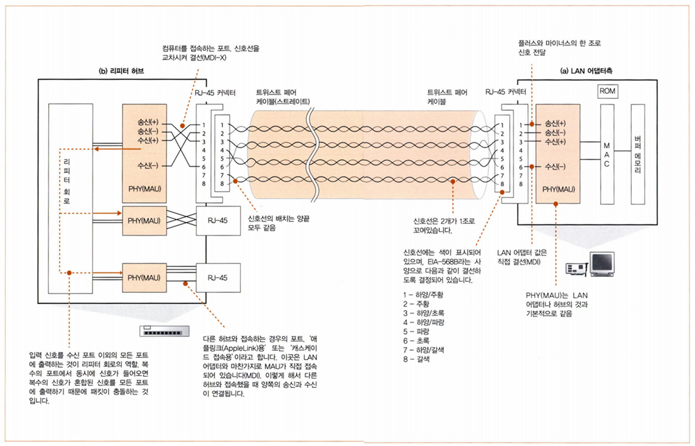
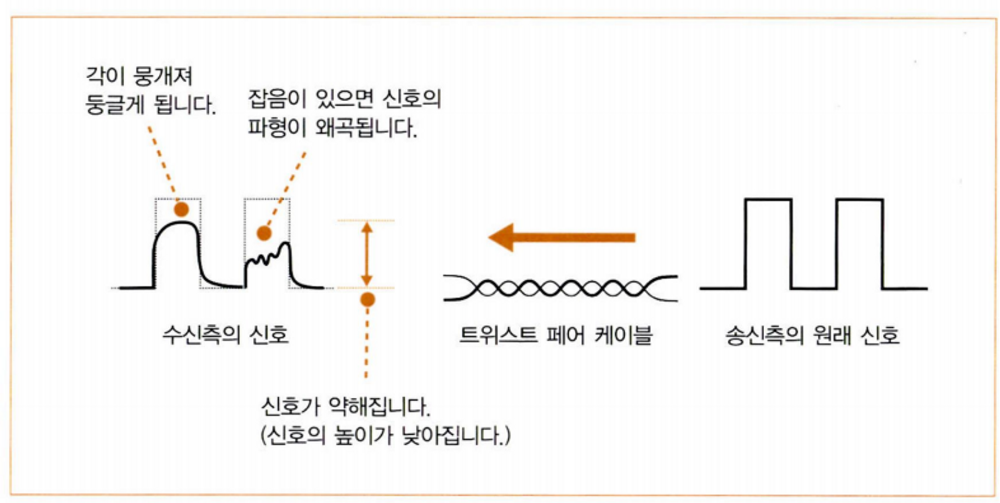
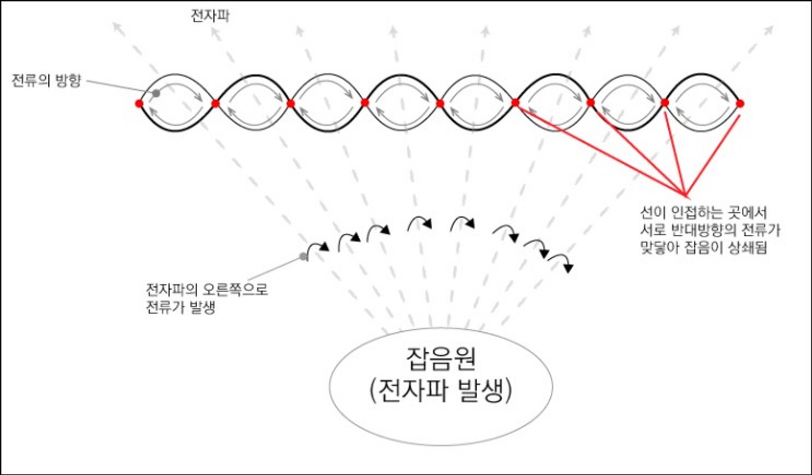
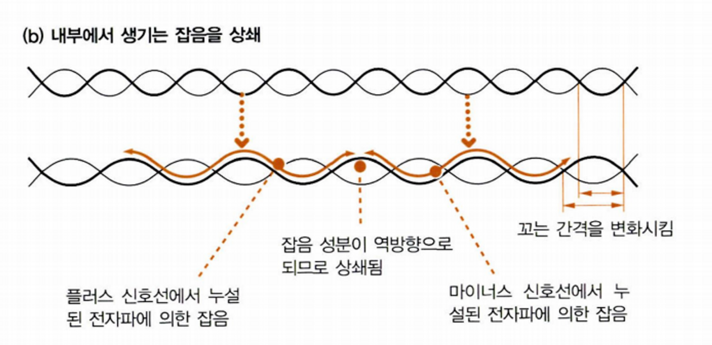
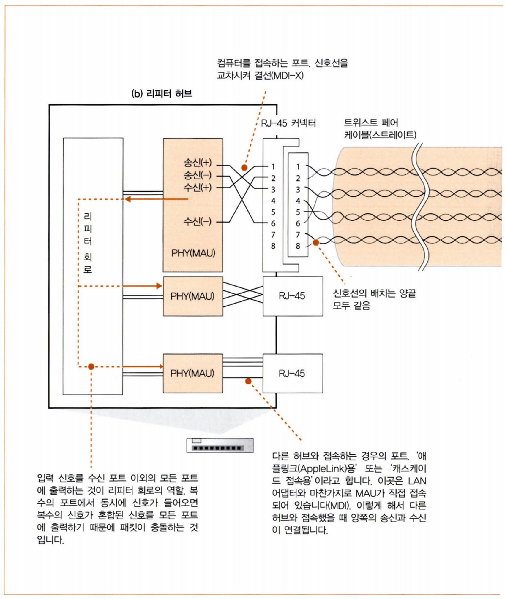
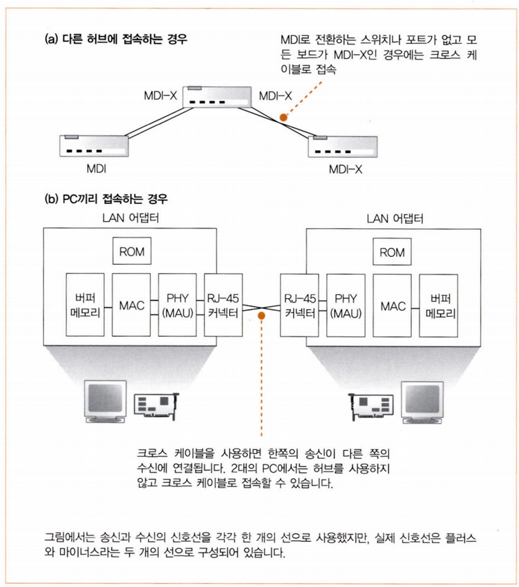
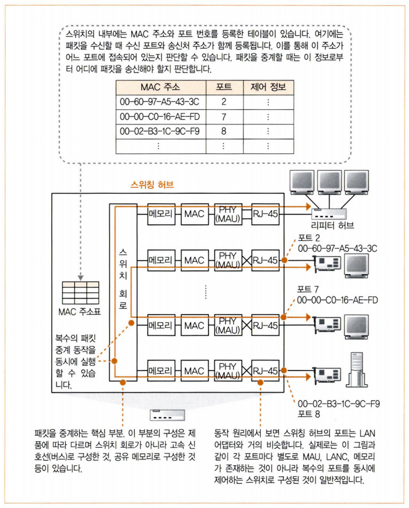
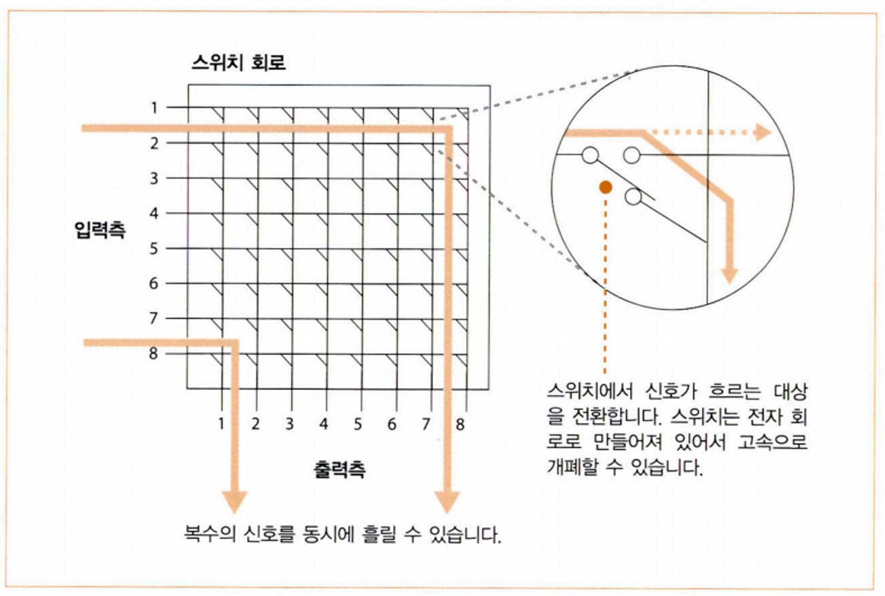
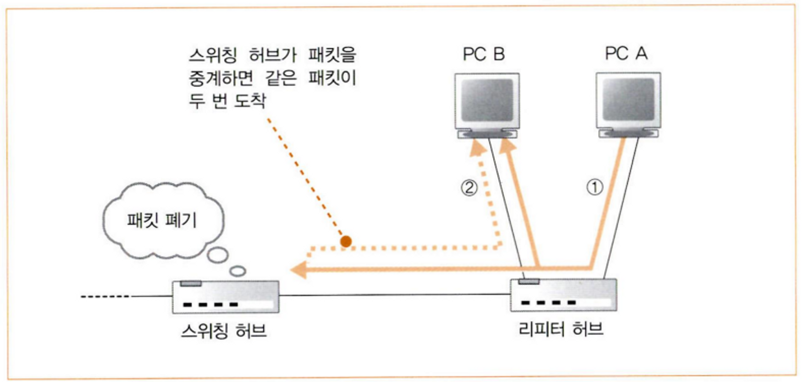
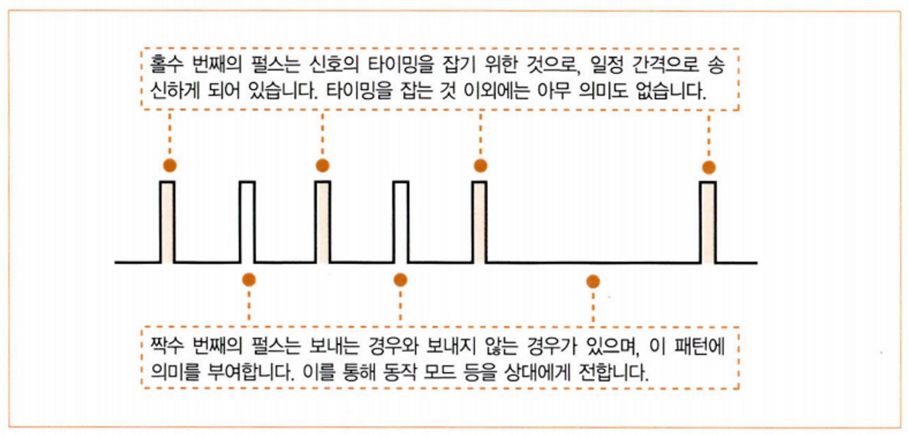

# 01. 케이블과 리피터, 허브 속을 신호가 흘러간다

## 1. 하나하나의 패킷이 독립된 것으로 동작

HTTP 메시지, TCP 프로토콜의 제어 정보(수신 확인, 시퀀스 번호 등), 클라이언트-서버 관계는 패킷 운반 동작(중계 동작)에 영향을 주지 않는다.

## 2. LAN 케이블은 신호를 약화시키지 않는 것이 핵심이다.

100메가비트/초 이상의 이더넷을 PHY(Physical Layer Device)라고 부른다. 이전의 저속 방식 중에는 MAU(Medium Attachment Unit)라고 부르는 것도 있다.

- 리피터 허브까지 가는 과정

0-1. 데이터에 헤더가 모두 추가된 후 완성된 패킷은 IP 담당 부분에서 LAN 어댑터로 송신된다.

0-2.  LAN 드라이버는 받은 패킷을 LAN 어댑터의 버퍼 메모리에 복사한다.

0-3. MAC 회로는 패킷 앞에 프리앰블과 스타트 프레임 딜리머터를 붙이고, 뒤에 프레임 체크 시퀀스를 붙인다.

0-4. MAC 회로가 디지털 데이터를 전기 신호(공통 형식의 신호)로 변환 후 PHY(MAU) 회로에 보낸다.

1. 전기 신호는 PHY 회로를 통해 RJ-45 커넥터의 1번과 2번 핀으로 나간 후 트위스트 페어 케이블(꼰 선쌍)로 흐른다.
2. 케이블 속의 전기 신호는 리피터 허브의 RJ-45 커넥터 부분에 전달된다.

- 오류 통신의 원인

케이블이 길수록 신호가 약해지고, 중간에 변형도 되어 처음과 달라진 형태의 신호가 허브에 도착한다.

이더넷은 사각형 형태의 신호를 사용하는데, 각진 부분은 전압이 급격히 변화하므로 주파수가 높다. 주파수가 높으면 전파의 방출량이 높기 때문에 에너지가 그만큼 손실되어서 신호가 약해진다.

중간에 잡음까지 생기면 신호가 더 변형된다. 이로 인해 0과 1이 잘못 판단된다.

## 3. ‘꼼’은 잡음을 방지하기 위한 방법

- 잡음

모터, 형광등과 같은 기기에서 전자파가 나오는데, 이 전자파가 케이블 주위에 있으면 케이블 안에 전자파에 의해 만들어진 전류가 흐르게 된다. 이 잡음과 신호가 섞여 신호의 파형이 변한다.

트위스트 페어 케이블(꼰 선쌍)은. 두 가닥의 신호선을 ‘꼼’으로써 잡음을 막을 수 있다.

전자파가 신호선에 닿으면 전자파 진행 방향의 오른쪽으로 전류(잡음)가 생긴다. 이때 신호선이 꼬여있어 나선형 모양이면, 옆에 나선형에서는 반대쪽으로 흐르는 전류(잡음)가 생겨 서로 상쇄되기 때문에 잡음의 전류가 약해진다.

또 하나의 잡음은 다른 신호선에서 오는 잡음으로, 이를 크로스토크(crosstalk)라고 한다.

트위스트 페어 케이블은 플러스 신호선과 마이너스 신호선을 한 쌍으로 꼬는데, 이때 꼬는 간격을 조금씩 다르게 한다. 그러면 어떤 잡음은 플러스 신호선에서 생겨나고, 또 다른 잡음은 마이너스 신호선에서 생겨나게 된다.  플러스와 마이너스에서는 잡음의 영향이 반대가 되기 때문에 잡음의 영향이 줄어든다.

## 4. 리피터 허브는 연결되어 있는 전체 케이블에 신호 송신

리피터 허브에서 신호를 받으려면 PHY(MAU) 회로의 수신 단자로 받아야 하기 때문에 PHY(MAU) 회로와 RJ-45 커넥터 사이의 신호선은 교차로 되어있다.  교차로 결선된 것은 MDI-X(Media Dependent Interface-Crossover)라고 하고, 직접 결선된 것은 MDI라고 한다.

허브의 커넥터는 보통 MDI-X로 되어 있으므로 허브끼리 접속할 때 다른 쪽 허브는 MDI로 설정해야 한다.

MDI로 전환하는 스위치나 포트가 없는 경우 또는 PC끼리 접속하는 경우는 크로스 케이블을 사용한다. 크로스 케이블은 송신이 수신 쪽으로 들어가도록 신호선을 접속한 케이블이다.

- 리피터 허브 도착 이후 과정
1. 신호가 RJ-45 커넥터를 통해 리피터 허브의 PHY(MAU) 회로 수신부로 들어간다.
2.  PHY(MAU) 회로에서 리피터 회로로 들어간다.
3. 리피터 회로는 들어온 신호 그대로 연결된 케이블 전체에 송신한다.
4. 신호를 수신한 기기는 수신처 MAC 주소가 자신이 아니면 무시한다.

# 02. 스위칭 허브의 패킷 중계 동작

## 1. 스위칭 허브는 주소 테이블로 중계

RJ-45 커넥터에서 PHY(MAU) 회로까지 신호가 전달되는 부분은 리피터 허브와 같다.

- 이후 스위칭 허브 과정
1. PHY(MAU) 회로에서 공통 신호로 바꾸고 MAC 회로로 전달한다.
2. MAC 회로에서 디지털 데이터로 변환한다.
3. 패킷 뒤에 있는 FCS와 대조해 오류가 없다면 버퍼 메모리에 저장한다.
4. 수신처 MAC 주소와 MAC 주소표를 비교한다. (MAC 주소와 포트가 짝지어져 있다.)
5. 스위치 회로를 통해 수신처 MAC 주소와 짝지어진 포트로 전달한다.

6. MAC 회로와 PHY(MAU) 회로를 통해 케이블로 신호를 보낸다.

커넥터와 안쪽에 있는 회로를 포트라고 부른다. 스위칭 허브의 포트는 수신처 MAC 주소와 자신의 MAC 주소를 비교하지 않고 모든 패킷을 버퍼 메모리에 저장한다. 그렇기 때문에 스위칭 허브의 포트에서 MAC 회로는 MAC 주소가 필요 없다. (할당되어 있지 않음)

## 2. MAC 주소 테이블 등록 및 갱신

스위칭 허브는 패킷을 수신했을 때 송신처의 MAC 주소와 수신처의 입력 포트 번호를 MAC 주소표에 등록한다. 그리고 일정 시간이 경과하면 삭제한다.

## 3. 예외적인 동작

- 송신처 포트와 수신처 포트가 같을 경우

스위칭 허브에 리피터 허브가 접속해 있을 때

1. PC A에서 리피터 허브를 통해 PC B에게 패킷을 보내려 하면
2. 리피터 허브가 연결된 모든 포트에 패킷을 보낸다.

(만약 이때 스위칭 허브가 패킷의 수신처를 보고 리피터 허브를 통해 PC B에게 보내려하면, PC B는 같은 패킷이 두 번 도착하게 된다.)

1. 스위칭 허브는 송신처 포트와 수신처 포트가 같기 때문에 패킷을 폐기한다.

- MAC 주소표에 수신처 MAC 주소가 없을 경우
1. 수신한 포트 이외의 전체 포트에 패킷을 송신한다.
2. 수신처의 MAC 주소가 아닌 기기는 무시하고, 맞는 기기에게 응답이 돌아온다.
3. 응답을 수신하고 MAC 주소표에 등록한다.

## 4. 전이중 모드에서 송신과 수신을 동시 실행

리피터 허브의 경우 동시에 송신 동작을 하면 충돌이 일어나지만(반이중 모드), 스위칭 허브는 송신과 수신을 동시에 할 수 있다. (전이중 모드)

- 트위스트 페어 케이블은 송신용과 수신용이 나뉘어져 있어서 신호가 충돌하지 않는다.
- 전이중 모드는 반이중 모드보다 빠르고, 송신할 수 있는 데이터 양이 더 많아 성능이 좋다.

## 5. 최적의 전송 속도로 보내는 자동 조정

자동 조정 기능은 접속한 상대가 할 수 있는 동작 모드와 전송 속도를 검출하여 그에 맞게 자동으로 전환하는 기능이다.

이더넷은 데이터가 흐르지 않을 때 링크 펄스라는 펄스형 신호를 흘림으로써 케이블에 이상이 없는지 알 수 있게 해준다.

자동 조정 기능은 펄스형 신호를 이용한다. 펄스형 신호의 패턴을 읽고 자신과 상대가 지원하는 것 중에 우선 순위가 가장 높은 모드로 동작한다.

## 6. 스위칭 허브는 복수의 중계 동작을 동시에 실행

스위칭 허브는 수신처 MAC 주소의 기기가 존재하는 포트를 제외하면 다른 포트들은 비어 있기 때문에 별도의 패킷을 중계할 수 있다.

---

출처

성공과 실패를 결정하는 1%의 네트워크 원리

트위스트 페어 케이블
https://m.blog.naver.com/PostView.naver?isHttpsRedirect=true&blogId=kwshop89&logNo=220019277267