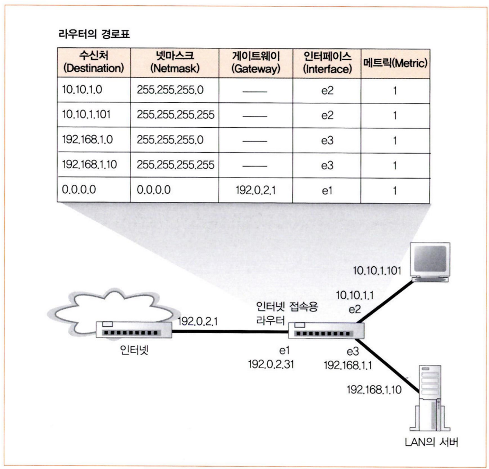
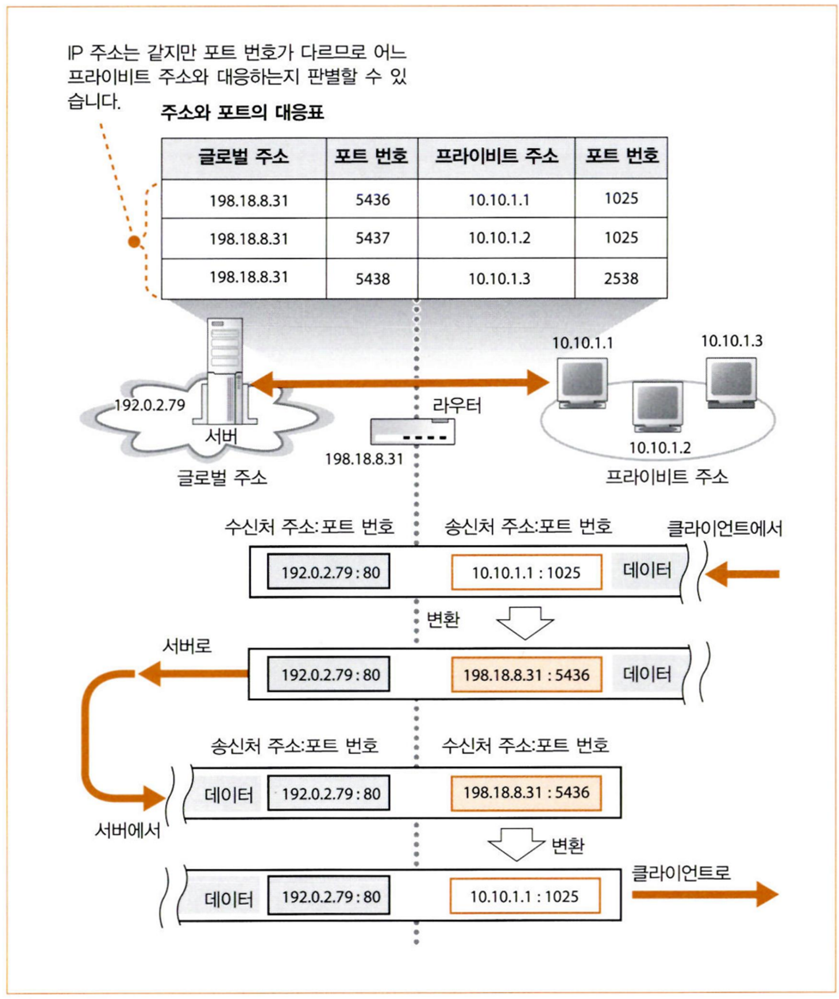

# 6주차

# 03. 라우터의 패킷 중계 동작

## 1. 라우터의 기본

- 라우터의 구조는 패킷 중계 부분과 포트 부분으로 나뉜다.
- 라우터의 각 포트에는 MAC 주소와 IP 주소가 할당되어 있어서 송신처나 수신처가 될 수 있다.
- 동작 순서
    1. (포트 부분) 포트 부분의 하드웨어(이더넷, 통신 회선, 무선 LAN 등)에 의뢰하여 패킷 수신한다.
    2. (중계 부분) 패킷의 IP 헤더에 기록되어 있는 수신처 IP 주소를 중계 대상이 등록되어 있는 표에서 찾는다.
    3. 중계 대상으로 갈 수 있는 포트로 패킷을 옮긴다.
    4. (포트 부분) 포트 부분의 하드웨어 규칙에 따라 패킷을 송신한다. (송신 동작을 포트 부분에 의뢰)

## 2. 경로표에 등록된 정보

스위칭 허브는 MAC 주소로 중계 대상을 판단하지만, 라우터는 IP 주소로 중계 대상을 판단한다.  그래서 라우터는 스위칭 허브와는 다른 표인 라우팅 테이블(경로표)이 있다.

- 수신처
    - 서브넷 자체 IP 주소 (= 호스트 비트는 모두 0)가 들어있다.
    - 주소 집약으로 여러 개의 서브넷을 한 개의 서브넷으로 묶을 수 있다.
        - 3개의 서브넷 10.10.1.0/24, 10.10.2.0/24, 10.10.3.0/24 가 있을 때, 3개 모두 하나의 라우터에서 중계된다면 10.10.0.0/16 을 경로표에 등록한다.
- 넷마스크
    - 네트워크 번호의 비트 수를 나타낸다.
- 게이트웨이
    - 중계 대상(라우터)의 IP 주소이다.
- 인터페이스
    - 인터페이스는 포트와 같은 말이다.
    - 패킷을 중계하는 부분이다.
- 메트릭
    - 다음 라우터의 IP 주소가 멀수록 큰 수를 적는다.

라우터의 경로표 정보는 사람이 수동으로 등록/갱신하거나 라우팅 프로토콜로 라우터들끼리 정보를 교환하여 등록/갱신한다.

## 3. 라우터의 패킷 수신 동작

1. 커넥터에 신호가 도착한다.
2. PHY(MAU) 회로와 MAC 회로에서 디지털 데이터로 변환한다.
3. FCS를 대조하여 오류의 유무를 점검한다.
4. MAC 주소가 자신의 주소가 맞다면 수신 버퍼 메모리에 패킷을 저장한다.
    1. 자신에게 온 패킷이 아니라면 폐기한다.

## 4. 경로표를 검색하여 출력 포트 발견

1. 라우터는 패킷을 받고 MAC 헤더를 폐기한다.
2. IP 헤더를 보고 패킷 중계 동작을 한다.
3. 경로표의 수신처 항목과 일치하는 것을 찾는다.
    1. 여러 항목이 같으면 네트워크 번호의 비트 수가 가장 긴 것을 찾는다.
    2. 네트워크 번호의 비트 수도 같다면 메트릭이 작은 값(가까운 곳)을 선택한다.
    3. 일치하는 행이 없다면 패킷을 폐기하고, ICMP(Internet Control Message Protocol) 메시지로 송신처에게 알린다.

## 5. 해당하는 경로가 없는 경우 선택하는 기본 경로

넷마스크 항목을 0.0.0.0 으로 하면 모든 주소와 일치한다. 그래서 게이트웨이 항목에 이 라우터를 등록하면 해당하는 행이 없을 때 0.0.0.0 인 라우터로 중계된다.

0.0.0.0인 행을 기본 경로라고 하고, 0.0.0.0인 라우터를 기본 게이트웨이라고 한다.

## 6. 패킷 유효 기간

다음 중계 대상을 찾은 라우터는 패킷의 IP 헤더에 있는 TTL을 갱신한다.

- TTL (Time To Live)
    - 패킷의 생존 기간으로, 64 또는 128을 설정한다.
    - 라우터에 도착할 때마다 TTL의 값이 1씩 줄어들고, 0이 되면 패킷이 폐기된다.
    - 패킷이 같은 장소를 계속 순환하지 못하도록 만든 것이다.
    - 라우터 수는 많아도 수십 개이기 때문에 정상적으로 가면 수명이 다하기 전에 도착한다.

## 7. 큰 패킷은 조각 나누기 기능으로 분할

패킷의 크기가 출력측의 패킷 최대 길이보다 크면 IP 프로토콜에 규정된 조각 나누기 방법을 사용한다.

- 조각 나누기 과정
1. 출력측의 MTU(운반할 수 있는 데이터의 최대 길이)를 조사한다.
    1. 패킷보다 크면 그대로 송신한다.
2. 패킷보다 작으면 패킷을 분할한다. (TCP 헤더도 데이터로 간주)
    1. IP 헤더의 플래그 필드가 분할 불가로 되어 있으면 ICMP 메시지를 송신처에 보낸다.
3. 복사한 IP 헤더를 분할한 패킷에 붙인다.

## 8. 컴퓨터와 같은 라우터의 송신 동작

1. 게이트웨이 항목에서 상대 IP 주소를 확인한다. 만약 게이트웨이가 비어있다면 IP 헤더의 수신처 IP 주소를 확인한다.
2. ARP로 IP 주소에서 MAC 주소를 조사한다.
    1. ARP 캐시를 확인한고, 캐시에 없으면 ARP로 조회를 보낸다.
3. 조사한 MAC 주소를 수신처 MAC 주소 필드에 적는다.
4. 송신처 MAC 주소 필드에는 출력측의 포트에 할당된 MAC 주소를 적는다.
5. 패킷을 전기 신호로 변환하여 포트에서 송신한다.

## 9. 라우터와 스위칭 허브의 관계

라우터가 패킷을 중계할 때 새로운 MAC 헤더에 패킷을 붙인다. (= 이더넷의 패킷 데이터 부분에 IP의 패킷을 넣는다.) IP는 스스로 패킷을 운반하는 수단이 없기 때문에 이더넷에 의뢰한다.

라우터는 IP, 스위칭 허브는 이더넷에 기초하여 만들어졌다. 그렇기 때문에 라우터는 새로운 MAC 헤더를 만들어 스위칭 허브에게 다음 라우터까지 패킷 운반을 의뢰한다.

통신 상태까지 패킷을 전달하는 전체 동작은 IP(라우터)가 담당하고, 다음 라우터까지 패킷을 운반하는 동작은 이더넷(스위칭 허브)가 담당한다.

# 04. 라우터의 부가 기능

## 1. 주소 변환으로 IP 주소를 효율적으로 이용

- 글로벌 주소 (global address)
    - 고유한 주소이다.

- 프라이비트 주소 (private address)
    - 사내용 주소이며, 다른 회사와 같아도 된다.
    - 주소 범위
        - 10.0.0.0~10.255.255.255
        - 172.16.0.0~172.31.255.255
        - 192.168.0.0~192.168.255.255
    - 인터넷에 접속할 때는 주소 변환을 하여 글로벌 주소를 할당한다.

## 2. 주소 변환의 기본 동작

1. 주소 변환 장치에서 미사용 포트 번호를 선택한다.
2. 선택한 포트에 할당된 주소를 사용해 프라이비트 주소를 글로벌 주소로 바꿔준다. 이때 포트 번호도 바꾼다.
3. 바꿔쓰기 전의 프라이비트 주소, 포트 번호와 바꿔쓴 후의 글로벌 주소, 포트 번호를 주소 변환 장치에 있는 대응표에 기록한다.
4. 패킷을 인터넷에 보내면 서버에 도착한다.
5. 서버는 회신을 보낸다. (이때 수신처는 바꿔쓴 글로벌 주소와 포트 번호이다.)
6. 패킷이 주소 변환 장치에 도착한다.
7. 대응표에서 수신처에 해당하는 프라이비트 주소와 포트 번호를 찾는다.
8. 패킷의 수신처를 프라이비트 주소와 포트 번호로 바꾼 후 사내 네트워크에 보낸다.
9. 연결 끊기 동작의 패킷이 흐르고 접속 동작이 끊기면 대응표에 등록한 것을 삭제한다.

## 3. 포트 번호를 바꿔쓰는 이유

초기에는 주소만 변환했었다. 그러나 주소만 변환하면 프라이비트 주소와 글로벌 주소가 1 대 1로 대응해서 수 많은 글로벌 주소가 필요하게 된다. 그래서 포트 번호를 변환하도록 바뀌었는데, 포트 번호는 16비트라서 수만 개의 값을 얻을 수 있다.

## 4. 인터넷에서 회사로 액세스

인터넷에서 사내로 패킷을 보낼 때는 대응표에 등록되어 있지 않아 보낼 수 없다. 즉, 인터넷에 액세스하고 있지 않은 기기에는 패킷을 보낼 수 없다. 이를 통해 악의적으로 들어오는 것을 막을 수 있다.

## 5. 라우터의 패킷 필터링 기능

- 패킷 필터링
    - 패킷의 MAC 헤더, IP 헤더, TCP 헤더의 내용이 사전에 설정한 조건에 맞으면 중계하고 아니면 폐기하는 동작이다.
    - 방화벽이나 소프트웨어는 패킷 필터링을 이용해 악의적인 침입을 막는다.

---

**출처**

성공과 실패를 결정하는 1%의 네트워크 원리