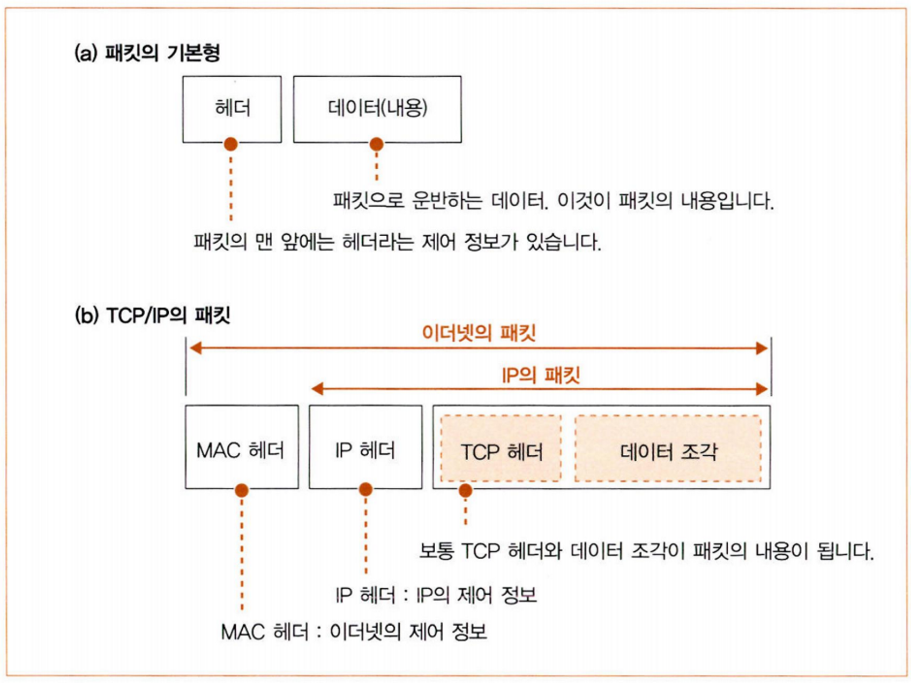
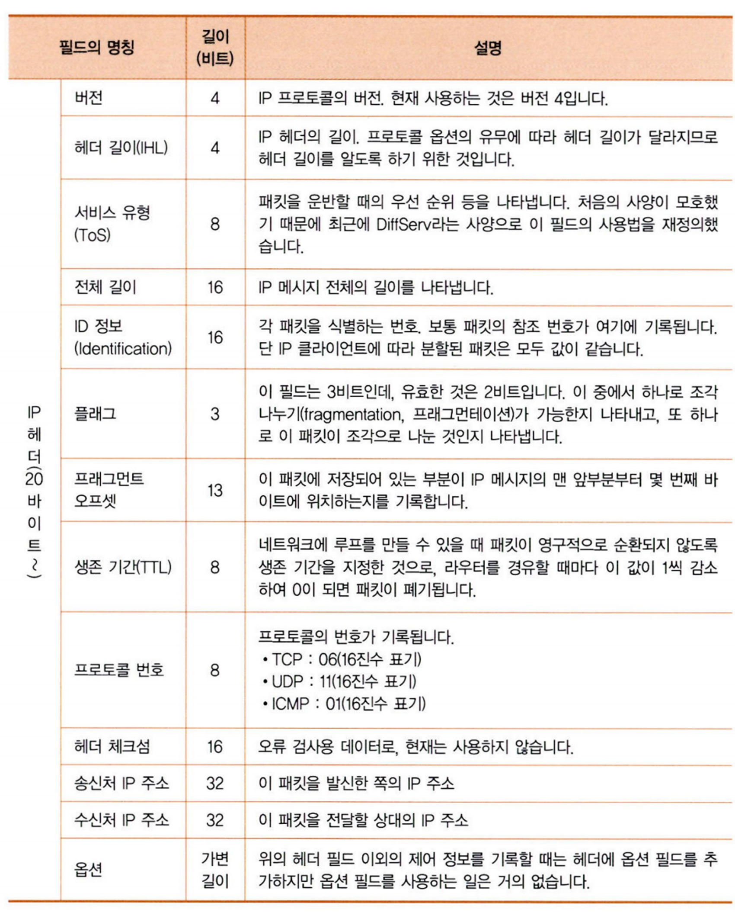
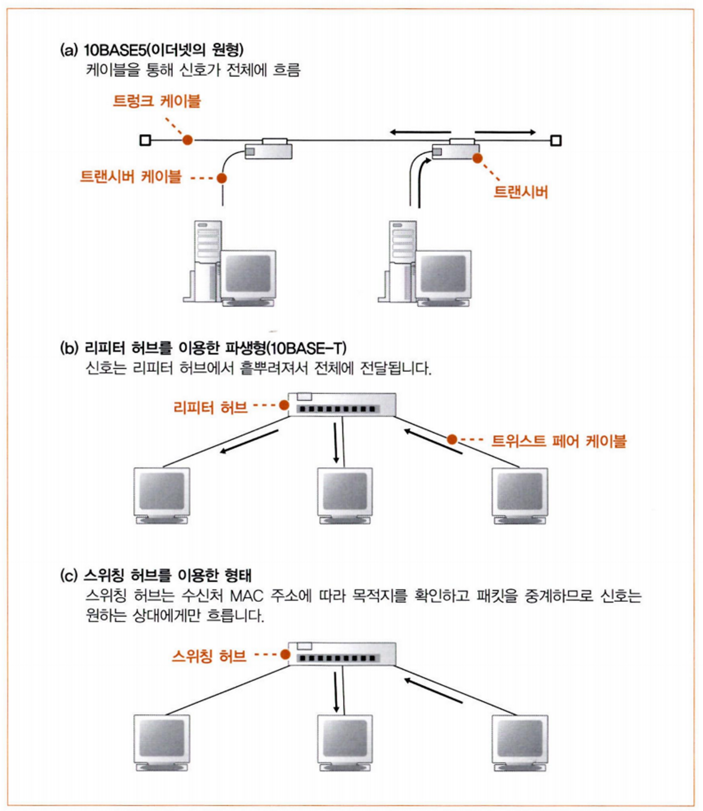

# 7주차

# 01. ADSL 기술을 이용한 액세스 회선의 구조와 동작

## 1. 인터넷의 기본 가정이나 회사의 LAN과 같음

인터넷은 회사의 네트워크 규모가 커진 것과 비슷한데, 경로표에 경로 정보 등록 방법에는 차이가 있다.

## 2. 사용자와 인터넷을 연결하는 액세스 회선

액세스 회선은 인터넷과 회사(또는 가정)의 LAN을 연결하는 통신 회선이다.

ADSL, FTTH, CATV, 전화 회선, ISDN 등의 종류가 있다.

## 3. ADSL 모델에서 패킷을 셀로 분할

1. 클라이언트에서 만든 패킷이 인터넷 접속용 라우터에 도착
2. 패킷에 있는 IP로 중계 대상 판단
3. ADSL 모뎀이 이더넷으로 연결되어 있을 경우 MAC 헤더, PPPoC 헤더, PPP 헤더를 붙이고 이더넷에 규칙에 따라 신호로 변환 후 송신
4. ADSL 모뎀에 도착
5. ADSL 모뎀이 패킷을 분할 후 셀에 저장 (ATM 통신 기술 사용)

ATM(Asynchronous Transfer Mode)는 셀(작은 덩어리)을 이용해 데이터를 운반하는 통신 방식이다. 개발 투자나 설비 투자를 줄일 수 있기 때문에 셀로 분할한다.

## 4. ADSL은 변조 방식으로 셀 신호화

ADSL 모뎀은 셀에 저장한 디지털 데이터를 신호로 변환할 때, 완만한 파형을 합성한 신호에 0과 1의 비트를 대응 시키는 변조 기술을 사용한다. 변조 기술은 진폭 변조(ASK), 위상 변조(PSK)와 이 둘을 결합한 직교 진폭 변조(QAM) 방식을 사용한다.

진폭 변조는 신호의 진폭이 크면 1로 대응시키고, 작으면 0으로 대응시키는 방식이다.

위상 변조는 신호파가 0도에서 시작할 때 0을 대응시키고, 180도에서 시작할 때 1을 대응시키는 방식이다.

직교 진폭 변조는 진폭 변조와 위상 변조를 각각 1비트에 대응시켜 총 2비트분의 데이터를 표현하는 것처럼 두 신호를 결합한 방식이다.

## 5. ADSL은 파를 많이 사용해 고속화를 실현

주파수를 다르게 한 파들을 각각 직교 진폭 변조 방식으로 비트값을 대응시킨다. 이때 대응시킨 비트 수의 합이 크면 전체 전송가 속도가 빠르다.

ADSL은 업로드(사용자에서 인터넷으로 향하는 방향)은 26개의 파를 사용하고, 다운로드(인터넷에서 사용자로 향하는 방향)은 95개나 223개의 파를 사용한다. 따라서 다운로드가 더 빠르다.

## 6. 스플리터의 역할

ADSL 모뎀이 패킷을 전기 신호로 변환 후 스플리터에 보낸다.

스플리터는 전화 회선에서 신호가 흘러들어왔을 때 전화 신호와 ADSL 신호를 나누는 역할을 한다. 둘의 신호가 분리되지 않으면 ADSL 신호의 잡음 때문에 전화 음성을 듣기 어려워 진다.

스플리터는 일정한 주파수를 초과한 신호는 차단할 수 있기 때문에 주파수가 높은 신호인 ADSL 신호는 차단한다.

## 7. 전화국까지의 여정

스플리터 → 모듈형 커넥터 → IDF 또는 MDF → 밖에서 과대한 전류가 흘러들어 오지 않도록 보호하는 보안기 → 전봇대 전화 케이블 → 전봇대에 있는 금속 파이프 속 지하(궤선점) → 지하에 케이블들을 모아 놓은 동도 → 전화국 → 전화국의 MDF

## 8. 잡음의 영향

전화 케이블은 이더넷의 트위스트 페어 케이블보다 잡음의 영향을 받기 쉽다.

ADSL은 다수의 주파수로 나누어져 있기 때문에 잡음의 영향을 받은 신호는 사용할 수 없다. 이는 사용할 수 있는 신호의 수가 줄어든 것 이기 때문에 속도가 느려진다.

## 9. DSLAM을 통과하여 BAS에 도달

DSLAM(DSL Access Multiplexer)은 ADSL 모뎀을 하나의 케이스에 넣은 기기이다. 이더넷 대신 ATM 인터페이스를 가졌기 때문에 셀의 형태로 라우터와 주고 받는다.

1. 전화국에 도착한 신호가 배선반과 스플리터를 통과해 DSLAM에 도착
2. 전기 신호를 디지털 데이터의 셀로 복원 후 BAS에 전달
3. BAS(패킷 중계 장치)에 도착 후 ATM 인터페이스를 이용해 패킷으로 복원
4. MAC헤더, PPPoC 헤더를 버린 후 PPP 헤더 이후 부분 추출 (MAC헤더, PPPoC 헤더는 BAS에 오기 위한 헤더이기 때문)
5. 터널링용 헤더를 붙이고 터널링으로 중계
6. 터널링용 라우터에 도착 후 터널링용 헤더 분리
7. 인터넷 내부로 중계

# 2. 광섬유를 이용한 액세스 회선(FTTH)

## 1. 광섬유의 기본

광섬유의 코어 속에 광신호를 흘려 디지털 데이터를 전달한다. 광신호는 등이 밝으면 1, 어두우면 0을 나타낸다.

디지털 데이터에서 전기 신호로 변환할 때 1이면 높은 전압, 0이면 낮은 전압을 나타낸다. 전기 신호로 변환 후 광신호로 변환한다.

전기 신호를 광원(LED나 포트 다이오드 등)에 입력하여 전압이 높으면 밝아지고, 낮으면 어두워진다. 이 빛은 광섬유를 통해 수신측으로 같다.

수신측은 수광 소자를 이용해 빛이 밝으면 높은 전압의 전기 신호, 어두우면 낮은 전압의 전기 신호를 낸 후 디지털 데이터로 변환하여 수신한다.

## 2. 싱글모드와 멀티모드의 차이

광섬유의 코어 직경은 싱글모드와 멀티모드가 있다.

- 싱글 모드
    - 직경을 가늘게 만들어 각도가 가장 작은 빛만 들어가도록 만든 것이다.
    - 들어가는 빛의 양이 한 개이기 때문에 광원이나 수광 소자의 성능이 높아야 한다.
    - 신호의 변형이 적다.
- 멀티모드
    - 직경을 굵게 만들어 입사각이 큰 빛이어도 들어가도록 만든 것이다. 그래서 복수의 빛이 들어간다.
    - 들어가는 빛의 양이 많아 광원이나 수광 소자의 성능이 싱글모드보다 낮아도 된다.

## 3. 광섬유를 분기시켜서 비용을 절감

FTTH 액세스 회선은 광섬유를 이용해 인터넷 접속용 라우터와 BAS를 접속하는 것이다.

- FTTH 액세스 회선의 두 가지 형태
    - 광섬유를 분기 시키지 않는 유형
        1. 미디어 컨버터 장치에서 전기 신호를 광신호로 변환한다.
        2. 미디어 컨버터에 연결된 광섬유 속으로 들어가 집합형 미디어 컨버터에 들어간다. (실글모드의 광섬유 사용)
        3. 집합형 미디어 컨버터에서 전기 신호로 변환하면 BAS의 포트가 수신한다.
        4. 인터넷 내부로 패킷 중계한다.
        5. 인터넷에서 응답이 돌아오면 하향 광신호가 흐르는데, 이 신호가 인터넷으로 가는 상향 광신호와 섞여도 프리즘의 원리로 분리할 수 있다.
        - 하나의 광섬유를 이용해 복수의 광신호를 흘린다. → 파장 다중
    - 광섬유를 분기시키는 유형
        1. ONU에서 전기 신호를 광신호로 변환한다.
        2. OLT 장치로 흘러간다.
        3. BAS에서 사용자측으로 신호를 보낸다. 이때 패킷의 앞에 ONU를 식별하는 정보를 부가한다.
        4. ONU는 신호가 자신에게 오는지 확인하고 광신호를 수신하고, 이더넷의 신호로 변환한다.

## 03. 액세스 회선으로 이용하는 PPP와 터널링

### 1. 본인 확인과 설정 정보 통지

1. ADSL이나 FTTH 등의 액세스 회선에서 BAS로 패킷이 도착한다. 이때 액세스 회선은 사용자명과 패스워드를 입력한다.
2. 전화 회선이나 ISDN을 사용해 인터넷에 다이얼업 방식으로 접속하면 PPP로 동작한다.
3. 프로바이더의 액세스 포인트에 전화를 건다.
4. 전화가 연결되면 사용자명과 패스워드를 RADIUS 프로토콜을 사용해 RAS에서 인증 서버에 전송한다.
5. 인증이 되면 인증 서버에서 IP 주소 등의 설정 정보를 보내 사용자 측에 전송한다.
6. 사용자 PC는 이 정보로 설정하고, 패킷 송수신을 준비한다.

### 2. 이더넷에서 PPP 메시지를 주고 받는 PPPoE

액세스 회선은 BAS를 케이블로 공정적으로 접속하기 때문에 본인 확인을 할 필요가 없다. (PPP 구조 필요 X) 그러나 본인 확인 동작을 하면 사용자명에 따라 프로바이더를 전환할 수 있기 때문에 PPP의 구조를 사용한다.

PPP는 다이얼업 접속이기 때문에 액세스 회선에서 그대로 사용할 수 없다. 또한, PPP는 FCS나 신호에 대한 규정 등이 없기 때문에 이 규정들을 가진 HDLC 프로토콜을 이용한다.

ADSL이나 FTTH는 HDLC 대신 이더넷 패킷을 사용한다. 그러나 이더넷은 PPP와의 격차가 있기 때문에 새로운 사양인 PPPoE가 만들어졌다. PPPoE는 PPP메시지를 이더넷의 패킷에 넣어 주고받는다. 이렇게 해서 ADSL이나 FTTH도 다이얼업 회선과 같이 통신할 수 있게 된다.

### 3. 터널링 기능에 의해 프로바이더에 패킷 전달

터널링은 네트워크 안에 터널이 만들어져, 그 속을 패킷이 통과하는 것이다.

BAS와 프로바이더 라우터 사이의 ADSL/FTTH 접속 서비스 사업자의 네트워크 안에 터널을 만든다. 그 후 액세스 회선을 연결하여 길을 만든다.

### 4. 액세스 회선 전체의 동작

1. 인터넷 접속용 라우터는 PPPoE의 Discovery 구조에 따라 BAS를 찾는다.
    1. Discovery 구조는 브로드캐스트를 이용해 BAS의 MAC 주소를 찾는다.
2. 사용자명과 패스워드를 BAS에 보낸다.
    1. CHAP 방식(암호화 O), PAP 방식(암호화 X)이 있다.
3. 패스워드 확인 후 BAS는 사용자에게 TCP/IP 설정 정보를 통지한다.
4. 인터넷 접속용 라우터를 사용하면 인터넷 접속용 라우터가 정보를 받아 자체에 설정한다.
    1. 그러면 BAS측 포트에 글로벌 주소가 할당되고, 경로표에 기본 게이트웨이가 설정된다. → 인터넷에 중계할 수 있는 상태가 된다.
5. 클라이언트로부터 인터넷에 액세스하는 패킷이 온다.
6. 인터넷의 한 부분인 수신처는 경로표에 없을 것 이기 때문에 기본 게이트웨이에 패킷을 중계한다.
7. 경로표에서 중계 대상을 보고 PPPoE 규칙을 따르는 상태가 된다.
8. 패킷의 수신처 MAC 주소에 BAS의 MAC 주소를 넣고, 송신처 MAC 주소에 인터넷 접속용 라우터 BAS측 포트의 MAC 주소를 넣는다.
9. 패킷을 중계하면서 사전에 값이 결정된 헤더를 부가만 한다.
10. 패킷을 신호로 변환 후 포트에서 송신한다.
11. BAS에 도착한 패킷은 MAC 헤더, PPPoE 헤더를 제거하고, PPP 헤더 이후 부분을 추출해 터널링 원리로 패킷을 송신한다.
12. 터널을 빠져나오면 프로바이더의 라우터에 도착한다.

### 5. IP 어드레스를 할당하지 않는 언넘버드

패킷을 중계하면서 사전에 값이 결정된 헤더를 부가만 하므로 IP 주소가 필요하지 않다. 라우터의 포트끼리 하나의 케이블로 연결되어있기 때문에 어떤 게이트웨이 항목에 어떤 값이 들어와도 상관이 없다.

이렇게 1 대 1 형태로 접속되어 있다면 포트에 IP 주소를 할당하지 않아도 되는데, 이를 언넘버드(unnumbered)라고 한다.

### 6. 인터넷 접속용 라우터에서 프라이비트 주소를 글로벌 주소로 변환

BAS가 통지한 설정 정보를 인터넷 접속용 라우터가 받기 때문에 글로벌 주소는 라우터에 할당이 된다. 그래서 PC는 프라이비트 주소를 할당받고, PC가 보낸 패킷은 인터넷 접속용 라우터에서 주소 변환 후 인터넷에 중계된다.

### 7. PPPoE 이외의 방식

- PPPoA (Point-to-Point Protocol over ATM)
    - PPP 메시지를 이더넷 패킷에 저장하지 않고 메시지 그대로 셀에 저장한다.
    - MAC 헤더와 PPPoE 헤더를 붙이지 않는다. 그래서 이더넷에 전송할 수 없기 때문에 PC나 라우터를 ADSL 모뎀과 일체화해야 한다.

---

**출처**

성공과 실패를 결정하는 1%의 네트워크 원리