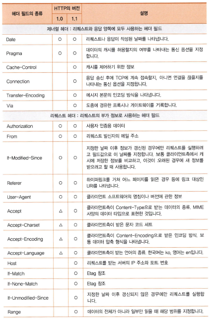

# HTTP 리퀘스트 메시지를 작성한다.

___

- 개요

  - 브라우저가 URL을 읽는 방법을 이해한다.

  - URL의 의미에 따라 리퀘스트 메시지를 만드는 과정을 이해한다.

  - HTTP 프로토콜을 이해한다.


- URL
  - 네트워크 상에서 브라우저의 요청에 의해 원하는 리소스가 어디 있는지를 알려주기 위한 규약
  - 어떠한 데이터에 접근하냐에 따라 다양한 형식이 존재


- URL 해독
  - 브라우저가 처음 하는 것은 URL을 해독하는 것
  - URL의 요소
    - ```<접근 방식> + <//> + <웹 서버명> + <데이터 경로> ```
      - ex) http://www.lab.cyber.co.kr/dir1/file1.html
        - 접근 방식 : http
        - // : 나중에 이어지는 문자열이 서버의 이름임을 나태냄
        - 웹 서버명 : www.lab.cyber.co.kr
        - 데이터 경로 : /dir1/file1.html
  - URL의 맨 앞에는 데이터에 따른 접근 방식을 기록
    - ex) http, ftp, file, mailto, new ...
  - 파일명을 생략한 경우
    - 파일명을 생략하는 경우도 URL의 규칙을 만족
    - 파일명을 생략하는 경우엔 서버에서 설정해놓은 기본적인 파일에 접근


- HTTP

  - 클라이언트와 서버간 메시지를 주고받기 위한 프로토콜

  

  - 클라이언트는 서버를 향해 리퀘스트 메시지를 보낸다.

    - 리퀘스트 메시지에는 '무엇을', '어떻게 해서' 하겠다는 내용이 담겨있음

  - URI

    - 리퀘스트 메시지에서 '무엇을'에 해당하는 것.

    - 불러올 파일의 이름이나 CGI* 프로그램의 파일명

      - ex) '/dir1/file1.html', '/dir1/program1.cgi'

      **CGI : 웹 서버 소프트웨어에서 프로그램을 호출할 때의 규칙을 정한 것* 

  - 메소드
    - 리퀘스트 메시지에서 '어떻게 해서'에 해당하는 것.
    - 메소드를 통해 웹 서버에 어떠한 동작을 하고싶어하는지를 전달.

  

  - 스테이터스 코드
    - 클라이언트의 요청에 대한 응답 메시지에서 실행 결과를 나타내는 코드


- 리퀘스트 / 응답 메시지
  - 브라우저나 웹 서버는 정해진 포멧에 맞게 메시지를 만들고 보낸다.
  - 리퀘스트 메시지
    - 리퀘스트 라인
      - 리퀘스트의 내용을 대략적으로 표현한 것
    - 메시지 본문
      - 클라이언트에서 서버에 송신하는 데이터, 폼, 페이지에 입력한 데이터를 POST 메소드로 웹 서버에 보낼 때 등에 데이터가 들어감
  - 응답 메시지
    - 스테이터스 라인
      - 응답 내용을 대략적으로 표현한 것
    - 메시지 본문
      - 서버에서 클라이언트에 송신하는 데이터, 파일에서 읽은 데이터나 CGI 애플리케이션에서 출력한 데이터가 들어감
  - 메시지 헤더
    - 리퀘스트 / 스테이터스 라인에서 더 부가적인 정보가 담겨져 있는 곳
    - ex) 날짜, 데이터의 종류, 언어, 압축 형식, 클라이언트나 서버의 소프트웨어 명칭과 버전, 데이터의 유효 기간, ...




# 웹 서버의 IP 주소를 DNS 서버에 조회한다.

___

- 개요
  - DNS 서버를 통해 IP 주소를 찾는 과정을 이해한다.


- TCP/IP 네트워크

  - 서브넷이라는 작은 네트워크를 라우터*로 접속하여 전체 네트워크가 만들어진 것

  **라우터 : 패킷을 중계하는 장치의 일종*

  - 서브넷

    - 허브*에 몇 대의 PC가 접속되어 있는 단위

    **허브 : 패킷을 중계하는 장치의 일종*

  - 클라이언트와 서버간의 메시지는 서브넷의 허브가 가장 가까운 라우터로 메시지를 전달하고 라우터에서 다시 메시지를 확인하여 다음 서브넷으로 전달한다.


- IP 주소
  - 네트워크 번호와 호스트 번호를 포함하는 것
  - 넷마스크
    - IP주소에서 어떠한 부분이 네트워크 번호이고 어떠한 부분이 호스트 번호인지를 구분할 수 있게 해주는 것
    - 필요에 따라 IP주소에 덧붙여서 나타낸다.


​																															***IP의 기본 개념***


- 도메인명과 IP 주소를 구분하여 사용하는 이유
  - TCP/IP 네트워크는 IP 주소를 통해 상대를 지정한다.
  - IP 주소는 4바이트지만 도메인명은 최대 255바이트까지 될 수 있기 때문에 데이터 운반에 동작시간이 더 걸림


- DNS
  - 도메인명과 IP 주소를 대응시키고 메일 주소와 메일 서버를 대응시키는 것 등 다양한 정보를 이름에 대응해서 등록할 수 있게 해주는 시스템


- Socket 라이브러리
  - 네트워크의 기능을 호출하기 위한 프로그램의 부품
  - DNS 서버에 IP를 조사하는 것은 DNS 서버에 대해 반송되는 응답 메시지를 받는 것
  - DNS 서버에 대해 클라이언트로 동작하다고 할 수 있음
  - DNS 클라이언트에 해당하는 것을 **DNS 리졸버** 또는 **리졸버**라 한다.
  - 이러한 리졸버는 Socket 라이브러리에 들어있는 부품화한 프로그램


# 참고자료

- 성공과 실패를 결정하는 1%의 네트워크 원리