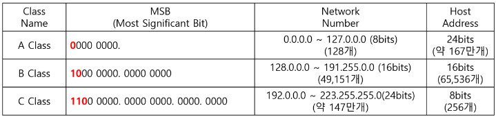

# 네트워크 스터디 1주차

## 서론

### 컴퓨터 네트워크를 배워야 하는 이유
요즘은 웹 페이지에 접속하는 것이 체감상 0.1초 이내에 완료되는 것 같다. 하지만 폴더폰 쓰던 때만 생각해 보더라도 접속하려고 하면 수 초에서 길면 십 여초까지 기다려야 하는 것이 일상이었다. 지금 우리가 그 속도로 돌아간다면 적응하기 많이 힘들 것이다. 하지만 만약 돌아가게 될 상황을 대비해서, 우리가 웹 페이지 접속 요청을 하게 될 경우 네트워크 상에서 이루어지는 다양한 과정을 공부해보자. 그럼 나중에 우리가 과거로 돌아가게 된다고 하더라도 힘든 일을 수행하고 있는 컴퓨터에게 넓은 아량을 가질 수 있게 될 것이다.  

### 웹의 응답 과정
우리가 브라우저에 URL을 입력하고 엔터를 치게 되면, 네트워크의 입장에서는 아래와 같은 과정이 일어난다.  

1. 브라우저가 HTTP 리퀘스트 메시지를 작성한다.
2. 브라우저가 웹 서버에 HTTP 리퀘스트 메시지를 전송한다.
3. 브라우저에서 웹 서버로 HTTP 리퀘스트 메시지가 날아간다.
4. 웹 서버에서 브라우저로 HTTP 응답 메시지를 전송한다.
5. 브라우저에서 전송받은 HTTP 응답 메시지를 조회하여 화면을 구성한다.

물론 위 과정은 매우 간략화되어있다. 하지만 위 과정을 기억해두고 네트워크 공부를 시작한다면 좀 더 지식이 머릿속에 잘 들어올 것이다.  

## 1. 브라우저가 HTTP 리퀘스트 메시지를 작성한다. 
브라우저는 굉장히 많은 일을 수행하는데, 그중에는 HTTP 리퀘스트 메시지 작성도 포함되어 있다. HTTP 리퀘스트 메시지는 아래와 같은 구조를 띠고 있는데, 브라우저는 어떻게 저 내용들을 알아내서 메시지를 작성하는 것일까? 하나 하나 알아보도록 하자.  

```
<HTTP 메서드> <URI> <HTTP버전>
<필드명>:<필드값>
...

<메시지 본문>
```

### HTTP 메서드
리퀘스트 메시지를 전달받는 서버 입장에서는 본격적인 작업을 수행하기에 앞서 여러 가지 정보를 알아야 하는데, 그 중 하나가 바로 **HTTP 메서드**이다. HTTP 메서드는 서버에서 어떤 일을 수행해야 하는지를 나타내는 것으로, 여러 종류가 있지만 대표적으로 GET과 POST를 많이 사용한다. 요즘은 PUT과 PATCH, DELETE도 많이 사용하는 것 같다.  

#### GET 메서드
GET은 말 그대로 서버로부터 특정 정보를 "가져온다"는 뜻이다. 정확하게는 서버에 있는 특정 파일의 내용을 조회하여 가져오고자 할 때 사용한다. 아마도 제일 많이 사용하는 HTTP 메서드로, 평범한 접속 요청을 수행할 시, 대부분 GET 요청을 진행한다고도 할 수 있다.
ex) 게시판에 등록된 글 목록 조회, 게시글 조회

#### POST 메서드
POST는 "게시하다", "공시하다" 라는 뜻을 가지고 있다. 새로운 내용을 서버에 게재한다고 이해할 수 있겠다. 폼에 있는 여러 내용을 서버에 있는 특정 경로에 <메시지 본문> 내용으로 담아 전달하고자 할 때 사용한다. GET과 달리 메시지 본문을 사용하는 이유는 간단하다. POST의 경우 새로운 파일을 작성하거나 특정 내용을 서버 프로그램에 전달해야 하는데, 메시지 본문이 없으면 요청의 알맹이가 없기 때문이다. 비슷한 이유로 후술할 PUT, PATCH 메서드를 사용할 때도 HTTP 리퀘스트 메시지에 <메시지 본문>을 함께 작성해야 한다.
ex) 게시글 작성 시

#### PUT 메서드
PUT은 "놓다" 라는 뜻이다. 물건을 탁자 위에 놓는데, 탁자가 한 칸 짜리라 다른 물건이 있다면 밀어버리고 새로 가져온 물건을 올려놓는다고 생각해보면 이해가 될까 싶다. 이 요청은 기존 내용을 **덮어씌우고자** 할 때 사용하는 메서드이다. 여기서 한 가지를 알 수 있는데, 요청하는 클라이언트 입장에서 현재 요청하는 내용이 기존에 존재할 수 있다는 점을 알고 있다는 것이다.  
PUT 메서드로 요청을 보내면 요청 데이터에 해당하는 리소스가 기존에 존재하는지 먼저 점검한다. 만약 해당하는 리소스가 있다면 **기존 내용을 폐기하고 전달받은 내용을 덮어씌운다.** 만약 해당하는 리소스가 없다면 **전달받은 내용으로 새로운 리소스를 생성한다.**
ex) 게시글 수정 시

#### PATCH 메서드
PATCH는 "고치다" 라는 뜻이다. 기존 내용을 고칠 때 사용한다고 생각하면 되겠다. 수정이라는 면에서 PUT과 겹치기도 하고, 많이들 헷갈려한다. 하지만 PUT과 PATCH에는 엄연한 차이가 있는데, PUT은 기존 내용을 다 지워버리고 새로 작성하는 반면에 PATCH는 기존 내용에서 전달받은 내용에 해당하는 부분들만 수정한다. 가진 정보가 많지만 일부분만 수정하고자 할 때 사용하기 좋은 메서드이지 않을까 싶다.
ex) 사용자 정보 수정 시

#### DELETE 메서드
DELETE는 "삭제하다" 라는 뜻으로, 이름 그대로 서버의 특정 리소스를 제거하는 메서드이다. 특정 리소스 경로에 존재하는 데이터를 삭제하고자 할 때 사용할 수 있다.
ex) 게시글 삭제

### URI
위 HTTP 메서드로 서버는 어떤 행동을 해야 할 지 알았다. 하지만 그 행동을 "어디에" 해야 할 지는 아직 모른다. 따라서 이 내용을 URI에 담아주어야 한다. 일단 URI는 뭔가 URL이랑 비슷하게 생겼다. 실제로 비슷한 뜻이지만 조금 다르다. URL은 `Uniform Resource Locator`로, "통합 자원 위치 지시기"라는 뜻으로 해석할 수 있겠다. 반면에 URI는 `Uniform Resource Identifier`로, "통합 자원 식별자"라는 뜻이다. URL은 **네트워크 상에서의** 특정 파일의 경로를 나타내고 URI는 특정 파일 그 자체를 나타낸다. URL은 URI에 네트워크 경로를 덧붙인 것이라고 이해할 수 있겠다. URL은 URI이지만 URI는 URL이라고 할 수 없다. 쉽게 말해서 URL은 URI의 개념 속에 포함된다고 볼 수 있다. 아래 예시를 보면 이해에 도움이 될 것이다.
URI: `naver.com`
URL: `https://naver.com`

### HTTP 버전
서버에서 리퀘스트 메시지를 어느 버전의 사양을 바탕으로 쓴 것인지 해석하기 위해 HTTP 버전 번호를 명시해주어야 한다.

### 메시지 헤더
HTTP 메서드와 URI, HTTP 버전을 작성하고 나면 다음 행부터는 여러 행에 걸쳐서 여러 필드 정보를 명시하는 부분이 이어지는데, 이 부분을 **메시지 헤더**라고 한다. 이 부분에는 작성하는 리퀘스트의 부가적인 정보에 대해 서술한다(날짜, 종류, 언어 등). 다양한 정보가 올 수 있는 만큼, 선택적으로 여러 행이 올 수 있다.

### 메시지 본문
메시지 헤더에서 한 행이 공백으로 띄어지고 난 뒤에 이어지는 내용이 "메시지 본문"이다. 메시지 본문은 위에 HTTP 메시지를 설명할 때 나왔듯이 파일에 대한 부가적인 정보가 필요할 때에만 작성한다. 대표적으로 POST, PUT, PATCH에서 메시지 본문이 필요하다.

## 2. 브라우저가 웹 서버에 HTTP 리퀘스트 메시지를 전송한다.
이제 리퀘스트 메시지를 다 작성했으니 웹 서버로 전송하면 될 것 같다! 하지만 틀렸다! 한 가지 과정을 더 거쳐야 한다! 바로 도착지의 주소를 파악하는 것이다. 엥? 뭔가 이상하다. 분명 우리는 웹 페이지에 접속을 시도할 때 URL로 서버 정보를 제공해주었다(이를테면 `http://www.naver.com`이라던가). 하지만 이 주소는 실제 서버의 주소가 아니라 별명에 불과하다고 할 수 있는데, 이를 도메인이라고 한다.  
도메인을 실제 IP 주소로 다시 변환해주어야 하는데, 이 일은 DNS를 통해 진행하게 된다. 과정은 다음과 같다.  
1. 호출 결과를 저장할 메모리 공간을 할당해 두고 Socket 라이브러리 속 리졸버를 호출한다.
2. 리졸버가 DNS 서버에 주소 조회 메시지를 보낸다.
  - 리졸버가 직접 보내는 것은 아니고 OS 내부에 포함된 **프로토콜 스택**을 호출하여 실행을 의뢰한다.
3. DNS 서버에서 응답 메시지를 보내준다.
4. 응답 메시지에서 IP 주소를 추출하여 최초에 할당해두었던 메모리 공간에 저장한다.
5. 브라우저가 추출된 IP 주소를 가지고 HTTP 리퀘스트 메시지를 작성한다.

## 3. 브라우저에서 웹 서버로 HTTP 리퀘스트 메시지가 날아간다.

### 네트워크
브라우저는 리퀘스트 메시지 작성을 끝냈고, 이제 웹 서버로 전송할 차례이다. 이번에는 그 과정에 대해 알아볼 것인데, 제일 먼저 네트워크에 대해 짚고 넘어가야 한다.  
**네트워크**는 여러 대의 PC가 하나의 허브에 연결되고, 이러한 허브들이 다시 모여 라우터에 연결됨으로써 구성된다. 그러다 보니 네트워크 하나에는 여러 허브(다수의 PC가 포함된)가 존재하게 되는데, 이들을 각각 **서브넷**이라고 한다. 이 서브넷이 모이고 모여서 거대한 네트워크를 이루는 것이다. 

### 라우터는 서브넷에 포함되지 않는다.
서브넷은 "PC"와 "허브"의 연결 모임인데, 서브넷끼리는 어떻게 이어질 수 있을까? 앞서 언급했듯이 서브넷은 라우터로 이어진다. 그리고 라우터가 서브넷에서의 PC 역할을 "도와줌"으로써 또다른 상위 서브넷을 구축한다. 순서를 나타내자면 이런 느낌이다.  
PC - 허브 - 라우터 - 허브 - 라우터 - 허브 - 라우터 - ...  
그리고 이걸 서브넷 단위로 묶어보면 다음과 같다.  
[PC - 허브] - 라우터 [ - 허브 ] - 라우터 [ - 허브 ] - 라우터 - ...  
여기서 눈여겨봐야 할 점은 **라우터는 서브넷에 포함되지 않는다**는 것이다. 분명 라우터는 여러 서브넷이 합쳐질 수 있도록 도와주는 역할을 하지만, 단지 그 뿐 서브넷 자체에 포함된다고 할 수는 없다.  
흠.. 슬슬 머리가 아프다. 한 가지 예를 들어서 이해해 보자. PC를 사람, 허브를 건물, 도시 등으로 치환해보자. 이런 상황에서 라우터는 "네비게이션"으로 비유할 수 있다.  
"여러 **도시** 중에서 하나를 특정하고, 다시 그 도시 속에서 **건물**을 특정하고, 다시 그 건물 속에서 **사람**을 특정한다."  
이것은 네트워크에서 IP주소를 따라 목적지를 찾아가는 과정과 같다. 네트워크에로 되돌려 다시 문장을 해석해보면 다음과 같다.  
"여러 **허브** 중에서 하나를 특정하고, 다시 그 허브 속에서 **허브**를 특정하고, 다시 그 건물 속에서 **PC**를 특정한다."  
HTTP 리퀘스트 메시지는 목적지를 찾기 위해 네트워크 속에서 여러 허브 사이를 떠다닌다. 허브는 계층 구조를 띠기 때문에 허브를 지나가면 지나갈수록 목적지에 가까워질 것이다. 이 부분에 집중해야 한다. **허브는 지나면 지날수록 목적지에 가까워져야 한다.** 이 것을 위해 존재하는 것이 바로 **라우터**이다. 라우터는 요청이 최소한의 경로로 목적지에 도달할 수 있도록 방향을 잡아주는 일을 한다. 그래서 "네비게이션"이라는 비유를 든 것인데, 도시에서 목적지를 찾아가는 과정에 "네비게이션" 자체가 있었는가? 결코 그렇지 않다. 네비게이션은 목적지로 가기 위한 경로를 잡아줄 뿐, 목적지 중 하나가 될 수는 없다. 네트워크 속 라우터도 같다. 여러 서브넷 사이에서 목적지로 가는 최적의 다음 라우터를 가리킬 뿐, 서브넷 중 하나가 될 수는 없다. 따라서 라우터는 서브넷 사이를 이어줄 뿐, 서브넷에 포함되지 않는다.

### 라우팅 테이블
이제 라우터에 대해 어느 정도 감이 잡힌 것 같다. 그런데 라우터는 어떤 방법으로 최적의 경로를 지정해주는 것일까? 이 부분에 대해서는 나중에 배울 것이기 때문에 간단하게만 짚고 넘어가겠다.  
라우터 속에는 라우팅 테이블이라는 것이 있다. 라우팅 테이블은 모든 목적지 정보에 대하여 해당 라우터에서 나아갈 수 있는 **다음 라우터**의 정보(거리와 방법)를 가지고 있다.

### IP 주소
우리가 보낸 HTTP 리퀘스트 메시지가 서버로 어떤 과정을 거쳐서 날아가는지 대충 알겠다. 하지만 깜빡한 부분이 있는데, 우리는 메시지를 어떻게 날리는지 알았을 뿐, 어디로 날리는지는 아직 배우지 않았다. 하지만 다들 예상하고 있듯이 라우터가 메시지를 목적지로 보내주기 위해 참조하는 주소가 바로 IP 주소이다.  
**IP**는 "Internet Protocol"이라는 뜻으로, IP 주소는 인터넷 속에서 컴퓨터의 주소(번지수)와 같다고 이해할 수 있다. IP는 8자리 비트를 .으로 구분하여 다시 4자리로 이루어지는데(총 32비트), 이론상 000.000.000.000 ~ 255.255.255.255의 범위를 가질 수 있는 것이다.  
사실 IP 주소는 **네트워크 번호**와 **호스트 번호**로 나누어 사용하고 있다. 네트워크 번호는 목적지가 어느 서브넷에 포함되어 있는지에 대한 정보를 가지고 있고, 호스트 번호는 목적지가 특정 서브넷 내에서 어디에 위치하고 있는지에 대한 정보를 가지고 있다. 여기서 한 가지 문제가 발생하게 된다. IP 주소에서 어느 만큼을 네트워크 번호로 사용하고, 어느 만큼을 호스트 번호로 사용해야 할 지에 대한 고민이 생기는 것이다. 네트워크 번호에 너무 많은 비트를 할당하게 되면 한 네트워크에 접속 가능한 PC의 수가 적어진다. 반면에 호스트 번호에 너무 많은 비트를 할당하게 되면 한 네트워크에 접속 가능한 PC의 수는 많아지겠지만 전체 네트워크의 수가 줄어들 것이다.    
인터넷 초창기 시절, 사람들은 클래스라는 개념을 만들어서 이를 해결하고자 했다. 대표적으로 A클래스, B클래스, C클래스가 있는데, 해당 클래스에 대한 내용은 다음과 같다.  

네트워크 수가 A클래스부터 순서대로 128개, 약 5만개, 약 153만개로 크게 증가한다. 하지만 반대로 네트워크에 할당 가능한 호스트 수가 A클래스부터 순서대로 약 167만개, 약 6만개, 256개로 크게 줄어든다. 보면 알겠지만 각 클래스별로 차이가 너무 크다. 사원 수가 300명인 기업은 C클래스가 살짝 모자라니 눈 꼭 감고 6만 명을 수용 가능한 B 클래스를 사용해야 하는 것이다. 이 경우 낭비되는 IP 수가 벌써 59,700개이다. 이런 기업이 수백, 수천 곳이라고 생각해보면, 너무나도 비효율적인 할당 방식이라는 것이 명백하다.

### 서브넷 마스크
그럼 어떻게 해야 이 불필요한 IP 낭비를 줄일 수 있을까? 바로 IP와 똑같이 생긴 쌍둥이 동생을 같이 데리고 다니는 것이다. IP의 몇 번째 비트까지를 네트워크 번호로 사용하고, 몇 번째 비트까지를 호스트 번호로 사용할지에 대한 정보를 담는 쌍둥이 IP를 같이 들고다닐 수 있다면? 해당 네트워크에서 필요한 호스트 수에 따라 적절하게 네트워크 번호에 비트를 많이 할당함으로써 IP 낭비를 최소화할 수 있을 것이다. 그렇다면 쌍둥이 IP를 정확히 어떻게 사용해야 할까? 다음과 같은 IP가 있다고 해보자.  
192.168.0.31  
이를 이진수로 풀어쓰면 다음과 같다.  
11000000.10101000.00000000.00011111  
여기서 네트워크 번호로 사용할 비트를 1, 호스트 번호로 사용할 비트를 0으로 가정하고, 임의의 쌍둥이 동생 IP를 잡아 보자.  
11111111.11111111.11111111.00000000  
이 수를 다시 십진수로 쓰면 다음과 같다.  
255.255.255.0  
이제 두 IP는 함께 다니면서 라우터를 만나면 쌍둥이 동생은 이렇게 외친다.  
"우리 형 주소를 해석할 때 내가 1값을 갖는 비트들은 네트워크 번호로, 0값을 갖는 비트들은 호스트 번호로 해석해줘!!"  
그렇게 되면 위 아이피에서 네트워크 부분은 192.168.0.이고, 호스트 부분은 31이 된다.  
이렇게 기존 IP와 함께 네트워크 번호의 자릿수를 지정하기 위한 쌍둥이 IP를 들고 다니면 호스트 낭비를 최소화할 수 있게 되는데, 여기서 쌍둥이 IP가 바로 **서브넷 마스크**이다.  

#### 서브넷 마스크의 표기 방법
서브넷 마스크는 앞서 말했듯이 IP와 함께 다닐 때 비로소 의미가 있다. 따라서 다음과 같은 방법으로 IP와 함께 서브넷 마스크를 명시할 수 있다.

- 192.168.0.31/255.255.255.0 -> IP 주소 / 넷마스크
- 192.168.0.31/24 -> IP 주소 / 넷마스크에서 네트워크 번호의 비트 수

#### 특별한 서브넷 마스크
서브넷 마스크 중에는 특별한 케이스가 두 가지 있다. 첫 번째는 호스트 번호의 비트가 모두 0인 경우인데, 이 경우 특정 기기를 가리키는 것이 아니라 해당 **서브넷 자체**를 가리킨다. 두 번째는 호스트 번호의 비트가 모두 1인 경우로, 이 경우 **해당 서브넷의 모든 기기에 패킷을 전송(브로드캐스트)**한다.  
  
※패킷: 네트워크 상에서 데이터를 운반할 때 정해진 형식

## 4. 웹 서버에서 브라우저로 HTTP 응답 메시지를 전송한다.
웹 서버에서는 HTTP 리퀘스트 메시지에 따른 처리를 마치면 HTTP 응답 메시지를 전송한다. HTTP 응답 메시지는 다음과 같다.

```
<HTTP 버전> <HTTP 응답 코드> <HTTP 응답 메시지>
<메시지 헤더>
...

<메시지 본문>
```

HTTP 응답 코드와 HTTP 응답 메시지를 제외한 다른 내용은 HTTP 리퀘스트 메시지와 동일한 방식으로 작성되니 해당 부분에 대해서만 알아보자.

### HTTP 스테이터스(응답) 코드와 응답 메시지
웹 서버측의 처리 결과를 클라이언트에 알려주기 위해 리퀘스트의 실행 결과를 스테이터스 코드와 응답 메시지로 반환한다. 스테이터스 코드의 종류는 여러가지이지만 크게 5가지로 분류할 수 있다.

- 1xx: 처리 경과 통지
- 2xx: 정상 종료
- 3xx: 조치 필요
- 4xx: 클라이언트측의 오류
- 5xx: 서버측의 오류

응답 메시지는 실행 결과에 대한 부가설명이 작성된다. 스테이터스 코드는 숫자로, 프로그램에게 결과를 전달하기 위한 내용이지만, 응답 메시지는 문장으로, 사람에게 실행 결과를 전달하기 위한 내용이다.


## 5. 브라우저에서 전송받은 HTTP 응답 메시지를 조회하여 화면을 구성한다.
웹 서버로부터 HTTP 응답 메시지를 받은 브라우저는 메시지를 조회하여 HTML 등의 코드로 사용자에게 보여줄 화면을 구성한다. 하지만 만약 와 같은 하이퍼텍스트가 들어가는 태그가 코드 내에 포함되어 있다면, 브라우저는 해당 내용들에 대해 각각 다시 한 번씩 웹 서버로 HTTP 리퀘스트 메시지를 전송한다. 한 요청에는 한 가지 응답만 가능하기 때문이다. 따라서 만약 우리가 한 웹 페이지에 접속했는데 그 페이지에 이미지가 총 3장 출력되어야 한다면 아래와 같은 내용으로 총 4회의 요청이 웹 서버로 넘어가게 된다.

1. 최초 웹 페이지 정보 요청
2. 이미지 1 요청
3. 이미지 2 요청
4. 이미지 3 요청
-> 브라우저가 웹 페이지를 화면에 출력

## 참고 자료
[HTTP 메서드 정리](https://rachel0115.tistory.com/entry/HTTP-%EB%A9%94%EC%84%9C%EB%93%9C-%EC%A0%95%EB%A6%AC-GET-POST-PUT-PATCH-DELETE)
[URI와 URL](https://www.elancer.co.kr/blog/view?seq=74)
[IP 주소와 서브넷 마스크](https://yozm.wishket.com/magazine/detail/2108/)