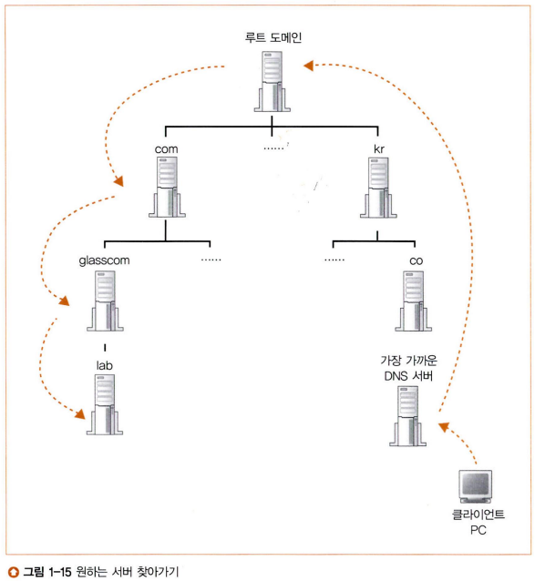

# 네트워크 스터디 2주차

## DNS 서버
지난 주에는 리졸버에서 DNS 서버를 통해 IP 주소를 추출하는 과정에 대해 간략하게 알아보았는데, 이번에는 이에 대해 세부적으로 알아보자.

### DNS 서버의 기본 동작
리졸버에서 DNS 서버로 보내는 조회 메시지에는 "이름"과 "클래스", "타입"을 담고 있다.  
  
1. 이름
    - 서버, 메일 배송 목적지 등
2. 클래스
    - 인터넷 이외의 네트워크에서도 이용할 수 있기 위한 식별자.
    - 현재는 인터넷 이외의 네트워크는 소멸하였으므로 항상 인터넷을 뜻하는 'IN'을 가짐
3. 타입
    - 이름에 어떤 타입의 정보가 지원되는가
    - ex) A -> IP 주소(Address), MX -> 메일 배송 목적지(Mail eXchanger)
    - 이에 따라 클라이언트에 회답하는 정보의 내용이 달라짐  
  
DNS 서버에는 위 3가지 정보와 이에 대응하는 리소스 레코드를 가지고 있다. 이 내용은 클라이언트에 보내는 응답 메시지에 들어갈 내용으로, 타입에 따라 달라지며 복수의 항목을 포함하기도 한다.  
리졸버(클라이언트)로부터 DNS 서버로 IP 주소를 받아오는 순서는 다음과 같다.  
  
1. 리졸버에서 DNS 서버로 이름과 클래스, 타입을 담아 조회 메시지를 보낸다.
2. DNS 서버 내에서 등록된 정보를 찾는다.
3. 대응되는 항목을 찾아 리소스 레코드 내용을 응답 메시지에 담은 후 반송한다.

### DNS 서버의 탐색 과정
이제 DNS 서버에서 IP 주소를 찾아오는 과정은 이해했다. 이것만 알면 DNS 서버의 구조를 모두 이해했다고 할 수 있을까? 그렇지 않다. DNS 서버는 하나만 있는 게 아니다. 만약 그렇다면 세상의 모든 IP 주소를 하나의 DNS 서버에서 감당해야 할 텐데, 상식적으로 가능할 리가 없다. 그럼 DNS 서버는 어떻게 운영되고 있을까? 실제 DNS 서버는 수많은 정보를 분산시켜 다수의 DNS 서버에 등록하고, DNS 서버들이 연대하여 하나의 IP 주소를 찾아내는 구조를 띠고 있다. 이들은 어떻게 연대하길래 도메인명 하나만 가지고 수많은 DNS 서버들 사이에서 대응하는 IP 주소를 찾아낼 수 있는 것일까?  
  
도메인명은 `.`을 구분자로 하는 도메인들의 모임으로써 계층 구조를 띠고 있는데, 이를 통해 찾고자 하는 DNS 서버를 찾을 수 있다. 예를 들어 `portal.koreatech.ac.kr`이라는 도메인의 IP 주소를 담고 있는 DNS 서버를 찾는 상황을 떠올려 보자. 이 도메인명은 제일 상위 도메인(이를 **최상위 도메인**이라 한다.)이 `kr`이다. 따라서 `kr`을 관리하는 DNS 서버에서 다음 계층 도메인인 `ac`를 포함한 `ac.kr`을 찾는다. 찾는 과정은 위에서 살펴보았듯이 조회 메시지를 보내 찾아낸다고 생각하면 된다. `ac`를 찾았다면 `koreatech.ac.kr`을, 그 이후에는 `portal.koreatech.ac.kr`을 관리하는 DNS 서버를 순서대로 방문한다. 가장 하위 도메인을 관리하는 DNS 서버에 도착했다면, 드디어 그 DNS 서버에서 해당 도메인명에 대응하는 IP 주소를 찾을 수 있을 것이고, 그 주소를 반환하게 된다.  

### DNS 서버의 등록 과정
위 과정이 정상적으로 이루어지기 위해서는 상위 도메인에 그의 직속 하위 도메인 정보를 모두 등록해야 하는데, 복잡하다고 생각할 수 있다. 하지만 의외로 정말 간단하다. `kut90.koreatech.ac.kr`을 새로 등록한다고 가정해보자. `kut90.koreatech.ac.kr`를 담당하는 DNS 서버를 `koreatech.ac.kr`의 DNS 서버에 등록하고, `koreatech.ac.kr`을 담당하는 DNS 서버를 `ac.kr`의 DNS 서버에, 이를 다시 `kr`을 담당하는 DNS 서버에 등록한다. 이렇게 되면 차후에 `kut90.koreatech.ac.kr`에 대응하는 IP 주소를 찾고자 할 때, 최상위 도메인인 `kr`을 담당하는 DNS 서버부터 방문하여, 여러 DNS 서버를 순차적으로 거쳐 원하는 IP 주소를 찾을 수 있게 될 것이다.

### 루트 도메인의 존재
위 예에서는 `kr`을 최상위 도메인이라고 언급했는데, 그럼 당연히 이 도메인이 가장 높은 계층의 도메인이라고 이해하고 있을 것이다. 하지만 사실은 그렇지 않다. 도메인명은 우리한테 한 가지 비밀을 숨기고 있었다. 바로 **루트 도메인**이다.  
  
`kut90.koreatech.ac.kr`의 본래 모습은 `kut90.koreatech.ac.kr.`이다. 도메인명의 가장 끝에 `.`을 하나 숨기고 있었다. 우리는 도메인명의 오른쪽으로 갈 수록 상위 도메인이라는 사실을 알고 있다. 그렇다면 저 말이 의미하는 바는 무엇인가? 바로 최상위 도메인 위에 상위 도메인이 하나 더 있다는 것이다. 루트 도메인은 이름이 없다. 그래서 마지막 `.` 뒤에는 아무 것도 오지 않는다. 루트 도메인이 있는 이유는 간단하다. 모든 도메인은 상위 도메인에 등록되어 있는데, 최상위 도메인도 상위 도메인이 있어야 한 번에 모든 도메인명을 찾을 수 있지 않을까? 그렇지 않다면 최상위 도메인도 `kr`, `jp`, `net` 등 많은 종류가 있을 텐데, 서로 다른 최상위 도메인끼리는 DNS 서버에 접근할 수 없을 것이다. 그래서 모든 최상위 도메인은 루트 도메인에 등록되어 있다.

### 루트 도메인의 효과

루트 도메인은 숨바꼭질과 최상위 도메인끼리의 연결 외에도 나름의 최적화 기능을 간접적으로 제공한다. 인터넷에 존재하는 모든 DNS 서버는 루트 도메인 DNS 서버를 등록해야 한다. 귀찮아 보이긴 하지만 이를 통해 아주 좋은 기능을 할 수 있게 해준다. 바로 루트 도메인까지의 경로를 건너뛰고 진행할 수 있다는 점이다. `kut90.koreatech.ac.kr`에서 `www.naver.com` DNS 서버로 가고자 한다면 원래는  
  
`kut90.koreatech.ac.kr` > `koreatech.ac.kr` > `ac.kr` > `kr` > `.` > `com` > `naver.com` > `www.naver.com`  
  
의 과정을 거쳐야 한다. 하지만 루트 도메인으로 건너뛰어 이후 과정을 진행하게 된다면  
  
`kut90.koreatech.ac.kr` > `.` > `com` > `naver.com` > `www.naver.com`  
  
이와 같이 과정이 굉장히 단축된다. 경로가 단축된 만큼 응답 속도도 빨라지게 되고, 부하도 줄어들게 된다.

### DNS 서버의 캐시 기능
캐시가 무엇인지는 어렴풋이 알고 있을 것이다. 캐시의 사전적 정의는 "데이터나 값을 미리 복사해 놓는 임시 장소"이다. 가장 대표적인 사례는 CPU와 메모리 사이에 두는 캐시 메모리가 있다. 캐시는 한 번 접근한 정보에 대해 고속 기억 장치에 저장해두어 두 번째 이후의 접근 시 빠른 접근을 돕는 기술이다. 이러한 캐시 기술은 네트워크에서도 일반화되어 있는데, DNS 서버도 예외는 아니다. DNS 서버는 한 번 조사한 이름을 캐시에 기록할 수 있는데, 조회하는 이름에 해당하는 정보가 캐시에 있으면 그 정보를 넘겨준다. 이렇게 되면 그 위치부터 이어서 DNS 서버를 탐색하기 때문에 탐색 시간이 단축된다. 조회하는 이름이 DNS 서버에 존재하지 않는 경우에도 "해당 이름은 존재하지 않는다"라는 내용을 캐시에 기록할 수도 있다.  
  
이런 캐시 기능은 마냥 좋아보이지만 한 가지 단점이 있다. 바로 캐시에 기록된 정보가 올바른 정보라는 확신이 없다는 것이다. 캐시에 기록된 내용은 자동으로 업데이트되는 것이 아니기 때문에 시간이 지나 해당 이름에 대해 내용에 변경이 일어나게 되면 실제 정보와 일치하지 않는 현상이 일어나게 된다. 따라서 DNS 서버의 캐시에 정보를 저장할 때는 유효기간을 함께 설정하여 유효기간이 지나면 캐시에서 자동으로 삭제해 버린다. 또한 마지막 보루로써 DNS 서버에서 응답 메시지를 보낼 때는 해당 정보가 등록처 DNS 서버에서 응답한 것인지, 캐시에 저장된 정보로 응답한 것인지도 함께 반환한다.

## 프로토콜 스택과 메시지 송수신
네트워크와 관련된 실질적인 동작은 모두 OS에 탑재되어 있는 프로토콜 스택에서 일어난다. 이는 브라우저에서 메시지를 송수신할 때도 마찬가지이다. 따라서 이 동작에 대해 알아보겠다.  
  
브라우저에서 메시지를 송수신할 때는 DNS 서버에서 IP 주소를 조회할 때와 마찬가지로 Socket 라이브러리에 포함되어 있는 메서드를 이용하여 프로토콜 스택에 접근한다. Socket 라이브러리는 클라이언트 프로그램과 프로토콜 스택을 중개해주는 역할을 하고, 클라이언트 프로그램은 프로토콜 스택에 직접적으로 접근하지 않는다.

### 데이터 송수신 동작의 개요

데이터 송수신은 두 개의 프로그램 사이에 파이프를 구성한 후에 그 파이프 속에 디지털 데이터를 때려넣음으로써 진행된다. 여기서 파이크의 양 쪽 입구를 소켓이라고 하고 이를 활용한 통신을 소켓 통신이라고 한다.  

데이터 송수신의 절차는 다음과 같다. 여기서 사용되는 메서드들은 프로토콜 스택에 의뢰하기 위한 Socket 라이브러리로의 메서드들이다.

   
1. 소켓 작성 단계(socket): 소켓 생성
2. 접속 단계(connect): 서버측 소켓에 파이프 연결
3. 송수신 단계(write, read): 데이터 송수신
4. 연결 끊기 단계(close): 파이프 분리 후 소켓 제거

### 소켓의 작성 단계
`<디스크립터> = socket(<서버의 IP 주소>, ...)`  
소켓 통신의 첫 단계는 소켓의 작성이다. 다행히도 소켓 생성은 어렵지 않다! 물론 Socket 라이브러리 내부적으로는 복잡할 수 있겠지만 우리는 그 부분까지는 아직 알아보지 않을 것이다. 우리는 Socket 라이브러리의 socket 메서드만 호출해서 서버의 IP 주소를 넘겨주면 Socket 라이브러리에서 넘겨준 정보를 기반으로 알아서 소켓을 만들어준다. 그리고 소켓의 구분자인 **디스크립터**를 반환하게 된다. 이 디스크립터는 DB의 id, Primary Key와 같은 역할을 한다고 생각하면 쉽다. 각각의 디스크립터는 고유한 값을 가지고 있기 때문에 클라이언트 프로그램은 디스크립터를 통해 제어하고자 하는 소켓을 지정할 수 있다.  

### 접속 단계
`connect(<디스크립터>, <서버의 IP 주소:포트 번호>, ...)`  
소켓이 생성되었다면 다음은 소켓을 연결 차례다. 생성하면 그걸로 된 것이지 왜 또 연결까지 해야할까? 사실 아직 우리가 가지고 있는 소켓은 완성된 소켓이 아니다. 서버의 IP 주소로 생성된 소켓이 서버 컴퓨터와 연결되어 있는 것은 맞다. 다만 아직 그 소켓이 서버의 어떤 소켓에 연결되는 것인지는 정해지지 않았다. 따라서 이 부분을 지정해주기 위해 접속 단계를 추가로 거쳐야만 한다. 그럼 어떻게 서버의 소켓을 특정할 수 있을까? 여기서는 서버의 **포트 번호**라는 것이 필요하다. 포트 번호는 IANA(Internet Assigned Numbers Authority, 인터넷 할당 번호 관리기관)에 의해 관리되는 것으로, 전세계적으로 통일된 규칙을 적용하고 있다. 그 예로 웹은 80번, 메일은 25번을 사용한다. 아무튼 이러한 포트 번호를 사용하게 되면 클라이언트 프로그램은 서버의 어떤 소켓에 접속해야 할지를 특정할 수 있게 된다. 따라서 소켓을 생성한 뒤 소켓으로 서버 소켓에 접속하기 위해서는 디스크립터와 포트 번호가 필요하다.

#### 디스크립터와 포트 번호
잠깐, 분명 방금 디스크립터와 포트 번호가 필요하다고 했다. 하지만 둘은 용도가 같지 않은가? "어떤 소켓인지에 대한 구분자"라는 입장에서 둘은 분명 같은 용도로 사용되고 있다. 그럼 그냥 클라이언트에서 소켓을 작성할 때 반환된 디스크립터만 쓰면 되는 것 아닌가? 흠.. 헷갈릴 수 있는 부분인 만큼 확실히 짚고 넘어가도록 하자.  
  
디스크립터는 소켓을 작성할 때 반환되는 구분자이다. **소켓의 작성자** 입장에서 방금 생성된 소켓을 다른 소켓과 구분할 수 있도록 하는 구분자이다. 그렇다면 클라이언트 프로그램 입장에서 서버의 소켓을 특정하기 위해 디스크립터를 사용하는 것은 가능하다고 생각되는가? 물론 가능은 하겠지만, 이 방법을 사용하기 위해서는 클라이언트 프로그램이 자신이 원하는 서버의 소켓에 대한 디스크립터를 알고 있어야 한다. 이는 번거로운 과정이 될 것이고, 이에 대한 해결책이 바로 포트 번호이다.  
  
포트 번호는 접속 단계를 설명할 때 말했듯이 특정 기관에 의해 전 세계적으로 통일된 규칙이 적용되어 관리되고 있다. 따라서 클라이언트 프로그램은 서버의 디스크립터를 알 필요 없이, 접속하고자 하는 대상의 프로그램 종류에 따라 적절한 포트 번호를 전달하기만 하면 서버의 소켓을 특정할 수 있게 된다.

### 송수신 단계
소켓 작성과 접속까지 마쳤으니 이제 송수신 단계이다. 지금까지 너무 어려웠던 것 같지만, 막상 송수신 단계는 별 것 없으니 걱정하지 않아도 된다! 처음 설명할 때 말했듯이 데이터의 송수신은 소켓이라는 파이프에 데이터를 때려넣는 행위와 같다고 했다. 말 그대로 한 쪽 소켓에서 송신하면 반대편 소켓에서 수신되는 것이다.  
  
`write(<디스크립터>, <송신 데이터>, <송신 데이터 길이>)`  
먼저 데이터 송신은 Socket 라이브러리의 write 메서드를 통해 이루어진다. 디스크립터를 넘기면서 자신의 어떤 소켓을 사용할지 명시하고, 송신할 데이터와, 그 길이를 함께 넘겨준다. 그럼 Socket 라이브러리에서는 프로토콜 스택에 대상 소켓으로의 디지털 데이터 전송을 의뢰해준다. 여기서 대상 소켓이 무엇인지는 전달하지 않았는데, 이미 우리가 작성하고 접속되어 있는 소켓을 사용했기 때문에 해당 소켓의 식별자인 디스크립터만 넘겨주더라도 Socket 라이브러리는 대상 소켓이 어디 서버의 어느 소켓인지 다 알 수 있다.  
  
`<수신 데이터 길이> = read(<디스크립터>, <수신 버퍼>, ...)`  
데이터를 송신했으면 수신할 차례이다. 서버 프로그램에서는 넘겨받은 데이터로 응답 메시지를 작성하고 다시 클라이언트 소켓에게 송신할 것이다. 이 데이터를 받기 위해 클라이언트에서는 Socket 라이브러리의 read 메서드를 호출해야 한다. 디스크립터를 넘겨 어느 소켓인지 알려주면 Socket 라이브러리에서는 프로토콜 스택으로부터 넘겨받은 응답 메시지를 수신 버퍼에 저장한 후, 수신 메시지의 길이를 반환한다.

### 연결 끊기 단계
`close(<디스크립터>)`  
마지막으로 연결 끊기 단계이다. 데이터 송수신이 끝났으니 이제 연결을 끊고 소켓을 제거할 차례이다. 서버에서는 응답 메시지의 송신을 마친 후, 연결 끊기 동작을 수행한다.(서버가 먼저 close를 수행한다.) 그럼 이것이 클라이언트로 전달되어 클라이언트의 소켓도 연결 끊기 단계에 들어간다. 또한 read가 끝날 때 송수신이 완료되어 연결이 끊겼다는 점을 브라우저에 알리기 때문에 브라우저는 송수신이 종료되었다는 점을 알 수 있다. 따라서 브라우저는 close를 호출하여 연결 끊기 단계에 들어간다. 파이프를 분리하고, 소켓을 제거하는 것이다.

#### 연결 끊기 단계 - HTTP 1.1
마지막으로 연결 끊기 단계이다. 데이터 송수신이 끝났으니 이제 연결을 끊고 소켓을 제거할 차례이다. 엥? 잠시만 다시 생각해 보자. 사실은 그렇지 않을 수도 있다. 뭔가.. 뭔가 효율이 떨어지는 것 같은 느낌이 들지 않는가? 흠... 아! 지난 주에 설명했던 부분 중 하나를 다시 떠올려 보자. GET 요청을 날린 후 돌아온 HTTP 응답 메시지에 ``와 같은 하이퍼텍스트가 포함된 태그가 들어있으면 브라우저는 서버로 조회 메시지를 다시 날려야 한다. 그럼 우리가 지금까지 배운 내용에 따르면 소켓을 두 번 작성, 접속, 송수신 그리고 종료해야 한다. 어차피 같은 곳으로 송수신해야 하는 것이라면, 굳이 소켓을 끊었다 연결했다하지 말고 한 번 접속했을 때 필요한 모든 정보를 송수신한 다음 연결을 종료할 수는 없을까? 확실히 이게 훨씬 효율적인 것 같다.  
  
놀랍게도 실제로 이 기능은 HTTP 1.1 버전부터 사용할 수 있게 되었다! 좀 더 있어보이게 말하자면 **"커넥션을 재사용할 수 있게 되었다"**. 따라서 하나의 문서에 여러 리소스가 포함된 경우 이를 화면에 표시하기 위해 사용되었던 커넥션을 다시 열어서 시간을 단축시킬 수 있게 되었다. 추가적으로 HTTP 1.1 버전부터는 "파이프라이닝"이라는 기능도 추가되어 첫 요청에 대한 응답이 완전히 전송되기도 전에 두 번재 요청을 전송할 수 있게 되었다고 한다. 물론 이 기능도 시간 단축을 위한 것이다.

## 참고 자료
성공과 실패를 결정하는 1%의 네트워크 원리 - Tsutomu Tone, 출판사: 성안당  
[Socket과 Port의 특징, HTTP 버전별 정리](https://tigercoin.tistory.com/189)
