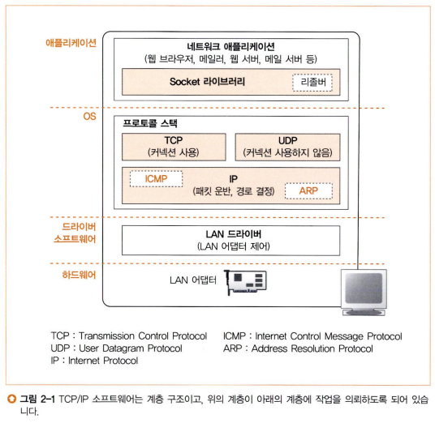
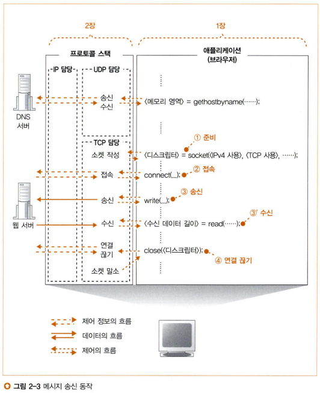
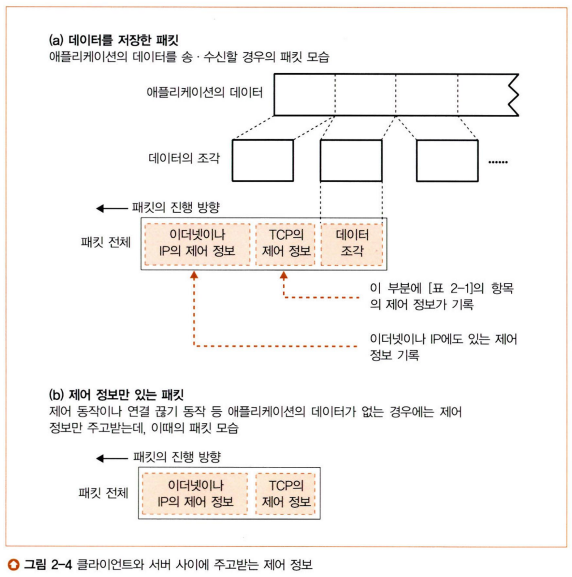
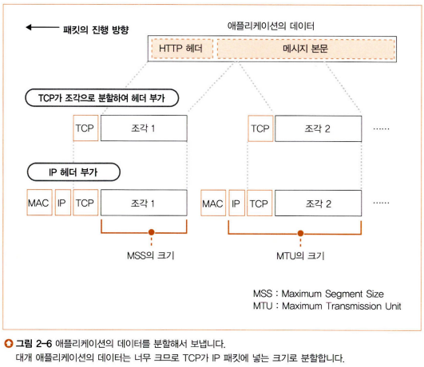
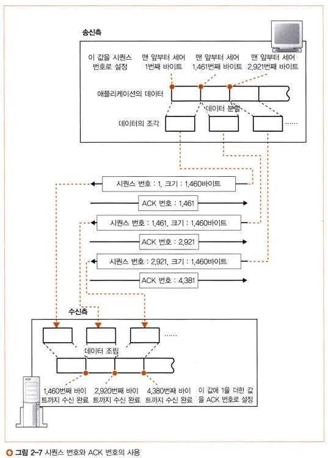
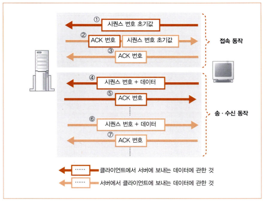
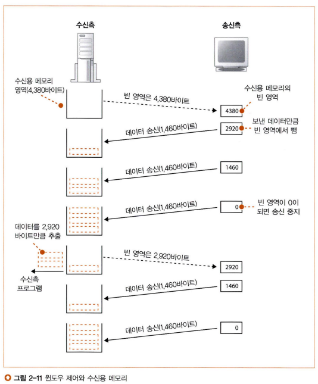
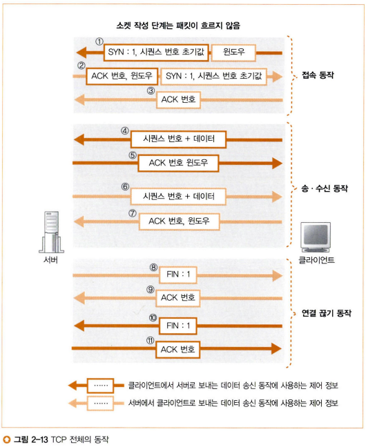

# 네트워크 스터디 3주차

## 개요
지난 주에는 애플리케이션에서 웹 서버와 통신하기 위한 소켓 통신 과정에 대해 살펴보았다. 특히 클라이언트의 입장에서 소켓의 생성, 동작 및 소멸이 어떻게 이루어지는지를 중점적으로 알아보았다. 이번 주에도 같은 내용을 살펴볼 것이다. 하지만 이번에는 프로토콜 스택을 중점적으로 다룰 예정이다. 소켓 통신에서 프로토콜 스택이 관여하는 부분에 대해 한 번 알아보자.

---

## 소켓 작성 단계 (socket)

### 프로토콜 스택의 내부 구성
프로토콜 스택이 관여하는 부분에 알아보기 전에, 우선 프로토콜 스택이 어떻게 구성되어 있는지부터 알아보자.  
  
  
프로토콜 스택은 위 사진과 같이 구성되어 있다. 
1. 네트워크를 사용하는 애플리케이션에서 Socket 라이브러리를 호출하면
2. OS 단에 존재하는 프로토콜 스택으로 의뢰가 넘어간다.
3. 프로토콜 스택 내에서 TCP 프로토콜과 UDP 프로토콜 중 거쳐야 할 프로토콜 부분에서 필요한 작업을 진행한 후 IP 부분으로 의뢰를 넘긴다.
  1. TCP 프로토콜: 일반적인 애플리케이션의 데이터 송수신에 사용  
      - ex) 브라우저, 메일 등
  2. UDP 프로토콜: 짧은 제어용 데이터 송수신에 사용  
      - ex) DNS 서버 조회 등
4. IP 부분에서 필요한 일을 마치면 LAN 드라이버에 의뢰를 넘기면서 본격적으로 네트워크 송신을 진행한다.
  
네트워크에서는 데이터를 운반할 때 데이터를 잘게 잘라 **패킷**의 형태로 운반한다.

### 소켓의 실체
지난 주에 우리는 소켓을 무엇이라고 배웠는지 기억하는가? "통신할 두 프로그램 사이를 파이프로 연결할 때, 파이프의 양 쪽 출입구"라고 배웠다. 하지만 사실 소켓은 "출입구"가 아니다.  
  
프로토콜 스택의 내부에는 **제어 정보**를 기록하는 메모리 영역이 존재하는데, 여기에 통신 동작을 제어하기 위한 제어 정보를 기록한다(IP 주소, 포트 번호, 현재 상태 등). 소켓은 개념적인 것이어서 실체가 없지만 굳이 따지자면 여기서 말하는 제어 정보가 우리가 알고 있던 소켓이라고 할 수 있다. 다시 말해 소켓은 **프로토콜 스택 내부에 기록되는 제어 정보**이다.  
  
그리고 **프로토콜은 소켓에 기록된 제어 정보를 참조하면서 동작한다.**  
  
참고) 윈도우 cmd에서 `netstat` 커맨드 입력 시 PC에 존재하는 소켓의 내용을 확인할 수 있다.

### Socket 라이브러리를 호출했을 때의 동작
  
위 그림은 애플리케이션에서 Socket 라이브러리를 호출했을 때의 동작 과정을 그린 것이다. 애플리케이션에서 Socket 라이브러리의 메서드를 호출할 때마다 프로토콜 스택 내의 TCP 담당 부분이 애플리케이션의 의뢰를 받아 IP 담당 부분을 거쳐 웹 서버로 정보를 송신한다. 단, 소켓 작성 단계의 경우에는 웹 서버까지 데이터를 보내지 않는다. 따라서 IP 담당 부분으로의 의뢰도 이루어지지 않는다.

### 소켓의 작성 단계
이제 진짜 소켓의 작성 단계에 대해 알아보자. 이미 알고 있겠지만 TCP 통신의 첫 단계는 소켓을 작성하는 것이다. 이 때 프로토콜 스택은 제일 먼저 소켓 한 개 분량의 메모리 영역을 할당한다. 그리고 그 공간에 제어 정보(소켓)를 기록한다. 아직 접속 단계를 거치지 않은 생성된지 얼마 안 된 아기 소켓은 초기 상태임을 나타내는 제어 정보를 메모리 영역에 기록한다.  
소켓이 만들어지면 프로토콜 스택에서 여러 소켓 중 해당 소켓을 구분할 수 있는 기준인 구분자 "디스크립터"를 애플리케이션에 알려준다. 아까 설명했듯이 소켓에는 통신을 제어할 수 있는 정보를 기록해두는데, 프로토콜 스택이 통신을 하기 위해서는 이 정보가 반드시 필요하다. 따라서 여기서 제공받은 디스크립터를 이후 통신 단계에 사용하여 프로토콜 스택이 소켓을 구분한다.

---

## 접속 단계 (connect)

### 접속의 의미
소켓을 만든 직후에는 초기 상태임을 나타내는 제어 정보만 들어있기 때문에 통신 상대가 누구인지 알 수 없다. 따라서 이를 위해 접속 단계를 거치게 된다. 접속 단계에서 서버의 IP 주소나 포트 번호 등 통신에 필요한 제어 정보를 프로토콜 스택에 알리게 된다.  
  
위 설명은 클라이언트 측 이야기이고, 서버 측은 어떨까? 서버 측은 소켓을 만들어 두고, 누군가 와주기를 하염없이 기다릴 뿐이다. 클라이언트는 서버에 접속하고자 할 때, 쓸쓸히 기다리는 서버 측 소켓 방 문을 두드리면서 "어느 IP의 어느 포트번호로 데이터 송수신을 진행하고 싶다"라는 신호를 보낸다. 그럼 서버 측 소켓은 수줍어하면서 방 문을 열어주게 되는데, 이게 접속 단계이다.  
  
간단하게 정리하자면 접속 단계는 클라이언트 입장에서는 통신 상대의 제어 정보를 자신의 소켓에 기록하는 것이고, 서버 입장에서는 클라이언트가 접속한다는 사실을 접수하여 자신의 소켓에 기록하는 것이다.  
  
마지막으로 데이터 송수신을 진행할 때는 데이터를 잠시 저장할 메모리 공간이 필요한데, 이 공간을 "버퍼 메모리"라고 한다. 이 버퍼 메모리의 할당도 접속 단계에서 진행된다.  
  
이러한 일련의 접속 단계를 마치면 서로 데이터 송수신이 가능한 상태가 된다.

### 제어 정보를 기록한 헤더 배치
소켓에 기록된 제어 정보는 데이터를 패킷에 담아 전송할 때 패킷의 앞 부분에 "헤더"라는 이름으로 기록되어 전달된다. 위의 "Socket 라이브러리를 호출했을 때의 동작"에 명시된 그림을 잘 살펴보면 접속 단계와 연결 끊기 단계에서는 "제어 정보의 흐름"이라는 말이 써있다. 접속 단계와 연결 끊기 단계에서는 송수신할 데이터가 없기 때문에 제어 정보만 전달하는 것이다. 제어 정보는 헤더에 담겨 전달되기 때문에 이 때 운반되는 패킷에는 헤더만 있고 데이터는 존재하지 않는다.  
  
그리고 사실, 제어 정보에는 두 종류가 있다. 첫 번째는 자신의 소켓에 기록하기 위한 제어 정보이고, 두 번째는 상대방에게 알려주기 위해 헤더에 기입하는 제어 정보이다.  
  
안타깝게도 헤더에도 여러 종류가 있다. **TCP 헤더**와 **IP 헤더**, **이더넷 헤더(MAC 헤더)**이다. TCP 헤더는 서버와 클라이언트가 데이터를 송수신할 때 필요한 제어 정보를 담고 있다. 또한 IP 헤더나 이더넷 헤더는 말 그대로 이더넷이나 IP에 대한 제어 정보가 담겨 있다. 아직은 자세히 다루지 않으니 그냥 이런게 있구나 하고 눈도장만 찍고 가볍게 넘기자.  
  
  
  
위 그림은 패킷의 구조를 나타낸다. 데이터를 송수신할 때는 먼저 데이터를 작게 분리하여 패킷에 넣는다. 그리고 패킷의 앞부분에 IP(또는 이더넷) 헤더와 TCP 헤더를 순서대로 배치한다.  
  
접속 단계나 연결 끊기 단계의 경우는 IP(또는 이더넷) 헤더와 TCP 헤더만을 패킷에 담는다.  
  
이렇게 헤더에 집착하는 이유는 헤더가 없으면 상대의 프로토콜 스택이 해당 통신에 필요한 제어 정보를 알 수 없기 때문이다. 따라서 통신을 할 때는 항상 패킷의 앞에 헤더를 배치한다.

### 접속 동작의 실제
이제 접속 동작의 실질적인 절차에 대해 알아보자. 제일 먼저 애플리케이션이 Socket 라이브러리의 connect 메서드를 호출한다. 

#### TCP 부분
connect가 호출되면 Socket 라이브러리는 프로토콜 스택의 TCP 부분에게 의뢰를 하게 되는데, 이 때 호출 시 전달받은 서버 측의 IP 주소와 포트 번호를 함께 제공하게 된다. TCP 부분은 이름 그대로 TCP 헤더를 작성 및 해석하는 역할을 맡고 있다. TCP 헤더 내에는 여러 가지 컨트롤 비트가 있지만, 접속 단계에서는 그 중에서도 **SYN 비트**를 1로 만들면서 TCP 헤더를 작성한다. SYN 비트가 1이면 해당 패킷이 접속 단계라는 뜻을 가지는 제어 정보라고 해석할 수 있다. 이 외의 용도로는 쓰이지 않기 때문에, SYN 비트는 접속 이외의 단계에서는 항상 0이다.

#### IP 부분
TCP 부분에서 패킷에 TCP 헤더를 작성한 후에는 IP 부분으로 다시 넘긴다. IP 부분에서는 작성된 패킷에 부가적으로 IP 헤더를 작성하고 나서 패킷 송신 동작을 실행하게 된다. 

#### 서버 측의 동작
패킷이 송신되고 나면 네트워크를 통해 서버에 도착할 것이고, 이후로는 지금까지의 역순으로 해석된다. 패킷이 서버에 도착하면 서버의 IP 담당 부분이 이 것을 받아 TCP 부분에 넘겨준다. TCP 부분에서는 TCP 헤더를 해석하여 여기에 기록되어 있는 수신측의 포트 번호를 보고 동일한 포트 번호이면서 접속 대기 상태인 소켓을 찾아낸다. 그 후 소켓에 필요한 정보를 기입해주고(이 동안 소켓은 "접속 동작 진행중" 이라는 상태가 된다.) 다시 클라이언트로 응답을 돌려보낸다.  
  
서버에서 클라이언트로 다시 응답을 돌려보낼 때는 TCP 부분에서 TCP 헤더의 SYN 컨트롤 비트와 함께 ACK 컨트롤 비트도 1로 만든다. 이 ACK 비트는 쉽게 말해서 "정상 도착 확인"을 의미한다. ACK 비트는 SYN 비트와 달리 앞으로의 단계에서도 계속 사용할 것이다. 지금은 그냥 이런 게 있구나~ 하고 넘기자.
  
이 이후에는 또다시 역순으로 진행된다. ACK 번호가 1로 입력된 패킷을 클라이언트가 받아 IP 부분을 경유하여 TCP 부분에 도착한다. TCP 부분은 TCP 헤더를 조사하여 어느 소켓인지, 이 접속 동작이 성공했는지 확인한다. 서버에서 돌아온 응답에서도 SYN 비트가 1이면 접속에 성공했다는 뜻이므로 만세, 만세, 만만세! 하며 끝이 난다.  
  
였으면 좋았겠지만... 뭔가 잊은 것 같지 않는가? 모든 송신에는 정상적으로 도착했는지를 확인하는 "정상 도착 확인" 응답이 반드시 돌아와야 한다. 이게 뭐더라? 맞다. ACK 번호다. ACK 번호는 우리를 잠시라도 행복하게 놔두지 않는다... 클라이언트는 다시 SYN 비트가 1인 패킷을 정상적으로 수신했다는 내용뜻으로 다시 ACK 비트를 1로 바꿔서 서버로 송신한다. 이후 과정은 지긋지긋하게 알아보았기 때문에 건너뛰도록 하겠다.  
  
아직 ACK 비트가 무엇인지도 잘 모르겠고 왜 이렇게 우릴 골치아프게 하는 건지 화가 나지만, 일단은 무시하고 지나가보자. 아까 말했듯이 조만간 다시 나올 것이다. 그 때 제대로 설명하겠다.

---

## 데이터 송수신 단계 (write, read)
접속 단계에 대해 알아보느라 힘들었으나, 데이터 송수신이 **진짜**다. 천천히 심호흡을 하고 어깨에 힘 빡주고 눈에 힘 주고 들어가보도록 하자.

### 프로토콜 스택에 HTTP 리퀘스트 메시지를 넘긴다
connect 메서드를 호출하여 접속 단계를 끝냈다면, 다음은 애플리케이션에서 서버로 데이터를 송신할 차례이다. Socket 라이브러리의 write 메서드를 호출하여 진행하게 되는데, Socket 라이브러리에서 프로토콜 스택으로 애플리케이션이 송신할 데이터를 전달하여 송신을 의뢰한다.  
  
하지만 이 때 프로토콜 스택이 전달받은 데이터를 바로 송신할 수 있는 것은 아니고, 잠시 프로토콜 스택 내부의 송신용 버퍼 메모리에 저장해둔다. 그렇게 애플리케이션에서 다음 데이터가 넘어올 때까지 기다리다가 데이터를 패킷에 담아 송신하게 된다. 그런데 여기서 송신용 버퍼 메모리에 저장해둘지, 애플리케이션에서 다음 데이터가 올 때까지 기다릴지 선택하는 기준이 있는데, 바로 **MTU**(Maximum Transmission Unit)라는 매개변수이다. MTU는 한 패킷에 저장할 수 있는 데이터의 최대 크기로, 이더넷에서는 보통 1,500바이트 정도 된다. 하지만 패킷의 앞에는 항상 헤더가 포함되기 때문에, 패킷에 저장 가능한 실제 데이터의 크기는 MTU - 헤더 크기(TCP 헤더 + IP 헤더)가 된다. 이를 **MSS**(Maximum Segment Size)라고 한다.  
  
왜 이렇게 한 번에 최대한 많은 데이터를 패킷에 담아서 전송하려고 하는 것일까? 만약 프로토콜 스택이 애플리케이션으로부터 작은 데이터 여러 개를 전달받았는데, 이를 각각 별개의 패킷으로 포장하여 송신한다면 어떻게 될까? 고속도로에 차가 많이 들어오면 차가 막히듯이 네트워크에 패킷이 많이 들어온다면 네트워크 이용 효율이 저하될 것이다.

그럼 매 번 요청이 들어올 때마다 최대한 패킷에 꾹꾹 눌러담아서 보내는 것이 적절할까? 그건 또 아니다. 우리는 여기서 한 가지를 더 고려해보아야 하는데, 바로 시간이다. 물론 패킷마다 용량을 꽉꽉 채워서 넣어주게 되면 네트워크 이용 효율은 올라가겠지만, 패킷에 데이터를 누적하기 위해 버퍼에 오래 머무르게 되면 그만큼 송신이 지연될 것이다. 그만큼 통신이 지연된다는 것이다.  
  
따라서 우리는 위에서 살펴본 패킷의 **크기**와 **최대 버퍼 상주 시간**을 절충하여 적절한 중간값을 수행해야 한다. 하지만 이에 대한 규정은 TCP 프로토콜 사양에 없기 때문에 온전히 프로토콜 스택 개발자의 손에 달려있다.  
  
하지만 이 "알잘딱"이 못미더운 경우를 고려하여, 애플리케이션이 직접 데이터 송신 옵션으로 관련 부분을 지정해줄 수 있다. 이를테면 "버퍼에 머물지 않고 바로 송신하라"던가? 이런 경우는 브라우저같은 대화형 애플리케이션에 사용될 수도 있겠다. 이런 애플리케이션은 지연시간에 굉장히 민감하기 때문이다.  

### 데이터가 클 때는 분할하여 보낸다
클라이언트에서 서버에 데이터를 송신할 때 패킷에 데이터가 한 번에 담기지 않는 경우에는 어떻게 해야 할까? 물론 HTTP 리퀘스트 메시지와 같은 간단한 요청의 경우에는 하나의 패킷에 다 들어가겠지만, 그 안에 폼을 넣는다거나, 이미지를 조회한다거나 하는 경우에는 한 패킷에 전부 넣기가 힘들 것이다. 이럴 때는 어떻게 해야 할까?  
  
  

당연하다면 당연하지만 데이터를 여러 조각으로 분할하여 여러 패킷에 담아 송신한다. 단순히 분할된 조각을 그대로 송신하는 것은 아니고, TCP 부분에서 데이터 조각이 담긴 패킷의 앞에 TCP 헤더를 부가한다. 거기에 추가로 IP 부분에서 IP 헤더를 부가한 뒤에 비로소 패킷이 완성되어 네트워크로 송신되는 것이다.

### ACK 번호를 사용하여 패킷이 도착했는지 확인한다
이제 데이터도 넣고 헤더도 넣어서 패킷도 완성하여 서버로 송신했겠다, 데이터 송신이 끝났다고 생각되는가? 이제 슬슬 눈치챘겠지만 만약 그랬다면 질문을 안했을 것이다..😂 TCP에는 안전한 송신을 위하여 송신된 패킷을 상대가 정상적으로 수신했는지 확인하고, 그렇지 않다면 재송신하는 기능이 존재한다. 따라서 패킷 송신 이후에는 확인 동작으로 넘어간다.  
  
#### 정상 수신 확인 동작
앞에서 프로토콜 스택이 전달받은 데이터가 너무 길다면 여러 조각으로 분할하여 패킷에 나눠담아준다고 설명했다. 사실 이 때 TCP 부분은 한 패킷에 데이터 조각을 담을 때 해당 데이터가 **통신 개시로부터 몇 번째 바이트**에 해당하는지를 TCP 헤더에 기록하는데, 이를 **시퀀스 번호**라고 한다. 보내는 데이터의 시작점을 헤더에 기록했으니 보내는 데이터의 크기도 헤더에 기록해야겠지? 싶지만 이건 또 아니다. 하지만 이는 당연한 것이, 수신처에서는 수신받은 데이터 크기를 직접 재면 그만이기 때문이다.(데이터 크기를 재는 방법은 이전에 서술했으니 넘기겠다.)

  
  
이렇게 시퀀스 번호를 사용하게 되면 수신측에서는 송신된 패킷 사이에 누락된 것이 있는지 확인할 수 있다! 위 그림을 기준으로 첫 번째 패킷을 받은 상태에서 두 번째 패킷이 수신되었다고 가정해보자. 그럼 이미 들어와있는 패킷은 1460까지이니 다음 패킷은 1461번째가 오면 될 것이다. 다음 패킷이 수신되었을 때, 그 패킷의 TCP 헤더에 기록된 시퀀스 번호가 1461이라면 도중에 누락 없이 정상적으로 수신되었다는 것이 검증된다.  
  
위 방법대로 패킷 송신 절차가 이루어진다면 1번째 바이트부터 마지막 바이트까지 데이터가 순서대로 송신될 텐데, 이렇게 되면 해킹에 굉장히 취약해진다. 따라서 한 가지 대응책을 마련했는데, 바로 시퀀스 번호를 난수로 설정하는 것이다. 이렇게 되면 송신 내용이 탈취당하더라도 공격자는 해당 패킷이 몇 번째 바이트부터 송신된 것인지 알 수 없다.  
  
시퀀스 번호를 난수로 설정하게 된다면 공격자는 물론 수신처도 첫 패킷의 첫 바이트가 데이터의 몇 번째 바이트인지 알 수 없게 된다. 따라서 수신처에게 시퀀스 번호가 몇 바이트부터 시작되는 것인지 알릴 필요가 있는데, 이는 사실 접속 단계에서 이루어진다! 접속 단계에는 SYN 컨트롤 비트가 1로 설정되면서 해당 패킷이 접속 단계에 대한 제어 정보임을 알리는데, 이 때 시퀀스 번호의 초기값도 함께 알리는 것이다.  

#### ACK 번호 (ACK 비트 아님!)
위 방법대로 진행하면 패킷 사이에 누락된 패킷이 있는지 검증할 수 있다. 하지만 아직 부족하다. 이대로라면 수신측은 패킷이 누락되었는지 점검할 수 있지만 송신측은 보낸 패킷에 이상이 있는지 확인할 방법이 없다. 따라서 수신측은 패킷을 수신한 후에 정상적으로 패킷을 수신했다는 의미에서 **수신 확인 응답** 절차를 진행해야만 한다.  
  
이 절차는 **ACK 번호**에 의해 이루어진다. 1번째로 온 패킷의 크기가 1460이라면 수신처는 1460번째 바이트까지의 데이터를 수신했다는 의미로 TCP 헤더에서 ACK 번호를 1460으로 기록하여 다시 송신처로 돌려보낸다. 이렇듯 ACK 번호는 수신처에서 몇 번째 바이트까지 정상적으로 수신했는지를 알려주는 번호이다.  

### 중간 정리!
축하한다! 데이터 송수신 단계의 휴게소에 도착했다. 지금까지 너무 많은 내용을 다룬 것 같아 쉬어가면서 지금까지 배운 내용을 간단하게 되짚어보려 한다. 읽어보면서 이해가 안가는 부분이 있다면 해당 부분을 다시 학습하고 오길 추천한다.  
  
  
  
1. 접속 단계
    1. [클라 -> 서버] SYN 비트:1, 클라이언트의 시퀀스 번호 초기값
        1. 접속단계이므로 SYN 비트: 1
        2. 클라이언트에서 전송하는 데이터의 첫 바이트가 몇인지 전달하기 위해 클라이언트의 시퀀스 초기값 전송
    2. [서버 -> 클라] ACK 번호, SYN 비트:1, 서버의 시퀀스 번호 초기값
        1. 접속 단계이므로 SYN 비트: 1
        2. 서버에서 전송하는 데이터의 첫 바이트가 몇인지 전달하기 위해 서버의 시퀀스 초기값 전송
    3. [클라 -> 서버] ACK 번호
        1. 클라이언트가 서버의 시퀀스 번호 초기값이 담긴 패킷을 정상적으로 수신했다는 의미에서 ACK 번호를 다시 송신한다.
2. 데이터 송신(클라이언트 기준)
    1. [클라 -> 서버] 시퀀스 번호 + 데이터
        1. 클라이언트에서 서버로 HTTP 요청 메시지를 보낸다.
        2. 데이터와 함께 해당 패킷에 담긴 데이터가 몇 번째 바이트부터의 값인지를 TCP 헤더의 시퀀스 번호로 기록하여 송신한다.
    2. [서버 -> 클라] ACK 번호
        1. 서버는 클라이언트로부터 정상적으로 데이터를 수신했다는 의미로 TCP 헤더에 ACK 번호를 기록하여 다시 클라이언트로 송신한다.
3. 데이터 수신(클라이언트 기준)
    1. [서버 -> 클라] 시퀀스 번호 + 데이터
        1. 서버에서는 클라이언트의 HTTP 요청 메시지에 대한 응답 메시지를 보낸다.
        2. 데이터와 함께 해당 패킷에 담긴 데이터가 몇 번째 바이트부터의 값인지를 TCP 헤더의 시퀀스 번호로 기록하여 송신한다.
    2. [클라 -> 서버] ACK 번호
        1. 클라이언트에서는 서버의 응답 메시지를 정상적으로 수신했다는 의미에서 TCP 헤더에 ACK 번호를 기록하여 다시 서버로 송신한다.
  
TCP의 위 구조는 매우 강력하지 때문에 TCP를 제외한 LAN 어댑터나 버퍼, 라우터 등에서는 패킷 누락에 대한 별도의 회복 조치를 취하지 않는다. 오류가 발생되면 그 패킷을 버리기만 하면 되는 것이다.  
  
하지만 단 하나의 예외가 있는데, 통신 대상의 인터넷이 끊긴 경우, 쉽게 말해서 랜선이 뽑힌 경우이다. 이 경우에는 아무리 TCP가 재송신을 하더라도 수신처에 닿을 수 없는데, 언제까지고 재송신을 할 수는 없으므로 TCP에서는 몇 번 재송신을 해본다. 그래도 ACK 번호 응답이 없다면 가망이 없는 것으로 보고 데이터 송신 동작을 종료한 후 애플리케이션에 오류를 보고한다.

### ACK 번호의 대기 시간 조정
송신처는 패킷을 송신한 후에 수신처로부터 ACK 번호가 담긴 패킷이 돌아오지 않는다면 수신처가 정상적으로 패킷을 수신하지 못했다고 판단하여 패킷을 재송신한다. 여기서 송신처의 입장에서 "수신처가 패킷을 정상적으로 수신하지 못했다"고 판단하여 다시 송신하기까지의 대기 시간을 **타임아웃 값**이라고 한다.  
  
네트워크가 혼잡하면 ACK 번호가 돌아오는 것도 지연되기 때문에 이를 예측해서 타임아웃 값을 어느 정도 길게 잡아주어야 한다. 만약 이를 고려하지 않는다면 서버가 정상적으로 동작하고 있으나 ACK 번호가 차마 돌아오기도 전에 재송신이 이루어질 수도 있다. 하지만 그렇다고 마냥 타임아웃 값을 길게 잡아줄 수도 없는 것이, 대기 시간이 길어지면 길어질수록 패킷 재송신까지의 시간도 지연되어 속도 저하의 원인이 된다.  
  
따라서 타임아웃은 너무 짧지도 길지도 않은 적절한 값으로 설정해야 하는데, 서버까지의 거리나 네트워크 정체 등을 다 고려하기는 힘들다. 그래서 TCP는 타임아웃 값을 동적으로 변경하는 방법을 사용하고 있다. 데이터 송신 동작을 실행중일 때 항상 ACK 번호가 돌아오는 시간을 측정하다가, 만약 이 시간이 지연되는 것 같으면 대기시간도 늘려준다. 반대로 ACK 번호가 일찍 오면 대기시간을 다시 줄인다.  

### 윈도우 제어 방식으로 효율적으로 ACK 번호를 관리한다
지금까지 우리가 배운 내용에 의하면 데이터 송수신은 패킷 하나를 보내고, 이 패킷에 대한 ACK 번호를 수신하는 것의 반복으로 이루어진다. 하지만 사실 이렇게 되면 패킷을 보내고 이에 대한 ACK 번호가 수신되기까지 서버와 클라이언트는 기다리기만 하여 시간이 낭비된다. 따라서 TCP는 윈도우 제어 방식이라는 것을 도입하여 이 낭비되는 시간을 최소화하고 있다. 

#### 윈도우 제어 방식
한 개의 패킷을 보낸 후 돌아올 ACK 번호를 기다리지 않고 차례대로 연속해서 패킷들을 보내는 방법이다. 이 방법을 사용하게 되면 ACK 번호가 돌아올 때까지 시간이 낭비되지 않는다.

#### 윈도우 제어 방식의 문제점
서버와 클라이언트의 TCP는 수신되는 패킷을 애플리케이션에서 가져가서 처리하기 전까지 잠시 담아두는 수신 버퍼(최대값을 **윈도우 사이즈**라고 한다.)가 있다. 이 점을 기억해두자.  
  
기존 방식대로라면 패킷을 보내고 나면 수신측으로부터 ACK 번호가 돌아오기 전까지 다음 패킷을 송신하지 않는다. 따라서 수신측의 수신 버퍼는 한 번의 하나의 패킷만 들어가기 때문에 넘칠 걱정이 없다. 하지만 윈도우 제어 방식이라면 어떨까? 윈도우 제어 방식의 경우 여러 패킷을 순서대로 연달아 보내게 된다. 이 것은 수신측의 수신 버퍼를 고려하지 않는 송신이고, 최악의 경우 수신측의 수신 버퍼가 넘쳐버릴 수도 있게 된다.

#### 해결 방안
  
  
이를 해결하기 위해 TCP에서는 TCP 헤더에 **윈도우**라는 필드를 도입했다. 윈도우에는 수신측에서 수신 가능한 수신 버퍼의 빈 공간 분량을 기록한다. 그리고 윈도우 값을 송신한다. 그러면 송신측에서는 연속적으로 패킷을 송신하다가 윈도우 값을 수신하게 될 것인데, 이 때 수신측의 남은 수신 버퍼 공간을 알게 되어 그 이상 패킷을 송신하지 않는다. 그렇게 잠시 패킷 송신을 멈추다가 수신측으로부터 다시 윈도우 값이 수신되면 수신측이 수신 가능한 만큼만 패킷을 이어서 보낸다. 이 과정을 반복하게 되는 것이다.

### ACK 번호와 윈도우
데이터 송수신을 효율적으로 구성하기 위해 ACK 번호와 윈도우 전송을 함께 진행할 수는 없을까? 먼저 각각을 송신하는 타이밍에 대해 알아보자.  
  
#### 윈도우
윈도우의 경우 송신측이 알아야 하기 때문에 매번 전송해야 할까? 그렇지 않다. 송신측은 데이터 송신을 진행할 때마다 스스로 송신한 데이터 양만큼을 수신측의 버퍼 크기에서 감산하여 직접 계산할 수 있다. 정답부터 말하자면 윈도우는 수신측의 수신 버퍼에 빈 공간이 추가로 확보될 때마다 전송되어야 한다. 수신측의 수신 버퍼에 빈공간이 추가로 생긴다는 것은 수신 버퍼에 들어있던 내용 중 일부가 처리되었다는 것인데, 이는 다시 말해 수신측의 애플리케이션이 수신 버퍼의 내용을 가져갔다는 뜻이다. 송신측에서는 수신측에서 이런 일이 언제 일어날지 알 수 없으므로 이 때마다 윈도우를 수신측에서 송신측으로 통지하는 것이다.

#### ACK 번호
ACK 번호는 어떨까? 생각하는 그대로다. 수신측이 **패킷을 받자 마자** 정상적으로 수신했다는 의미에서 바로 송신측으로 ACK 번호를 송신한다.

#### ACK 번호와 윈도우의 효율적인 전송
설명한 내용에 의하면 ACK 번호와 윈도우는 별도의 패킷으로 별도의 타이밍에 송신된다. 하지만 이렇게 송신되어서는 수신측에서 송신측에 보내는 패킷이 많아져 효율이 떨어지게 된다. 그렇다면 어떻게 해야 할까?  
  
답은 "기다림"이다. 수신측은 ACK 번호나 윈도우를 통지하고자 할 때 패킷을 바로 보내지 않고 잠시 기다리면서 다음 통지 동작이 일어나는지 기다려본다. 다음 동작이 일어나지 않으면 그대로 패킷을 송신하지만, 만약 다음 동작이 일어난다면 보내려고 했던 내용과 다음 통지 동작을 합산하여 한 개의 패킷으로 묶어버린 후 송신한다.

#### ACK 번호의 합산
패킷을 연달아 전송한다고는 했지만, 철저히 순서대로 전송된다. 그리고 ACK 번호는 몇 바이트까지 수신되었는지를 기록하는 것이다. 따라서 만약 ACK 번호 둘을 합산해야 한다면, 마지막에 들어온 ACK 번호만 송신하면 된다. 어차피 패킷은 순서대로 들어오기 때문에 마지막 ACK 번호 외에는 쓸모가 없어지기 때문이다.

#### 윈도우의 합산
윈도우 통지가 연속해서 일어난다는 것은 다시말해 수신 버퍼의 빈 공간이 점점 커지고 있다는 뜻이다. 이 경우에도 ACK 번호와 같이 마지막 윈도우만을 송신하면 된다.

---

## 연결 끊기 단계 (close)
굉장히 긴 데이터 송수신 단계가 끝이 났다. 이제 남은 건 마지막 단계인 연결 끊기 단계이다. 얼마 안남았으니 마지막까지 힘내보자!

### 모든 데이터 송신 완료 후 연결 끊기
모든 데이터의 송신이 완료되었다고 판단되면 연결 끊기 단계에 진입한다. 이걸 판단하는 주체는 기본적인 웹 서버와의 통신에 대해서는 웹 서버라고 할 수 있다. 서버에 HTTP 리퀘스트 메시지를 보내면 서버는 응답 메시지를 보냄으로써 모든 데이터의 송신이 끝난다. 따라서 서버측에서 연결 끊기 단계에 들어가게 된다. 웹 서버의 경우는 서버측에서 먼저 연결 끊기 단계에 들어가지만 경우에 따라 다르기도 하고, 클라이언트측에서 먼저 연결 끊기 단계에 들어가는 경우도 있기 때문에 프로토콜 스택은 어느 쪽에서 먼저 연결 끊기 단계에 들어가도 상관이 없도록 만들어져 있다.  
  
아무튼 웹 서버와의 통신에서는 서버측이 먼저 연결 끊기 동작을 실행하기 때문에, 이를 기준으로 설명하겠다. 먼저 서버측의 애플리케이션이 Socket 라이브러리의 close 메서드를 호출한다. 그럼 서버측의 프로토콜 스택의 TCP 부분에서 TCP 헤더를 작성하고, 여기에 연결 끊기를 나타내는 **FIN 컨트롤 비트**를 1로 기입한다. 이후 IP 부분에 의뢰하여 클라이언트측으로 송신을 의뢰한다. 이와 함께 서버측의 소켓에는 연결 끊기 동작에 들어갔다는 정보를 기록한다.  
  
클라이언트측에는 FIN 비트가 1로 설정된 TCP 헤더가 도착하고, 클라이언트는 이를 보고 서버가 연결 끊기 동작에 들어갔다는 것을 인지하게 된다. 이후 클라이언트측의 프로토콜 스택은 자신의 소켓에 서버가 연결 끊기 동작에 들어갔다는 것을 기록하고 애플리케이션이 데이터를 가지러 올 때까지 대기한다.  
  
이후에 클라이언트측 애플리케이션에서 read를 호출하여 데이터를 가지러 오면 데이터 대신 서버에서 보낸 데이터를 전부 수신했다는 사실을 애플리케이션에게 알린다. 서버의 데이터를 전부 수신한 뒤에는 클라이언트도 마침내 Socket 라이브러리의 close를 호출하여 연결 끊기 동작에 들어간다. 따라서 서버로부터 FIN 비트가 1인 패킷을 정상적으로 수신했다는 것을 알리기 위해 ACK 번호를 다시 서버측으로 보내준다.  
  
서버측은 FIN이 1로 설정된 패킷을 수신함으로써 클라이언트도 연결 끊기 동작에 들어갔다는 것을 인지한다. 그리고 이 패킷을 정상적으로 수신했다는 의미에서 ACK 번호를 다시 클라이언트로 송신한다.  
  
클라이언트측으로 서버에서 반송한 ACK 번호가 도착하면 비로소 서버와 클라이언트의 데이터 송수신은 끝이 난다.

### 소켓 제거
여기서 연결 끊기 단계까지 끝이 난 것 같지만, 사실 아직 마지막 한 가지가 남았다. 바로 소켓을 제거해야 한다는 것인데, 연결이 끊겼기 때문에 사용하던 소켓을 통해서는 더이상 서버와 대화가 불가능해졌다. 그래서 이 소켓을 제거해야 하는데, 바로 제거하지 않고 잠시 기다려줘야만 한다. 이는 오동작을 막기 위해서인데, 원인은 다양하지만 한 가지만 소개해보겠다.  
  
위의 예시에서 마지막에 클라이언트는 서버측으로 FIN을 1로 설정한 패킷을 송신하고, 돌아오는 ACK 번호를 확인함으로써 데이터 송수신을 끝낸다. 하지만 만약 어떤 이슈로 서버측에서 보낸 ACK 번호가 클라이언트측에 도착하지 못한다면, 클라이언트는 다시 서버측으로 FIN을 1로 설정한 패킷을 송신해야 할 것이다. 서버가 ACK 번호를 반송한 이후 자신의 일이 끝났다는 이유로 바로 소켓을 제거해버리게 되면 클라이언트로부터 재송신된 FIN에 대해 ACK 번호를 넘겨줄 수 없게 되어버린다. 최악의 경우, 서버측에 동일한 포트 번호를 사용하는 다른 애플리케이션이 할당되면 애꿎은 다른 애플리케이션이 태어난 지 얼마 되지도 않았는데 바로 연결 끊기 동작에 들어가게 되버린다.  
  
이러한 오동작을 막기 위해 데이터 송수신이 완전히 끝나더라도 소켓은 잠시 기다린 후에 제거해야 한다.  
  
이 때 기다리는 시간은 소켓 재송신 시간과 비슷하게 잡게 된다. 패킷이 없어졌을 때 재송신하는 동작은 몇 분정도 지속되는데, 이 시간동안 네트워크에는 재송신된 패킷이 존재할 수 있다. 따라서 혹시 이런 패킷이 존재한다면 받아야 하기 때문에 마지막에 소켓을 제거하기 전까지 기다리는 시간은 소켓 재송신 시간과 비슷하게 몇 분 정도로 책정된다. 

---

## 프로토콜 스택의 입장에서 소켓 통신 과정 정리
  

## 참고 자료
성공과 실패를 결정하는 1%의 네트워크 원리 - Tsutomu Tone, 출판사: 성안당
  - Chapter 2-1 ~ 2-4