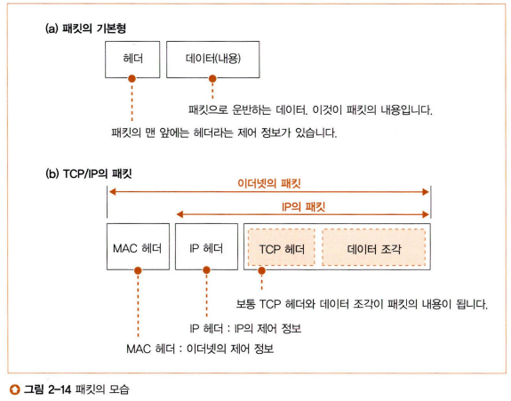
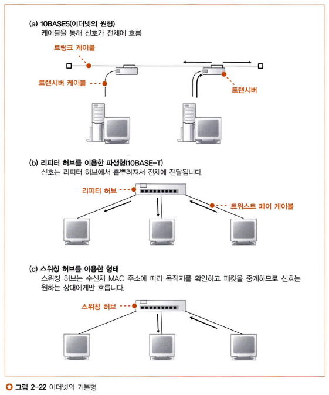
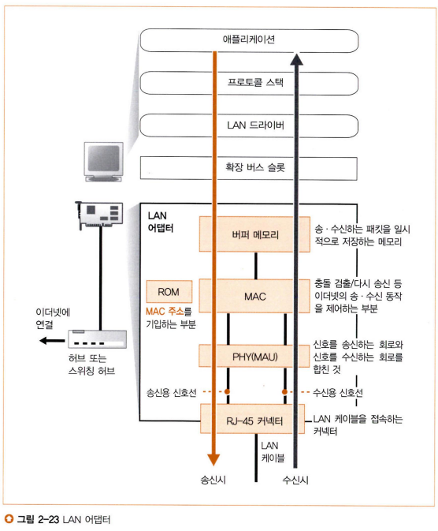
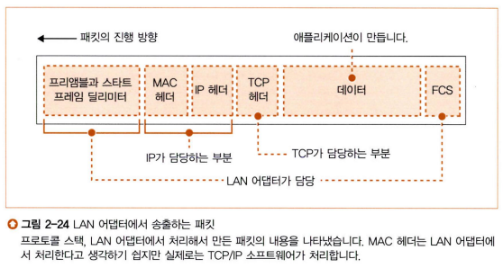
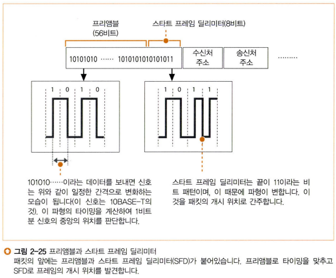
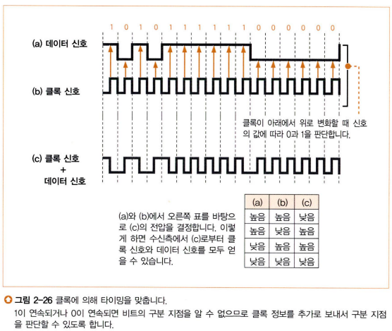

# 스터디 - 네트워크 스터디 4주차

## 개요
지난 주차에서는 프로토콜 스택의 소켓 통신 과정에 대해 알아보았다. 이번 주에는 IP와 이더넷의 패킷 송수신 동작에 대해 알아볼 것인데, IP와 이더넷은 프로토콜 스택과 달리 소켓 통신의 어느 과정에 있든 상관없이 항상 같은 작업을 수행한다. 따라서 소켓 통신 과정이 아닌 패킷 송수신 동작에 대해 알아보겠다.

---

## 패킷과 통신 과정 맛보기

### 패킷
TCP 부분에서는 통신 상대와 대화할 때 데이터를 패킷으로 만들어 전달한다. 이 패킷은 어떻게 이루어져 있는지 자세히 알아보자.  
  
  

패킷은 헤더와 데이터로 이루어져 있다. 헤더에는 통신에 필요한 제어 정보가, 데이터에는 애플리케이션에서 의뢰한 데이터가 들어있다. 하지만 그림의 (b)를 보면 한 패킷에 대해 헤더가 3개나 있다. 이 것은 여러 관점에 바라보면 중첩된 세 패킷으로 이해할 수 있다.  
  
제일 먼저 프로토콜 스택의 TCP 부분에서 애플리케이션으로부터 건네받은 데이터의 앞에 TCP 헤더를 부가하고 IP 부분에 넘겨준다. IP 부분에서는 넘겨받은 패킷(헤더+데이터)을 통째로 하나의 데이터로 취급하고 그 앞에 IP 헤더를 부가한 뒤 LAN 어댑터에 넘겨준다. 마지막으로 LAN 어댑터에서는 넘겨받은 IP 패킷의 앞에 다시 MAC 헤더를 부가하고 송신한다.  
  
각자의 관점에서는 데이터의 맨 앞에 헤더를 부가하기 때문에 세 패킷이 중첩된 구조로 이해할 수 있다. 하지만 실제는 조금 다른데, MAC 헤더, IP 헤더는 목적지를 찾을 때 사용되는 반면 TCP 헤더는 목적지에서 수행하는 작업에 사용된다. 따라서 이더넷과 IP의 통신 과정에서 MAC 헤더와 IP 헤더는 각각을 헤더로 취급하지만 TCP 헤더와 데이터는 함께 묶어서 데이터로 취급된다.

### 통신 과정
송신처가 패킷을 만들고 가장 가까운 중계 장치에 송신한다. 중계 장치는 헤더에서 패킷의 목적지를 조사하고 자신의 표에 어느 방향으로 기록되어 있는지 찾아 다음 중계장치로 송신한다. 이렇게 여러 중계 장치를 거치다 보면 결국 수신처에 패킷이 도착하게 된다. 이 구조는 TCPIP 네트워크 뿐만 아니라 여러 가지 패킷 통신 방식에 적합하다.

### 허브와 라우터
허브와 라우터는 패킷 중계 장치이지만 서로 역할을 분담하여 패킷을 운반한다.  
  
1. 라우터 목적지를 확인하여 다음 라우터를 나타낸다.
  - IP의 규칙에 따라 패킷을 운반한다.
  - IP가 목적지를 확인하여 다음 IP 중계 장치를 나타낸다.
  - IP 헤더 활용
2. 허브 서브넷 안에서 다음 라우터에 패킷을 송신한다.
  - 이더넷의 규칙에 따라 패킷을 운반한다.
  - 서브넷 안의 이더넷이 중계 장치까지 패킷을 운반한다.
  - MAC 헤더(이더넷용 헤더) 활용

### 통신 과정과 헤더
통신 과정을 좀 더 자세히 알아보자. 송신처에서 IP 헤더의 수신처 IP 주소에 대상 서버의 IP를 기록한다. 그리고 이 IP를 향하는 다음 라우터를 조사하여 MAC 헤더에 해당 라우터의 MAC 주소를 기록한다. 그렇게 패킷을 송신하면 허브에 도착하게 되는데, 허브에서 가지고 있는 이더넷 표를 조사하여 패킷의 목적지를 중계한다. 여기서 허브가 여러 개라면 여러 허브를 거치게 된다.  
  
이제 패킷이 허브로부터 다음 라우터에 도착하게 되는데, 라우터에서 가지고 있는 IP용 표를 조사하여 다음 중계할 라우터를 결정한다. 그리고 해당 라우터의 MAC 주소를 조사하여 이를 기록한 MAC 헤더를 기존 MAC 헤더와 바꿔치기하고 다음 라우터로 패킷을 송신한다.  
  
위의 두 동작(허브 - 라우터 - 허브 - ...)을 반복하다 보면 패킷이 목적지에 도착하게 된다.

### 역할을 분담하는 이유
왜 번거롭게 IP와 이더넷의 역할을 분리하여 설계하였는지 이해가 안갈 수 있다. 방대한 네트워크에는 이더넷뿐만 아니라 무선 LAN, FTTH 등 다른 프로토콜도 사용될 수 있다. 하지만 이더넷이 아닌 다른 프로토콜을 사용하게 되더라도 이더넷 헤더만 바꿔끼면 네트워크를 그대로 사용할 수 있게 된다. 따라서 TCPIP 네트워크에서 이더넷과 IP를 분리하는 이유는 확장성과 유연성 때문이라고 할 수 있다.

---

## 패킷 송수신 동작
통신 과정에 대해 전반적으로 훑어보았으니 이번에는 프로토콜 스택의 IP 부분의 관점에서 패킷 송수신 동작을 알아보겠다.  
  
### 패킷 송신 동작
제일 먼저 IP 부분은 TCP 부분으로부터 TCP 헤더와 데이터가 담긴 패킷을 전달받는다. 그럼 IP 부분은 이 앞에 IP 헤더를 부가하고 또 다시 그 앞에 MAC 헤더를 부가하여 LAN 어댑터로 송신하게 된다. 여기서 IP 헤더는 IP 주소로 표시된 목적지까지 패킷을 전달할 때 사용되는 제어 정보가 기록되고, MAC 헤더에는 이더넷 등을 통해 가장 가까운 라우터까지 패킷을 전달할 때 사용되는 제어 정보가 기록된다.  
  
이렇게 만들어진 패킷은 네트워크용 하드웨어(여기서는 LAN 어댑터로 설명)에 전달된다. 이 때 패킷은 0과 1의 비트의 연속으로 이루어진 디지털 데이터인데, LAN 어댑터에서 이를 전기나 빛의 신호로 변환하여 케이블에 송출하는 것이다.

### 패킷 수신 동작
패킷이 상대에게 도착하면 응답이 돌아올 텐데, 수신 동작은 송신 동작의 반대 서순으로 이해하면 쉽다. 먼저 신호 형태의 패킷이 들어오면 LAN 어댑터에서 이를 디지털 데이터로 변환하여 IP 부분으로 넘겨준다. IP 부분에서는 IP 헤더에 적힌 수신처 IP 주소가 자신이 맞는지 점검한 후 기존 패킷에서 MAC 헤더와 IP 헤더를 떼어낸 TCP 헤더 + 데이터 형태의 패킷을 TCP 부분으로 넘겨준다. 마지막으로 TCP 부분에서는 이전에 설명했던 작업을 수행하게 된다.

### 헤더를 헤더로 보지 않는다
패킷에는 세 가지 헤더가 들어있지만 이 중 각 부분에서 사용하는 헤더는 하나뿐이다. 따라서 각 부분에서는 자신이 관여할 헤더와 그 외 데이터로 구분하여 작업을 수행하기 때문에 (다른 헤더가 포함된)그 외 데이터 부분에는 무엇이 들어있든 전혀 신경쓰지 않는다.  
  
각 부분별 패킷의 해석 관점은 아래와 같이 생각할 수 있다.
- LAN 어댑터 MAC 헤더 + 데이터
  - 실제 패킷 MAC 헤더 + IP 헤더 + TCP 헤더 + 데이터
- IP 부분 IP 헤더 + 데이터
  - 실제 패킷 IP 헤더 + TCP 헤더 + 데이터
- TCP 부분 TCP 헤더 + 데이터
  - 실제 패킷 TCP 헤더 + 데이터

---

## IP 헤더
IP 부분에서는 제일 먼저 IP 헤더를 만들어 TCP 헤더 앞에 부가한다. 

### 수신처 IP 주소
IP 헤더에는 여러가지 제어 정보가 있지만, 그중에서 가장 중요한 정보는 수신처 IP 주소이다. TCP 부분으로부터 전달받은 상대의 IP 주소를 여기에 기록하는 것이기 때문에 잘못 전달받아도 난 잘못없어! 하면서 무시하고 그대로 진행한다.

### 송신처 IP 주소
송신처 IP 주소도 기록하게 되는데, 이 송신처 IP를 알아내는 과정이 생각보다 복잡하다. 뭐 그냥 자기 컴퓨터 IP 받아와서 기록하면 되는 거 아니야 라고 생각할 수 있겠지만... 맞다! 하지만 자세히 파고들면 쪼오금 복잡하다.  
  
사실 IP는 PC에 할당되는 것이 아니라 PC에 들어있는 LAN 어댑터에 할당되는 것이다. 그래서 LAN 어댑터에 할당된 IP 주소를 불러와 송신처 IP 주소로 기록하게 된다. 클라이언트 PC(개인 PC)의 경우 보통 LAN 어댑터가 하나만 장착되어 있기 때문에 이렇게 간단하게 진행되지만, 서버 PC의 경우에는 LAN 어댑터가 여러 개 장착되기 때문에 이 중 어느 IP 주소를 사용해야 할 지 골라야 한다.

### 라우팅 테이블(IP용 표, 경로표)
어떤 LAN 어댑터를 사용할지 고르는 기준은 라우팅 테이블이라는 것이다. 라우팅 테이블은 `route print` 커맨드를 입력하여 확인할 수 있다.  
  
우선 라우팅 테이블의 네트워크 대상(Network Destination) IP 목록에서 소켓의 수신처 IP 주소와 대조하여 IP 주소의 왼쪽부터 일치하는 부분을 찾아낸다.  
ex) 소켓에 기록된 수신처 `192.168.1.21`  라우팅 테이블의 네트워크 대상 중 하나 `192.168.0.0`  
  
그리고 해당 행에 대한 Interface 항목과 Gateway 항목을 참조함으로써 어느 LAN 어댑터의 IP 주소를 사용해야 할 지 정하게 된다.  

#### Interface
Interface는 LAN 어댑터 등의 네트워크 인터페이스이다. 인터페이스에서 패킷을 송신하면 상대에게 패킷을 전달할 수 있다.

#### Gateway
Gateway에는 다음 라우터의 IP 주소를 기록하게 되어 있다. 따라서 해당 라우터에게 패킷을 송신하면 라우터가 상대에게 패킷을 중계해 준다. Gateway는 TCPIP에서 라우터를 의미한다.

#### Gateway와 Interface가 일치하는 경우
Gateway와 Interface의 IP 주소가 일치하는 경우는 중간에 중계 라우터를 거치지 않고 상대에게 직접 패킷을 전할 수 있다는 뜻이다.

#### 기본 게이트웨이
라우팅 테이블의 맨 위에는 네트워크 대상과 넷마스크가 `0.0.0.0`으로 되어 있는 행이 있는데, 이를 기본 게이트웨이라고 한다. 다른 행 중에 전달하고자 하는 대상의 IP와 일치하는 행이 없는 경우에는 이 기본 게이트웨이를 이용하게 된다.

### 프로토콜 번호
IP 부분에서는 프로토콜 번호 필드에도 값을 기록한다. 여기에는 패킷 내용물이 어떤 종류인지 명시하면 되는데, 대표적으로 TCP는 0x06, UDP는 0x17을 기록한다.

### 기타 필드
IP 부분에서는 IP 헤더에 위에서 설명한 필드들 이외에도 값을 기록하지만 나중에 설명하겠다.

---

## 이더넷용 MAC 헤더
IP 부분에서는 IP 헤더를 만들어 패킷 앞에 붙였으니 다음으로 MAC 헤더를 만들 차례이다. IP 헤더에 기록했던 수신처 IP 주소를 통해 목적지를 알 수 있지 않나 실제로 우리는 그렇게 배웠다. 하지만 이 개념은 TCPIP의 개념이고, 이는 이더넷에서는 성립하지 않는다.  
  
따라서 이더넷에서 목적지를 찾기 위해 사용하는 것이 바로 MAC 헤더이다.  
  
MAC 헤더에는 수신처 MAC 주소와 송신처 MAC 주소, 그리고 이더 타입(EtherType)이 기록되어 있다. 수신처 주소와 송신처 주소는 주소가 MAC 주소라는 점을 제외하면 IP 헤더에서의 필드와 동일한 개념이라고 볼 수 있다. 이더 타입의 경우 낯설어 보이지만 사실 그 개념은 전혀 낯설지 않다. 이전에 IP 헤더에서의 프로토콜 번호는 패킷의 내용물의 종류를 나타낸다고 설명했었다. MAC 헤더의 이더 타입또한 MAC 헤더 이후에 나오는 패킷의 내용물(IP 헤더 + TCP 헤더 + 데이터)이 어떤 종류인지를 나타낸다. 이더넷의 내용물은 IP나 ARP라는 프로토콜 소켓이기 때문에 이에 해당하는 값을 이더 타입에 기록하게 된다.  

### 이더 타입
이더 타입은 간단하게 기록할 수 있다. 사용되는 프로토콜이 무엇인지 기록하면 되기 때문에 IP 프로토콜의 경우 `0x0800`을 기록한다.

### 송신처 MAC 주소
MAC 주소는 LAN 어댑터를 제조할 때 그 속의 ROM에 기록되기 때문에 송신처 MAC 주소는 LAN 어댑터의 MAC 주소를 기록해주면 된다. 하나의 PC 안에 여러 LAN 어댑터가 장착되어 있는 경우에는 송신처 IP 주소를 설정할 때와 같은 절차를 거쳐서 어느 LAN 어댑터를 사용할지 선택하여 해당 LAN 어댑터의 MAC 주소를 기록한다.

### 수신처 MAC 주소
LAN 어댑터는 수신처 MAC 주소를 MAC 헤더에 분명 기록해야 하지만 사실 이 시점에서 LAN 어댑터는 수신처의 MAC 주소를 알지 못한다. 따라서 이걸 구해야 하는데, 상대의 MAC 주소를 구하기 이전에 먼저 상대를 찾아야 한다.(여기서 상대는 목적지로 가는 경로의 가장 가까운 라우터이다.) 이는 라우팅 테이블에서 일치하는 행의 Gateway에 기록되어 있는 IP 주소에 해당하는 기기(라우터)이다.  
  
상대를 찾았으니 이제는 그 친구의 MAC 주소를 가져와야 한다. 여기서는 IP 주소를 통해 MAC 주소를 조사하는 동작을 ARP 동작을 수행한다.

---

## ARP로 수신처 라우터의 MAC 주소 조사
ARP(Address Resolution Protocol)는 브로드캐스트를 사용하여 MAC 주소를 조사하는 방법이다. 브로드캐스트란 연결되어 있는 전원에게 패킷을 보내는 것으로, 모두에게 특정 IP인지 묻는 패킷을 보내서 그 IP에 해당하는 기기(라우터)가 자신의 MAC 주소를 담아 응답 패킷을 돌려준다. ARP는 이러한 동작을 통해 MAC 주소를 얻을 수 있게 되는데, 이를 ARP 캐시라는 메모리 공간에 저장해 둔다. 그리고 나중에 다시 ARP를 통해 특정 IP의 MAC 주소를 찾고자 하게 되면 ARP 캐시에 보관되어 있는 값이 있는지 먼저 확인한다. 캐시의 특성상 시간이 지날수록 실제와 다를 가능성이 점점 높아지기 때문에 ARP 캐시는 보통 몇 분 정도가 지나면 보관해두었던 값을 무조건 제거한다.

### MAC 헤더를 IP 부분에서 작성하는 것이 맞는가
MAC(이더넷)과 IP는 분명 다르고, 이때문에 헤더도 분리했고, 라우터와 허브로 취급하는 기기도 나뉜다. 하지만 IP 헤더와 MAC 헤더를 분명 IP 부분에서 전부 작성하고 있다. 이 구조가 맞는지 의심이 갈 수 있다. 물론 그런 관점에서 보면 적절하지 않을 수 있지만, 확장성과 유연성의 측면에서 보았을 때는 적절하다고 할 수 있다. 프로토콜 스택의 IP 부분에서 작업이 끝나면 LAN 어댑터로 패킷을 넘기게 되는데, IP 부분에서 IP 헤더와 MAC 헤더를 모두 작성하면 LAN 어댑터는 완성된 패킷의 송신에 집중할 수 있게 된다. 이는 다시 말해 LAN 어댑터와 상관없이 프로토콜 스택만 교체하면 TCPIP 외의 다른 패킷도 송신할 수 있게 되는 것이다.

---

## 이더넷
IP 부분이 끝났으니 LAN 어댑터를 설명할 차례이지만, 그 전에 잠깐 이더넷에 대해 짚고 넘어가겠다.  
  
이더넷은 여러 컴퓨터가 여러 상대와 저렴하게 통신하기 위해 만들어졌다. 실제 네트워크는 케이블로 이루어져 있는데, 모든 PC가 하나의 케이블로 연결되어 있어 한 PC가 패킷을 보내면 해당 네트워크에 포함된 모든 PC가 그 패킷을 받게 된다(심지어 송신자마저도). 그래서 사실은 패킷의 수신자와는 상관없는 PC도 패킷을 받게 되지만, 여기서 수신처와 수신처가 아닌 PC를 구분하기 위해 이더넷에서는 MAC 주소를 사용한다. 받은 패킷의 MAC 헤더에 기록된 MAC 주소가 자신의 것과 일치하지 않는다면 해당 패킷을 자신의 것이 아니라고 판단하여 바로 폐기해버린다. 그럼 결국 수신처에 해당하는 PC만 해당 패킷을 수신하게 되는 것이다.  
  
  
  
이더넷의 형태는 시간이 흐를수록 진화해가고 있지만 기본적인 개념은 동일하다. 위 그림을 보면 (a)와 (b)는 케이블의 형태만 바뀌었을 뿐 모든 PC에 패킷이 전달되어 수신처가 패킷을 수신한다는 점에서 동일하다. (c)는 스위칭 허브에서 수신처 방향으로만 패킷을 보내주는 형태로 변경되었지만 이는 MAC 헤더에 기록된 제어 정보를 바탕으로 동작한다. 때문에 MAC 헤더를 기반으로 수신처에 패킷을 보내준다는 관점에서 보았을 때 (a), (b), (c)에서 MAC 헤더의 개념은 모두 동일하다고 할 수 있다.

### 이더넷과 TCP 동작 단계  
이더넷도 IP와 마찬가지로 패킷에서 자신이 관여하는 헤더 이외의 부분은 전부 데이터 덩어리로 취급해서 그 내용에 신경쓰지 않는다. 따라서 이더넷도 TCP의 동작 단계에 대해 상관없이 항상 동일하게 동작한다.

---

## IP 패킷을 전기나 빛의 신호로 변환하여 송신
이제 정말로 LAN 어댑터에 대해 알아보겠다. IP 부분이 작성한 패킷은 0과 1로 이루어진 디지털 데이터지만 실제 네트워크를 떠다니는 신호는 전기나 빛의 신호이다. 따라서 디지털 데이터를 전기나 빛 신호로 변환하는 작업이 필요한데, 이 변환 작업을 진행하는 것이 LAN 어댑터이다. 하지만 LAN 어댑터는 독립적으로 동작할 수 없고, LAN 드라이버 소프트웨어가 필요하다. 여기서 드라이버는 짐작하는 바와 같이 마우스나 키보드 등을 처음 꽂을 때 자동으로 설치되는 드라이버와 동일한 종류이다. LAN 어댑터는 하드웨어이기 때문에 전용 드라이버가 필요한데, 이는 LAN 어댑터 제조 업체가 준비한 전용 소프트웨어를 사용하게 된다. 유명한 제조 업체의 경우에는 해당하는 LAN 드라이버가 OS에 기본적으로 내장되어 있다!

### LAN 어댑터의 내부 구조
  
  
LAN 어댑터의 내부 구조는 위 그림과 같다.

### LAN 어댑터의 초기화
LAN 어댑터는 다른 하드웨어처럼 전원을 켜면 초기화 작업을 먼저 수행해야 하는데, 이는 LAN 드라이버가 수행한다. 초기화 작업에서는 다른 것도 많이 진행하지만, 특히 이더넷에서 송수신 동작을 제어할 때 필요한 MAC 주소를 설정하게 된다.

### MAC 회로
MAC 주소는 LAN 어댑터에 내장된 MAC 회로에 저장된다. 좀 더 자세한 절차를 알아보자.  
  
LAN 어댑터 안에는 ROM이 있는데, LAN 어댑터를 제작할 때 세계에서 유일한 MAC 주소를 여기에 기록해둔다. LAN 어댑터는 여기에서 MAC 주소를 읽어와 MAC 회로에 설정하는 것이다. 이렇게만 보면 LAN 어댑터의 전원을 켜자 마자 MAC 주소가 자동으로 할당될 것 같지만, 실제로는 LAN 드라이버가 초기화 작업을 하면서 LAN 어댑터 내의 ROM에 저장된 MAC 주소를 LAN 어댑터의 MAC 회로에 설정해주는 과정을 거칠 때 비로소 LAN 어댑터의 MAC 주소가 유효해진다.  
  
특별한 경우에는 별도의 명령이나 설정 파일을 통해 MAC 주소를 설정할 수 있지만, 겹치는 MAC 주소가 존재한다면 정상적으로 동작하지 않게 된다.  

---

## 패킷에 3개의 제어용 데이터 추가
LAN 어댑터가 무엇인지 알아보았으니 이번에는 LAN 어댑터가 하는 변환 작업에 대해 좀 더 자세히 알아보자. LAN 드라이버는 IP 패킷을 받으면 이를 LAN 어댑터의 버퍼 메모리에 복사한다. 그리고 MAC 회로에 패킷 송신 명령을 내리면 MAC 회로가 동작하게 된다.  
  
  
  
MAC 회로는 버퍼 메모리에서 송신 패킷을 꺼내서 앞에는 프리앰블과 스타트 프레임 딜리미터를 부가하고, 뒤에는 프레임 체크 시퀀스(FCS)를 부가한다.  

### 프리앰블(Preamble)
프리앰블은 수신 측에서 패킷을 읽을 타이밍을 재기 위해 부가한다. 1과 0이 연달아 이어지는 56비트(7바이트) 길이의 비트열이다(101010...). 불필요하게 패킷 길이를 늘리는 것이 아닌가 싶을 수 있지만, 수신측에서 패킷 신호를 해석하는 타이밍을 잡기 위해 반드시 필요하다. 1과 0을 번갈아 가며 제공함으로써 수신측이 각 비트신호 사이의 간격을 알 수 있도록 한다.  
  

### 스타트 프레임 딜리미터(SFD, Starting Frame Delimiter)
스타트 프레임 딜리미터는 프리앰블의 끝에 이어지는 8비트(1바이트) 길이의 비트열로, 10101011의 비트열로 구성되어 있다. 이는 마지막 비트가 11로 작성됨으로써 이 이후부터 실제 패킷 데이터를 송신하겠다는 뜻으로 사용된다. 이렇게 프리앰블 7바이트와 스타트 프레임 딜리미터 1바이트를 합해 총 8바이트가 패킷의 앞에 부가되는 것이다.

### 클록
이론적으로는 0000이면 0000, 1111이면 1111로 해석되어야 하겠지만 실제로는 힘들다. 연속되는 신호는 ----처럼 신호의 변동 없이 이어지게 되는데, 그러면 비트 구분이 힘들어지게 된다.  
  
  
  
이를 해결하기 위해 클록 신호라는 것이 필요하다. 클록은 0과 1이 일정한 간격을 두고 나열된 것인데, 이 신호를 데이터 신호와 함께 보냄으로써 수신측이 데이터의 간격을 구분할 수 있도록 돕는다.  
  
정확히는 클록의 신호가 0에서 1로 변화할 때 데이터 신호를 읽고 해석한다. 하지만 여기에도 치명적인 문제가 하나 남아있다. 송신측과 수신측 사이의 거리가 멀어지게 되면 케이블 길이가 달라져서 데이터 신호와 클록 신호의 전송 시간에 차이가 생길 수 있는데, 이 때 클록 신호와 데이터 신호의 도달 시간이 틀어져버리게 된다.  
  
하지만 똑똑한 사람들은 이마저도 해결방법을 찾아냈는데, 바로 데이터 신호와 클록 신호를 처음부터 합성해서 송신하는 것이다. 그렇게 하면 둘이 틀어질 일도 없어지기 때문에 수신측은 안전하게 신호를 해석할 수 있게 된다. 하지만 어떻게 이게 가능한 것일까  
  
데이터 신호와 클록 신호에 XOR 연산을 진행하면 된다. 그림을 잘 보면 클록 신호에서 신호가 변화하는 타이밍은 데이터 신호의 각 신호비트의 가운데 지점이다. 따라서 데이터와 클록에 XOR을 진행하게 되면 한 비트마다 신호 값이 반드시 변화하게 되고, 클록 신호로부터 데이터 신호를 복원할 수 있게 된다.  
  
여기서 중요한 점은 클록 신호의 타이밍을 재는 것이다. 클록 신호의 변화 주기는 이미 결정되어 있기 때문에 잠시 신호의 변화를 관찰하면서 타이밍을 파악해야 한다. 이를 위해 준비해둔 것이 프리앰블이다.

### FCS(프레임 체크 시퀀스, Frame Check Sequence)
패킷의 끝에는 오류 검출을 위한 FCS를 부가한다. 패킷 운반 도중에 잡음 등의 영향으로 인해 신호가 흐트러질 수 있는데, 이를 검출하기 위해 부가하는 것이다. 32비트(4바이트)의 비트열로 구성되며 CRC 등에 사용되는 오류 검사 코드를 사용하는데, 패킷의 맨 앞부터 맨 끝까지의 내용 중 1비트라도 내용이 초기와 달라지면 결과값이 달라지도록 설계되어 있다. 따라서 송신 시 계산한 값을 FCS에 부가하고 수신 시 수신된 패킷 내용을 기반으로 다시 계산한 후 둘의 내용이 다르면 패킷에서 오류가 검출된 것으로 판단하고 패킷을 폐기해버린다.

---

## 허브를 향해 패킷 송신
LAN 어댑터에서 패킷에 세 가지(프리앰블, 스타트 프레임 딜리미터, FCS)를 부가했으면 이제 실제로 케이블에 패킷을 송신할 차례이다. 패킷 신호를 케이블에 송신하는 방법에는 두 가지가 있는데, 리피터 허브를 사용하는 반이중 모드와 스위칭 허브를 사용하는 전이중 모드이다.

### 반이중 모드
먼저 반이중 모드에 대해 알아보자. 반이중 모드의 경우 이름에서 유추할 수 있듯이 송신과 수신이 동시에 이루어질 수 없다. 한 번에 하나의 신호만 이동 가능한 것이다. 따라서 신호를 송신하기 전에 먼저 해당 케이블에 이미 흐르고 있던 신호가 있는지 먼저 검사한다. 케이블 내에 신호가 없다면 바로 신호를 보내지만, 이미 신호가 있다면 그와 충돌하기 때문에 해당 신호가 끝날 때까지 기다린 후에 신호를 보낸다. 그렇게 송신이 끝날 때까지 들어오는 신호가 없다면 송수신 동작이 끝나게 되지만, 만약 송신 도중에 신호가 들어온다면 충돌이 나게 되어 송신을 중단하고 이를 알리기 위해 재밍 신호를 보낸다. 그리고 잠시 기다리고 나서 다시 송신을 진행한다. 여기서 잠시라는 대기시간이 일정하다면 아까 충돌을 일으킨 상대방과 다시 충돌이 일어날 것이기에 이 대기시간은 MAC 주소를 바탕으로 생성된 난수를 통해 계산된다.  
  
이렇게 대기시간을 정하고 다시 송신을 했지만 그럼에도 다시 충돌이 나면 대기시간을 2배로 늘려서 재송신해본다. 그래도 충돌이 나면 2배로 더 늘리고, 늘리고... 이렇게 총 10회까지 대기시간을 늘려 재송신해보고 그래도 안되면 오류로 판단하게 된다.
  
### PHY(MAU)
위에서 다른 신호가 들어오면 대기시간을 잡고 잠시 기다린 후에 재송신을 한다고 설명했는데, 이 일을 수행하는 것은 PHY(MAU) 회로라는 것이다. PHY(MAU) 회로는 송수신 신호 부분으로, MAC 회로가 전기 신호를 이곳으로 전달하면 이를 파형 등의 실제 케이블에 송출하는 형식으로 변환하여 송신한다.

### 전이중 모드
스위칭 허브를 전이중 모드는 반이중 모드와 달리 송신과 수신을 동시에 진행하지만 충돌이 일어나지 않는다. 그래서 케이블에 떠다니는 신호가 있든 없든 송신을 진행할 수 있다.

---

## 돌아온 패킷 수신
패킷 송신 동작은 이렇게 끝이 났고, 이제 패킷을 수신하는 동작에 대해 알아보도록 하자. 기본적으로는 송신의 반대로 생각할 수 있다.  
  
리피터 허브를 사용하는 반이중 동작의 이더넷에서는 1대가 신호를 보내면 같은 리피터 허브에 연결된 모든 케이블에 신호가 흘러간다. 다시말해 모든 PC는 자신의 패킷을 제외한 다른 목적지로 가는 패킷도 받게 된다.   
  
우선 신호의 맨 앞에 있는 프리앰블을 통해 신호를 해석할 타이밍을 잡아두고, 스타트 프레임 딜리미터가 나오면 그 다음 비트부터 신호를 디지털 데이터 형태로 변환하게 된다. 먼저 PHY(MAU) 회로에서 들어온 신호를 전기 신호로 변환하여 MAC 회로로 전달한다. MAC 회로에서는 이를 디지털 데이터로 변환하여 버퍼 메모리에 저장하는데, 신호를 다 읽으면 맨 끝의 FCS를 검사하여 패킷에 오류가 있는지 점검하여 오류가 있으면 패킷을 폐기한다.  
  
FCS에 문제가 없으면 MAC 헤더에 기록된 수신처 MAC 주소를 조사하여 자신의 MAC 주소(LAN 어댑터 초기화 시 설정된 값)와 일치하는지 점검함으로써 자신에게 오는 패킷인지 확인하고 버퍼 메모리에 저장한다. 물론 자신이 수신처가 아니라면 패킷을 폐기한다.  
  
LAN 어댑터에서 패킷을 송수신하는 동안 PC는 다른 일을 하고 있는데, 얘가 너무 바빠서 LAN 어댑터에서 PC에게 패킷을 수신했다는 말을 해주지 않으면 PC는 패킷을 수신했는지 모른다. 따라서 LAN 어댑터가 바쁜 PC에게 끼어들어서 자기한테 관심을 달라는 말을 해줘야 하는데, 이 동작을 우리는 인터럽트라고 부른다.  
  
좀 더 자세히 알아보자. PC의 CPU에는 인터럽트 컨트롤러를 통해 확장 버스 슬롯의 인터럽트용 신호선이 연결되어 있는데, LAN 어댑터는 패킷이 오면 이 인터럽트용 신호선에 신호를 보낸다. 그럼 CPU는 하던 일을 잠시 멈추고 OS 내부의 인터럽트 처리용 프로그램으로 와서 LAN 드라이버를 호출하고, 이게 다시 LAN 어댑터를 제어하면서 송수신 동작을 실행하게 된다.  
  
LAN 어댑터를 설치할 때 하드웨어에서 인터럽트에 번호를 할당하는데, 인터럽트 처리용 프로그램이 이 번호에 대응하도록 LAN 드라이버 소프트웨어를 등록한다. 따라서 LAN 어댑터가 인터럽트 동작을 수행하면 인터럽트 처리용 프로그램이 이 번호에 대응되는 신호선을 찾아 거기에 있는 LAN 드라이버를 호출하게 된다. 이 과정은 현재 PnP(Plug and Play) 기능이 생기면서 자동으로 수행되고 있다.  
  
LAN 드라이버가 동작하면 LAN 어댑터의 버퍼 메모리에서 수신한 패킷을 추출하여 MAC 헤더의 타입 필드를 조사하여 어떤 프로토콜을 사용하는지 판단한다. 물론 지금은 대부분 TCPIP 프로토콜을 사용하지만 옛날엔 다른 것도 썼기 때문에 이런 절차가 남아있다. LAN 드라이버는 타입 필드 값이 IP에 대응하는 값이라면 TCPIP 프로토콜 스택에 패킷을 넘겨주고, AppleTalk에 대응하는 값이라면 AppleTalk 프로토콜 스택에 패킷을 넘겨주는 것이다.

---

## 서버의 응답 패킷을 IP에서 TCP로 넘기기
LAN 드라이버를 통해 패킷은 TCPIP 프로토콜 스택으로 넘어가고, IP 부분에 도착할 것이다. IP 부분에서는 IP 헤더 부분에서 수신처 IP 주소를 조사하여 자신이 수신처임을 확인하고 패킷을 수신한다. 만약 수신처 IP 주소가 자신의 IP와 다르다면 IP 부분이 ICMP 메시지(Destinationi unreachable)를 통해 상대에게 오류를 통지한다.  
  
자신이 수신처가 맞다는 것을 확인한 후에는 조각 나누기(fragmentation, 프래그먼테이션)을 수행한다. 네트워크를 떠다니던 패킷은 특정한 부분에서 길이 좁아져서 패킷을 분할하여 이동하게 될 때가 있다. 이럴 때는 분할된 패킷의 IP 헤더에서 플래그를 설정하여 패킷이 분할된 것임을 표시하고 ID 정보에 동일한 ID를 작성한 뒤 프래그먼트 오프셋(fragment offset)에 패킷이 원래 어느 위치였는지 기록한다. 그리고 수신측 IP 부분에서는 분할된 패킷이 수신되면 이들을 버퍼 메모리에 모아두었다가 분할된 패킷이 모두 도착하면 하나로 합쳐 원본 패킷을 만들어내는데, 이를 리어셈블링(reassembling)이라고 한다.  
  
IP 부분에서는 리어셈블링까지 끝나면 패킷을 TCP 부분에게 전달한다. TCP 부분에서는 TCP 헤더에서 송신처와 수신처의 포트 번호를 찾아 해당하는 소켓을 찾고 그 소켓에 명시된 상황에 따라 동작을 수행한다. 이렇게 패킷의 수신은 끝이 난다.

---

## UDP 프로토콜
이번 주 내용을 마치기 전에 마지막으로 UDP 프로토콜에 대해 짧게 알아보자. 우린 지금까지 TCPIP 프로토콜에 대해서만 배워왔지만, 사실 UDP에 대한 내용도 쉽게 이해할 수 있게 되었다. TCPIP의 간단한 버전이라고 생각하면 되니 가벼운 마음으로 읽어보자.  
  
대부분의 애플리케이션은 TCPIP 프로토콜을 사용하지만 가끔은 UDP 프로토콜도 사용한다. 실제로 우리가 배운 내용 중에도 하나 있었는데, 바로 DNS 서버에서 IP 주소를 조회해올 때 사용되었다. TCPIP 프로토콜이 굉장히 강력한 프로토콜인 것 같은데, 이 좋은 걸 그냥 쓰면 되지 왜 굳이 UDP 프로토콜을 찾아서 사용하는 것일까  
  
---

## UDP 프로토콜을 사용하는 이유
UDP는 TCP의 복잡한 과정을 생략한 프로토콜이다. TCP는 매 번 데이터를 보낼 때마다 수신 확인 응답을 다시 보내주어야 했지만, UDP는 딱히 수신 확인같은 절차를 밟지 않는다. 이렇게 보내려면 어떻게 해야 할까 바로 데이터를 한 번에 전부 보내는 것이다. 이렇게 하면 수신 확인 응답같은 절차를 거치지 않더라도 상대로부터 응답이 없으면 모든 데이터를 다시 통째로 보내주면 그만이다. 어느 부분부터 패킷이 손실되었다거나 뭐 그런 복잡한 절차를 거치지 않아도 되는 것이다.  
  
그럼 어떻게 모든 데이터를 한 번에 보낼 수 있을까 답은 간단하다. 송신해야 하는 모든 데이터의 양이 하나의 패킷 안에 담길 수 있을 정도로 작으면 된다. 그럼 패킷 하나만 보내도 모든 내용을 송신하게 되고, 상대에게 응답이 오지 않으면 패킷 하나만 다시 보내는 것이 데이터를 전부 보내는 것이나 다름없게 되는 것이다. 또한 UDP에서는 상대에게 수신 확인 응답을 따로 받지 않고 돌아오는 응답을 그냥 수신 확인으로 퉁친다. 다시말해 패킷을 보내면 패킷이 돌아오고, 그걸로 통신이 끝나는 것이다. 이런 구조가 되면 TCP처럼 접속이나 연결끊기 단계를 따로 패킷을 보내면서 거치지 않아도 되서 그 구조가 TCP에 비해 훨씬 간단하게 구성되고 그만큼 통신도 가볍게 이루어진다. UDP는 TCP에 비해 송수신이 훨신 빠르고 가볍게 이루어지는 것이다.  
  
UDP 프로토콜의 송신 과정
1. 애플리케이션으로부터 송신할 데이터를 받는다.
2. UDP 부분에서 UDP 헤더를 부가한다.
3. IP 부분으로 송신을 의뢰한다.
  
위를 보면 송신 과정이 매우 간단해 보이는데, 수신 과정도 그만큼 간단하다. IP 헤더에서 IP 주소를 조사하고, UDP 헤더에서 포트 번호를 조사하여 해당하는 소켓을 찾아 대응하는 애플리케이션에 데이터를 넘겨준다. 그걸로 끝이다. 이 과정에서 어떤 오류가 발생하더라도 송신처에 어떠한 통지도 진행하지 않는다. 어차피 송신처는 응답이 돌아오지 않으면 송신 오류로 판단하고 다시 보내줄 것이기 때문이다.

---

## UDP의 효율적인 사용처
UDP를 왜 쓰는지는 알겠다. 하지만 패킷 하나에 담길 수 있을 정도의 데이터만 보내는 일은 생각보다 많지 않을 것 같은데 UDP는 어디에 사용되는 것일까  
  
1. 제어용 데이터
2. 음성 및 동영상 데이터
  
먼저 제어용 데이터를 송수신할 때 사용한다. 제어용 데이터는 보통 보내야 하는 내용이 길지 않아 한 개의 패킷으로 끝나는 경우가 많아서 UDP를 주로 사용한다.  
  
다음으로 음성 및 동영상 데이터를 송수신할 때 사용한다고 써있는데, 이건 아무리 생각해봐도 그 크기가 너무 크다. 일반 텍스트와는 비교도 안될 정도로 크다! 그런데 왜 이런 데이터의 송수신에 UDP를 사용한다는 것일까  
  
음성이나 동영상은 도중에 패킷 송수신이 지연되면 그대로 끊김 현상이 나타나게 된다. 스트리밍 서비스의 버퍼링과 같은 것이라고 생각하면 쉽다. 그런데 TCP에서는 패킷 하나하나 절대 놓치지 않으려고 여러 부가적인 절차를 거치게 되는데, 이때문에 버퍼링이 더 오래 발생하게 된다. 하지만 사람은 실제로 그렇게 크게 예민하지 않아서 음성이 잠깐 치직거린다거나 동영상에서 화질이 좀 안좋아져도 크게 개의치 않는다. 따라서 이 점을 이용하여 몇몇 패킷이 손실되더라도 빠르게 데이터를 송신할 수 있도록 UDP를 사용한다. 
  
위와 같이 다시 보낼 필요가 없거나 다시 보내도 쓸모가 없다면 UDP로 데이터를 송신하는 것이 더 효율적이다.

## 참고 자료
성공과 실패를 결정하는 1%의 네트워크 원리 - Tsutomu Tone, 출판사: 성안당
  - Chapter 2-5 ~ 2-6