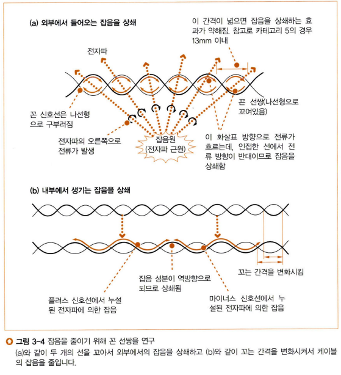
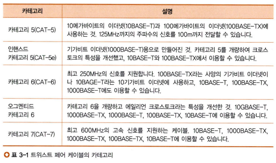
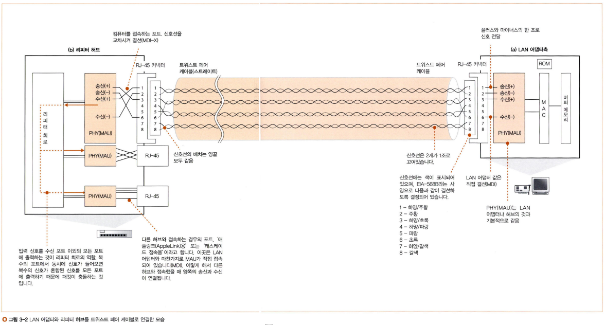
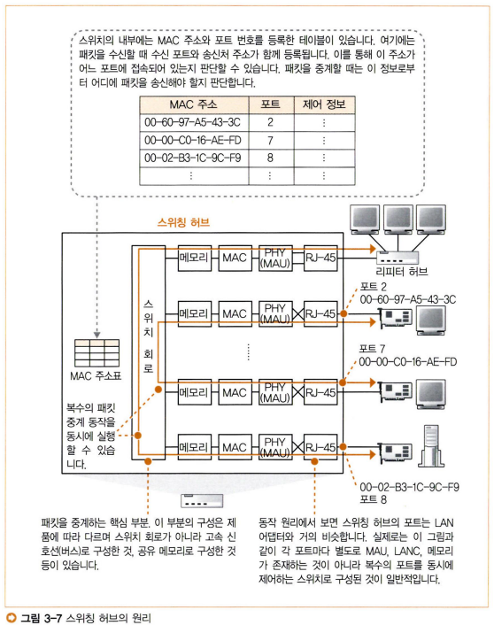
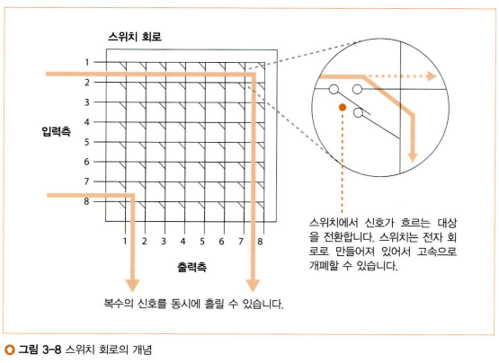
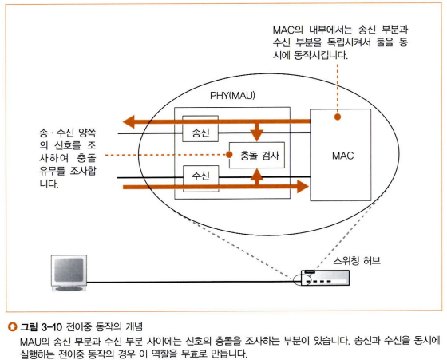
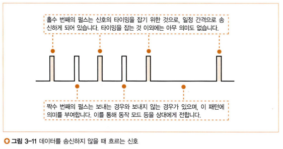
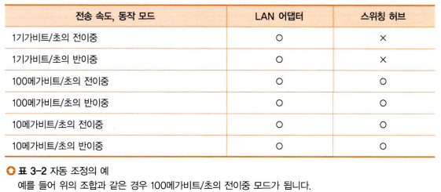

# 스터디 - 네트워크 스터디 5주차

## 이번 주에 다루는 내용

지난 주에 우리는 LAN 어댑터에서 패킷을 송신하는 부분에 대해 공부했다. LAN 어댑터에서 송신된 패킷은 케이블을 통해 이동하고 허브와 라우터를 거치게 되는데, 이번 주는 이에 대해 알아보겠다.

---

## LAN 케이블의 신호 약화

LAN 어댑터의 PHY(MAU) 회로에서 나온 패킷의 전기 신호는 RJ-45 커넥터를 통해 **트위스트 페어 케이블**에 들어가게 된다. 케이블을 통해 신호는 리피터 허브나 스위칭 허브의 RJ-45 커넥터 부분으로 전달된다. 하지만 케이블을 통한 신호의 전달 과정에서 신호가 점점 뭉개지게 된다. 원래는 각진 +와 -의 신호가 점점 각이 뭉개지고 잡음의 영향으로 파형이 왜곡되는 등 수신측이 해석하기 어렵게 변화한다. 어떻게 해야 이 문제를 해결할 수 있을까?

### 참고) 트위스트 페어 케이블

이름은 굉장히 낯설지만 의외로 여러분은 이를 알고 있다. 이 케이블은 랜선의 피복을 벗기면 나오는 둘씩 쌍지어 꼬인 4묶음의 신호선이다. 이들을 직접 본 적은 없을 수 있지만 랜선(LAN 케이블)의 끝 단자(RJ-45 커넥터)를 잘 보면 알록달록한 케이블들이 단자 끝에 찝혀져 있는데, 이들이 바로 트위스트 페어 케이블이다.

---

## 트위스트 페어 케이블의 잡음 최소화

잡음을 최소화하기 위해 나온 해결책은 두 개의 신호선씩 쌍을 지어 서로 꼬는 것이다. 이게 어떻게 잡음의 영향을 줄일 수 있다는 걸까? 우선 신호선에 미치는 잡음의 원인은 케이블 주위의 전자파이고, 전자파는 금속을 만나면 전자파 진행 방향에 대해 시계방향으로 전류가 흐르게 된다(=자기장이 형성된다)(렌츠 법칙, 전자기 유도). LAN 케이블은 금속으로 만들어져 있기 때문에 전자파에 노출되면 신호선 속 신호가 무너지게 된다. 하지만 두 신호선을 꼬게 되면 위 사진의 (a)와 같이 두 신호선에 대해 외부 전자파에 의한 잡음의 방향이 반대가 되는데, 두 신호선이 만나는 각 지점마다 잡음이 맞닿아 서로 상쇄된다.

잡음이 생기는 또 하나의 원인은 케이블 속 인접 신호선에 의해 발생하는 전자파이다. 신호선 속에 흐르는 신호도 전류이기 때문에 이에 의해 외부로 전자파가 발생하는데, 한 케이블 속에는 총 8개의 신호선이 뭉쳐있다. 따라서 서로의 신호에 간섭을 하게 되는데, 이를 **크로스토크(crosstalk)**라고 한다. 이에 대한 대책은 어떻게 해야 할까 고민이 되지만, 사실 두 신호선을 꼼으로써 이 현상도 최소화할 수 있다! 좀 더 정확히는 두 신호선을 꼬는 간격을 신호선 쌍마다 서로 다르게 잡는 것이다. 신호선 쌍마다 간격이 다르다면 어느 곳에서는 + 잡음이 발생하겠지만 또 어느 곳에서는 - 잡음이 발생하기 때문에 두 잡음이 서로 상쇄된다. 이렇게 각 신호선 쌍의 꼼 간격을 상이하게 조정하면서 여러 신호선 쌍이 한 케이블 속에 있더라도 이들의 크로스토크를 최소화할 수 있게 되는 것이다.

물론 신호선을 쌍을 지어 꼬는 방법으로 잡음을 줄일 수 있지만, 이 외에도 잡음을 줄이기 위한 여러 노력이 있다. 신호선 사이에 구분판을 넣거나 피복을 입히기도 하는 등 여러 가지 성능의 케이블들이 나왔고, 이에 따라 시중에 판매되고 있는 트위스트 페어 케이블에도 여러 카테고리가 존재하고 있다.

---

## 리피터 허브

허브는 리피터 허브와 스위칭 허브가 있는데 우선 리피터 허브에 대해 알아보겠다.

리피터 허브는 수신한 신호를 연결된 LAN 전체에 뿌려버린다. "전체에 패킷을 뿌리고 수신처만 패킷을 수신한다"라는 이더넷의 기본 원리에 충실한 것이다. 위 그림에서 왼쪽이 리피터 허브인데, 오른쪽에 있는 LAN 어댑터측의 "송신 단자"에서 보낸 신호를 리피터 허브의 "수신 단자"에서 받아야 한다. 하지만 양 쪽의 커넥터(RJ-45)는 똑같이 생겼기 때문에, PHY(MAU) 송수신 회로로 결선할 때는 한 쪽(오른쪽)은 직접 결선(1자로 연결), 나머지 한 쪽(왼쪽)은 교차 결선(선을 교차하여 연결)해야 한다. 이들을 각각 **MDI(Media Dependent Interface, 직접 결선)**와 **MDI-X(MDI-Crossover, 교차 결선)**라고 한다. 따라서 리피터 허브의 커넥터에는 MDI와 MDI-X를 전환할 수 있는 스위치가 내장되어 신호를 송신한 대상이 MDI냐 MDI-X냐에 따라 반대 형식으로 설정하게 된다. 허브에는 보통 MDI-X가 내장되어 있지만 허브끼리 통신해야 하는데 수신 허브가 MDI 스위치가 없는 MDI-X 형식이라면 허브에 접속할 때 **크로스 케이블**로 접속해야 한다.

### 참고) 크로스 케이블

크로스 케이블은 송신 단자와 수신 단자가 바뀌어 들어오도록 신호선을 찝은 케이블이다. 다음 예시를 살펴보자.

#### 기존(다이렉트 케이블, T568B:T568B, 양 측 커넥터 결선 형식이 동일한 경우)

| 대상   | 단자    | 번호 | 대상   | 단자    | 번호 |
| ------ | ------- | ---- | ------ | ------- | ---- |
| 송신측 | 수신(+) | 1    | 수신측 | 수신(+) | 1    |
| 송신측 | 수신(-) | 2    | 수신측 | 수신(-) | 2    |
| 송신측 | 송신(+) | 3    | 수신측 | 송신(+) | 3    |
| 송신측 | 송신(-) | 6    | 수신측 | 송신(-) | 6    |

위 예시는 양 측 모두 MDI-X(교차 결선)인 경우이다. 양 측이 송신과 수신이라는 다른 동작을 하지만 3번과 6번이라는 동일한 단자를 사용하게 된다. 이는 정상적으로 단자 연결이 되지 않을 것이고, 실제로 이런 경우에는 통신이 불가능하다.

#### 크로스 케이블(T568A:T568B, 양 측 커넥터 결선 형식이 다른 경우)

| 대상   | 단자    | 번호 | 대상   | 단자    | 번호 |
| ------ | ------- | ---- | ------ | ------- | ---- |
| 송신측 | 수신(+) | 1    | 수신측 | 수신(+) | 3    |
| 송신측 | 수신(-) | 2    | 수신측 | 수신(-) | 6    |
| 송신측 | 송신(+) | 3    | 수신측 | 송신(+) | 1    |
| 송신측 | 송신(-) | 6    | 수신측 | 송신(-) | 2    |

이번에도 양 측 모두 MDI-X이지만 이번에는 양 측의 커넥터 결선 형식을 바꾼 경우이다. 좀 더 정확히 말하자면 송신 단자와 수신 단자를 서로 바꾸었다. 이 경우 송신 측과 수신 측의 송수신 단자 번호가 서로 바뀌게 된다. 따라서 양 측 모두 MDI-X 형식을 갖고 있더라도 정상적으로 송수신이 가능해진다. 같은 원리로 양 측 모두 MDI인 PC 간 통신의 경우에도 크로스 케이블을 사용하면 중간에 허브같은 중계기를 끼지 않더라도 정상적으로 통신이 가능하다.

아무튼 다이렉트 케이블이든 크로스 케이블이든 사용해서 리피터 허브의 PHY(MAU) 회로까지 신호가 도착하면, 이제 리피터 허브의 리피터 회로에 들어간다. 네이밍부터가 허브 이름과 동일한 만큼 리피터 허브의 핵심적인 역할을 한다. 들어온 신호를 연결된 모든 케이블에 뿌리는 것이다. 직전에 올린 그림을 보면 리피터 회로의 내부 구조가 그려져 있는데, 여러 PHY(MAU) 회로 중 하나로 들어온 신호를 나머지 PHY(MAU) 회로로 전부 송신시키는 것이다.

---

## 스위칭 허브는 주소 테이블로 중계한다

지금까지 리피터 허브에 대해 알아보았으니 이번에는 스위칭 허브에 대해 알아보겠다. 스위칭 허브의 가장 큰 차이점은 수신한 신호를 모든 케이블에 송신하는 리피터 허브와 달리 수신한 신호를 목적지에 맞는 케이블에만 송신한다는 점이다.

스위칭 허브의 내부에는 LAN 어댑터와 흡사하게 RJ-45 커넥터, PHY(MAU) 회로, MAC 회로, 그리고 버퍼 메모리가 있고 이들이 다시 여러 묶음으로 스위치 회로에 이어진다. 여기서 각 묶음은 LAN 어댑터와 동일한 구조를 가지고 있기 때문에 LAN 어댑터라고 이해해도 좋다. 그리고 이러한 묶음을 각각 **포트**라고 부른다. 다만 포트와 LAN 어댑터의 차이가 하나 있는데, LAN 어댑터는 자신의 패킷이 아니면 폐기하는 반면 스위칭 허브는 수신측에 상관없이 일단 전부 받아들여야 한다. 자신에게 패킷이 도달했다는 것은 자신과 연결되어 있는 포트 중 하나로 수신측과 연결되어 있다는 뜻이다. 따라서 들어온 모든 패킷이 필요하기 때문에 자신의 MAC 주소와 일치하는지 여부를 확인하지 않는다. 따라서 **스위칭 허브의 포트는 MAC 주소를 가지지 않는다.**

리피터 허브는 들어온 신호를 모든 케이블에 송신하면 됐지만 스위칭 허브는 대상 케이블로만 송신해야 하기 때문에 대상을 특정할 수 있어야 한다. 여기에 사용되는 것이 위 그림에 나타난 MAC 주소표로, MAC 주소와 이에 대응하는 포트 번호가 등록되어 있다. 스위칭 허브에서는 패킷이 들어오면 수신측 MAC 주소를 확인하여 MAC 주소표에서 대응하는 포트 번호를 찾아 해당 포트로 패킷을 전달해준다.

### 스위치 회로

스위칭 허브가 수신측에 해당하는 포트로 패킷을 전달해주는 행위는 스위치 회로에서 일어나게 된다. 위 그림에서 입력측은 수신측 포트, 출력측은 송신측 포트에 접속되어 있다. 입력측으로 패킷이 수신되어 들어오면 수신측 MAC 주소를 통해 어느 포트로 내보낼지 판단한 후 해당 출력측으로 이어지도록 수많은 스위치가 조정된다. 각 스위치는 독립적으로 움직이기 때문에 신호가 중복되지 않는 한 **여러 신호를 동시에 제어할 수 있다.**

### 포트의 동작

각 포트는 LAN 어댑터와 같이 신호의 송신과 수신을 동시에 수행할 수 없다. 따라서 LAN 어댑터처럼 송신 전에는 다른 신호를 수신중인지 확인하고, 충돌이 나면 재밍신호를 보내고 기다렸다가 다시 보내기도 한다.

---

## MAC 주소 테이블을 등록 및 갱신한다

스위칭 허브는 MAC 주소표를 가지고 수신측을 판단한다고 했는데, 그럼 MAC 주소표의 정보들은 어떻게 등록되는 것일까? MAC 주소표의 갱신에는 두 가지 동작이 있다.

### MAC 주소 등록

MAC 주소표에 정보를 등록하는 과정은 간단하다. 패킷이 스위칭 허브에 도착하면 이를 **수신한 포트**와 **송신처 MAC 주소**를 짝지어 MAC 주소표에 등록한다. 이렇게 하면 나중에 해당 MAC 주소로 보내는 패킷이 들어왔을 때 수신했던 포트로 패킷을 넘기면 되는 것이다.

문제는 MAC 주소표에 등록되지 않은 MAC 주소로 패킷을 송신해야 할 때이다. 스위칭 허브에 패킷이 도달했다는 것은 다시말하면 스위칭 허브에 연결된 포트 중 하나는 수신측이 있다는 것인데, 이를 이용하여 수신한 포트를 제외한 모든 포트에 패킷을 송신한다. 그럼 수신측이 패킷을 받게 될 것이고, 일반적으로는 잠시 후에 수신측이 송신측으로 다시 패킷을 송신할 것이다. 이 때 스위칭 허브가 다시 패킷을 받은 포트 번호와 MAC 주소를 MAC 주소표에 등록하게 되면 이후에는 MAC 주소가 MAC 주소표에 등록되어 스위칭 허브가 수신측을 판단할 수 있게 되는 것이다.

### MAC 주소 제거

노트북처럼 자주 옮겨다니는 경우에는 접속하는 허브가 매 번 달라질 것이고, 그럼 스위칭 허브가 가진 MAC 주소가 성립하지 않게 될 것이다. 그럼 스위칭 허브는 존재하지도 않는 곳으로 패킷을 보내려고 할 것이고 통신이 실패할 것이다. 따라서 오래된 정보는 캐시와 비슷한 이유로 제거해주어야 하는데, 노트북을 옮겼다는 정보를 스위칭 허브에 알릴 방법은 없기 때문에 스위칭 허브는 그저 MAC 주소표에 정보가 등록된 지 몇 분이 지나면 알아서 다시 지우는 것으로 대처하고 있다. 오래된 정보가 지워지기 전에 이전 방향으로 패킷이 전달되는 경우가 간혹 있는데, 이런 경우에는 스위칭 허브를 리셋하면 MAC 주소표가 전부 날아가므로 해결할 수 있다.

이렇게 MAC 주소표의 내용은 알아서 갱신과 삭제가 이루어지고 정보가 잘못되어있어도 리셋을 해버리기 때문에 우리가 수동으로 갱신해줄 필요가 없다. 그래서 저렴한 기기는 수동 갱신 기능을 아예 지원하지 않기도 한다.

---

## 예외적인 동작

스위칭 허브에는 예외적인 상황이 연출되기도 한다. 분명 패킷을 수신받았는데 MAC 주소표를 조사해보니 전달해줄 대상 포트가 방금 패킷을 수신한 포트로 잡혀있다던가 하는 상황이다. 이는 스위칭 허브에게 패킷을 넘긴 포트를 제외한 어느 포트도 수신측이 아닌 상황으로, 이 스위칭 허브에는 수신측이 연결되어 있지 않다고 할 수 있다. 패킷은 수신측을 향해 나아갈 터인데 어째서 스위칭 허브에 무관한 패킷이 도달했는가를 생각해보면 한 가지가 떠오른다. 바로 리피터 허브다. 리피터 허브는 대상이 수신측이든 말든 연결된 케이블로 패킷을 전부 뿌려버린다. 따라서 상관도 없는 스위칭 허브로 패킷이 도달하는 상황이 발생하게 되는 것이다.

만약 이 때 스위칭 허브가 받은 패킷을 다시 같은 포트로 쏴버린다면 어떻게 될까? 리피터 허브의 관점에서 보면 스위칭 허브를 포함한 여러 케이블로 패킷을 뿌렸을 것이고, 스위칭 허브로부터 다시 패킷을 받아서 이를 또 뿌릴 것이다. 그럼 같은 패킷이 네트워크에 두 개 존재하게 되는 것인데, 이는 무의미하기 때문에 스위칭 허브에서는 수신 포트와 송신 포트가 동일한 패킷을 받을 경우 이를 중계하지 않고 폐기하게 된다. 그래서 최초에 MAC 주소를 등록하기 이전에 패킷을 모든 포트에 뿌릴 때도 수신한 포트에는 패킷을 보내지 않는다.

---

## 전이중 모드에서 송신과 수신을 동시에 실행한다

기억날지 모르겠지만 아까 스위칭 허브에서는 동시에 여러 패킷의 운반이 가능하다고 언급했다. 스위치 회로가 여러 스위치들로 이루어져 있기 때문에 신호가 중복되지 않는 한 여러 패킷의 운반이 가능하다는 것이다. 때문에 스위칭 허브는 송신과 수신을 동시에 진행하는 **전이중 모드**를 지원한다고 할 수 있다. 리피터 허브의 경우는 여러 곳에서 한 번에 신호를 받으면 내부의 리피터 회로에서 패킷들끼리 충돌이 나서 신호가 파괴되어 한 번에 한 가지 일만 수행할 수 있다. 이를 **반이중 모드**라고 한다.

원래는 신호가 흐르고 있으면 송신이 불가능하다는 것이 이더넷의 규칙이었지만, 신호가 흐르고 있어도 송신이 가능하다는 전이중 모드가 추가되었다. 전이중 모드로 동작중일 때는 신호 충돌 검출 회로를 무효화한다.

### 트위스트 페어 케이블과 전이중 모드

아무리 허브가 전이중 모드를 지원한다고 해도 케이블이 지원하지 않으면 전이중 모드는 불가능하다. 그럼 트위스트 페어 케이블도 전이중 모드를 지원해야 할텐데, 실제로 이를 지원하고 있다.

트위스트 페어 케이블은 3번째 그림의 트위스트 페어 케이블 모습을 보면 알 수 있듯이 신호선 자체가 이미 송신과 수신의 신호선으로 구분되어 있다. 따라서 송신과 수신 신호가 독립적으로 흐르기 때문에 서로 충돌하지 않는다!

---

## 최적의 전송 속도로 보내는 자동 조정

네트워크 상에서 최대한 전송 속도를 빠르게 유지하기 위해 **자동 조정(auto negotiation)**이라는 기능이 생겼다. 이더넷에서는 데이터가 흐르고 있지 않을 때 **링크 펄스**라는 펄스 신호를 흘려서 정상 동작중인지 확인하는데, 이 펄스 신호를 통해 기기의 상태까지 전달할 수 있다. 그리고 이 링크 펄스를 통해 자동 조정이 이루어지게 된다.

PC와 리피터 허브가 연결되어 있다고 가정해보자. 각 기기의 전원이 켜지고 초기화가 완료되면 그 때부터 각자의 링크 펄스를 보내기 시작하는데, 펄스 신호가 자신에게 들어오면 이를 해석하여 해당 기기의 지원 속도와 동작 모드를 확인하고 둘 사이에서 통신 가능한 최고의 통신 조합을 설정한다.

위 그림을 기준으로는 위에서 아래로 통신 조합의 우선순위가 매겨진다. 속도가 빠른 전이중 > 반이중 > 느린 전이중 > 반이중 의 순서대로 우선순위가 매겨진다고 할 수 있다. 또한 위 그림은 LAN 어댑터와 스위칭 허브가 각각 지원하는 전송 속도와 동작 모드에 대해 예시를 든 것인데, 이 경우에는 둘이 동시에 지원하는 최고의 조합인 100Mbps 전이중 모드로 각각의 기기가 세팅된다.

---

## 참고 자료

성공과 실패를 결정하는 1%의 네트워크 원리 - Tsutomu Tone, 출판사: 성안당

- Chapter 3-1 ~ 3-2
  [UTP 크로스와 다이렉트 케이블의 차이](https://sengsung.tistory.com/39)
