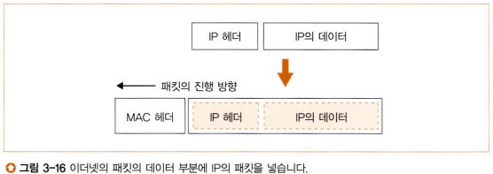

# 스터디 - 네트워크 스터디 6주차

## 라우터
지난 주에는 허브에 대해 배웠다. 허브를 거친 패킷은 라우터에 도달하게 되는데, 이번 주에는 이 라우터에 대해 알아보겠다.  
  
스위칭 허브는 내부에 MAC 주소표를 가지고 이를 기반으로 패킷을 넘길 포트를 판단했다. 라우터도 이와 비슷하다. 내부에 라우팅 테이플을 가지고 이 내용으로 패킷을 넘길 포트를 판단한다. 하지만 자세히 살펴보면 스위칭 허브는 이더넷(MAC)에 근간을 두고 라우터는 IP에 근간을 두기 때문에 테이블 내용 등 여러 차이점이 존재한다.

### 라우터의 내부 구조
  
  
라우터는 기본적으로 **중계 부분**과 **포트 부분**으로 나뉜다. 그 역할은 스위칭 허브의 그 것과 같이 이해할 수 있다. 또한 라우터의 포트 부분은 장착하는 하드웨어에 따라 이더넷이 아니라 다른 통신 기술도 지원할 수 있다.  
  
라우터에서 패킷을 수신하면 해당 포트의 통신 규칙을 따르게 된다. 포트를 거쳐 중계 부분으로 오면 여기서 패킷의 수신처 IP 주소와 라우팅 테이블을 비교한 뒤 중계 대상을 판단한다. 마지막으로 중계 대상 포트로 패킷을 넘기고 해당 포트의 통신 규칙에 따라 패킷 송신을 수행한다.  
  
여기서 중요한 점을 하나 짚고 넘어가겠다. 한 포트에서 패킷을 수신했고 또 다른 포트에서 패킷을 수신한다. 여기에 등장하는 포트들은 각각을 "중계자"가 아니라 "수신처"와 "송신처"로 인지하는 것이 적절하다. 이를 위해 라우터의 각 포트에는 IP 주소와 MAC 주소가 할당된다. 덕분에 스위칭 허브는 중계자로써 패킷을 전달하지만 라우터는 각 포트 스스로가 수신처가 송신처가 되어 직접 패킷을 송수신할 수 있다. 이에 대해서는 잠시 후에 다시 다루겠다.

---

## 라우팅 테이블
스위칭 허브와 라우터가 내부의 테이블을 통해 중계 대상을 판단한다는 근간은 같지만 실제 테이블의 모습은 많이 다르다. 스위칭 허브는 수신처 MAC 주소로 중계 대상을 판단하는 반면, 라우터는 수신처 IP 주소로 중계 대상을 판단하기 때문이다.  
  
  
  
### 수신처(Destination)
수신처 항목에는 중계할 수 있는 대상 IP 주소가 명시되어 있는데, IP 주소가 그대로 들어간 것이 아니라 네트워크 부분 비트만 들어가 있다. 호스트 부분 비트는 전부 0으로 지운 것이다. 이는 특정 위치를 가리키는 것이 아니라 여러 PC가 있는 서브넷을 묶어서 표현한 것이다. 실제 패킷이 들어오면 수신처의 맨 뒤부터 시작해서 제일 먼저 일치하는 행을 찾는다. 제일 먼저 일치하는 행일수록 네트워크 번호가 구체적인 수신처로, 그 곳은 호스트 번호가 작을 수밖에 없다. 다시 말해 해당 서브넷에는 포함된 PC가 적다는 뜻이므로 그 수신처를 이용하는 것이 제일 효율이 좋다.

### 넷마스크(Netmask)
앞서 설명에서는 수신처 항목에서 호스트 번호를 버리고 네트워크 번호만큼의 부분만 사용한다고 했는데, 어디까지가 네트워크 번호를 나타내는 비트인지 정확히 알기 위해서는 넷마스크가 반드시 필요하다. 이에 대한 자세한 설명은 "네트워크 스터디 1주차 - 서브넷 마스크" 부분에서 설명했으니 기억이 나지 않는다면 참고하자.

### 주소 집약
수신처에는 서브넷을 기록한다고 했는데, 모든 서브넷을 전부 라우팅 테이블에 기록하게 되면 테이블이 비효율적으로 구성되게 된다. 예를 들어 IP 주소 및 넷마스크가 각각 `1.1.1.0/24`, `1.1.2.0/24`, `1.1.3.0/24`이고 셋의 게이트웨이가 동일하다고 가정해보자. 이를 모두 라우팅 테이블에 기록하게 되면 목적지(게이트웨이)가 같음에도 불구하고 3행이나 차지하게 된다. 이런 경우에는 세 서브넷의 공통부분을 따서 `1.1.0.0`으로 수신처 IP를 기록하고 넷마스크를 16(네트워크 부분 비트 수가 줄어들었기 때문)으로 기록한다. 이렇게 되면 중계 동작은 정상적으로 수행 가능하면서도 라우팅 테이블에 정보를 효과적으로 기록할 수 있다.

### 라우팅 테이블의 수신처에 PC를 등록하는 방법
넷마스크를 이용하면 라우팅 테이블의 수신처 IP 주소에 서브넷뿐만 아니라 특정 PC도 기록할 수 있다. 넷마스크를 `255.255.255.255`로 잡게 되면 수신처 IP 주소의 모든 비트를 비교 대상에 포함시키게 되기 때문에 특정 PC 주소를 가리킬 수도 있게 된다.

### 게이트웨이(Gateway)와 인터페이스(Interface)
인터페이스는 라우터 내에 있는 포트와 같은 의미이고, 게이트웨이는 중계 대상 라우터의 IP 주소이다. 수신처와 넷마스크로 중계 대상에 해당하는 행을 찾아내면 이에 대응하는 "인터페이스"의 "게이트웨이" IP 주소에 해당하는 라우터에 패킷을 송신한다.

### 메트릭(Metric)
메트릭은 목적지를 향한 거리를 나타낸다. 작을수록 가깝고, 클수록 멀다. 따라서 동일한 중계 목적지 후보가 여럿이라면 이 중 메트릭이 작은 쪽을 선택한다.

### 라우팅 테이블 갱신
패킷을 중계할 때마다 MAC 주소표를 갱신하는 스위칭 허브와 달리 라우터에서는 패킷을 중계할 때 라우팅 테이블을 자동으로 갱신해주지 않는다. 라우팅 테이블은 사람이 수동으로 갱신해주거나 라우팅 프로토콜을 통해 라우터들 간에 서로 경로 정보를 교환하는 식으로 테이블을 갱신한다. 여기서 라우팅 프로토콜은 RIP, OSPF, BGP 등 여러 가지가 존재한다.

---

## 라우터의 패킷 수신 동작
이렇게 라우터의 전반적인 동작 과정과 중계 방법을 간단하게 알아보았다. 이제 세부적으로 알아볼텐데, 우선 패킷 수신 동작에 대해 먼저 알아보자. 여기서 설명하는 모든 내용은 이더넷에 기반을 두고 설명한다.  
  
라우터의 패킷 수신부는 "포트(인터페이스)"로, PC의 LAN 어댑터와 거의 동일한 구조를 지니고 있다. MAC 주소 할당 여부를 제외하면 스위칭 허브의 포트와도 굉장히 비슷하다. 패킷 신호가 RJ-45 커넥터로 들어오면 PHY(MAU)회로를 거치면서 디지털 데이터화되고, MAC 회로를 거치면서 포트 자신에게 할당된 MAC 주소와 패킷의 수신처 MAC 주소가 일치하는지 확인한다. 물론 수신 과정중에 FCS에서 오류가 검출되거나 자신이 수신처가 아니라는 판단이 되면 패킷을 폐기해버린다.

---

## 경로표를 검색하여 출력 포트를 발견한다

### MAC 헤더 폐기
패킷 수신 동작이 끝나면 패킷 앞에 있는 MAC 헤더를 폐기해버린다. MAC 헤더에 기록되어 있던 수신처 MAC 주소는 자신으로 되어있으니 이 역할은 완료되었다. 따라서 MAC 헤더를 새로 작성해주어야 하기 때문에 수신이 끝나면 우선 MAC 헤더를 폐기하는 것이다.  
  
### 패킷 중계 동작
라우터는 IP를 기반으로 동작한다고 언급했었다. 중계 대상을 IP로 정하기 때문이다. 패킷 수신 동작을 마친 라우터는 이제 패킷 중계 동작을 수행한다. 중계 대상을 라우팅 테이블을 통해 찾아내야 하는데, 자세한 동작 과정은 이전에 설명했기 때문에 간단하게 언급하겠다.  
  
### 수신처와 넷마스크
우선 수신한 패킷의 수신처 IP 주소를 "수신처"와 비교하여 해당하는 행을 찾는다. 이 때 "넷마스크"에 기록된 비트만큼만 비교한다. 이 결과로 여러 행이 나올 수 있는데, 이런 경우에는 먼저 네트워크 번호의 길이를 비교해본다. 네트워크 번호 길이가 더 긴쪽을 선택하게 되는데 이는 해당 서브넷 내에 존재하는 호스트 수가 적다는 뜻이고, 다시말해 중계가 훨씬 효율적으로 이루어질 수 있다고 할 수 있다.  
  
### 메트릭
그런데 네트워크 번호 길이마저도 같은 행이 여럿 존재하는 경우도 있을 것이다. 혹시 모를 통신 간 예외 상황을 상정하여 우회로를 두는 경우가 이런 경우이다. 이 때는 "메트릭" 값을 기준으로 행을 선택한다. 메트릭 값이 작을수록 가까이 있는 것이기 때문에 메트릭 값이 작은 행을 선택한다.  
  
### 라우팅 테이블에 중계 후보가 없다면
라우팅 테이블에 중계 후보가 여럿인 경우를 알아보았지만 중계 후보가 하나도 없다면 어떨까? 스위칭 허브에서는 모든 포트에 패킷을 뿌리고 응답 패킷을 통해 주소표를 갱신했다. 하지만 라우터에서는 같은 방법을 사용해서는 안된다. 스위칭 허브는 연결된 네트워크 상정 규모가 많아야 수천 대여서 모든 포트에 패킷을 뿌려도 네트워크에 큰 영향을 주지 않는다. 하지만 라우터가 상정하는 네트워크 규모는 "인터넷", 전 세계이다..! 따라서 전 세계의 모든 라우터가 중계 후보가 없을 때마다 모든 포트에 패킷을 뿌리게 되면 네트워크에는 수많은 패킷이 뿌려져 금방 혼잡해지고 마비될 것이다.  
  
그래서 라우터는 중계 후보가 없다면 스위칭 허브와 달리 수신한 패킷을 폐기하고 송신처로 ICMP(Internet Control Message Protocol, 패킷 전달 시 오류 통지 or 제어용 메시지를 보낼 때 이용) 메시지를 보낸다.

---

## 해당하는 경로가 없는 경우에 선택하는 기본 경로
방금 설명했듯이 라우팅 테이블에 등록해두지 않은 행에 대해서는 ICMP 메시지를 보내고 패킷을 폐기해 버린다. 그럼 전 세계로 라우팅하고자 하는 서버의 경우는 어떻게 해야 할까? 전 세계의 모든 라우터와 수신처를 라우팅 테이블에 등록해야 할까? 이런 경우를 위해 라우터에서는 기본 경로 기능을 제공하고 있다.  
  
라우팅 테이블에서 넷마스크는 비교할 비트 수를 나타낸다고 했다. 그래서 모든 비트를 1로 설정하면 특정 PC를 가리킬 수도 있다고 했다. 이 개념을 반대로 응용해보자. 넷마스크의 모든 비트를 0으로 설정하면 어떻게 될까? 수신처 IP 주소와 하나도 비교를 수행하지 않고도 해당 행을 중계 대상으로 간주할 수 있게 된다. 이러한 경로를 **기본 경로**라고 하고 여기에 등록된 게이트웨이(라우터)를 **기본 게이트웨이**라고 한다.  
  
중계 대상이 여럿일 경우 넷마스크에서 네트워크 번호 비트가 많은 후보를 선정한다고 설명했었다. 기본 경로는 네트워크 번호 비트 수가 0개이기 때문에 항상 다른 중계 후보가 없는 경우에만 마지막으로 선정되어 중계 대상이 된다.

---

## 패킷은 유효 기간이 있다
패킷의 IP 헤더에는 **TTL**(Time To Live, 생존기간)이라는 필드가 있다. 이건 패킷의 생존 기간으로, 라우터를 경유할 때마다 1씩 줄어들다가 0이 되면 패킷을 폐기한다. TTL은 처음 송신처에서 64나 128로 설정되고 패킷이 송신되고, 이후 따로 갱신되지 않는다. 패킷이 잘 송신되다가 거리가 멀어서 TTL이 0이 되어버려 도중에 패킷이 폐기되면 어떡하나? 라는 생각을 할 수도 있다. 하지만 지구 반대편까지 이어지는 라우터 수는 많아야 수십 개 정도로 수신처까지 충분히 도착할 수 있다.  
  
패킷에 이러한 유효 기간을 설정하는 이유는 무엇일까? 이는 패킷이 특정 경로를 반복해서 순환하는 상황을 막기 위해 설정된다. 물론 라우팅 테이블에 정보가 정상적으로 등록되어 있다면 이런 상황은 일어나지 않는다. 하지만 라우팅 테이블에 등록된 정보에 오류가 있거나 기기의 고장 등으로 중계 대상이 우회로로 전환되는 경우에는 일시적으로 경로가 혼란에 빠질 수 있는데, 이 때 패킷이 순환하는 상황이 생길 수 있다.

---

## 큰 패킷은 조각 나누기 기능으로 분할한다
라우터 포트 부분에는 여러 프로토콜을 지원하는 하드웨어가 장착될 수 있는데, 프로토콜 별로 지원 가능한 패킷 최대 길이가 다르다. 이 때 송신부 포트의 패킷 최대 길이가 중계하려는 패킷의 길이보다 작을 수 있는데, 그러면 패킷을 그대로 송신할 수 없게 된다. 이런 경우를 위해 IP 프로토콜에 규정된 것이 **조각 나누기(fragmentation)** 기능이다. 조각 나누기 기능을 수행하여 패킷을 분할하여 작게 만든 후 중계한다.

### TCP 데이터 분할과의 차이점
TCP에서도 데이터를 조각으로 분할하여 패킷에 담지만, 라우터에서 다루는 조각 나누기 기능은 이와 다르다. TCP에서는 데이터 조각 앞에 TCP 헤더를 부가하지만, 라우터에서는 "TCP 헤더 + 데이터"를 하나의 "데이터"로 보고 나눈다. 따라서 어떤 패킷에는 TCP 헤더와 데이터 일부분이, 어떤 패킷에는 TCP 헤더 없이 데이터만 일부분이 담길 수 있는 것이다.  
  
  

### 조각 나누기(fragmentation) 과정
1. 송신(출력) 포트의 MTU를 조사하여 중계할 패킷을 그대로 보낼 수 있는지 확인
  - 중계 패킷의 (이더넷의 경우 MAC)헤더를 폐기했기 때문에 송신 포트의 프로토콜 헤더 길이만큼을 중계 패킷에 더하여 계산한다.
2. 송신 포트의 MTU가 패킷보다 작다면 중계 패킷의 IP 헤더에 있는 "플래그" 필드를 조사하여 분할 가능한 패킷인지 확인한다.
3. 패킷 분할이 가능하다면 데이터 부분을 맨 앞부터 차례대로 잘라낸 후 IP 헤더를 덧붙인다.
    - 이 때 IP 헤더는 복사한 것을 붙이지만 조각 나누기 관련 정보를 기록하기 위해 일부 필드는 고쳐쓴다.
    - TCP 헤더는 IP 기준 데이터 부분이기 때문에 데이터로 간주한다.
  
만약 패킷 분할을 해야 하지만 "플래그" 필드로 인해 분할이 불가능하다면 패킷을 폐기하고 ICMP 메시지를 송신처로 보낸다.

---

## 라우터의 송신 동작은 컴퓨터와 같다
이제 패킷을 송신할 준비가 끝났으니 패킷 송신 동작으로 넘어가겠다. 패킷 송신 동작은 송신할 포트의 프로토콜에 따라 패킷을 신호로 변환하여 송신한다. 여기서는 이더넷을 기준으로 설명하겠다.  
  
라우터에서의 패킷 송신 동작은 LAN 어댑터의 패킷 송신 동작과 같다. 자신에게 할당된 MAC 주소를 기록한 MAC 헤더를 패킷 앞에 부가하고, 디지털 데이터를 전기 신호로 변환하여 송신한다. 전반적으로는 이렇게 간단하지만 구체적으로 들어가면 조금 복잡하다. 조금만 더 자세히 알아보자.  
  
### 수신처 MAC 주소
먼저 MAC 헤더에 설정할 수신처 MAC 주소를 알아내야 한다. 라우터는 현재 "수신처 IP 주소"만 알고 있기 때문에 이를 라우팅 테이블과 대조하여 대응하는 "게이트웨이", 즉 해당 수신처로 가기 위한 다음 중계 라우터의 IP 주소를 가져온다. 그리고 다시 한 번 이 다음 라우터의 IP 주소로 ARP 조회를 진행하여 해당 IP 주소에 대응하는 MAC 주소를 가져온다. 이 MAC 주소가 곧 다음 라우터의 MAC 주소, 다시 말해 "수신처 MAC 주소"가 된다. 이를 MAC 헤더에 설정하면 된다.  
  
### 게이트웨이가 공란인 경우
게이트웨이가 곧 다음 라우터의 IP 주소이기 때문에 게이트웨이 IP 주소를 통해 다음 라우터의 MAC 주소를 파악할 수 있었다. 하지만 게이트웨이가 공란인 경우도 있는데, 이 경우에는 기존 패킷에 있던 IP 헤더의 "수신처 IP 주소"가 건네줄 대상이 된다. 이 IP 주소로 ARP를 조회하여 응답받은 MAC 주소를 "수신처 MAC 주소"에 기록하는 것이다.

#### ARP 캐시
사실 라우터에도 ARP 캐시가 존재하기 때문에 ARP 캐시에 원하는 정보가 있는지 먼저 확인한다. 정보가 없다면 비로소 ARP로 IP 주소를 조회하여 MAC 주소를 가져온다. 

### 패킷 신호 송신
이제 송신할 패킷이 완성되었으니 패킷을 전기 신호로 만들어 송신할 차례인데, 이 동작도 컴퓨터와 동일하다. 반이중 모드면 케이블 내에 흐르는 신호가 없을 때까지 기다렸다가 송신하고, 전이중 모드면 케이블에 흐르는 신호가 있는지 체크하지 않고 바로 송신한다.  
  
이렇게 송신된 패킷은 스위칭 허브를 거쳐 다음 라우터로 들어갈 것이고, MAC 헤더가 교체되어 다시 다음 라우터를 향해 나아갈 것이고, 이를 반복하다 보면 결국 수신처에 도달할 것이다.

---

## 라우터와 스위칭 허브의 관계
지금까지 라우터의 패킷 송수신 동작에 대해 알아보았고 이번에는 스위칭 허브와의 관계에 대해 알아보겠다.  
  
  
  
지금까지는 패킷의 앞에 MAC 헤더를 부가한다고 설명했지만 사실 이는 "이더넷 패킷 데이터 부분에 IP 패킷을 넣는다"라고 표현하는 것이 더 적절하다. 물론 MAC 헤더가 교체된다는 기본 개념은 동일하다. 하지만 MAC 헤더를 갈아끼운다는 개념보다는, 이더넷 패킷 틀을 짜두고 그 데이터 부분에 IP 패킷을 넣는다는 개념이 더 실제에 가깝다는 것이다.  
  
라우터는 IP, 스위칭 허브는 이더넷에 기초하여 만들어졌기 때문에 라우터와 스위칭 허브를 각각 IP와 이더넷에 대응하여 생각해보면 관계를 쉽게 떠올릴 수 있다. IP는 스스로 패킷을 운반할 수단이 없기 때문에 이더넷에 운반을 의뢰한다. 이를 대응시켜 보면 "라우터는 스스로 패킷을 운반할 수단이 없기 때문에 스위칭 허브에 운반을 의뢰한다."가 되는데 실제로 이 설명이 맞다.

### 패킷 운반 목적지
라우터와 스위칭 허브의 가장 큰 차이점은 "패킷을 어디까지 운반하는가"라고 할 수 있다. 라우터는 IP를 기반으로 스스로가 직접 송신처 및 수신처가 되어 패킷 운반을 요청한다. 반면 스위칭 허브는 MAC 주소를 바탕으로 직접 수신처까지 패킷을 운반하면서 스스로가 송수신처가 되지 않고 엄연한 "중계자"의 역할을 고수한다.

---

## 라우터의 주소 변환 기능
라우터는 위에서 설명한 기본 동작 외에도 여러 부가 기능을 가지고 있는데, 그 중 주소 변환에 대해 알아보겠다.  
  
### 문제 인식
IP 주소는 다른 것과 중복되지 않는 고유한 것이어야 한다. 그래야 대상을 명확히 식별하여 통신을 진행할 수 있다. 하지만 상식적으로 전 세계의 모든 전자기기의 식별자를 IP 주소에 모두 담을 수 있다고 생각되는가? IP 주소 형식으로 나타낼 수 있는 주소의 수는 약 43억 개이다. 기껏해야 전세계 인구의 절반 수준에 지나지 않는다. 이걸로 전 세계의 모든 전자기기를 담을 수 있을리가 없고, 그래서 나온 것이 **주소 변환** 기능이다.  
  
### 아이디어
회사 A사와 B사가 있다고 가정해보자. 이들은 각각 회사 내에 1000대의 PC를 가지고 있고, 각자 독립된 사내망을 구축하여 사용하고 있다. 이 때 A사와 B사 내의 PC는 서로 통신을 할 일이 없을 것이다. 그럼 여기서 A사와 B사가 동일한 IP를 사용한다고 하더라도 문제가 없다! 둘은 서로 분리된 네트워크를 사용하고 있기 때문에 IP 주소가 겹쳐도 PC 식별에 영향을 끼치지 않기 때문이다.

### 해결 방안
이렇게 각 회사 밑의 PC들을 사내망에 있는 것처럼 다루면 중복된 IP 주소의 사용이 가능해지기 때문에 IP 주소 부족을 해소할 수 있다. 하지만 어떻게 해야 할까? 주소 변환에서는 이를 적용하기 위해 **글로벌 주소**(global address)와 **프라이빗 주소**(private address)라는 개념을 도입했다. 글로벌 주소는 바깥 네트워크에 공유되는 외부 IP 주소이고, 프라이빗 주소는 이하 네트워크망 내에서만 쓰이는 내부 IP 주소이다.  

  
  
확실히 이렇게 외부 네트워크와 내부 네트워크를 분리하면 IP 주소를 중복으로 사용할 수 있어서 좋은 것 같다. 하지만 이렇게 되면 사내 네트워크에서는 외부에 있는 "인터넷"에 접속할 수 없게 된다. 인터넷 접속을 위해서는 프라이빗 주소에서 글로벌 주소로 변환하는 작업이 필요하다. 그래서 이러한 변환 기능이 라우터에 실제로 들어가 있는데, 이 기능이 바로 **주소 변환** 기능이다.

### 프라이빗 주소로 할당 가능한 IP 주소의 범위
- `10.0.0.0` ~ `10.255.255.255`
- `172.16.0.0` ~ `172.31.255.255`
- `192.168.0.0` ~ `192.168.255.255`
위 범위 자체에 크게 의미가 있는 것은 아니고, 그저 프라이빗 주소라는 개념을 만드는 시점에 아직 할당되지 않았던 IP 주소들이다.

---

## 주소 변환의 기본 동작
주소 변환의 기본 로직은 패킷 중계 시 IP 주소와 포트 번호를 다른 걸로 바꿔쓰는 것이다. 조금 더 자세히 살펴보자.  
  
내부 망과 외부 망을 연결하는 라우터에 내부 망으로부터 패킷이 들어온다. 그럼 라우터는 이 패킷의 IP 헤더에서 "송신처 IP 주소"를 원래 IP에서 자신(라우터)에게 할당된 IP 주소로 바꿔버린다. 그리고 포트 번호도 자기 마음대로 자신(라우터)이 아직 할당하지 않은 포트 번호 중 하나로 바꿔버린다. 마지막으로 바꿔버린 IP 주소 및 포트 번호를 바꾸기 이전 IP 주소 및 포트 번호와 함께 라우터 내부의 대응표에 기록해둔다. 이후에 같은 곳으로부터 다시 패킷이 들어오면 그 때는 대응표에 기록해둔 내용대로 IP 주소와 포트 번호를 바꿔서 송신한다.  
  
외부 네트워크에서 내부 네트워크 방향으로 패킷이 들어올 때도 비슷하다. 패킷이 들어오면 라우터 내의 대응표를 조사하여 "수신처 IP 주소"와 "수신처 포트 번호"에 대응하는 행을 찾아 원래 주소 및 포트 번호로 수정한 후 중계를 진행한다. 그럼 내부 네트워크 내에서 원래의 수신처를 올바르게 찾아갈 수 있을 것이다.

---

## 포트 번호를 바꿔쓰는 이유
로직은 알겠지만 왜 포트 번호까지 바꿔서 사용해야 하는 걸까? 만약에 포트 번호를 바꾸지 않고 주소 변환을 수행한다면 어떻게 될까?  
  
라우터는 내부 네트워크로부터 패킷이 들어올 때마다 송신처 IP 주소를 바꿔서 적어줘야 한다. 그렇지 않으면 외부 네트워크에서 내부 네트워크의 여러 기기들을 구분할 수 없기 때문이다. 그럼 라우터에서는 동시에 접속하는 기기 수만큼 글로벌 주소를 할당받아야 하고, 이는 글로벌 IP 주소의 낭비가 된다. 하지만 라우터에서 포트 번호를 바꿔 중계한다면 라우터 자신에게 부여된 IP 주소 하나만으로 포트 번호의 종류(65535개, 하지만 이들 모두를 사용하지는 않는다.)만큼 내부 네트워크의 PC들을 중계해줄 수 있다. 굉장히 효율적이지 않은가?

---

## 인터넷에서 회사로 액세스한다
사실 여기에는 한 가지 함정이 있다. 위에서 소개한 예시 사례에서는 내부 네트워크에서 외부 네트워크 방향으로 먼저 패킷을 송신하기 때문에 인터넷으로부터 패킷이 오기 전에 미리 대응표에 정보를 등록할 수 있다. 하지만 인터넷에서 먼저 패킷이 온다면, 다시 말해 외부 네트워크로부터 내부 네트워크로 먼저 패킷이 온다면 어떨까?  
  
이 경우에는 라우터가 중계해줄 수가 없다. 내부 네트워크의 어느 PC에 넘겨줘야 할 지 알 방법이 없기 때문이다. 따라서 내부 네트워크에서 먼저 인터넷에 액세스를 수행한 기기만 인터넷이 액세스할 수 있다. 좀 더 자세히 말하자면 먼저 인터넷에 액세스를 수행한 포트(프로그램)로만 인터넷에서 액세스가 가능하다. 접속을 못한다니 안좋아보일 수 없지만 이는 부정 침입을 방지하는 효과가 있다.  
  
그리고 인터넷에서 먼저 내부 네트워크에 액세스할 수 있는 방법도 있다. 똑똑한 사람들은 이미 예상했겠지만 라우터가 가진 대응표에 액세스를 원하는 내부 네트워크 기기의 정보를 수동으로 미리 기록해두는 것이다. 그럼 내부 네트워크의 기기에서 먼저 인터넷에 액세스하지 않아도 대응표에 정보가 있기 때문에 인터넷에서 먼저 액세스하는 것이 가능해진다.

---

## 라우터의 패킷 필터링 기능
주소 변환 외에 라우터의 부가 기능 중에는 **패킷 필터링 기능**도 있다. 라우터가 패킷을 중계할 때 미리 헤더들(MAC, IP, TCP)의 정보를 조사하여 사전에 설정된 내용에 부합하면 패킷을 중계해주고 아니면 폐기하는 것이다. 대부분의 방화벽 기기나 소프트웨어는 이 원리를 이용하여 부정 침입을 방지하고 있다.

---

## 참고 자료
성공과 실패를 결정하는 1%의 네트워크 원리 - Tsutomu Tone, 출판사: 성안당
  - Chapter 3-3 ~ 3-4