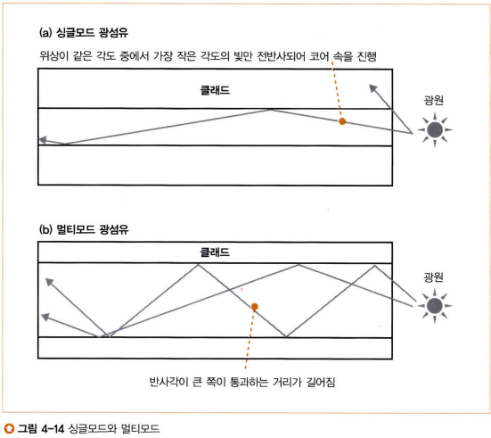

# 네트워크 스터디 7주차

## ADSL 기술을 이용한 액세스 회선의 구조와 동작

### 인터넷의 근간

근본적으로 인터넷은 LAN의 규모가 커진 것이라고 이해할 수 있다. 하지만 둘의 차이점이 있는데, 인터넷은 중계 장치 간의 거리가 너무 멀다. 그래서 케이블로 직접 연결하는 것이 불가능하다. 또 하나의 차이점은 라우팅 테이블의 갱신 방법이다. LAN에서는 라우팅 테이블을 수동으로 갱신해줘야 했지만 인터넷은 규모가 규모다 보니 직접 갱신해주는 것이 사실상 불가능하다. 그래서 라우팅 테이블 갱신의 자동화가 필요하다.

### 액세스 회선

액세스 회선이란 인터넷과 LAN을 연결하는 통신 회선을 말한다. ADSL, FTTH, 회사 전용 회선 등이 있다.

### [ADSL](http://www.ktword.co.kr/test/view/view.php?nav=2&no=242&sh=adsl)(Asymmetric Digital Subscriber Line, 비대칭 디지털 가입자 회선)

기존 전화 회선을 활용하여 가입자 선로(SL)를 고속화하는 방식이다.

#### ADSL이 비대칭인 이유

- 하나의 합성파에서 주파수 별로 파 분리 가능
  - 특정 주파수의 파만 통과시키는 필터 회로 사용 (프리즘의 원리)
- 대응되는 비트 수: 합성되는 파의 수의 곱만큼 증가
- 4.3125kHz씩 주파수를 다르게 한 파를 수백 개 합성
  - 직교 진폭 변조에 의해 비트 값을 대응
    - 잡음이 없는 주파수에 다수의 비트 대응
    - 잡음이 있는 주파수에 소수의 비트 대응
- ADSL에서 다운로드와 업로드 속도가 다른 이유
  - 
  - 다운로드는 95 or 223개의 파 사용
  - 업로드는 26개의 파 사용
- 다운로드 주파수는 잡음의 영향 큼 -> 적은 비트 수만 지원하거나 사용 못함
  - 거리가 멀어지거나 주파수가 높아질수록 커짐
    - 전화국에서 멀어지면 속도가 떨어짐

#### xDSL

기존 케이블에 별다른 증폭기나 중계기 없이 기술적으로 효율을 높이는 변조기술을 총칭한다.

## 패킷의 이동

  
라우터 -> ADSL 모뎀 -> 전화국 -> 프로바이더(ISP, Internet Service Provider)

1. [라우터] 인터넷 접속용 라우터에 패킷 도착
2. [라우터] IP 부분에서 중계 대상 판단 [여기까지 이더넷 라우터와 동일]
3. [라우터] MAC, PPPoE, PPP 헤더 부가 [액세스 회선 사업자에 따라 바뀜]
4. [라우터] ADSL 모뎀에 패킷 송신
5. [ADSL 모뎀] 패킷을 분할하여 셀에 저장
   - 셀
     - 헤더 5바이트, 데이터 48바이트
     - ATM이라는 통신기술에 사용
   - 분할 이유
     - 당시 비용 줄이려고 (주변 기기와 호환성 향상)
     - 그렇지 않다면 분할하지 않아도 상관없음

### [ATM](http://www.ktword.co.kr/test/view/view.php?nav=2&no=246&sh=atm)

1990년대에 가장 활발히 연구 발전된 기술이다. IP 기술의 발전으로 현재는 많이 축소되었지만 많은 분야에서 기반 기술로 적용되고 있다.

6. [ADSL 모뎀] 신호로 변환
   - 변조 기술(정현파에 비트 값을 대응시키는 기술) 사용
   - 직교 진폭 변조 사용
   - 트레이닝 수행

### 직교 진폭 변조

- 사용되는 변조 기술: 진폭 변조 + 위상 변조 = 직교 진폭 변조
  - 진폭 변조(ASK)
    - 진폭 크기에 0과 1 대응 (1비트)
      - 진폭이 작으면 0, 크면 1
    - 진폭 단계를 4단계로 늘리면 2비트 대응 가능
      - 00, 01, 10, 11
    - 단계를 늘릴수록 비트 수가 늘어나 고속화
      - 너무 늘리면 수신 측에서 잘못 해석할 수 있음
      - 늘릴 수 있는 한계 존재
  - 위상 변조(PSK)
    - 위상(시작 타이밍, 시작 각도)에 0과 1 대응 (1비트)
      - 파는 1주기(한 바퀴) 이후 원래대로 돌아옴
        - 이 1주기를 각도로 지정, 이를 위상이라 함
      - 0도는 0, 180도는 1
    - 단계를 늘릴수록 비트 수가 늘어나 고속화
      - 너무 늘리면 수신 측에서 잘못 해석할 수 있음
      - 늘릴 수 있는 한계 존재
  - 직교 진폭 변조(QAM)
    - 진폭 변조와 위상 변조를 결합한 것
    - 하나의 파에 대응하는 비트 수가 두 배로 늘어남 (기본 2비트)
    - 기존과 같이 늘릴 수 있는 한계 존재
    - 여러 주파수의 파를 합성하여 사용 가능

### 트레이닝

ADSL은 회선의 상태를 조사 가능

- 모델에 전원 공급 시 시험 신호를 보냄
- 수신 상태에 따라 파의 수나 비트 수를 판단
- 몇 초에서 수십 초 걸림
- 사용할 파의 수나 각 파에 대응하는 비트 수 판단 가능

7. [ADSL 모뎀] 전기 신호로 변환된 셀을 스플리터에 전달
8. [스플리터] ADSL 신호는 전화의 음성 신호와 섞여 전화 회선에 함께 나감
   - (1) 전화 회선에서 신호가 들어온 경우 [전화기에 ADSL 신호 영향 제거]
     - 수신한 신호에서 전화 음성 신호와 ADSL 신호를 분리
     - 전화기로는 향하는 ADSL의 고주파수 신호 차단
     - ADSL 모뎀으로는 모든 신호를 그대로 넘김
       - 불필요한 주파수는 ADSL 모뎀에서 알아서 차단
   - (2) 통화 여부 [ADSL에 전화기 영향 제거]
     - 스플리터가 없다면
       - 통화 중일 때와 통화중이지 않을 때 신호 전달 회선이 달라짐
         - 통화 중: 전화로 연결된 회선으로 신호 전달
         - 통화 종료: 다른 회선으로 신호 전달
       - 회선이 바뀌면 잡음 등의 성질이 바뀜
         - 트레이닝 재실행 필요
           - 트레이닝이 실행되는 수십 초 동안 통신 중단
     - 스플리터는 이런 문제를 방지한다

### [ADSL 스플리터](http://www.ktword.co.kr/test/view/view.php?nav=2&no=1190&sh=%EC%8A%A4%ED%94%8C%EB%A6%AC%ED%84%B0)

음성과 데이터를 분리해 주는 기능을 수행한다. 사용자 측과 전화국 양 쪽에 설치되어야 한다.

9. [전화 회선] 전화국까지 이동
1. 전화의 옥내 배선을 빠져나가 배선반으로 이동

    - 이곳은 외부 배선과 접속되어 있음

2. 배선반을 지나 보안기로 이동

    - 외부 전화선에서 과한 전류가 들어오지 않도록 보호하는 것

3. 보안기를 지나 전봇대 전화 케이블로 이동

    - [동도](http://www.ktword.co.kr/test/view/view.php?m_temp1=364)
      - 많은 전화선을 수용하기 위해 도로 밑에 설치하는 터널 모양의 시설물
    - 전화 케이블을 통해 전화국에 도달하면 전화국의 MDF에 하나씩 연결됨

### 잡음의 영향

전화 케이블 속을 신호가 흐를 때 발생하는 잡음

- 외부 잡음이나 크로스토크로 신호가 변형됨
  - 이더넷의 트위스트 케이블과 동일
- ADSL 신호는 잡음과 겹치는 주파수 신호만 사용 못함
  - 사용 가능한 신호 수 감소
    - 속도가 느려짐
    - 오류가 발생하는 것은 아님

10. [전화국] DSLAM에 도착
11. [DSLAM] 전기 신호가 셀(디지털 데이터)로 복원됨
    - 신호의 파형에서 진폭과 위상을 조사하여 복원
    - 사용자 ADSL 모뎀의 수신 동작과 같음
    - [DSLAM](http://www.ktword.co.kr/test/view/view.php?nav=2&no=1304&sh=dslam)
      - 다수의 DSL 모뎀을 [다중화/역다중화](http://www.ktword.co.kr/test/view/view.php?m_temp1=404&id=253)함
        - 다중화: 설비를 효율적으로 이용하기 위해 하나의 설비에 여러 신호를 결합하여 보냄
        - 역다중화: 수신단에서 수행하는 다중화의 역과정. 다중 신호를 분리하여 사용
    - DSLAM은 ATM 인터페이스 사용
      - 라우터와 셀의 형태로 패킷을 주고받음
12. [DSLAM] BAS 패킷 중계 장치로 전달
13. [BAS] 패킷 수신
    - ATM 인터페이스 보유
      - 수신한 셀을 원래 패킷으로 복원하는 기능 보유
    - 수신한 셀로 원래 패킷 복원
14. [BAS] 헤더 제거
    - MAC 헤더, PPPoE 헤더 제거
      - BAS 인터페이스에 패킷 전달을 위해 사용하던 것
      - 역할이 끝나 제거
15. [BAS] 터널링용 라우터에 전달 (터널링의 출구로 전달)
    - PPP 헤더 이후 부분을 추출
    - 터널링용 헤더(L2TP 헤더)를 붙여 터널링 출구로 중계

16. [터널링용 라우터] 인터넷 내부로 중계
    - 터널링용 헤더 분리
    - IP 패킷 추출
    - 인터넷의 내부에 중계

---

## 광섬유를 이용한 액세스 회선 (FTTH)

### 광섬유의 기본

- 광신호
- 디지털 데이터 -> 전기 신호 -> 광신호
  - 디지털 데이터: 0, 1
  - 전기 신호: 낮은 전압(0), 높은 전압(1)
  - 광신호: 어두움(0), 밝음(1)
- [수광 소자(광전 소자)](http://www.ktword.co.kr/test/view/view.php?nav=2&no=906&sh=%EC%88%98%EA%B4%91+%EC%86%8C%EC%9E%90)
  - 광 에너지를 전기 에너지로 변환시키는 소자
  - 광검출기(광센서)
    - 광 에너지를 검출하여 전기적 신호로 바꿈
      - 밝은 빛이 닿으면 높은 전압(1) 발생
      - 어두우면 낮은 전압(0) 발생

### 빛이 광원에서 코어로 진입할 수 있는 경우

- 빛은 다양한 각도로 흩뿌려짐 -> 코어에도 여러 각도로 빛이 진입
- 입사각이 크면 코어와 클래드의 경계에서 굴절되어 밖으로 나감
- 입사각이 작으면 코어와 클래드의 경계에서 전반사되어 코어 속으로 이동

### 입사각이 작은 경우 (코어 내로 진입한 경우)

- 경계면에서 반사 시 각도에 따라 위상차 발생
  - 경계면을 향하는 빛과 반사되어 돌아온 빛이 교차 시
    - 위상차 발생: 빛이 서로 상쇄되어 소멸
    - 위상차 없음: 빛이 소멸되지 않고 광섬유 속을 계속 이동
- 대부분의 각도에서는 위상차가 발생하여 빛이 소멸
- 특정 각도들에서는 경계면을 향하는 빛과 반사되어 돌아온 빛의 위상이 같음
  - 반사되지 않고 멀리 도착
  - 코어의 직경은 이 각도를 고려하여 만들어짐

### 코어의 직경에 따른 모드

- 위상이 같은 각도의 빛이 한 개 진입하는지, 여러 개 진입하는지에 따라 모드가 나뉨
- [싱글모드](http://www.ktword.co.kr/test/view/view.php?nav=2&no=1739&sh=%EC%8B%B1%EA%B8%80%EB%AA%A8%EB%93%9C) (8~10μm)
  - 입사각이 작은 빛만 들어감
  - 위상이 같은 각도 중 가장 작은 빛 하나만 진입
  - 빛의 양이 적다
    - 광원이나 수광 소자의 성능이 높아야 함
      - 가격 올라감
    - 신호의 변형이 적다
- [멀티모드](http://www.ktword.co.kr/test/view/view.php?m_temp1=2040&id=9) (50μm or 62.5μm)
  - 입사각이 큰 빛도 들어감
  - 위상이 같은 각도 중 여러 빛이 진입
  - 빛의 양이 많다
    - 광원이나 수광 소자의 성능이 낮아도 됨
      - 비용 절감 -> 최초로 상품화된 광섬유

### 신호의 변형

- 싱글모드
  - 전송가능한 빛이 하나뿐인 광섬유
    - 신호의 폭이 일정함
    - 신호의 변형이 일어나지 않음
  - 광섬유가 길어져도 신호의 변형이 적음
  - 변형이 적음 -> 장거리 연결
    - FTTH에서 사용
- 멀티모드
  - 전송가능한 빛이 여러 개인 광섬유
  - 변형 과정
    - 반사각이 큰 빛은 같은 거리를 가는 데 걸리는 시간이 길어짐
    - 신호가 도착하는 시간이 일정하지 않게 됨
    - 이렇게 신호의 폭이 넓어짐
  - 광섬유가 길어질수록 변형이 커짐
  - 변형이 한도를 초과하면 통신 오류 발생
  - 변형이 많음 -> 단거리 연결

### FTTH 액세스 회선

FTTH: ADSL 대신 광섬유로 인터넷 접속용 라우터와 인터넷 BAS에 접속하는 것

- 두 가지 유형 존재
- 한 개의 광섬유로 사용자와 가까운 전화국에 접속하는 유형
  - 광섬유 하나로 직접 연결
  - 사용자의 **미디어 컨버터**에서 이더넷의 전기 신호를 광신호로 변환
    - 이더넷 패킷 그대로 변환
  - 광신호는 연결된 광섬유 속으로 진입하여 BAS 앞 집합형 미디어 컨버터로 진입
  - 집합형 미디어 컨버터에서 전기 신호로 복원
  - BAS의 포트가 패킷 수신
  - 인터넷 내부로 패킷 중계
- 사용자 근처의 전봇대에 **광스플리터**를 설치하여 광섬유를 분기하는 유형
  - 광스플리터를 통해 여러 사용자 연결 가능
  - 사용자의 **ONU**에서 이더넷의 전기 신호를 광신호로 변환
  - 광신호는 BAS 앞의 **OLT**로 흘러감
  - 이후 BAS를 거쳐 인터넷으로 패킷 중계
  - 여러 사용자가 동시에 사용하기 때문에 광스플리터에서 패킷의 광신호 충돌 가능
    - OLT와 ONU에 패킷 충돌 방지 기능이 적용되어 있음

### [ONU (Optical Network Unit, 광통신망 유닛)](http://www.ktword.co.kr/test/view/view.php?nav=2&no=3502&sh=onu)

- 사용자 밀집 지역의 중심부에 설치하는 소규모 광통신 장치
- 사용자와 망의 분계점(연결점)
- 사용자 망 인터페이스(UNI) 역할

### [UNI (User-Network Interface, 사용자 망 인터페이스)](http://www.ktword.co.kr/test/view/view.php?nav=2&no=857&sh=uni)

- 사용자와 통신망 간의 분계점/인터페이스/접면

### [OLT (Optical Line Terminal, 광선로 종단장치)](http://www.ktword.co.kr/test/view/view.php?nav=2&no=3502&sh=onu)

- 전화국(국사) 내에 설치되어 백본망(중심 네트워크)과 가입자망(사용자 측 네트워크)을 연결하는 광가입자망 구성 장치
- 사용자의 광 신호를 전화국에서 종단하는 역할

### 패킷 충돌 방지 기능

- OLT가 ONU에 송신을 지시
  - 송신 타이밍 조절
- BAS에서 사용자 측으로 신호를 보내는 경우
  - 분기 장치에서 신호가 뿌려짐
    - 충돌하지 않음
    - 수신처 이외의 부분에 신호가 흐름
      - 정보 누설 가능성이 있음
        - 패킷 앞에 ONU 식별 정보 부가
        - ONU는 자신에게 오는 패킷에 대한 광신호만 수신하여 이더넷 신호로 변환

### [파장분할 다중화방식 (WDM, Wavelength Division Multiplexing)](http://www.ktword.co.kr/test/view/view.php?nav=2&no=908&sh=%ED%8C%8C%EC%9E%A5+%EB%8B%A4%EC%A4%91)

- 여러 파장대역을 통해 여러 광신호를 전송하는 광 다중화 방식
- 각 입력 채널마다 다른 파장대역을 할당함
- 사용하는 이유
  - 인터넷을 향하는 광신호와 인터넷에서 돌아오는 광신호가 섞이면 망가짐
  - 파장이 다른 빛은 프리즘의 원리로 다시 분리 가능함
  - 비용 절감을 위해 하나의 광섬유에 여러 광신호를 흘려 사용함

---

## [PPP](http://www.ktword.co.kr/test/view/view.php?nav=2&no=1074&sh=ppp) (Point-to-Point Protocol)

- 점대점 통신
- 데이터 전송용 프로토콜
- 3계층(네트워크 계층) 프로토콜을 캡슐화
- 2계층(링크 계층) 위에 PPP를 올려서도 사용 가능
  - PPPoE, PPPoA, POS 등
- 패킷 구조
  - 
  - HDLC에서 유래되었기 때문에 패킷 구조와 HDLC와 매우 유사
- 전화 회선을 이용한 인터넷 다이얼업 접속 과정
  1. 접속 명령: 프로바이더의 액세스 포인트에 전화 걸기
  2. 회선 접속: 전화 연결
  3. 본인 확인: 사용자명과 패스워드로 로그인
  - RADIUS 시스템 사용
    - RAS에서 인증 서버로 전송하여 검사
      - 인증 서버에서 설정 정보 반송
        - 인터넷에서 사용할 글로벌 IP 주소 포함
          - 전화번호에 따라 액세스 포인트가 전환되는 다이얼업 접속이기 때문에 고정 IP 사용 불가능
    - 사용자측으로 설정 정보 전송
  4. 사용자 PC는 전달받은 설정 정보로 `TCP/IP`의 패킷 송수신 준비 완료

### [HDLC 프로토콜](http://www.ktword.co.kr/test/view/view.php?m_temp1=89&id=847)

- 컴퓨터 데이터 통신에 적합한 전송 제어 방식
  - 점대점 링크, 다중점 링크 상에서 반이중 통신과 전이중 통신을 모두 지원하도록 설계됨
- PPP 메시지를 저장하기 위해 다이얼업에서 일부 수정하여 사용
- 특징
  - [비트 지향형 프로토콜](http://www.ktword.co.kr/test/view/view.php?m_temp1=1119&id=750)
    - 비트들을 묶고 처음과 끝에 비트 패턴을 붙여 함께 전송하는 프로토콜
    - 고속 데이터 전송에 적합
  - 오류제어
    - CRC 필드 방식 사용 (FCS, Frame Check Sequence)
    - 에러 발생 시 재전송 요구 (ARQ, Automatic Repeat Request)
  - 수신측의 응답을 기다리지 않고 데이터 연속 전송 가능
    - 버퍼를 둠으로써 흐름 제어
  - 여러 통신 방식 모두 지원
    - 점대점, 다중점, 반이중, 전이중

### [RADIUS 시스템](http://www.ktword.co.kr/test/view/view.php?nav=2&no=1709&sh=radius)

- 분산 보안 시스템(인증 프로토콜)
  - 대규모 원격 접속에 대한 인증용 서버
- 구성 요소
  - 실제 사용자
  - Radius 클라이언트 (인증 에이전트)
    - 원격 접속 터미널 서버
    - NAS, 802.1x 브리지
    - AP 등
  - Radius 서버 (인증 서버)
    - 인증 전용 서버
    - 인증을 위한 자격 정보를 저장 및 관리
      - 사용자 식별명, 비밀번호, 디지털 인증서, 단말 MAC 주소 등
- 구성
  - 실제 사용자 - 터미널 서버(Radius 클라이언트) - 인증 서버 (Radius 서버)
- 패킷 구조
  - 

## PPPoE

### BAS

BAS Router: 액세스 회선을 연결하는 라우터로써 특화된 기기

- 본인 확인과 설정값 통지 기능
  - 액세스 회선은 최초에 인터넷 접속용 사용자명과 패스워드 입력 필요
  - 비로그인 시 인터넷 액세스 불가
  - BAS에서 이 기능을 수행하기 위해 PPPoE 구조 사용

### 등장 배경

  
ADSL과 FTTH

- PC에 글로벌 주소 미설정 시 인터넷 접속 불가
- 케이블을 통해 BAS에 고정 접속하므로 본인 확인 절차가 필요 없음
  - PPP 구조가 전부 필요하지는 않음
- 단, 로그인 절차를 남겨두면 사용자에 따라 프로바이더를 전환할 수 있어 편리함
  - 따라서 PPP 구조 사용 (그대로는 아님)
- HDLC 프로토콜을 사용하지 못함
- 대신 이더넷 패킷 사양을 차용하기로 함
  - PPP 개념에 이더넷 사양을 차용한 새로운 사양 제작
    - PPPoE 프로토콜 : 이더넷 프레임 안에 PPP 프레임을 넣어 사용

### 패킷 전달 과정

1. BAS와 프로바이더의 라우터 사이에 ADSL/FTTH 터널 생성
2. 사용자와 BAS를 액세스 회선으로 연결
3. 사용자 -> 프로바이더의 라우터 경로의 회선이 연결됨

    - 액세스 회선이 프로바이더의 라우터까지 연장된다고 이해할 수 있다

4. 해당 회선으로 인터넷에 패킷 전달

### 터널링 기능

- BAS에서 사용하는 패킷 운반 기능
- 터널링 출입구에서 패킷을 넣으면 반대편 출입구(프로바이더)에서 나옴
  - TCP의 커넥션과 비슷 (소켓과 소켓 사이를 연결)
- 패킷 그대로의 모습으로 운반할 수 있다면 어떤 구조라도 터널링에 이용 가능
- TCP의 커넥션을 이용한 터널링
  
  1. 터널링용 라우터 사이에 TCP 커넥션 생성
  2. 커넥션 양끝을 라우터의 포트로 간주하고 패킷 송수신

      - 터널링의 규칙을 따름
- 캡슐화를 이용한 터널링
  1. 패킷을 별도의 패킷으로 포장
  2. 터널링 양끝으로 패킷 송수신

### 통신 준비 과정

1. 사용자 측에 인터넷 접속용 라우터 설치
2. 프로바이더가 할당한 로그인 정보를 인터넷 접속용 라우터에 등록
3. 라우터가 BAS(의 MAC 주소)를 찾음

    - PPPoE의 Discovery 구조를 따름
      - BAS가 있는지 브로드캐스트로 요청하면 BAS가 MAC 주소 반환
      - 사용자 측에서 망 측의 집중 장치(AC, Access Concentrator, NAS)의 이더넷 MAC 주소 및 PPPoE 세션 ID를 가져옴

4. 라우터가 BAS와 통신할 수 있게 됨
5. BAS에 로그인 정보 송신

    - 라우터의 설정에 명시된 대로 프로토콜 선정
      - CHAP: 패스워드를 암호화하는 방식
        - 안전성이 높아 권장
      - PAP: 패스워드를 암호화하지 않는 방식
        - BAS와 인터넷 접속용 라우터 사이만 흐름
        - 패스워드 도청이 힘듬

6. BAS에서 정보 확인 후 사용자 측으로 `TCP/IP` 설정 정보 통지

    - 할당받은 글로벌 IP 주소, DNS 서버 IP 주소, 기본 게이트웨이 IP 주소

7. 인터넷 접속용 라우터에 해당 설정 정보 설정
8. 인터넷 접속용 라우터는 인터넷 중계 가능한 상태가 됨

### 실제 통신 과정

1. 사용자가 인터넷으로 패킷 송신 시도
2. 인터넷 접속용 라우터가 BAS에게 통지받은 기본 게이트웨이로 패킷 중계

    - 인터넷 접속용 라우터의 라우팅 테이블에는 대상이 등록되어 있지 않을 것
    - 
    - 중계 시 MAC 헤더, PPPoE 헤더, PPP 헤더 부가
      - MAC 헤더
        - 수신처 MAC 주소: PPPoE의 Discovery로 가져온 BAS의 MAC 주소
        - 송신처 MAC 주소: 인터넷 접속용 라우터의 BAS측 포트 MAC 주소
        - 이더 타입: 8864 (16진수) (PPPoE라는 뜻)
      - PPPoE 헤더, PPP 헤더
        - 페이로드 길이: 패킷의 길이를 조사하여 기입
        - 기타 필드: 사전에 값이 결정되어 있음

3. 패킷이 BAS에 도착

    - MAC 헤더와 PPPoE 헤더 제거
    - 터널링을 통해 PPP 패킷(PPP 헤더부터의 패킷) 송신
    - 터널링의 반대편 출구: 프로바이더의 라우터

4. 패킷이 프로바이더의 라우터에 도착

### IP 주소 할당이 필요한가

인터넷 접속용 라우터가 패킷 송신 시 헤더를 부가한다.

- 부가할 값은 대부분 이미 결정되어 있다.
  - 라우팅 테이블의 기본 게이트웨이 항목에는 어떤 값이 들어와도 상관없다.
  - 라우터 포트끼리 케이블 하나로 1 대 1 연결이 되어있는 상태에서는 결국 반대편에 도착할 수밖에 없다.
    - 따라서 게이트웨이 항목을 기반으로 중계 대상의 주소를 찾을 필요가 없다.
      - 따라서 게이트웨이 항목에 값을 기록할 필요가 없다.
        - 따라서 중계 대상 라우터의 포트에 IP 주소를 할당할 필요가 없다.

#### 언넘버드(unnumbered)

- 1 대 1 형태로 접속된 포트에는 IP 주소를 할당하지 않아도 된다.
- 따라서 BAS에서 설정 정보를 통지하는 경우 기본 게이트웨이의 IP 주소를 통지하지 않는다.

## 주소 변환 동작

### 등장 배경

- BAS는 사용자 측으로 `TCP/IP` 설정 정보를 통지한다.
- `TCP/IP`의 원래 방법
  - 전달받은 설정 정보를 PC에 설정한다.
  - PC에 글로벌 주소가 할당된다.
  - 인터넷에 액세스한다.
- 인터넷 접속용 라우터
  - 설정 정보를 라우터가 전달받는다.
  - 글로벌 주소가 라우터에 할당된다.
  - PC에는 글로벌 주소를 할당할 수 없다.

### 주소 변환 동작 (인터넷 접속용 라우터)

- PC에는 프라이빗 주소를 할당한다.
- PC가 보낸 패킷은 인터넷 접속용 라우터에서 주소 변환을 거쳐 중계된다.
- 이전에 설명한 적 있음!!

### 부작용

주소 변환으로 인해 애플리케이션이 정확하게 동작하지 않는 경우

- 원래 방법대로 BAS가 통지하는 PPPoE 메시지를 PC가 받으면 된다.
  - PC에 글로벌 주소가 할당되어 주소 변환 없이 인터넷에 액세스할 수 있다.
  - ADSL 모뎀, 미디어 컨버터 ONU 등에 라우터 없이 PC(또는 허브를 경유하여)를 직접 연결하면 가능하다.
    - 라우터를 사용하지 않을 경우 인터넷에서 패킷이 직접 도착한다.
      - 공격받을 가능성이 있으니 방화벽 등을 잘 써야한다.

## PPPoE 이외의 방식

### PPPoA(Point-to-Point Protocol over ATM)

- PPP 메시지를 그대로 셀에 저장
  - PPPoE는 PPP 메시지를 이더넷 패킷에 담아 셀에 저장
  - 패킷의 앞에 MAC 헤더와 PPPoE 헤더를 붙이지 않는다!
    - PPP 메시지를 그대로 이더넷에 전송 불가능
    - PC나 라우터를 ADSL 모뎀과 일체화하지 않으면 PPP 구조가 동작하지 않음
      - 일체화 방법
        - 라우터 일체형 ADSL 모뎀 사용
          - PPPoE에서 라우터를 사용하는 것과 동일
  - 기타 동작은 거의 동일
- PPPoE에 비해 장점
  - PPPoE 헤더가 부가되지 않아 MTU가 상대적으로 김
    - 효율이 좋음
- PPPoE에 비해 단점
  - ADSL 모뎀과 라우터를 분리할 수 없다

### DHCP(Dynamic Host Configuration Protocol)

- PPP의 제약을 벗어나기 위해 사용 가능
- 내부망에서 클라이언트 PC에 `TCP/IP` 설정 정보를 통지하기 위해 주로 사용
- 절차
  1. PC에서 설정 정보 요구
  2. DHCP 서버가 설정 정보 통지
- 로그인 절차도 거치지 않음
  - 장점: 인터넷 패킷을 그대로 주고받음 -> PPP 헤더가 없어서 MTU가 짧아지지 않음 -> 효율적
  - 단점: 사용자명에 따라 프로바이더 전환 불가
- ADSL 모뎀도 PPPoE나 PPPoA와 달리 셀을 사용하지 않고 이더넷 패킷 그대로 ADSL 신호로 변환
  - ADSL 모뎀과 라우터를 분리할 수 없다는 제약이 사라짐

## 참고 자료

### 책

성공과 실패를 결정하는 1%의 네트워크 원리 - Tsutomu Tone, 출판사: 성안당

- Chapter 4-1 ~ 4-3

### 정보통신기술용어해설

[**ADSL**](http://www.ktword.co.kr/test/view/view.php?nav=2&no=242&sh=adsl)  
[**ATM**](http://www.ktword.co.kr/test/view/view.php?nav=2&no=246&sh=atm)  
[**ADSL 스플리터**](http://www.ktword.co.kr/test/view/view.php?nav=2&no=1190&sh=%EC%8A%A4%ED%94%8C%EB%A6%AC%ED%84%B0)  
[**동도**](http://www.ktword.co.kr/test/view/view.php?m_temp1=364)  
[**DSLAM**](http://www.ktword.co.kr/test/view/view.php?nav=2&no=1304&sh=dslam)  
[**다중화/역다중화**](http://www.ktword.co.kr/test/view/view.php?m_temp1=404&id=253)  
[**수광 소자**](http://www.ktword.co.kr/test/view/view.php?nav=2&no=906&sh=%EC%88%98%EA%B4%91+%EC%86%8C%EC%9E%90)  
[**싱글모드**](http://www.ktword.co.kr/test/view/view.php?nav=2&no=1739&sh=%EC%8B%B1%EA%B8%80%EB%AA%A8%EB%93%9C)  
[**멀티모드**](http://www.ktword.co.kr/test/view/view.php?m_temp1=2040&id=9)  
[**ONU와 OLT**](http://www.ktword.co.kr/test/view/view.php?nav=2&no=3502&sh=onu)  
[**UNI**](http://www.ktword.co.kr/test/view/view.php?nav=2&no=857&sh=uni)  
[**파장분할 다중화방식**](http://www.ktword.co.kr/test/view/view.php?nav=2&no=908&sh=%ED%8C%8C%EC%9E%A5+%EB%8B%A4%EC%A4%91)  
[**PPP**](http://www.ktword.co.kr/test/view/view.php?nav=2&no=1074&sh=ppp)  
[**RADIUS 시스템**](http://www.ktword.co.kr/test/view/view.php?nav=2&no=1709&sh=radius)  
[**HDLC 프로토콜**](http://www.ktword.co.kr/test/view/view.php?m_temp1=89&id=847)  
[**비트 지향형 프로토콜**](http://www.ktword.co.kr/test/view/view.php?m_temp1=1119&id=750)
